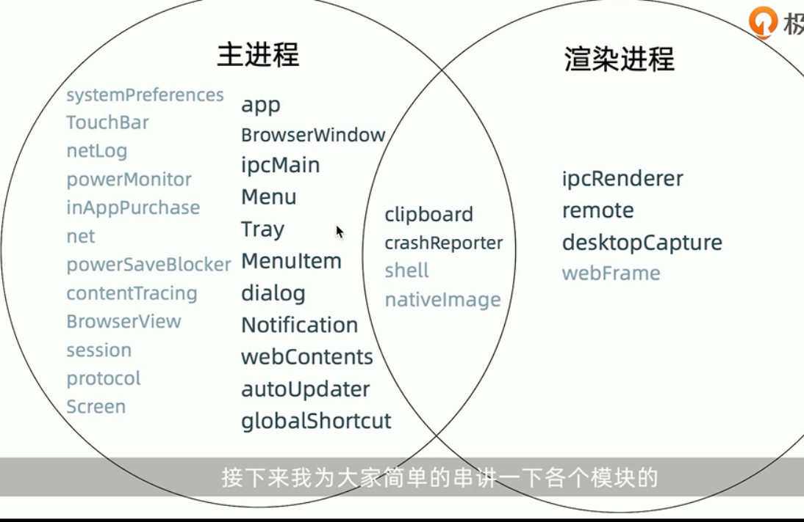

# electron

卡顿

看下electron原理

三章

webpack有八章

10天：10章刚好可以

第一章：Electron基础篇 (12讲)

01 | 课程介绍免费
02 | 内容综述：学完这门课程你能得到什么？免费
03 | Electron介绍：为什么Electron这么火？免费

js是网景公司天才10天开发的

可以让web端和桌面端复用一套代码

****

04 | 揭秘Electron架构原理：Chromium + Node.js是如何一起工作？免费

chrome也是一个桌面应用，

browser主进程

render渲染进程

进程通信ipc，红色部分

和chromium不同的是，在主进程里面用了nativeapi+nodejs

加了nodejs，要整个两个事件循环

**讲node集成到chromium：这样可以**

**electron起了一个新的安全线程去轮询node事件回调的backend_fd，然后在**

**当node有一个新的事件之后，通过posttask，转发到chromium的事件循环中**

可能会出面试题

----

05 | 桌面端技术选型：如何选择合适的桌面端技术？

---

06 | Electron开发准备：环境搭建及前期准备

每个人的node版本不一样这样其他人写的javascripts我们自己的node.js很可能运行不了看看写这个javascripts包的人用的node.js是哪个版本，我们再把这个版本下下来。nvm就相当于一个帮助你的工具 

ELectRon_Mirror=hTtps: //cdn. npm taobao.org/dist/electron/ npm install electron--save
 dev

npx electron -v

---

07 | 第一个Electron应用：开发一个简单版的番茄钟（上）

也就是说，渲染进程做通常操作，通过ipc通信来实现一些js实现不了的东西

---

08 | 第一个Electron应用：开发一个简单版的番茄钟（下）

---

09 | 与Web开发不同（一）：主进程与渲染进程

也就是我们能和底层打交道

---

10 | 与Web开发不同（二）：进程间通信

两个进程，到底分别能做啥，不是很清晰，不清晰就不知道交互

7

---

11 | 与Web开发不同（三）：Native能力及原生GUI

---

12 | 与Web开发不同（四）： 释放前端想象力，基于Electron能做什么？

---

第二章：实战篇 - 远程控制软件 (13讲)

13 | 实战项目综述：整体需求分析
14 | 设计思路：做远程控制有几步？
15 | 项目架构与基础业务：Electron 与 React 框架结合
16 | 主页面基础业务：Real World IPC
17 | 傀儡端实现（一）：基于Electron能力捕获桌面视频流
18 | 傀儡端实现（二）：如何接收&响应指令？
19 | 傀儡端实现（三）：基于WebRTC传输视频流（上）
20 | 傀儡端实现（四）：基于WebRTC传输视频流（下）
21 | 信令服务：如何连接两端（上）
22 | 信令服务：如何连接两端（下）
23 | 指令传输实现：如何建立数据传输？
24 | 项目完善与总结（上）：App特性
25 | 项目完善与总结（下）：原生GUI
第三章：Electron 工程篇 (10讲)

26 | Electron 应用打包：从HTML到安装包
27 | Electron 应用更新（一）：软件更新的痛点
28 | Electron 应用更新（二）：线上项目如何更新？
29 | Electron 质量监控：桌面端的质量抓手是什么？
30 | 使用原生能力：如何集成C++能力？
31 | Electron 自动化测试：如何编写端到端测试？
32 | Electron体验优化：如何优化白屏问题？
33 | Electron客户端的安全：从XSS到RCE
34 | Electron bad parts：辩证看待Electron技术
35 | 结课测试&结束语

