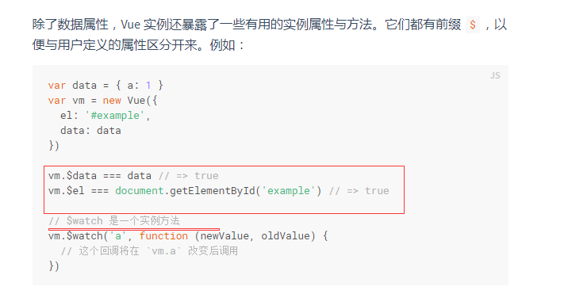
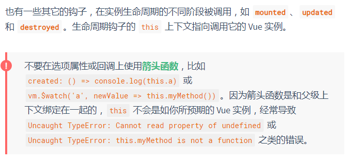
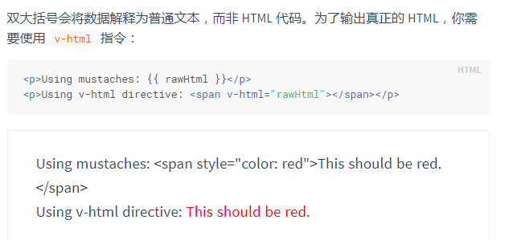
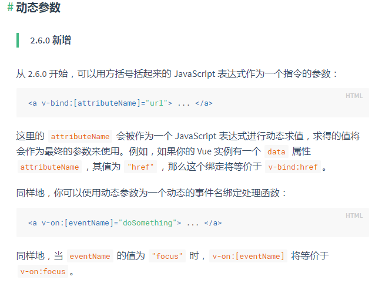
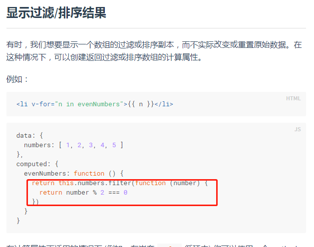
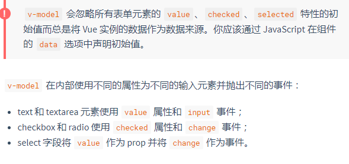
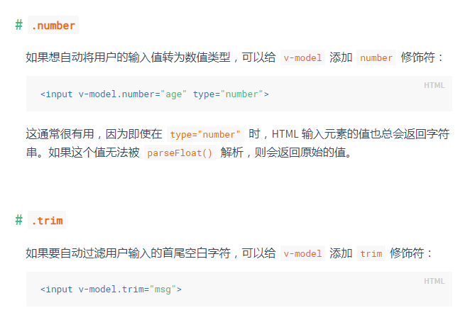
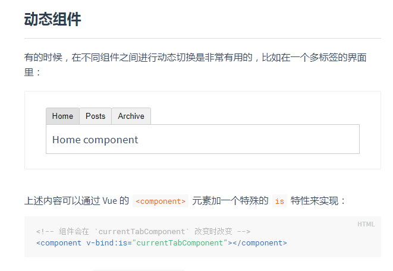
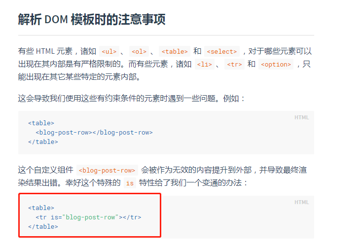

# vue文档阅读--基础篇

1，声明式渲染

> 这个例子演示了我们不仅可以把数据绑定到 DOM 文本或特性，还可以绑定到 DOM **结构**。此外，Vue 也提供一个强大的过渡效果系统，可以在 Vue 插入/更新/移除元素时自动应用[过渡效果](https://cn.vuejs.org/v2/guide/transitions.html)。


2，与自定义元素的关系

首先html中也可以自定义元素，并且可以为它定义样式和事件

但是自定义元素并没有完全被浏览器支持，而vue组件在浏览器中表现一致。

Vue 组件提供了纯自定义元素所不具备的一些重要功能，最突出的是跨组件数据流、自定义事件通信以及构建工具集成。


## vue实例

### 数据和方法

只有当实例被创建时 `data` 中存在的属性才是**响应式**的。也就是说如果你添加一个新的属性，比如：

```
vm.b = 'hi'
```

那么对 `b` 的改动将不会触发任何视图的更新。如果你知道你会在晚些时候需要一个属性，但是一开始它为空或不存在，那么你仅需要设置一些初始值。比如：

```
data: {
  newTodoText: '',
}
```

这里唯一的例外是使用 `Object.freeze()`，这会阻止修改现有的属性，也意味着响应系统无法再*追踪*变化。

> **Object.freeze()** 方法可以**冻结**一个对象。一个被冻结的对象再也不能被修改；冻结了一个对象则不能向这个对象添加新的属性，不能删除已有属性，不能修改该对象已有属性的可枚举性、可配置性、可写性，以及不能修改已有属性的值。此外，冻结一个对象后该对象的原型也不能被修改。`freeze()` 返回和传入的参数相同的对象。

注意 `const object2 = Object.freeze(object1);`是使object1这个对象不可修改，并且返回object1，所以object2指向object1



**vue实例中有些静态属性，也有实例方法**

### 实例生命周期钩子

注意：**生命周期钩子函数中的this指向调用他的vm实例**

在生命周期钩子函数中使用箭头函数和回调函数会改变这一点



## 模板语法

### 文本

通过使用 [v-once 指令](https://cn.vuejs.org/v2/api/#v-once)，你也能执行一次性地插值，当数据改变时，插值处的内容不会更新。但请留心这会影响到该节点上的其它数据绑定：

```
<span v-once>这个将不会改变: {{ msg }}</span>
```

### 原始html



### 特性

加了v-bind的布尔属性

```
<button v-bind:disabled="isButtonDisabled">Button</button>
```

如果 `isButtonDisabled` 的值是 `null`、`undefined` 或 `false`，则 `disabled` 特性甚至不会被包含在渲染出来的 `<button>` 元素中。

### 在花括号中使用js表达式

在花括号中使用js表达式时，可以使用表达式

重要：这些表达式会在**所属vue实例的数据域**下作为js被解析  但花括号中只能有单个表达式

这就是在花括号中引用vm的data变量不用this的原因

> 模板表达式都被放在沙盒中，只能访问全局变量的一个白名单，如 `Math` 和 `Date` 。你不应该在模板表达式中试图访问用户定义的全局变量。
>
> ????????????????????????????????????????

### 指令

#### 动态参数

也就是说v-bind指令不单单只绑定已经写好的属性，而是可以绑定一个动态变量，这个变量变了之后指令绑定的变量也就改变了



#### 修饰符

修饰符 (modifier) 是以半角句号 `.` 指明的特殊后缀，用于指出一个指令应该以特殊方式绑定。例如，`.prevent` 修饰符告诉 `v-on` 指令对于触发的事件调用 `event.preventDefault()`：

```
<form v-on:submit.prevent="onSubmit">...</form>
```

说明.prevent只是一个修饰符，并没有真正的js含义，只是用于编译器编译的规则

## 计算属性

计算属性中，我们写的方法是用来作为这个变量的getter方法

当关系到数据的变化的时候计算属性可以满足大多数情况，当有异步操作或者开销太大的行为就需要使用监听器

$watch

---

## 绑定class和绑定样式

class在实战视频中应用场景很多

样式也是可以绑定的，并可以灵活的使用，使用太少不多记录

---

## 条件渲染

因为vue会高度复用dom元素（提高效率），所以会出现一些问题

如果希望某些dom不要复用而是单独的，则加一个唯一key值即可

 Vue 为你提供了一种方式来表达“这两个元素是完全独立的，不要复用它们”。只需添加一个具有唯一值的 `key` 属性即可：

v-if和v-show的区别

`v-if` 是“真正”的条件渲染，因为它会确保在切换过程中条件块内的事件监听器和子组件适当地被销毁和重建。

`v-if` 也是**惰性的**：如果在初始渲染时条件为假，则什么也不做——直到条件第一次变为真时，才会开始渲染条件块。

相比之下，`v-show` 就简单得多——不管初始条件是什么，元素总是会被渲染，并且只是简单地基于 CSS 进行切换。

一般来说，`v-if` 有更高的切换开销，而 `v-show` 有更高的初始渲染开销。因此，如果需要非常频繁地切换，则使用 `v-show` 较好；如果在运行时条件很少改变，则使用 `v-if` 较好。

show只是修改display的值而已

> 当 `v-if` 与 `v-for` 一起使用时，`v-for` 具有比 `v-if` 更高的优先级

---

## 列表渲染

### 数组方法

变异方法和非变异方法

变异方法会改变原数组，非变异方法会返回一个处理后的数组

由于 JavaScript 的限制，Vue 不能检测以下变动的数组：

1. 当你利用索引直接设置一个项时，例如：`vm.items[indexOfItem] = newValue`
2. 当你修改数组的长度时，例如：`vm.items.length = newLength`

这些操作会使得动态绑定失效

为了解决第一类问题，以下两种方式都可以实现和 `vm.items[indexOfItem] = newValue` 相同的效果，同时也将触发状态更新：

```
// Vue.set
Vue.set(vm.items, indexOfItem, newValue)
// Array.prototype.splice
vm.items.splice(indexOfItem, 1, newValue)
```

你也可以使用 [`vm.$set`](https://vuejs.org/v2/api/#vm-set) 实例方法，该方法是全局方法 `Vue.set` 的一个别名：

```
vm.$set(vm.items, indexOfItem, newValue)
```

为了解决第二类问题，你可以使用 `splice`：

```
vm.items.splice(newLength)
```


对于已经创建的实例，Vue 不能动态添加根级别的响应式属性。但是，可以使用 `Vue.set(object, key, value)` 方法向嵌套对象添加响应式属性

也就是说，如果发生       **不在声明的地方来添加数据属性的，但又要实现双向数据绑定**   话，那么可以使用

vue的set方法来实现



----

## 事件处理

事件修饰符

- `.stop`
- `.prevent`
- `.capture`
- `.self`
- `.once`
- `.passive`

按键修饰符

```
<!-- 只有在 `key` 是 `Enter` 时调用 `vm.submit()` -->
<input v-on:keyup.enter="submit">
```

还有很多事件修饰符，可以监听鼠标键盘等等等等的用户行为

---

## 表单输入绑定



v-model中的修饰符



---


## 组件基础

1，组件中的data必须是个函数，如果不是，组件复用的时候，多个相同组件之间会互相影响

### 组件事件

父级组件可以像处理 native DOM 事件一样通过 `v-on` 监听子组件实例的任意事件：

同时子组件可以通过调用内建的 [**$emit** 方法](https://cn.vuejs.org/v2/api/#vm-emit) 并传入事件名称来触发一个事件

这个属于子父组件的通信方式：props和on与emit


实现类似菜单的场景





