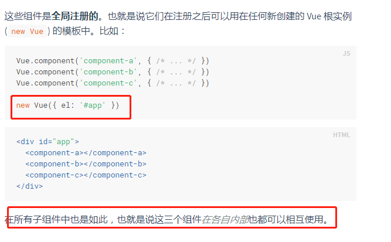
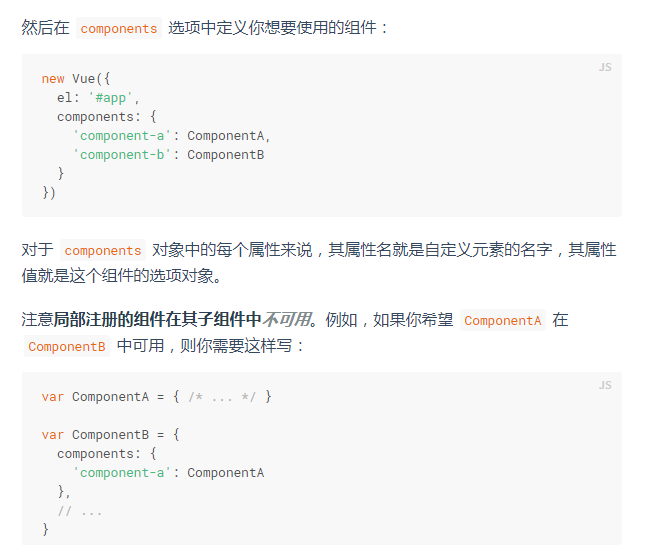

# vue文档阅读深入篇

1，组件名规范

 [W3C 规范](https://html.spec.whatwg.org/multipage/custom-elements.html#valid-custom-element-name)中的自定义组件名 (字母全小写且必须包含一个连字符)

`Vue.component('my-component-name', { /* ... */ })`

---

### 全局组件



**也就是工具组件就会注册在根组件页面**

也就是说   根组件 中注册的组件是全局组件    所有的子组件都可以使用包括各自内部



局部组件

那个组件注册了那个组件可以用

---

### 模块系统

模块系统就是使用webpack等系统时的全局和局部注册

1，一些基础组件（button）使用require.context()来实现局部注册就行

2，全局注册必须要在根vue实例创建之前完成

---

### prop

命名：在js中使用驼峰，在html中使用小写加短横线

prop实现上是希望实现单向数据流，但是子组件是可以改变prop中的数据，并且影响父组件进而影响其他子组件，这并不是vue希望的，所以当子组件改变prop时，vue会发出警告

> 注意在 JavaScript 中对象和数组是通过引用传入的，所以对于一个数组或对象类型的 prop 来说，在子组件中改变这个对象或数组本身**将会**影响到父组件的状态。

prop验证：支持验证，错误vue会发生控制台警告，用的比较简单

> 注意那些 **prop 会在一个组件实例创建之前进行验证**，**所以实例的属性** (如 `data`、`computed` 等) 在 `default` 或 `validator` 函数中是不可用的。

验证涉及安全方法，还支持类型检查，自定义类型检查

非prop特性这里看不懂

---

### 自定义事件

并且 `v-on` 事件监听器在 DOM 模板中会被自动转换为全小写 (因为 HTML 是大小写不敏感的)，所以 `v-on:myEvent` 将会变成 `v-on:myevent`——导致 `myEvent` 不可能被监听到。

因此，我们推荐你**始终使用 kebab-case 的事件名**


因此：变量是驼峰，事件名是小写，组件名是驼峰html中是小写


在给组件添加事件的时候，虽然他封装成貌似是input可能底层是个label，为了解决这个问题

Vue 提供了一个 `$listeners` 属性，它是一个对象，里面包含了作用在这个组件上的所有监听器


#### 事件中实现prop的双向数据绑定 .sync修饰符

首先，prop是单向数据流，如果子组件到父组件的通信，我们推荐使用$emit和on来实现。

但是prop的双向数据绑定也是可以实现的，并需要显示声明来确保数据流的确定性

即 `.sync` 修饰符：

```
<text-document v-bind:title.sync="doc.title"></text-document>
```

注意带有 `.sync` 修饰符的 `v-bind` **不能**和表达式一起使用 (例如 `v-bind:title.sync=”doc.title + ‘!’”` 是无效的)。取而代之的是，你只能提供你想要绑定的属性名，类似 `v-model`。

并且.sync修饰符还可以用来其他场景：将一个对象中所有的属性全部作为prop的值

当我们用一个对象同时设置多个 prop 的时候，也可以将这个 `.sync` 修饰符和 `v-bind` 配合使用：

```
<text-document v-bind.sync="doc"></text-document>
```

**这样会把 `doc` 对象中的每一个属性 (如 `title`) 都作为一个独立的 prop 传进去**，然后各自添加用于更新的 `v-on` 监听器。

将 `v-bind.sync` 用在一个字面量的对象上，例如 `v-bind.sync=”{ title: doc.title }”`，是无法正常工作的，因为在解析一个像这样的复杂表达式的时候，有很多边缘情况需要考虑。

---

### 插槽

在实战中，我们大多数使用的是带名字的，也就是使用指令v-slot：soltName来实现确定使用那个solt

如果看到使用url的也不用奇怪

插槽内容能够访问子组件

为了让 `user` 在父级的插槽内容可用，我们可以将 `user` 作为一个 `<slot>` 元素的特性绑定上去：

```
<span>
  <slot v-bind:user="user">
    {{ user.lastName }}
  </slot>
</span>
```

绑定在 `<slot>` 元素上的特性被称为**插槽 prop**。现在在父级作用域中，我们可以给 `v-slot` 带一个值来定义我们提供的插槽 prop 的名字：

插槽还是不是很清晰，之后再看不一遍啊，也许就能看懂并有所收货

---

### 动态组件 & 异步组件

动态组件

如果你希望自己的tab切换时，可以保留之前的状态，可以使用`<keep-alive>` 元素将其动态组件包裹起来

注意这个 `<keep-alive>` 要求被切换到的组件都有自己的名字，不论是通过组件的 `name` 选项还是局部/全局注册。

具体原理不清楚

#### 异步组件

也就是一开始不加载，等到需要的时候在加载

在大型应用中，我们可能需要将应用分割成小一些的代码块，并且只在需要的时候才从服务器加载一个模块。为了简化，Vue 允许你以一个工厂函数的方式定义你的组件，这个工厂函数会异步解析你的组件定义。Vue 只有在这个组件需要被渲染的时候才会触发该工厂函数，且会把结果缓存起来供未来重渲染。

---

### 边界处理情况

边界，不推荐使用，会让应用难以理解和调试

1，子组件可以通过$root属性来访问根实例

2，$parent属性同上

-----

## 进入/离开 & 列表过渡

