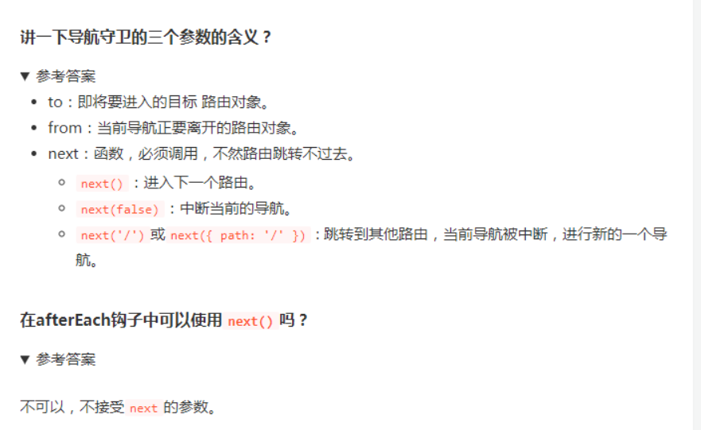

根据官网示例，可以看出实现 `vue-router` 大概需要经过一下几步：

1、将 `VueRouter` 插件注入 `Vue` 中

2、定义 `router-link` 、 `router-view` 两个全局组件供页面跳转使用

3、传入用户自定义的 `routes` 路由映射关系

----


慢慢看，总结出一套自己的理解对原理的理解

---

回去好好看下这些教程，结合实践，把教程看明白

----

## 插件 `vue-router` 安装

`vue-router` 只是 `vue` 中的一个插件。在 `vue` 中插件的开发有这几种方式：

```js
// https://cn.vuejs.org/v2/guide/plugins.html#开发插件

MyPlugin.install = function (Vue, options) {
  // 1. 添加全局方法或属性
  Vue.myGlobalMethod = function () {
    // 逻辑...
  }

  // 2. 添加全局资源
  Vue.directive('my-directive', {
    bind (el, binding, vnode, oldVnode) {
      // 逻辑...
    }
    ...
  })

  // 3. 注入组件选项
  Vue.mixin({
    created: function () {
      // 逻辑...
    }
    ...
  })

  // 4. 添加实例方法
  Vue.prototype.$myMethod = function (methodOptions) {
    // 逻辑...
  }
}
```

可以了解下这个然后，写一个插件，用来全局弹窗

----

然后通过 `mixin` 在 `vue` 的生命周期 `beforeCreate` 内注册实例，在 `destroyed` 内销毁实例。

接下来，将 `$router` 、 `$route` 挂载到 `vue` 上

```js
Object.defineProperty(Vue.prototype, '$router', {
  get () { return this._routerRoot._router }
})

Object.defineProperty(Vue.prototype, '$route', {
  get () { return this._routerRoot._route }
})
```

先都看一遍，然后再来总结笔记

---

**总结**讲了这么老半天， `./src/create-matcher.js` 中的 `createMatcher` 函数与 `./src/create-route-map.js` 中的 `createRouteMap` 函数就是为了将数组 `routes`

```js
const routes = [
  { path: '/foo', component: Foo },
  { path: '/bar', component: Bar }
]
复制代码
```

转换成树形结构 `map`

```js
map = {
  '/foo': {
    component: Foo
  },
  '/bar': {
    component: Bar
  }
}
复制代码
```

再加上一个可以动态添加的函数 `addRoutes` 。

组装成map，更好查找，降低查找的速度，并且补充了很多其他信息


**1、 `hash` 路由**

```html
<a href="#/home">首页</a>
<a href="#/about">关于</a>
<div id="html"></div>

<script>
  window.addEventListener('load', function () {
    document.getElementById('html').innerHTML = location.hash.slice(1);
  });
  window.addEventListener('hashchange', function () {
    document.getElementById('html').innerHTML = location.hash.slice(1);
  });
</script>
复制代码
```

**2、 `history` 路由**

```html
<div onclick="go('/home')">首页</div>
<div onclick="go('/about')">关于</div>
<div id="html"></div>

<script>
  function go(pathname) {
    document.getElementById('html').innerHTML = pathname;
    history.pushState({}, null, pathname);
  }
  window.addEventListener('popstate', function () {
    go(location.pathname);
  });
</script>
```

两种简易方式

---

休息一下，等会看history，解决看到中的问题，然后把两个模式具体的逻辑再补充下。最后总结出自己可以说的vue-router源码

补充： history.pushState({}, null, pathname);这个函数的参数是什么

> ```js
> const state = { 'page_id': 1, 'user_id': 5 }
> const title = ''
> const url = 'hello-world.html'
> 
> history.pushState(state, title, url)
> ```
>
> vue源码中是这样使用的
>
> ```js
>     if (replace) {
>       // preserve existing history state as it could be overriden by the user
>       const stateCopy = extend({}, history.state)
>       stateCopy.key = getStateKey()
>       history.replaceState(stateCopy, '', url)
>     } else {
>       history.pushState({ key: setStateKey(genStateKey()) }, '', url)
>     }
> ```
>
> 第1个参数是状态对象，它可以理解为一个拿来存储自定义数据的元素。它和同时作为参数的`url`会关联在一起。
>
> 第2个参数是标题，是一个字符串，目前各类浏览器都会忽略它（以后才有可能启用，用作页面标题），所以设置成什么都没关系。目前建议设置为空字符串。
>
> 第3个参数是URL地址，一般会是简单的`?page=2`这样的参数风格的相对路径，它会自动以当前URL为基准。需要注意的是，本参数URL需要和当前页面URL同源，否则会抛出错误。

本地调试方法，在vue-router中创建一个html，然后，在html中引用vue，和本地的vue-router，然后就可以给本地的vue-router打断点调试

参考https://router.vuejs.org/guide/#javascript中html引入的方式

----

1，准备工作，vue-router是一个插件，给vue全局注入了两个全局组件router-view，router-link，

```js
// 将每一个组件的 _routerRoot 都指向根 Vue 实例
        this._routerRoot = (this.$parent && this.$parent._routerRoot) || this
```

然后通过 `mixin` 在 `vue` 的生命周期 `beforeCreate` 内注册实例（让所有的vue组件的router对象都指向跟vue实例），在 `destroyed` 内销毁实例

让每个组件都能访问到router实例

最后，注册全局组件 `router-view` 、 `router-link`

然后就是将，用户定义的routes补充转换成路径为key的map

---

迭代器自动执行

```js
function runQueue (queue, fn, cb) {
  var step = function (index) {
    if (index >= queue.length) {
      cb();
    } else {
      if (queue[index]) {
        fn(queue[index], function () {
          step(index + 1);
        });
      } else {
        step(index + 1);
      }
    }
  };
  step(0);
}
```

这里history，讲的不详细，要好好的看看其他教程总结下

在 `history` 的初始化中，会设置一个监听器，监听历史栈的变化。

```js
setupListeners () {
  const router = this.router
  const expectScroll = router.options.scrollBehavior
  const supportsScroll = supportsPushState && expectScroll

  if (supportsScroll) {
    setupScroll()
  }

  window.addEventListener(supportsPushState ? 'popstate' : 'hashchange', () => {
    const current = this.current
    if (!ensureSlash()) {
      return
    }
    this.transitionTo(getHash(), route => {
      if (supportsScroll) {
        handleScroll(this.router, route, current, true)
      }
      if (!supportsPushState) {
        replaceHash(route.fullPath)
      }
    })
  })
}
```

----

## 大佬篇


hash模式下，刷新页面不会发送请求，不会触发hashchange事件，会有load事件。点击跳转和浏览器历史跳转会触发hashchange事件

图看不清，放大浏览器来看

history：浏览器动作，回调，触发popstate时间，点击跳转，调用pushState函数想浏览器历史添加一个状态，并不会想服务器请求，刷新页面输入ul，会向服务器请求。

浏览器动作，就是popstate，，点击跳转，就是用pushstate。

再看看之前的笔记了解下

----

对于路由注册来说，核心就是调用 `Vue.use(VueRouter)`，使得 VueRouter 可以使用 Vue。然后通过 Vue 来调用 VueRouter 的 `install` 函数。在该函数中，核心就是给组件混入钩子函数和全局注册两个路由组件。

在实例化 VueRouter 的过程中，核心是创建一个路由匹配对象，并且根据 mode 来采取不同的路由方式。

 // 确保通配符在最后

源码做了控制，所以写在最前面也没有事

```js
  // 导航守卫数组
  const queue: Array<?NavigationGuard> = [].concat(
    // 失活的组件钩子
    extractLeaveGuards(deactivated),
    // 全局 beforeEach 钩子
    this.router.beforeHooks,
    // 在当前路由改变，但是该组件被复用时调用
    extractUpdateHooks(updated),
    // 需要渲染组件 enter 守卫钩子
    activated.map(m => m.beforeEnter),
    // 解析异步路由组件
    resolveAsyncComponents(activated)
  )
```

至此，路由跳转已经全部分析完毕。核心就是判断需要跳转的路由是否存在于记录中，然后执行各种导航守卫函数，最后完成 URL 的改变和组件的渲染。


具体执行导航守卫函数的过程不清晰，要么看源码，要么就去看其他文章，要么就把整个顺序被一遍

可以把整个顺序背一遍

----

1. 导航被触发。

2. 在失活的组件里调用 `beforeRouteLeave` 守卫。

3. 调用全局的 `beforeEach` 守卫。

4. 在重用的组件里调用 `beforeRouteUpdate` 守卫 (2.2+)。

5. 在路由配置里调用 `beforeEnter`。路由级别的

6. 解析异步路由组件。

7. 在被激活的组件里调用 `beforeRouteEnter`。

8. 调用全局的 `beforeResolve` 守卫 (2.5+)。

9. 导航被确认。

10. 调用全局的 `afterEach` 钩子。

11. 触发 DOM 更新。

12. 调用 `beforeRouteEnter` 守卫中传给 `next` 的回调函数，创建好的组件实例会作为回调函数的参数传入。

13. ```js
    beforeRouteUpdate (to, from, next) {
        // 在当前路由改变，但是该组件被复用时调用
        // 举例来说，对于一个带有动态参数的路径 /foo/:id，在 /foo/1 和 /foo/2 之间跳转的时候，
        // 由于会渲染同样的 Foo 组件，因此组件实例会被复用。而这个钩子就会在这个情况下被调用。
        // 可以访问组件实例 `this`
      },
    ```

----

#### 路由导航守卫和Vue实例生命周期钩子函数的执行顺序？

路由导航守卫都是在Vue实例生命周期钩子函数之前执行的。，复用组件，不会再调用生命周期，能拿到this实例



#### 切换路由后，新页面要滚动到顶部或保持原先的滚动位置怎么做呢？

- 滚动原先位置

```js
const router = new VueRouter({
  mode: 'history',
  [
      {
        path: '/',
        name: 'home',
        component: home,
        meta: {
          title: 'home',
          keepAlive: true
        }
      }
  ],
  scrollBehavior (to, from, savedPosition) {
    if (savedPosition) {
      return savedPosition
    } else {
      if (from.meta.keepAlive) {
        from.meta.savedPosition = document.body.scrollTop
      }
      return { x: 0, y: to.meta.savedPosition || 0 }
    }
  }
})
在组件中

<keep-alive >
   <router-view v-if="$route.meta.keepAlive"></router-view>
</keep-alive>
<router-view v-if="!$route.meta.keepAlive"></router-view>
```

---

以上足以准备所有的vue-router面试题了

