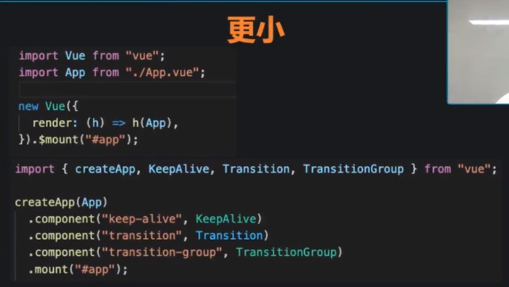

## 极客时间vue3

#### 更小


不用重复编译事件


因为代理对象，而不是属性，proxy是对对象包了一层，性能会比defineProperty好的多

#### 更强


制定挂载到对应的dom上


可以有多个根节点，而不是需要唯一的，需要手动挂载vue实例


vue3，锦上添花，对原有项目改动不大

#### 更小




需要手动注册这些组件


对组件库，变化要多


组件有很多hack操作


.native是默认挂载在根节点


**api替换，要注意及时更换，防止被坑，用推荐的最优写法**


回归到，就是要等propsdata都变化之后，update才变化，就会update两次


为了方便起见，我们为这种模式提供一个缩写，即 `.sync` 修饰符：

```
<text-document v-bind:title.sync="doc.title"></text-document>
```


对于组件来说，v-model和sync作用是一样的，就合并了


组件库


