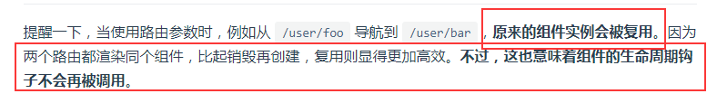
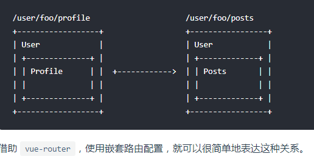
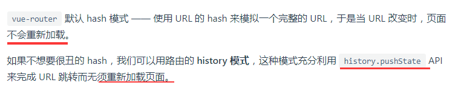
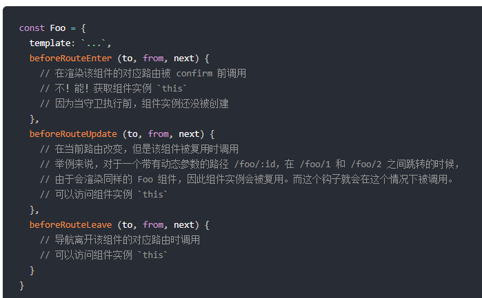
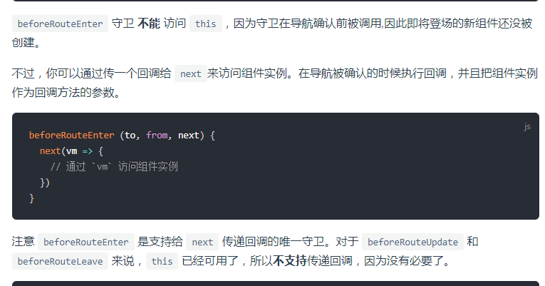
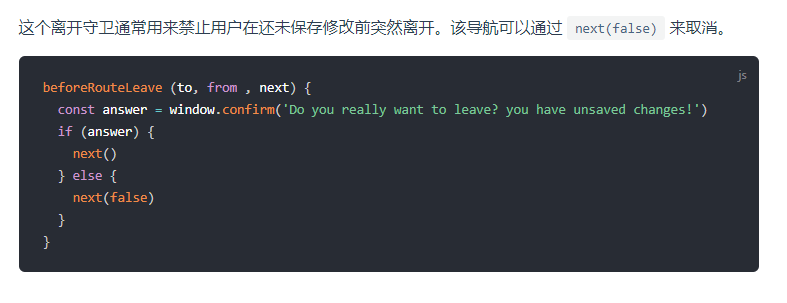
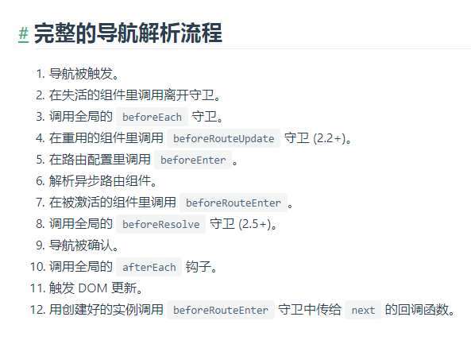
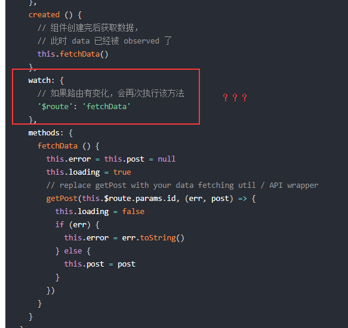
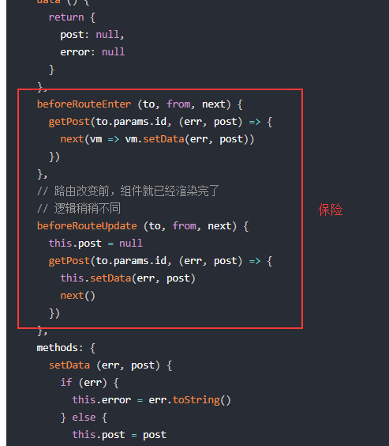
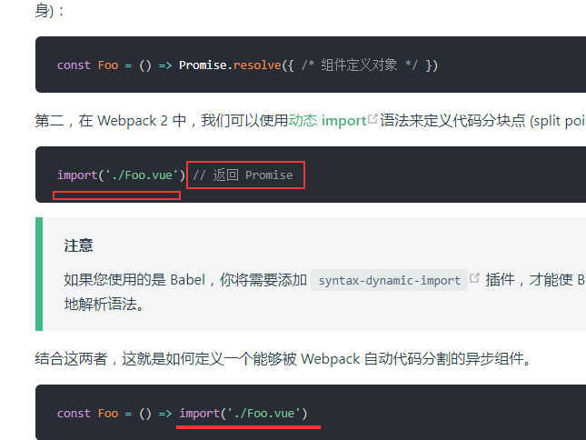

# vue-router

2019-8-11 17:40     广东佛山美的广夏花园

一共14节，看完之后去刷面试题

### 动态路由匹配



- 两个路由，如果只是参数不同的话，原来的组件实例会被复用
- 组件实例被复用的话，**生命钩子不会再被调用**。也就是会出现我之前遇到的问题，**数据不会重新拉取。**
- 如何解决数据不会被拉取？？这样根据路由参数来复用组件，虽然是少了代码，这些问题怎么解决

解决方法

复用组件时，想对路由参数的变化作出响应的话，你可以简单地 watch (监测变化) `$route` 对象：

或者使用 2.2 中引入的 `beforeRouteUpdate` [导航守卫](https://router.vuejs.org/zh/guide/advanced/navigation-guards.html)：

- 那么就是beforeRouterEnter来更新store中的数据，实现复用组件的同时又跟新数据。

那为什么后来又全部删掉了beforeRouterEnetr???

---

匹配的优先级就按照路由的定义顺序：**谁先定义的，谁的优先级就最高**。

### 嵌套路由



vue中的children就是实现上图中的问题,孩子确定里面的路由.

### 命名路由

就是给路由起一个名字   之后在router-view中的to属性上可以使用这个名字   而不是长长的url

还可以一个路由对应多个组件components之后在页面根据name属性确定(三个组件就在页面中放三个route-view)

### 重定向路由

- 为重定向路由添加路由守卫将无效
- 重定向 可以是路由，或者路由name，或者是一个函数
- 别名alias，就是两个路由都使用同一个组件。也就是两个路由相当于同一个

### 路由组件传参

- 如果 `props` 被设置为 `true`，`route.params` 将会被设置为组件属性。

目的是让路由和组件解耦，减少使用$route

### HISTORY模式



就是说两种方式都能实现url变但是页面不刷新（原理是什么？？）

**history需要后端设置当url匹配不到资源时(不是后端请求)显示前端的单页面index.html**

----

### 导航守卫


参数变化明确，查询变化是什么？？

进入离开是什么守卫enter

组件内三个路由的区别







一个很好地应用场景，当用户没有暂存却想离开时提醒。



还要看更多来理解这张图

### 路由元信息

meta存储了文档的元信息

```js
meta: { requiresAuth: true }
```

在路由中加这个，并且在路由守卫中判断元信息，可以实现登录判断并控制

### 数据获取

有两种方式：

- **导航完成之后获取**：先完成导航，然后在接下来的组件生命周期钩子中获取数据。在数据获取期间显示“加载中”之类的指示。（这个时候组件中的data已经是双向数据绑定中）
- **导航完成之前获取**：导航完成前，在路由进入的守卫中获取数据，在数据获取成功后执行导航。

从技术角度讲，两种方式都不错 —— 就看你想要的用户体验是哪种。





为啥要watch ￥router变化就再次请求？？？不合理的

滚动行为：**history.pushState**才能用，可以定位滚动行为，页面刷新后定位到哪个位置


### 懒加载

通过vue的异步组件，再加上webpack代码分割的功能实现组件按需加载



这些被懒加载之后的组件会被缓存起来，下一次进行使用。**vue在使用这些缓存组件是如何操作的呢？**？？？

9:15-11:02 （47分钟）实践之后学习效果更好