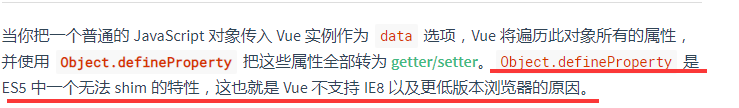
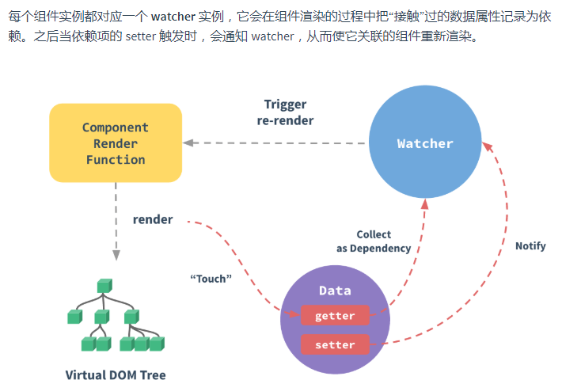
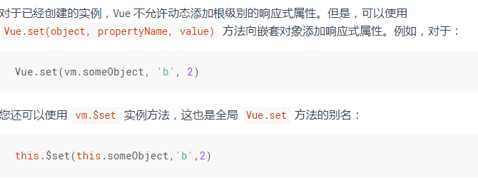

# 深入响应式原理

## 如何追踪变化

> 通过遍历定义在data中的所有数据，遍历他们的所有属性，并使用Object.defineProperty来重写set和get方法。当发现变化了之后触发事件，通知每个组件对应的watcher来通知这个watcher关联的组件重新渲染

## 检测变化的注意事项

1，只有定义在data上的属性才有响应式

2，如果想在一个已经创建的vm实例，可以使用set方法

## 声明响应式属性

`data`对象就像组件状态的结构 (schema)。提前声明所有的响应式属性，可以让组件代码在未来修改或给其他开发人员阅读时更易于理解。同时，规避了边界情况，易于vue做类型管理。

边界情况是什么？？？？？

## 异步更新队列

1，每个data变化时，并不会立刻更新dom，而是加入异步队列，有一个事件机制和缓存机制

2，可以使用this.$nextTick()方法，在dom更新之后做些操作。

vue异步更新的机制是什么呢？？？？

## 混入mixins

1，混入就一个js文件，这个文件里面可以引用其他任何组件。这个文件可以申请函数，vue钩子函数，变量

2，混入之后，这个组件就拥有了这个文件里面所有的函数和变量。

​	如果有冲突，就合并，变量采用交集，冲突组件数据优先。

