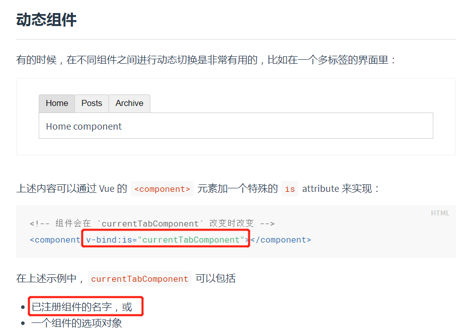

# 生命周期

 https://ustbhuangyi.github.io/vue-analysis/v2/components/lifecycle.html#beforemount-mounted 

目前还不是很清楚，需要重新学一下vue源码

## beforeCreate & created

`beforeCreate` 和 `created` 函数都是在实例化 `Vue` 的阶段，**在new Vue（）之前**

```js
Vue.prototype._init = function (options?: Object) {
  // ...
  initLifecycle(vm)
  initEvents(vm)
  initRender(vm)
  callHook(vm, 'beforeCreate')
  initInjections(vm) // resolve injections before data/props
  initState(vm)
  initProvide(vm) // resolve provide after data/props
  callHook(vm, 'created')
  // ...
}
```

可以看到 `beforeCreate` 和 `created` 的钩子调用是在 `initState` 的前后，`initState` 的作用是初始化 `props`、`data`、`methods`、`watch`、`computed` 等属性。那么显然 `beforeCreate` 的钩子函数中就不能获取到 `props`、`data` 中定义的值，也不能调用 `methods` 中定义的函数。

---

在执行 `vm._render()` 函数渲染 VNode 之前，执行了 `beforeMount` 钩子函数，在执行完 `vm._update()` 把 VNode patch 到真实 DOM 后，执行 `mounted` 钩子。注意，这里对 `mounted` 钩子函数执行有一个判断逻辑，`vm.$vnode` 如果为 `null`，则表明这不是一次组件的初始化过程，而是我们通过外部 `new Vue` 初始化过程。那么对于组件，它的 `mounted` 时机在哪儿呢？

之前我们提到过，组件的 VNode patch 到 DOM 后，会执行 `invokeInsertHook` 函数，把 `insertedVnodeQueue` 里保存的钩子函数依次执行一遍，它的定义在 `src/core/vdom/patch.js` 中：

```js
function invokeInsertHook (vnode, queue, initial) {
  // delay insert hooks for component root nodes, invoke them after the
  // element is really inserted
  if (isTrue(initial) && isDef(vnode.parent)) {
    vnode.parent.data.pendingInsert = queue
  } else {
    for (let i = 0; i < queue.length; ++i) {
      queue[i].data.hook.insert(queue[i])
    }
  }
}
```

该函数会执行 `insert` 这个钩子函数，对于组件而言，`insert` 钩子函数的定义在 `src/core/vdom/create-component.js` 中的 `componentVNodeHooks` 中：

```js
const componentVNodeHooks = {
  // ...
  insert (vnode: MountedComponentVNode) {
    const { context, componentInstance } = vnode
    if (!componentInstance._isMounted) {
      componentInstance._isMounted = true
      callHook(componentInstance, 'mounted')
    }
    // ...
  },
}
```

我们可以看到，每个子组件都是在这个钩子函数中执行 `mounted` 钩子函数，并且我们之前分析过，`insertedVnodeQueue` 的添加顺序是先子后父，所以对于同步渲染的子组件而言，`mounted` 钩子函数的执行顺序也是先子后父。

这块地方每太看懂，需要后续补足这些知识

---

## activated & deactivated

`activated` 和 `deactivated` 钩子函数是专门为 `keep-alive` 组件定制的钩子

### [keep-alive](https://cn.vuejs.org/v2/api/#keep-alive)

- **Props**：

  - `include` - 字符串或正则表达式。只有名称匹配的组件会被缓存。
  - `exclude` - 字符串或正则表达式。任何名称匹配的组件都不会被缓存。
  - `max` - 数字。最多可以缓存多少组件实例。

- **用法**：

  `` 包裹动态组件时，会缓存不活动的组件实例，而不是销毁它们。和 `` 相似，` <keep-alive> ` 是一个抽象组件：它自身不会渲染一个 DOM 元素，也不会出现在组件的父组件链中。

  当组件在 <keep-alive>  内被切换，它的 `activated` 和 `deactivated` 这两个生命周期钩子函数将会被对应执行。

  > 在 2.2.0 及其更高版本中，`activated` 和 `deactivated` 将会在 ` <keep-alive> ` 树内的所有嵌套组件中触发。

  主要用于保留组件状态或避免重新渲染。

  ```vue
  <!-- 基本 -->
  <keep-alive>
    <component :is="view"></component>
  </keep-alive>
  
  <!-- 多个条件判断的子组件 -->
  <keep-alive>
    <comp-a v-if="a > 1"></comp-a>
    <comp-b v-else></comp-b>
  </keep-alive>
  
  <!-- 和 `<transition>` 一起使用 -->
  <transition>
    <keep-alive>
      <component :is="view"></component>
    </keep-alive>
  </transition>
  ```

  注意，`` 是用在其一个直属的子组件被开关的情形。如果你在其中有 `v-for` 则不会工作。如果有上述的多个条件性的子元素，`` 要求同时只有一个子元素被渲染。

- **`include` and `exclude`**

  > 2.1.0 新增

  `include` 和 `exclude` 属性允许组件有条件地缓存。二者都可以用逗号分隔字符串、正则表达式或一个数组来表示：

  ```vue
  <!-- 逗号分隔字符串 -->
  <keep-alive include="a,b">
    <component :is="view"></component>
  </keep-alive>
  
  <!-- 正则表达式 (使用 `v-bind`) -->
  <keep-alive :include="/a|b/">
    <component :is="view"></component>
  </keep-alive>
  
  <!-- 数组 (使用 `v-bind`) -->
  <keep-alive :include="['a', 'b']">
    <component :is="view"></component>
  </keep-alive>
  ```

  匹配首先检查组件自身的 `name` 选项，如果 `name` 选项不可用，则匹配它的局部注册名称 (父组件 `components` 选项的键值)。匿名组件不能被匹配。

- **`max`**

  > 2.5.0 新增

  最多可以缓存多少组件实例。一旦这个数字达到了，在新实例被创建之前，已缓存组件中最久没有被访问的实例会被销毁掉。

  ```vue
  <keep-alive :max="10">
    <component :is="view"></component>
  </keep-alive>
  ```

  `` 不会在函数式组件中正常工作，因为它们没有缓存实例。

  ### 动态keep-live

   注意这个 要求被切换到的组件都有自己的名字，不论是通过组件的 `name` 选项还是局部/全局注册。 

```vue
<keep-alive>
  <component v-bind:is="currentTabComponent"></component>
</keep-alive>
```

