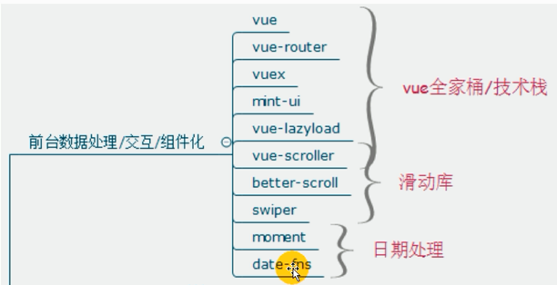
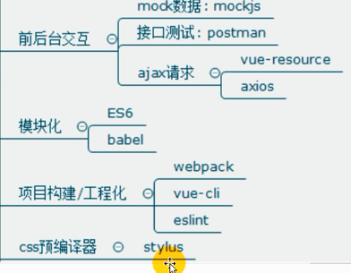
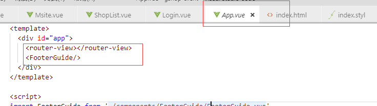
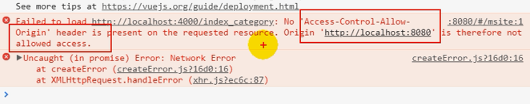
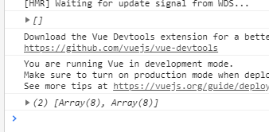
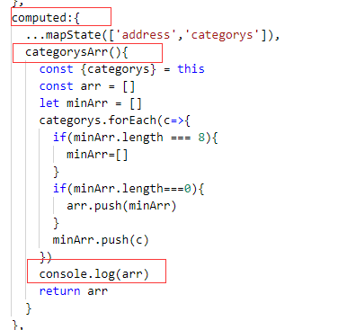
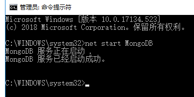
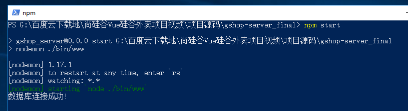
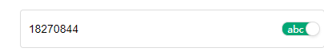

# vue实战--掌握vue框架





1，**render**：当vue中template不能满足一些活动性比较大的元素的html时，可以采用render函数实现。解决template写死的问题   ????

2，css中的reset.css文件，目的是为了解决浏览器默认样式不统一的问题  *{margining:0;padding:0;}效率太慢了

3，移动端添加文件viewport

html代码中最关键的就是meta标签设置，开发移动端页面首先一定要设置viewport 
<meta name="viewport" content="width=device-width, initial-scale=1.0, user-scalable=no, minimum-scale=1.0, maximum-scale=1.0" />
device-width - 设备的宽度
initial-scale - 初始的缩放比例  
minimum-scale - 允许用户缩放到的最小比例   
maximum-scale - 允许用户缩放到的最大比例  


2018-12-5

非路由组件，就是不随路由变化而变化的组件

> 强制绑定类名的写法选择：采用对象写法，当类名确定但是是否需要这个类名时，采用对象写法


### swiper实现轮播

官网教程

问题：

> 为什么在msite组件中没有应用footerguide组件，底部组件也能正常显示？

原因



> $route 表示当前路由



跨域问题

vue中跨域配置

所有的从后台获取的数据都要用vuex来管理


---

问题：computed里面的数据要等到渲染才能拿到这是为什么么





数据是ajax获取的，还是不是很理解es6里面的ajax，并且vue整个编译流程和状态函数


---

列表分页显示，需要在列表出来了之后才能实现轮播。列表显示了才能实现轮播

```js
  watch:{
    categorys(value){
      new Swiper ('.swiper-container', {
      loop: true, // 循环模式选项
      pagination: {
        el: '.swiper-pagination',
      }
      })         
    }
  },
```


监听ajax请求的值，如果这个值变化了，就表明ajax结果已经返回（很聪明）

但是界面更新之后立即执行需要使用vue中的nextTick函数

```js
  watch:{
    categorys(value){
      this.$nextTick(()=>{
        //nextTick表示下次更新页面，但是必须是数据更新之后再调用，才能实现想要的效果
        new Swiper ('.swiper-container', {
          loop: true, // 循环模式选项
          pagination: {
            el: '.swiper-pagination',
          }
        })  
      })
    }
  },
```


---

js将一维数组转换为二维数组遇到的坑

```js
    categorysArr(){
      const {categorys} = this
      const arr = []
      let minArr = []
      if(categorys.length>0){
        categorys.forEach(c=>{
        if(minArr.length === 4){
          arr.push(minArr)
          minArr=[]
        }
        //放完最后一个的时候，循环遍历就结束了，不会再进入循环而把小数组push进入大数组
        minArr.push(c)
      })
      }
      return arr
    }
```

正确的写法：就是先放空的，待装入的数组进去。之后当这个数组装满之后，就清空，放入总数组中，再加满。

```js
    categorysArr(){
      const {categorys} = this
      const arr = []
      let minArr = []
      categorys.forEach(c=>{
        if(minArr.length === 8){
          minArr=[]
        }
        if(minArr.length===0){
          arr.push(minArr)
        }
        minArr.push(c)
      })
      console.log(arr)
      return arr
    }
```

将二维数组转化为一维数组

```js
const arr=[[1,2,3],[3,4],[5]];
console.log([].concat.apply([],arr));

call()方法的作用和 apply() 方法类似，区别就是call()方法接受的是参数列表，而apply()方法接受的是一个参数数组。
concat用于连接两个或多个数组
```


---

vue奇怪的地方：src加了：找不到项目静态资源


---

svg图

----

### 后台项目运行方式

1，打开mongodb服务，查找cmd用管理员身份打开，输入net start MongoDB



2，找到后台应用：npm start




谷歌中安装好vue工具

----

```less
                .get_verification
                  position absolute
                  top 50%
                  right 10px
                  transform translateY(-50%)
                  border 0
                  color #ccc
                  font-size 14px
                  background transparent
                  &.right_phone//表示同级引用，表示必须要有right_phone和get_verification这两个类名的时候才用下面的样式规则
```



实现上图动画

1，利用变量关联的方式设置类名的变化，输入框的选择

2，将圆形div快移动到右边

```js
<section class="login_verification">
<input type="text" maxlength="8" placeholder="密码" v-if="showPwd" v-model="pwd">
<input type="password" maxlength="8" placeholder="密码" v-else v-model="pwd">
<div class="switch_button" :class="showPwd ? 'on' : 'off'" @click="showPwd = !showPwd">
 <div class="switch_circle" :class="{right: showPwd}"></div>
<span class="switch_text">{{showPwd ? 'abc' :' '}}</span>
                  </div>
                </section>
                  >.switch_circle
                    //transform translateX(27px)
                    position absolute
                    top -1px
                    left -1px
                    width 16px
                    height 16px
                    border 1px solid #ddd
                    border-radius 50%
                    background #fff
                    box-shadow 0 2px 4px 0 rgba(0,0,0,.1)
                    transition transform .3s
                    &.right
                     transform translateX(30px)
```

---

1、父组件可以使用 props 把数据传给子组件。
2、子组件可以使用 $emit 触发父组件的[自定义事件](https://www.baidu.com/s?wd=%E8%87%AA%E5%AE%9A%E4%B9%89%E4%BA%8B%E4%BB%B6&tn=24004469_oem_dg&rsv_dl=gh_pl_sl_csd)。

---

短信验证码

使用第三方（容联通信）

---

