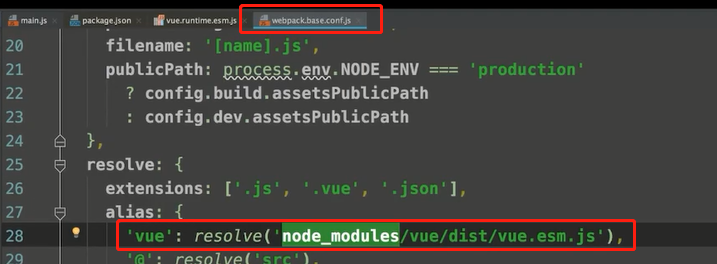
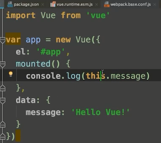
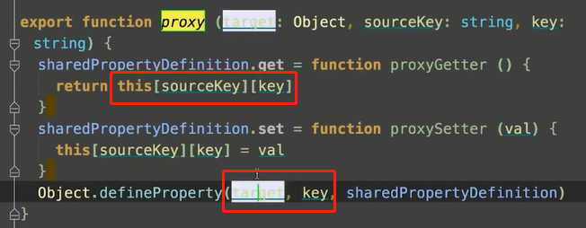
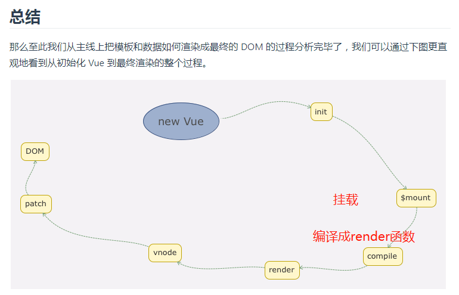
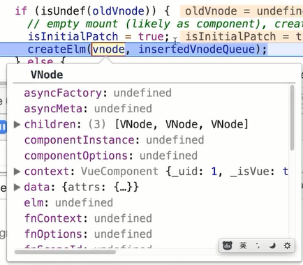
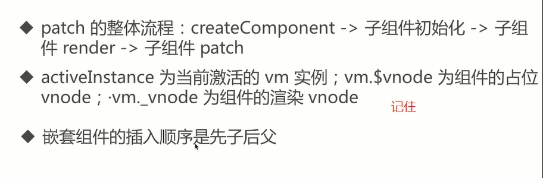
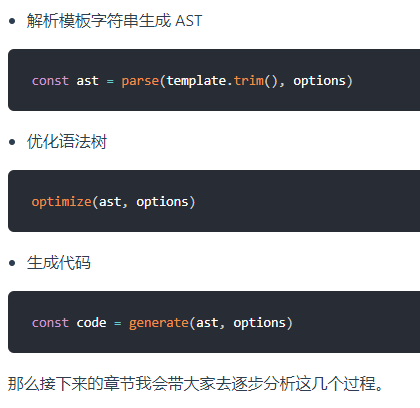

# vue源码深入解析

1，函数柯里化

见js文件夹

只记自己的理解，或者只记重要部分，用于考前面试快速复习

----

## 准备工作

#### flow

vue源码中使用flow来做类型检查，并且自定义了很多静态类，方便进行类型检查，比如vnode

具体类型检查方式见文档    flow[工作方式]([https://ustbhuangyi.github.io/vue-analysis/prepare/flow.html#flow-%E7%9A%84%E5%B7%A5%E4%BD%9C%E6%96%B9%E5%BC%8F](https://ustbhuangyi.github.io/vue-analysis/prepare/flow.html#flow-的工作方式))

##### 目录设计

作者把功能模块拆分的非常清楚，相关的逻辑放在一个独立的目录下维护，并且把复用的代码也抽成一个独立目#### 源码构

#### 源码构建

如何看**build**命令，**和简单的编译规则**

使用npm run build 将vue文件打包成浏览器认识的js文件，vue里面的规则可以将vue打包成不同版本的文件。

另外：会有Runtime Only VS Runtime + Compiler

就是打包过程中，全部打包不带编译器。带编译器的打包，可以在运行时进行编译

```
// 需要编译器的版本
new Vue({
  template: '<div>{{ hi }}</div>'
})

// 这种情况不需要
new Vue({
  render (h) {
    return h('div', this.hi)
  }
})
```

#### 从入口开始

一个用 Function 实现的 Class，然后它的原型 prototype 以及它本身都扩展了一系列的方法和属性

为何 Vue 不用 ES6 的 Class 去实现呢？我们往后看这里有很多 `xxxMixin` 的函数调用，并把 `Vue` 当参数传入，它们的功能都是给 Vue 的 prototype 上扩展一些方法（这里具体的细节会在之后的文章介绍，这里不展开），Vue 按功能把这些扩展分散到多个模块中去实现，而不是在一个模块里实现所有，这种方式是用 Class 难以实现的。

## 数据驱动

主要弄清楚，在vue文件中定义的变量，是如何渲染成浏览器的dom的

从new vue开始都发生了那些事情

**Vue 的初始化逻辑写的非常清楚，把不同的功能逻辑拆成一些单独的函数执行，让主线逻辑一目了然，这样的编程思想是非常值得借鉴和学习的。**

逻辑思维很重要，可以多多学习好的逻辑思维方式，借鉴好的逻辑思维方式。

源码调试技巧，就是找到vue编译后的文件，打debugger



webpack打包编译后的文件（之后补充）

---

#### vm.$mount 重点分析这个挂载方法



为什么我们在data中定义了变量，在钩子函数中可以用this使用

1，在初始化中，vue执行了initState，将data数据挂载到了_data中

2，使用proxy代理当用户访问data时其实访问的是_data中的变量



将vm的对象中的key设置了get和set方法，转化为_data.*

---

$mount的工作过程

**`mountComponent` 核心就是先实例化一个渲染`Watcher`，在它的回调函数中会调用 `updateComponent` 方法，在此方法中调用 `vm._render` 方法先生成虚拟 Node，最终调用 `vm._update` 更新 DOM。**

会将整个要挂载的dom替换成定义的，所以不能再body上绑定

render函数的实现

????



## 组件化

了解patch的整体流程

了解组件patch流程中的activeInstance，vm。vnode

了解嵌套组件的插入顺序

**patch的这整个流程，如果是dom字符串就使用原生方法来创建vnode挂载真正的dom，如果是组件，就遍历生成组件树vnode（建立父子关系），之后从子组件来开始创建真正的dom再创建父组件。**

每个组件都是继承vm的一些方法$mount等等等





#### 合并配置

也就是将组件中的配置合并起来

#### 生命周期

beforeCreate & created

**`beforeCreate` 和 `created` 的钩子调用是在 `initState` 的前后，`initState` 的作用是初始化 `props`、`data`、`methods`、`watch`、`computed` 等属性，之后我们会详细分析。那么显然 `beforeCreate` 的钩子函数中就不能获取到 `props`、`data` 中定义的值，也不能调用 `methods` 中定义的函数。**

在这俩个钩子函数执行的时候，并没有渲染 DOM，所以我们也不能够访问 DOM，

beforeMount & mounted

**在执行 `vm._render()` 函数渲染 VNode 之前，执行了 `beforeMount` 钩子函数，在执行完 `vm._update()` 把 VNode patch 到真实 DOM 后，执行 `mounted` 钩子。注意，这里对 `mounted` 钩子函数执行有一个判断逻辑，`vm.$vnode` 如果为 `null`，则表明这不是一次组件的初始化过程，而是我们通过外部 `new Vue` 初始化过程。那么对于组件，它的 `mounted` 时机在哪儿呢？**

**之前我们提到过，组件的 VNode patch 到 DOM 后，会执行 `invokeInsertHook` 函数，把 `insertedVnodeQueue` 里保存的钩子函数依次执行一遍，它的定义在 `src/core/vdom/patch.js` 中：**

**我们可以看到，每个子组件都是在这个钩子函数中执行 `mounted` 钩子函数，并且我们之前分析过，`insertedVnodeQueue` 的添加顺序是先子后父，所以对于同步渲染的子组件而言，`mounted` 钩子函数的执行顺序也是先子后父。**

#### 组件注册


## 深入响应式原理

## 编译

Vue.js 提供了 2 个版本，一个是 Runtime + Compiler 的，一个是 Runtime only 的，前者是包含编译代码的，可以把编译过程放在运行时做，后者是不包含编译代码的，需要借助 webpack 的 `vue-loader` 事先把模板编译成 `render`函数

编译的过程是一个相对复杂的过程，我们只要求理解整体的流程、输入和输出即可



编译入口逻辑之所以这么绕，是因为 Vue.js 在不同的平台下都会有编译的过程，因此编译过程中的依赖的配置 `baseOptions` 会有所不同。而编译过程会多次执行，但这同一个平台下每一次的编译过程配置又是相同的，为了不让这些配置在每次编译过程都通过参数传入，**Vue.js 利用了函数柯里化的技巧很好的实现了 `baseOptions` 的参数保留。同样，Vue.js 也是利用函数柯里化技巧把基础的编译过程函数抽出来，通过 `createCompilerCreator(baseCompile)` 的方式把真正编译的过程和其它逻辑如对编译配置处理、**缓存处理等剥离开，这样的设计还是非常巧妙的。
