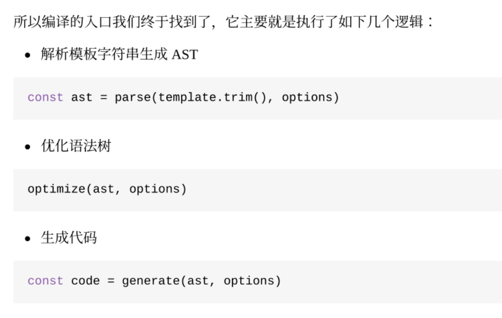
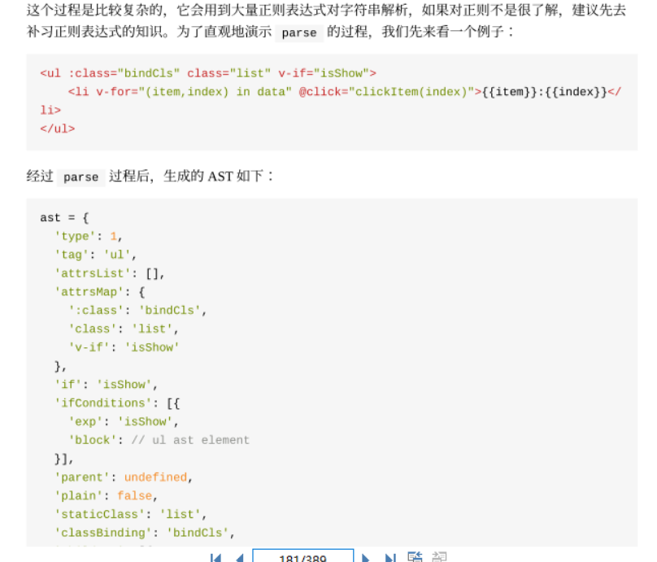
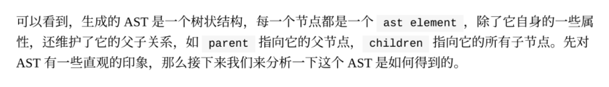
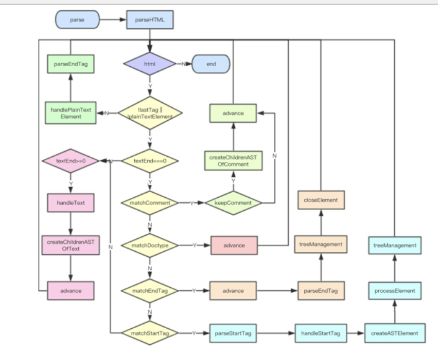
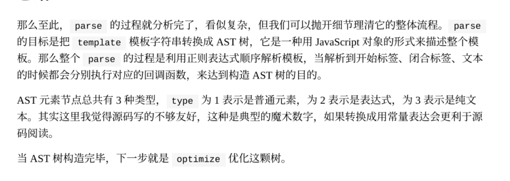
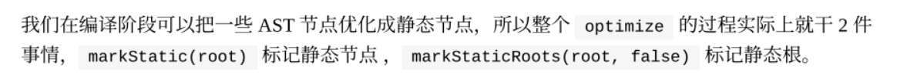
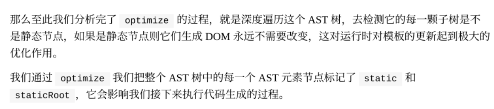
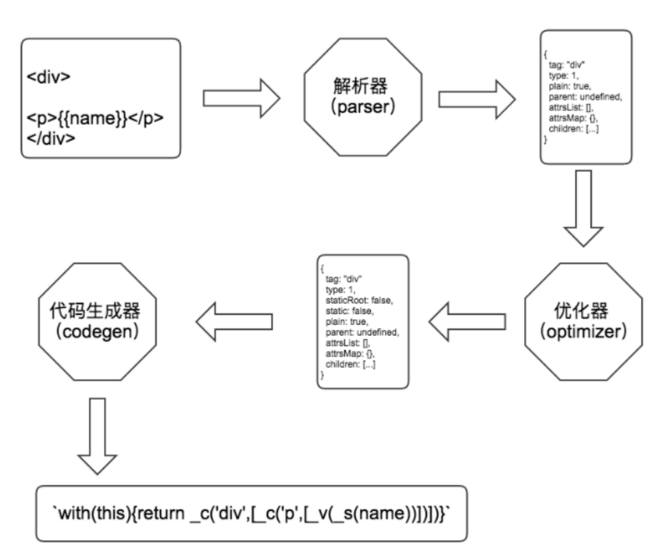

ast树，就是这样属性，就和不用jsx的render写法类似



正则+栈





所以optimize做的事情就是：标记静态节点，不设计动态数据



生成代码过程

编译的最后⼀步就是把优化后的 AST 树转换成可执⾏的代码

codegen

还是先从编译说起，我们知道编译是发⽣在调⽤  vm.$mount  的时候，所以编译的顺序是先编译⽗组
件，再编译⼦组件

我们知道在普通插槽中，**⽗组件应⽤到⼦组件插槽⾥的数据都是绑定到⽗组件的，因为它渲染成**
 vnode  **的时机的上下⽂是⽗组件的实例**。但是在⼀些实际开发中，我们想通过⼦组件的⼀些数据来
决定⽗组件实现插槽的逻辑，Vue 提供了另⼀种插槽——作⽤域插槽，接下来我们就来分析⼀下它的
实现原理。

通过这⼀章的分析，我们了解了普通插槽和作⽤域插槽的实现。它们有⼀个很⼤的差别是数据**作⽤**
**域，普通插槽是在⽗组件编译和渲染阶段⽣成**  vnodes ，所以数据的作⽤域是⽗组件实例，⼦组件渲
染的时候直接拿到这些渲染好的  vnodes 。⽽对于作⽤域插槽，**⽗组件在编译和渲染阶段并不会直接**
**⽣成  vnodes ，⽽是在⽗节点  vnode  的  data  中保留⼀个  scopedSlots  对象**，存储着不同名称
的插槽以及它们对应的渲染函数，**只有在编译和渲染⼦组件阶段才会执⾏这个渲染函数⽣成**
 vnodes ，由于是在⼦组件环境执⾏的，所以对应的数据作⽤域是⼦组件实例。
简单地说，两种插槽的⽬的都是让⼦组件  slot  占位符⽣成的内容由⽗组件来决定，但数据的作⽤域
会根据它们  vnodes  渲染时机不同⽽不同。

作用域，提供一个对象，这个对象里面有对应的插槽的名字及渲染函数

细节不是特别了解

### vue中加载顺序（记住这个图，父组件先创建，但是子组件先挂载）

探究的方法是：写一个有父子嵌套关系的组件，分别在他们的钩子函数中打印日志，观察执行顺序。得到的结果如图所示，父组件先创建，然后子组件创建；子组件先挂载，然后父组件挂载。


子组件挂载完成后，父组件还未挂载。所以组件数据回显的时候，在父组件`mounted`中获取api的数据，子组件的`mounted`是拿不到的。

仔细看看父子组件生命周期钩子的执行顺序，会发现`created`这个钩子是按照从外内顺序执行，所以回显场景的解决方案是：在created中发起请求获取数据，依次在子组件的created中会接收到这个数据。

---

生成器

前面有提到 VNode 是渲染函数生成的，代码生成器最后生成的正是渲染函数的代码字符串。依旧还是看前面的例子：

`with(this){return _c("div", [_v(_s(name))])}`

- 元素节点

```
function getElement (el, state) {
  const data = el.plain ? undefined : genData(el, state)

  const children = genChildren(el, state)
  code = `_c(`${el.tag}`${data ? `,${data}` : ''}${children ? `,${children}` : ''})`
  return code
}
```

生成子节点代码字符串其实就是一个循环的过程，再将它们拼接到一起，具体实现如下：

```
function genChildren (el, state) {
  const children = el.children
  if (children.length) {
    return `[${children.map(c => gen(c, state)).join(',')}]`
  }
}

function genCode (node, state) {
  if (node.type ===1) {
    return genElement(node, state)
  } else if (node.type === 3 && node.isComment) {
    return genComment(node)
  } else {
    return genText(node)
  }
}
```





解析器（parser）的原理是一小段一小段的去截取字符串，然后维护一个 `stack` 用来保存DOM深度，每截取到一段标签的开始就 `push` 到 `stack` 中，当所有字符串都截取完之后也就解析出了一个完整的 `AST`。

优化器（optimizer）的原理是用递归的方式将所有节点打标记，表示是否是一个 `静态节点`，然后再次递归一遍把 `静态根节点` 也标记出来。

代码生成器（code generator）的原理也是通过递归去拼一个函数执行代码的字符串，递归的过程根据不同的节点类型调用不同的生成方法，如果发现是一颗元素节点就拼一个 `_c(tagName, data, children)` 的函数调用字符串，然后 `data` 和 `children` 也是使用 `AST` 中的属性去拼字符串。

如果 `children` 中还有 `children` 则递归去拼。

最后拼出一个完整的 `render` 函数代码。

