## 五、 ES6 模块与 CommonJS 模块的差异

### 1. CommonJS 模块输出的是一个值的拷贝，ES6 模块输出的是值的引用。

- CommonJS 模块输出的是值的拷贝，也就是说，一旦输出一个值，模块内部的变化就影响不到这个值。
- ES6 模块的运行机制与 CommonJS 不一样。JS 引擎对脚本静态分析的时候，遇到模块加载命令`import`，就会生成一个只读引用。等到脚本真正执行时，再根据这个只读引用，到被加载的那个模块里面去取值。换句话说，ES6 的`import`有点像 Unix 系统的“符号连接”，原始值变了，`import`加载的值也会跟着变。因此，ES6 模块是动态引用，并且不会缓存值，模块里面的变量绑定其所在的模块。

### 2. CommonJS 模块是运行时加载，ES6 模块是编译时输出接口。

- 运行时加载: CommonJS 模块就是对象；即在输入时是先加载整个模块，生成一个对象，然后再从这个对象上面读取方法，这种加载称为“运行时加载”。
- 编译时加载: ES6 模块不是对象，而是通过 `export` 命令显式指定输出的代码，`import`时采用静态命令的形式。即在`import`时可以指定加载某个输出值，而不是加载整个模块，这种加载称为“编译时加载”。

CommonJS 加载的是一个对象（即`module.exports`属性），该对象只有在脚本运行完才会生成。而 ES6 模块不是对象，它的对外接口只是一种静态定义，在代码静态解析阶段就会生成。

es6编译的时候生成地址，运行的时候去对应模块取值，支持静态分析，

commonjs是运行的时候去同步加载，得到一个值的拷贝，是一个对象

下面不用复习

# JS模块化规范

模块化的好处：1，避免命名冲突（减少命名空间污染）2，更好的分离，按需加载 3，更高复用性 4，高可维护性

模块化带来的问题：请求过多（1个js文件被拆成多个），依赖模糊，难以维护

因此需要规范模块化

## 模块化进化史

1，全局函数模式：将不同的功能封装成不同的全局函数

全局变量，容易被覆盖

2，命名空间模式：简单对象封装

还是能设置对象里面的数据，不安全

3，匿名函数自调用（闭包）

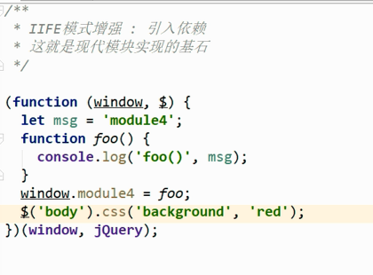

采用依赖注入的方法，将window和jquery注入进入，并把模块化中的数据通过window暴露出去，函数foo中使用的变量则为闭包产生出来的，这个案例中无法修改

## commonjs

#### commonjs基于服务器端（node）应用

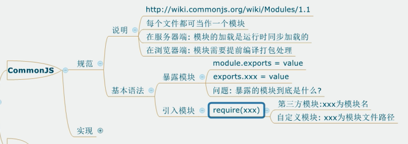

commonJS规范是**同步加载的**，适用于服务器端，但是如果用在浏览器端的话，**会造成请求不停等待**。而且commonjs中模块语法require()浏览器不识别

暴露的模块到底是什么：其实是module.exports(你将你希望暴露的属性加入这个对象中去)

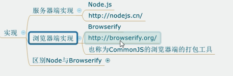

#### commonjs基于浏览器端的应用

通过使用browserify，在浏览器编译打包commonJs

commonjs的包名不能有大写和中文

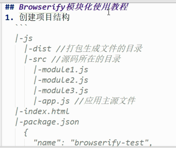

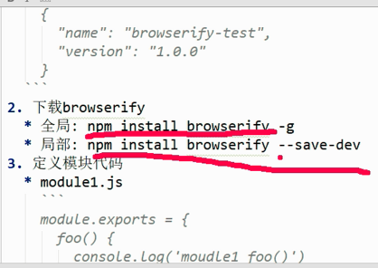

局部安装添加了-dev的作用：因为browerify是编译打包工具（打包之后编程dist文件夹下的js文件），所以最后运行环境上不需要加了-dev表示开发依赖，不加是运行依赖，如下图

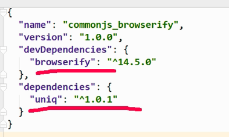

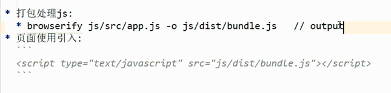

项目中都封装好了这些步骤

### commonjs的原理

如何实现同步加载，依赖如何处理

commonJS用同步的方式加载模块。在服务端，模块文件都存在本地磁盘，读取非常快，所以这样做不会有问题。但是在浏览器端，限于网络原因，更合理的方案是使用异步加载。

## amd

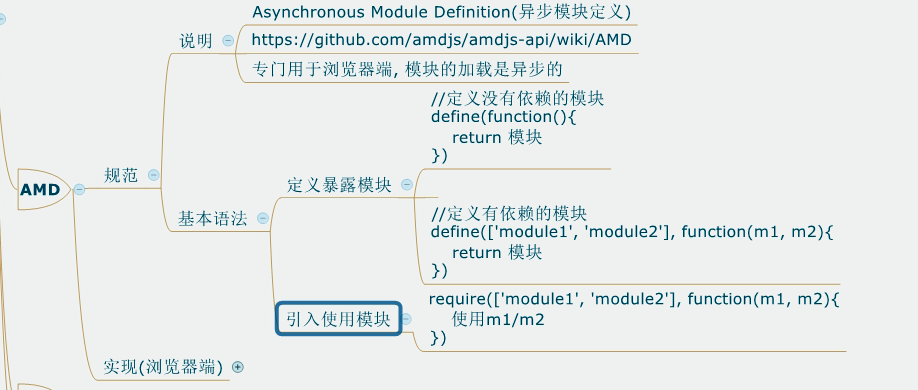

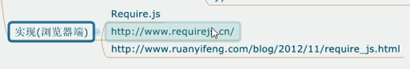

requireJs

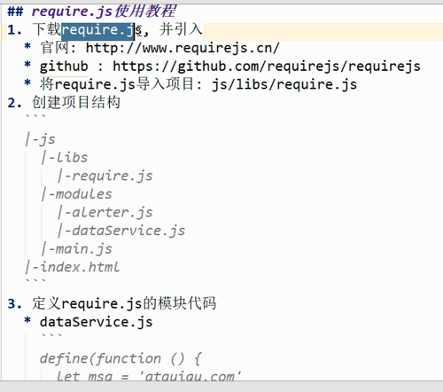

定义没有依赖得模块

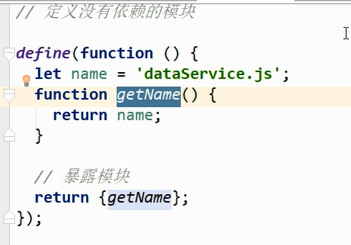

定义有依赖得模块

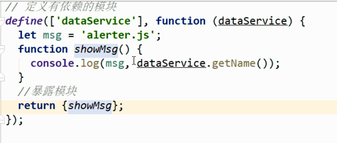

引用上面得模块

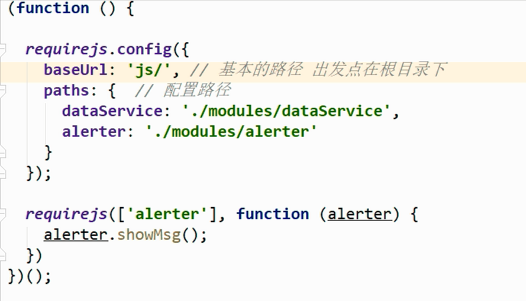

1，baseUrl找文件，从baseUrl文件夹下找，如果没有写baseUrl就从当前文件下找

2，path中写模块路径不要加后缀

html页面中得写法

引入require.js文件其中data-main表示js入口

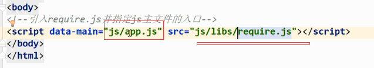

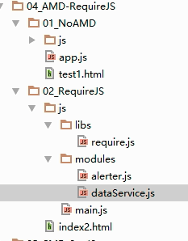

#### amd第三方模块

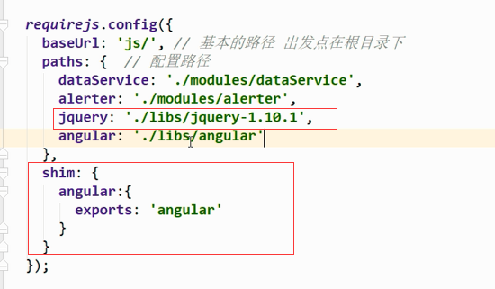

1，jQuery  模块名需要是小写 jquery

2，angular中模块的名字需要这样写加一个配置

3，路径中开头不能为/

AMD规范采用异步方式加载模块，模块的加载不影响它后面语句的运行。所有依赖这个模块的语句，都定义在一个回调函数中，等到加载完成之后，这个回调函数才会运行。这里介绍用require.js实现AMD规范的模块化：用`require.config()`指定引用路径等，用`define()`定义模块，用`require()`加载模块。

CMD是另一种js模块化方案，它与AMD很类似，不同点在于：AMD 推崇依赖前置、提前执行，CMD推崇依赖就近、延迟执行。此规范其实是在sea.js推广过程中产生的。

## ES6规范

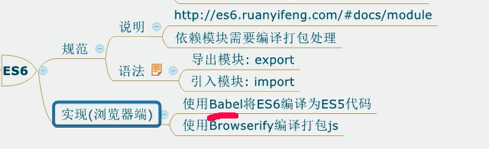

1，需要编译打包处理

因为很多浏览器还不支持es6中得语法，先用Babel编译为Es5，再解决require（）函数不识别的问题（使用Browserify）

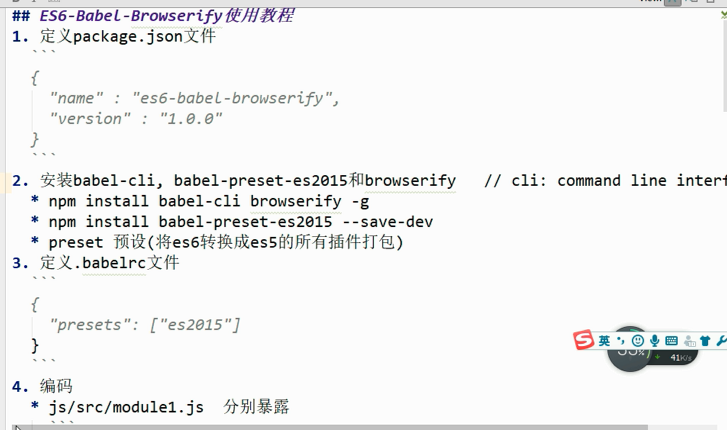

2，安装babel-cli，cli表示命令行接口，就是再命令行中使用babel命令

安装babel中的将es6转化为es5的库babel-preset0es2015

3，定义.babelrc 文件 run control

表示文件为运行时控制文件

暴露模块 

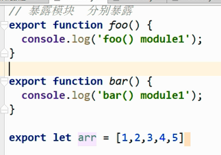

分别暴露

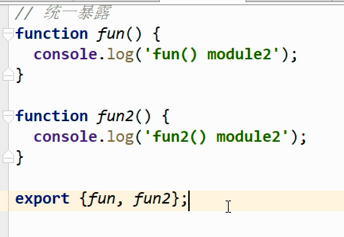

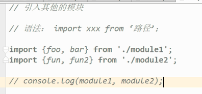

解构赋值的方式接收

>  变量的解构赋值
>
> 1、理解：从对象或数组中提取数据。并赋值1给变量（多个）
>
> 但是明明是按照顺序来接受的，为什么会按照属性名呢？

编译

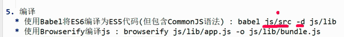

页面中使用

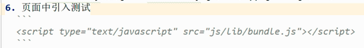

##### 默认暴露

默认暴露只能有一个，把需要暴露的属性加入默认暴露对象中，接受的时候import中就可以用一个变量接受

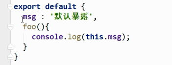

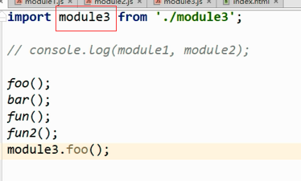

使用第三方模块

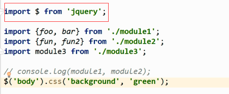

ES6的模块不是对象，`import`命令会被 JavaScript 引擎静态分析，在编译时就引入模块代码，而不是在代码运行时加载，所以无法实现条件加载。也正因为这个，使得静态分析成为可能。

-----

## 懒加载

用到的时候再加载

