## 滑动窗口

要保留，当前窗口右边界在哪，其次就是窗口中最大值及索引，当窗口移动的时候，最大值所在位置要被移出，这个时候新的最大值是多少呢？如何解决这个问题，就知道如何解决滑动窗口问题

如果直接就把窗口中计算一遍，把最大值计算出来，会很傻，时间复杂度高

比较好的就是下面这种，维护递增队列

下面这个方法比较难想，每次加的元素，**把比自己小的元素都不要了，因为不会有作用了**

重点： 检查队头元素在不在队列中，在就是，不在就pop

**怎么检查，队列中放的不是值，是对应的index，这样就很容易判断**

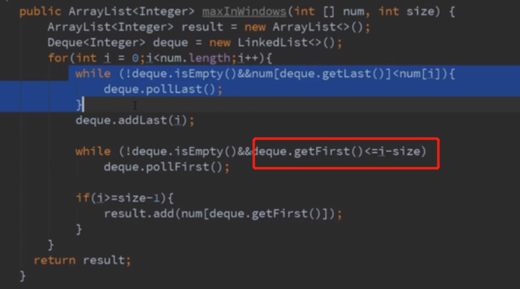

## 滑动窗口中最大的值

**使用单调队列，即单调递减或单调递增的队列**

```js
var maxSlidingWindow = function(nums, k) {
   const deque=[]; //存放单调队列的下标
   const  result=[]; 
   for(let i=0;i<nums.length;i++){
     if(i-deque[0]>=k) deque.shift(); //在滑动窗口之外的直接从队头删掉
     while(nums[deque[deque.length-1]]<=nums[i]){
         deque.pop();  //如果新加进来的数比单调队列中原来的数都要大，则直接弹出队列中的其他数
     }
     deque.push(i);
     //数组下标从0开始，k=3时 ，下标为0，1，2的数组元素构成一个滑动窗口，所以条件为i>=k-1就可以将答案存入res中
     if(i>=k-1) {  
         result.push(nums[deque[0]]);
     }
   }
   return result;
};
```

解题思路
核心思路：维护一个单调队列，队头元素到队尾元素依次递减，然后最大值就是队列中的第一个元素
合法性判断：滑动窗口外的元素删掉
**维护单调队列：如果新加进来的数大于等于队尾元素，则依次将队尾元素删除，始终维护队头元素是最大值**
当满足滑动窗口区间范围时，将队头元素推入结果数组中。
时间复杂度为O(N),空间复杂度为O(N)

作者：lisa-6
链接：https://leetcode-cn.com/problems/sliding-window-maximum/solution/239dan-diao-dui-lie-qiu-jie-hua-dong-chuang-kou-de/
来源：力扣（LeetCode）
著作权归作者所有。商业转载请联系作者获得授权，非商业转载请注明出处。


----

## 二叉树的直径

一、DFS 递归法
经过一个node，其左右子树的最大深度之和 + 1（二叉树的根节点深度为0）
定义一个递归函数 depth(node)
计算 node 为起点的 路径经过节点数 res
函数返回该节点为 根的子树的深度

时间复杂度：O(n) n为二叉树的节点 遍历n
空间复杂度：O(Height) 常数变量 递归的深度为二叉树的高度

代码

```js
var diameterOfBinaryTree = function(root) {
    let res = 0
    depth(root)
    return res
    function depth (node) {
        if (!node) return 0 // 节点不存在返回0
        let left = depth(node.left) // left为左子树的深度
        let right = depth(node.right)//right 为右子树的深度
        res = Math.max(left + right, res) //计算l+r 更新res
        return Math.max(left, right)+1 //返回该节点为根的子树的深度
    }
};
```


作者：ofeii
链接：https://leetcode-cn.com/problems/diameter-of-binary-tree/solution/mei-ri-yi-ti-ep10-d-of-binarytreeer-cha-shu-de-zhi/
来源：力扣（LeetCode）
著作权归作者所有。商业转载请联系作者获得授权，非商业转载请注明出处。

----

## 编辑距离

\21. `dp[i][j]` 代表 `word1` 中前 `i` 个字符，变换到 `word2` 中前 `j` 个字符，最短需要操作的次数

如果你刚刚听说动态规划，还不太明白 dp 为啥要定义成这样，转移方程是啥。
欢迎来看一下这篇题解，看完能稍微理解一下动态规划到底做了什么事？
或许芭。

思路
动态规划

定义 dp[i][j]
21. **dp[i][j] 代表 word1 中前 i 个字符，变换到 word2 中前 j 个字符，最短需要操作的次数**
22. 需要考虑 word1 或 word2 一个字母都没有，即全增加/删除的情况，所以预留 dp[0][j] 和 dp[i][0]

状态转移
31. 增，dp[i][j] = dp[i][j - 1] + 1
32. 删，dp[i][j] = dp[i - 1][j] + 1
33. 改，dp[i][j] = dp[i - 1][j - 1] + 1
34. 按顺序计算，当计算 dp[i][j] 时，dp[i - 1][j] ， dp[i][j - 1] ， dp[i - 1][j - 1] 均已经确定了
35. 配合增删改这三种操作，需要对应的 dp 把操作次数加一，取三种的最小
36. 如果刚好这两个字母相同 word1[i - 1] = word2[j - 1] ，那么可以直接参考 dp[i - 1][j - 1] ，操作不用加一

作者：ikaruga
链接：https://leetcode-cn.com/problems/edit-distance/solution/edit-distance-by-ikaruga/
来源：力扣（LeetCode）
著作权归作者所有。商业转载请联系作者获得授权，非商业转载请注明出处。

```js
/**
 * @param {string} word1
 * @param {string} word2
 * @return {number}
 */
var minDistance = function(word1, word2) {
    let m = word1.length + 1;
    let n = word2.length + 1;
    let dp = new Array(m);
    for(let k = 0; k < m; k++) {
        dp[k] = new Array(n);
    }
    for(let i = 0; i < m; i++ ) {
        dp[i][0] =  i;
    }
    for(let j = 0; j < n; j++ ) {
        dp[0][j] =  j;
    }
    for(let i = 1; i < m; i++ ) {
        for(let j = 1; j < n; j++ ) {
            if(word1[i-1] == word2[j-1]) {
                dp[i][j] = dp[i-1][j-1]
            }
            else {
                dp[i][j] = 1 + Math.min(dp[i-1][j-1], dp[i-1][j], dp[i][j-1])
            }
        }
    }
    return dp[m-1][n-1]
};

```

----

## 最长连续序列


### Set 的查找是 O(1)

### HashSet

HashSet 以哈希表实现。插入的元素是无序的。add，remove 和 contains 都是常数时间复杂度 O(1)。

这个set查询的时间复杂度不高吗???

```js
// 输入: [100, 4, 200, 1, 3, 2]
// 输出: 4
// 解释: 最长连续序列是 [1, 2, 3, 4]。它的长度为 4。
var longestConsecutive = (nums) => {
  const set = new Set(nums) // set存放数组的全部数字
  let max = 0
  for (let i = 0; i < nums.length; i++) {
    if (!set.has(nums[i] - 1)) { // nums[i]没有左邻居，是序列的起点
      let cur = nums[i]
      let count = 1
      while (set.has(cur + 1)) { // cur有右邻居cur+1
        cur++ // 更新cur
        count++ 
      }
      max = Math.max(max, count) // cur不再有右邻居，检查count是否最大
    }
  }
  return max
}
```

-----

## 判断二叉树是否是搜索树

二叉搜索树，左子树所有节点必须比当前节点小，右子树都比当前节点大。

**保留当前的min和max条件**

```js
/**
 * @param {TreeNode} root
 * @return {boolean}
 */
var isValidBST = function(root, min = -Infinity, max = Infinity) {
    if (!root) return true;
    if (root.val <= min || root.val >= max) return false;
    return isValidBST(root.left, min, root.val) && isValidBST(root.right, root.val, max);
};
```

**根据二叉搜索树特点，中序遍历是有序的，中序遍历之后验证是否有序**

```js
var isValidBST = function(root) {
    const quene = [];
    function dfs(root){
        if (!root){
            return;
        }
        root.left && dfs(root.left);
        quene.push(root.val);
        root.right && dfs(root.right);
    }

    dfs(root)

    for(let i=0; i<quene.length; i++){
        if(quene[i] >= quene[i+1]){
            return false;
        }
    }

    return true;
};
```

-----

## 下一个排列

没把正确的操作理清楚

>  **字典序：从右往左，找到第一个左值小于右值的数，然后从右往左，找到第一个大于该左值的数，交换这两个值，并将该左值(不包含)右边的进行从小到大进行排序(原来为降序，只需要改为升序)。**

```js
实现获取下一个排列的函数，算法需要将给定数字序列重新排列成字典序中下一个更大的排列。

如果不存在下一个更大的排列，则将数字重新排列成最小的排列（即升序排列）。

必须原地修改，只允许使用额外常数空间。

以下是一些例子，输入位于左侧列，其相应输出位于右侧列。
1,2,3 → 1,3,2
3,2,1 → 1,2,3
1,1,5 → 1,5,1

var nextPermutation = function(nums) {
  let len = nums.length;
  if (len <= 1) return;

  for (let i = len - 2; i >= 0; i--) {
    if (nums[i] < nums[i + 1]) {
      for (let j = len - 1; j > i; j--) {
        if (nums[i] < nums[j]) {
          swap(i, j, nums)
          break;
        }
      }
      let x = i + 1, y = len - 1;
      while (x < y) swap(x++, y--, nums)
      break;
    }
    if (i === 0) {
      let x = i, y = len - 1;
      while (x < y) swap(x++, y--, nums)
    }
  }
};

function swap(i, j, nums) {
  let t = nums[i];
  nums[i] = nums[j];
  nums[j] = t;
}
```

要仔细把数学规律找出来

数学规律出来了，可以不写代码

---

## 装最多水

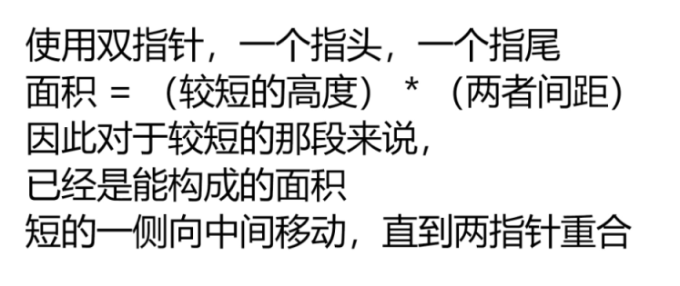

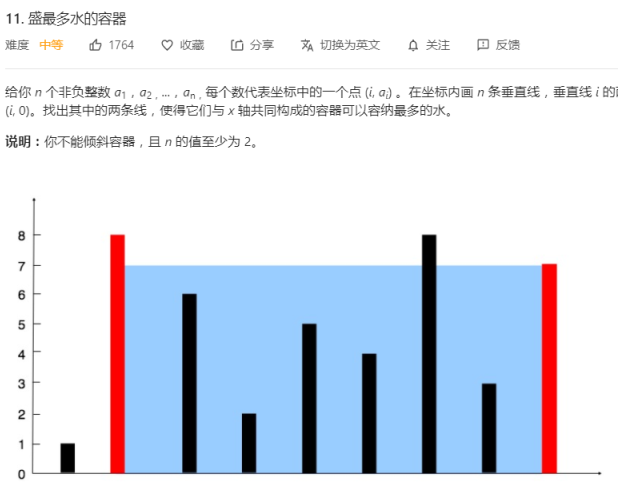

**双指针，向中间移动，每次移动那根最短的**

----

## 分割等和子集

给定一个只包含正整数的非空数组。是否可以将这个数组分割成两个子集，使得两个子集的元素和相等。

注意:

每个数组中的元素不会超过 100
数组的大小不会超过 200
示例 1:

输入: [1, 5, 11, 5]

输出: true

解释: 数组可以分割成 [1, 5, 5] 和 [11].

```js
var canPartition = function(nums) {
    let ans = false
    const sum = nums.reduce((a, b) => a + b, 0)
    if(sum % 2) return false
    nums.sort((a, b) => b - a)
    function backTrack(arr, i, sum1, target) {
        if(sum1 == target) ans = true
        if(sum1 - arr[i] == target) ans = true
        if(sum1 < target) return
        if (!ans) {
            for(let j = i + 1; j < arr.length; j++) {
                backTrack(arr, j, sum1 - arr[i], target)
            }
        }
    }
    backTrack(nums, 0, sum, sum / 2)
    return ans
};
数组中存不存在和为x的子集
用for来做循环，通过改变传入i，来实现回溯
得到总和一一半，回溯找到等于一半的子集，sort提高效率

回溯？？？不会写回溯，不会写动态规划，之后找个专题学习下，找啦
```

---

## 旋转90度矩阵

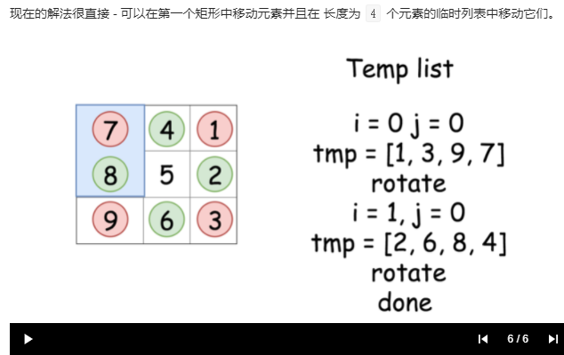

有两种方法，就是观察矩阵旋转90度中的变化规律：上下翻转，右上对角和左下对角翻转

还有一个方法，原地，不创建新的矩阵空间，就是上图，四边中对应的元素旋转一次置换

-----

## 单词拆分

```js
const wordBreak = (s, wordDict) => {
  const wordSet = new Set(wordDict);
  const len = s.length;
  const dp = new Array(len + 1).fill(false);
  dp[0] = true;
  // i从1开始到len
  for (let i = 1; i <= len; i++) {           
    // j去划分成两部分
    for (let j = i - 1; j >= 0; j--) {       
      // 后缀部分[j,i-1]
      const word = s.slice(j, i);               
      // 后缀部分是单词，且左侧子串[0,j-1]的dp[j]为真
      if (wordSet.has(word) && dp[j] == true) { 
        // 共同决定了当前长度为i的子串的dp项为真
        dp[i] = true; 
        // i长度的子串已经可以break成单词表的单词了，不需要j继续划分子串
        break; 
      }
    }
  }
  return dp[s.length];
};
wordBreak('ltcd',['lt','cd'])
```

动态规划，但是转化公式有点变态，dp[i] = 前面所有的元素每个都检查一遍，存不存在dp[j] && 字典有[j,i-1]

这种动态规划，两层递归

一般这种都可以用回溯来解决

需要回溯的dp，一般都有dp[i] dp[j]但是都会迭代找dp[j]，j之前已经有了结果

-----

## 二叉树镜像树

**前序遍历等于后序遍历的逆序**

- 两个根结点相等
- 左子树的右节点和右子树的左节点相同。
- 右子树的左节点和左子树的右节点相同。

## 最大子序和

```js
/**
 * @param {number[]} nums
 * @return {number}
 */
如果 sum > 0，则说明 sum 对结果有增益效果，则 sum 保留并加上当前遍历数字
如果 sum <= 0，则说明 sum 对结果无增益效果，需要舍弃，则 sum 直接更新为当前遍历数字
每次比较 sum 和 ans的大小，将最大值置为ans，遍历结束返回结果
var maxSubArray = function(nums) {
    let ans = nums[0];
    let sum = 0;
    for(const num of nums) {
        if(sum > 0) {
            sum += num;
        } else {
            sum = num;
        }
        ans = Math.max(ans, sum);
    }
    return ans;
};

```

---

## 前序遍历中序遍历得到二叉树

```js

var buildTree = function(preorder, inorder) {
    if(!preorder.length) return null;
    const root=new TreeNode(preorder[0]);
    const index=inorder.indexOf(preorder[0]);
    root.left=buildTree(preorder.slice(1,index+1),inorder.slice(0,index));
    root.right=buildTree(preorder.slice(index+1),inorder.slice(index+1));
    return root;
};

这种root.val  root.left  root.right
适用重新构建树
```

## 找到缺失的元素

给定一个范围在  1 ≤ a[i] ≤ n ( n = 数组大小 ) 的 整型数组，数组中的元素一些出现了两次，另一些只出现一次。

找到所有在 [1, n] 范围之间没有出现在数组中的数字。

您能在不使用额外空间且时间复杂度为O(n)的情况下完成这个任务吗? 你可以假定返回的数组不算在额外空间内。

示例:

输入:
[4,3,2,7,8,2,3,1]

输出:
[5,6]

> 利用index和应该在的元素位置关系是   index+1
>
> 依次遍历数组，当元素等于4，就将4-1为index对应的元素标记为*-1。这样表面4这个位置已经有元素了，依次，。剩下没有标记的index，就是缺失的元素

```java
class Solution {
	public List<Integer> findDisappearedNumbers(int[] nums) {
		List<Integer> res = new ArrayList<Integer>();
		//第一遍扫描，根据数组的值找到对应的下标，比如3对应下标2
		//将arr[2]设置成负数
		for(int i=0;i<nums.length;++i) {
			int index = Math.abs(nums[i])-1;
			if(nums[index]>0) {
				nums[index] *= -1;
			}
		}
		//第二遍扫描，找到所有非负数，非负数所在的下标+1，即为缺失的数字
		for(int i=1;i<=nums.length;++i) {
			// if(nums[i-1]>0) {
				res.add(nums[i-1]);
			// }
		}
		return res;
	}
}
```

----

## 判断单链表是否有环

快慢指针

```java
public boolean hasCycle(ListNode head) {
    if (head == null || head.next == null) {
        return false;
    }
    ListNode slow = head;
    ListNode fast = head.next;
    while (slow != fast) {
        // 
        if (fast == null || fast.next == null) {
            return false;
        }
        slow = slow.next;
        fast = fast.next.next;
    }
    return true;
}
```

如果没有环，块指针就提前到了尾部，尾部特征就是下一个元素是null

----

## 合并二叉树

```js
var mergeTrees = function(t1, t2) {
    if(!t1) return t2 //若t1节点为空，那直接返回t2节点，不管t2是否为空
    if(!t2) return t1 //若t2为空，那肯定t1肯定不为空，返回t1节点
    t1.val = t1.val + t2.val //能执行到这里证明t1与t2节点均不为空，那就两值相加，替换t1原来的值
    t1.left = mergeTrees(t1.left, t2.left ) //递归遍历两者的左子树
    t1.right = mergeTrees(t1.right, t2.right) ////递归遍历两者的右左子树
    return t1 //t1必然是返回的根节点，为啥？因为都拼到t1树上了啊
};
var mergeTrees = function(t1, t2) {
    if(!t1) t1 = t2
    if(t1 && t2) t1.val = t2.val+ t1.val
    if(!t1 && !t2) return null
    mergeTrees(t1.left,t2 && t2.left)
    mergeTrees(t1.right,t2 && t2.right)
    return t1
};
```

**对树有改变的情况下，可以最后返回根节点，每次都拿到对应的子树**，**重新构建树**，或者

记下这个公式

---

## 每日温度


请根据每日 `气温` 列表，重新生成一个列表。对应位置的输出为：要想观测到更高的气温，至少需要等待的天数。如果气温在这之后都不会升高，请在该位置用 `0` 来代替。

例如，给定一个列表 `temperatures = [73, 74, 75, 71, 69, 72, 76, 73]`，你的输出应该是 `[1, 1, 4, 2, 1, 1, 0, 0]`。

**提示：**`气温` 列表长度的范围是 `[1, 30000]`。每个气温的值的均为华氏度，都是在 `[30, 100]` 范围内的整数。

什么时候用单调栈
通常是一维数组，要寻找任一元素右边（左边）第一个比自己大（小）的元素
且要求 O(n) 的时间复杂度
模板套路
单调递增栈会剔除波峰，留下波谷；单调递减栈会剔除波谷，留下波峰

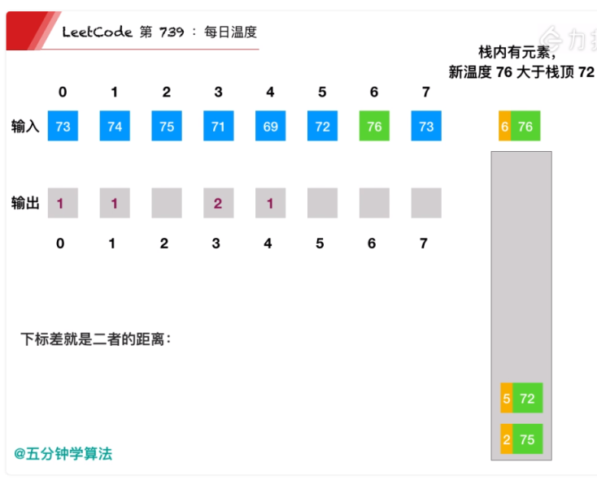 

栈中的76比72 75大，所以，72的值就是6-5  75要等的天数就是6-2

---

## 

```js
const dailyTemperatures = (T) => {
  const res = new Array(T.length).fill(0)
  const stack = []
  for (let i = T.length - 1; i >= 0; i--) {
    while (stack.length && T[i] >= T[stack[stack.length - 1]]) {
      stack.pop()
    }
    if (stack.length) {
      res[i] = stack[stack.length - 1] - i
    }
    stack.push(i)
  }
  return res
}
```

## 二叉树展开为单链表

```js
给定一个二叉树，原地将它展开为一个单链表。
例如，给定二叉树

    1
   / \
  2   5
 / \   \
3   4   6
将其展开为：

1
 \
  2
   \
    3
     \
      4
       \
        5
         \
          6
```


**中序遍历之后再连起来**

```js
var flatten = function(root) {
    const helper = (root) => {
        if (!root) {
            return
        }
        res.push(root)
        helper(root.left)
        helper(root.right)
    }
    let res = []
    helper(root)
    for (let i = 0; i < res.length - 1; i++) {
        res[i].left = null
        res[i].right = res[i + 1]
    }
};
```

----

## 括号生成

数字 *n* 代表生成括号的对数，请你设计一个函数，用于能够生成所有可能的并且 **有效的** 括号组合。

关键就是： 右括号的数量不能超过左括号，超过了，就不能添加，因为右括号不能做作为开头

dfs看不懂

```js
let generateParenthesis = (n) =>{
    let res = []
    let dfs = (s, left, right)=>{
        if(left ==n &&right==n) return res.push(s)
        if(left < n) dfs(s+'(', left+1, right)
        if(right < left) dfs(s+')', left, right+1)
    }
    dfs('', 0, 0)
    return res
}

```

----

## 完全平方数

给定正整数 n，找到若干个完全平方数（比如 1, 4, 9, 16, ...）使得它们的和等于 n。你需要让组成和的完全平方数的个数最少。

示例 1:

输入: n = 12
输出: 3 
解释: 12 = 4 + 4 + 4.
示例 2:

输入: n = 13
输出: 2
解释: 13 = 4 + 9.

```js
var numSquares = function(n) {
    const dp = [...Array(n+1)].map(_=>0); // 数组长度为n+1，值均为0
    for (let i = 1; i <= n; i++) {
        dp[i] = i; // 最坏的情况就是每次+1
        for (let j = 1; i - j * j >= 0; j++) { 
            dp[i] = Math.min(dp[i], dp[i - j * j] + 1); // 动态转移方程
        }
    }
    return dp[n];
};

dp12 : 12-1 = dp(11)+1
12-4 = dp(8)+1
12-9 = dp(3)+1

```

如果动态规划没有思路，就回想下暴力破解下中那些是重复的计算

-----

## 和为k的子数组

固定坐边界，超过就终止寻找

```js
var subarraySum = function(nums, k) {
    let count = 0;
    for (let start = 0; start < nums.length; ++start) {
        let sum = 0;
        for (let end = start; end >= 0; --end) {
            sum += nums[end];
            if (sum == k) {
                count++;
            }
        }
    }
    return count;
};
```

#### 跳跃游戏

难度中等787收藏分享切换为英文关注反馈

给定一个非负整数数组，你最初位于数组的第一个位置。

数组中的每个元素代表你在该位置可以跳跃的最大长度。

判断你是否能够到达最后一个位置。

**示例 1:**

```
输入: [2,3,1,1,4]
输出: true
解释: 我们可以先跳 1 步，从位置 0 到达 位置 1, 然后再从位置 1 跳 3 步到达最后一个位置。
```

**示例 2:**

```
输入: [3,2,1,0,4]
输出: false
解释: 无论怎样，你总会到达索引为 3 的位置。但该位置的最大跳跃长度是 0 ， 所以你永远不可能到达最后一个位置。
```

游戏中的bug：**就是最小是0，那么就是，一般都是大于1的步数，只要能一步一步跳就能成功。**

**所以只需要考虑存在0的时候能不能跳大步把0跳过**

---

**`BigInt`** 是一种内置对象，它提供了一种方法来表示大于 `253 - 1` 的整数。这原本是 Javascript中可以用 [`Number`](https://developer.mozilla.org/zh-CN/docs/Web/JavaScript/Reference/Global_Objects/Number) 表示的最大数字。**`BigInt`** 可以表示任意大的整数。

----

回文链表

```js
获取中间值：
设置一个中间指针 mid，在一次遍历中，head 走两格，mid 走一格，当 head 取到最后一个值或者跳出时，mid 就指向中间的值。


let mid = head
// 循环条件：只要head存在则最少走一次
while(head !== null && head.next !== null) {
    head = head.next.next // 指针一次走两格
    mid = mid.next// 中间指针一次走一格
}
反转前部分节点：
遍历的时候通过迭代来反转链表，mid 之前的 node 都会被反转。
使用迭代来反转。


while(head !== null && head.next !== null) {
        // 这个赋值要在mid被修改前提前
        pre = mid
        // 遍历链表
        mid = mid.next
        head = head.next.next
        // 反转前面部分的节点，并用reversed保存
        pre.next = reversed
        reversed = pre
    }
```

一次遍历，直接变成双向链表，头尾指针判断是否是回文

或者直接一次遍历放在数组里面，然后判断是否是回文

题解中快慢指针，找中间节点，很新奇，值得记忆的链表思路

----

## 搜索二维矩阵


编写一个高效的算法来搜索 *m* x *n* 矩阵 matrix 中的一个目标值 target。该矩阵具有以下特性：

- 每行的元素从左到右升序排列。
- 每列的元素从上到下升序排列。

**示例:**

现有矩阵 matrix 如下：

```
[
  [1,   4,  7, 11, 15],
  [2,   5,  8, 12, 19],
  [3,   6,  9, 16, 22],
  [10, 13, 14, 17, 24],
  [18, 21, 23, 26, 30]
]
从18开始
```

**每次从左下角搜索，如果比当前值小就想上移动，如果比自己大就往右移动**

```js
class Solution {
    public boolean searchMatrix(int[][] matrix, int target) {
        // start our "pointer" in the bottom-left
        int row = matrix.length-1;
        int col = 0;

        while (row >= 0 && col < matrix[0].length) {
            if (matrix[row][col] > target) {
                row--;
            } else if (matrix[row][col] < target) {
                col++;
            } else { // found it
                return true;
            }
        }

        return false;
    }
}

```

---

## 打家劫舍

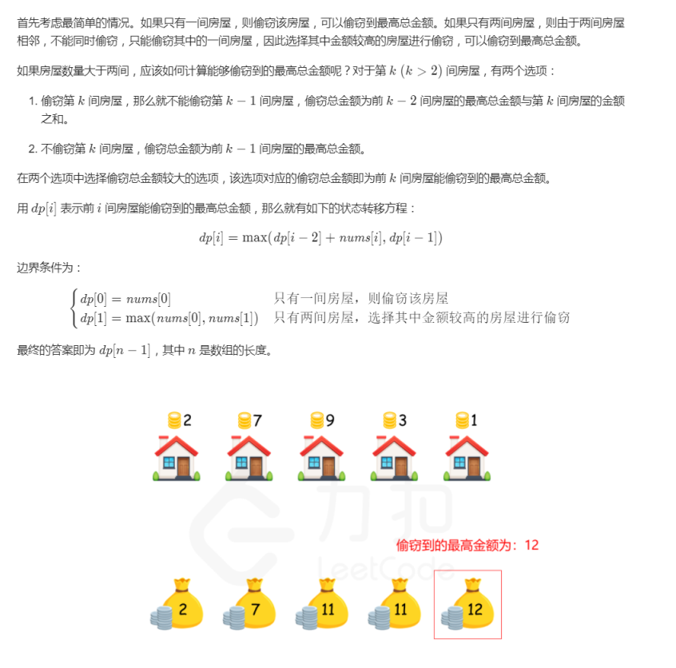

**动态规划没想清楚，这个是通过反着想的，dp[k]：有两个选择，偷k（k+dp[k-2]），不偷k（dp[k-1]）**

----

## 删除链表倒数第n个元素

```js
// 两个相隔n个节点的指针，前面走到尾，后面那个就是倒数第n个，删除
var removeNthFromEnd = function(head, n) {
    let fast = head, stack = head;
    while(--n){
        fast = fast.next;
    }
    if(!fast.next) return head.next;
    fast = fast.next;
    while(fast && fast.next){
        fast = fast.next;
        stack = stack.next;
    }
    stack.next = stack.next.next;
    return head;
};
```

----

## 搜索旋转排序数组

假设按照升序排序的数组在预先未知的某个点上进行了旋转。

( 例如，数组 [0,1,2,4,5,6,7] 可能变为 [4,5,6,7,0,1,2] )。

搜索一个给定的目标值，如果数组中存在这个目标值，则返回它的索引，否则返回 -1 。

你可以假设数组中不存在重复的元素。

你的算法时间复杂度必须是 O(log n) 级别。

示例 1:

输入: nums = [4,5,6,7,0,1,2], target = 0
输出: 4
示例 2:

输入: nums = [4,5,6,7,0,1,2], target = 3
输出: -1

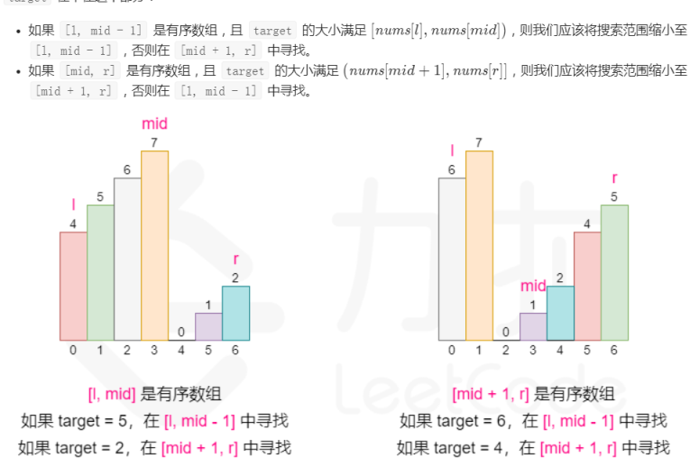

----

## 找到字符串中所有字母异位词

滑动窗口（记录窗口中，a字母的个数，b字母的个数，用一个map来记录）

> 输入:
> s: "cbaebabacd" p: "abc"
>
> 输出:
> [0, 6]
>
> 解释:
> 起始索引等于 0 的子串是 "cba", 它是 "abc" 的字母异位词。
> 起始索引等于 6 的子串是 "bac", 它是 "abc" 的字母异位词

具体窗口细节没考虑

休息一下，等会来看完，看完就是研究项目简历这么说

```js
var findAnagrams = function(s, p) {
    let res = [];
    let left = 0,right = 0;
    let needs = {},windows = {};
    let match = 0;
    for(let i = 0;i < p.length;i++){
        needs[p[i]] ? needs[p[i]]++ : needs[p[i]] = 1;
    }
    let needsLen = Object.keys(needs).length;
    while(right < s.length){
        let c1 = s[right];
        if(needs[c1]){
            windows[c1] ? windows[c1]++ : windows[c1] = 1;
            if(windows[c1] === needs[c1]){
                match++;
            }
        }
        right++;
        while(match === needsLen){
            if(right - left === p.length){
                res.push(left);
            }
            let c2 = s[left];
            if(needs[c2]){
                windows[c2]--;
                if(windows[c2] < needs[c2]){
                    match--;
                }
            }
            left++;
        }
    }
    return res;
};
```

---

## 合并多个链表

```js
var mergeKLists = function(lists) {
    let n = lists.length;
    if(n == 0) return null;
    let mergeTwoLists = (l1,l2) => {
        if(l1 == null) return l2;
        if(l2 == null) return l1;
        if(l1.val <= l2.val){
            l1.next = mergeTwoLists(l1.next,l2);
            return l1;
        }else{
            l2.next = mergeTwoLists(l1,l2.next);
            return l2;
        }
    }
    let merge = (left,right) => {
        if(left == right) return lists[left];
        let mid = (left + right) >> 1;
        let l1 = merge(left,mid);
        let l2 = merge(mid+1,right);
        return mergeTwoLists(l1,l2);
    }
    return merge(0,n-1);
};
没看懂
```

----

## 单词搜索

```js
function __exist(board, word, row, col, visited) {
    // 单词中字母全部匹配，说明可以搜索到，返回true
    if (!word.length) {
        return true;
    }

    const key = `${row}-${col}`;
    // 越界、之前访问过、单词首字母和当前元素不相同，返回false
    if (
        row >= board.length ||
        row < 0 ||
        col >= board[0].length ||
        col < 0 ||
        visited[key] ||
        board[row][col] !== word[0]
    ) {
        return false;
    }

    visited[key] = true;
    word = word.slice(1);
    // 下、上、右、左搜索（顺序不重要）
    const success =
        __exist(board, word, row + 1, col, visited) ||
        __exist(board, word, row - 1, col, visited) ||
        __exist(board, word, row, col + 1, visited) ||
        __exist(board, word, row, col - 1, visited);

    // success为false时，就是回溯
    visited[key] = success;
    return success;
}
// 递归回溯查询，不会
```

----

## 二叉搜索树的个数

动态规划 todo: 重要，动态规划

```js
var numTrees = function(n) {
    const G = new Array(n + 1).fill(0);
    G[0] = 1;
    G[1] = 1;

    for (let i = 2; i <= n; ++i) {
        for (let j = 1; j <= i; ++j) {
            G[i] += G[j - 1] * G[i - j];
        }
    }
    return G[n];
};
```

----

## 最大正方形

动态规划

方法二：动态规划
方法一虽然直观，但是时间复杂度太高，有没有办法降低时间复杂度呢？

可以使用动态规划降低时间复杂度。我们用 dp(i, j)dp(i,j) 表示以 (i, j)(i,j) 为右下角，且只包含 11 的正方形的边长最大值。如果我们能计算出所有 dp(i, j)dp(i,j) 的值，那么其中的最大值即为矩阵中只包含 11 的正方形的边长最大值，其平方即为最大正方形的面积。

那么如何计算 dpdp 中的每个元素值呢？对于每个位置 (i, j)(i,j)，检查在矩阵中该位置的值：

如果该位置的值是 00，则 dp(i, j) = 0dp(i,j)=0，因为当前位置不可能在由 11 组成的正方形中；

如果该位置的值是 11，则 dp(i, j)dp(i,j) 的值由其上方、左方和左上方的三个相邻位置的 dpdp 值决定。具体而言，当前位置的元素值等于三个相邻位置的元素中的最小值加 11，状态转移方程如下：

dp(i, j)=min(dp(i−1, j), dp(i−1, j−1), dp(i, j−1))+1
dp(i,j)=min(dp(i−1,j),dp(i−1,j−1),dp(i,j−1))+1

如果读者对这个状态转移方程感到不解，可以参考 1277. 统计全为 1 的正方形子矩阵的官方题解，其中给出了详细的证明。

此外，还需要考虑边界条件。如果 ii 和 jj 中至少有一个为 00，则以位置 (i, j)(i,j) 为右下角的最大正方形的边长只能是 11，因此 dp(i, j) = 1dp(i,j)=1。

以下用一个例子具体说明。原始矩阵如下。


0 1 1 1 0
1 1 1 1 0
0 1 1 1 1
0 1 1 1 1
0 0 1 1 1
对应的 dpdp 值如下。


0 1 1 1 0
1 1 2 2 0
0 1 2 3 1
0 1 2 3 2
0 0 1 2 3
下图也给出了计算 dpdp 值的过程。


```js
JavaC++Python3Golang

class Solution {
    public int maximalSquare(char matrix) {
        int maxSide = 0;
        if (matrix == null || matrix.length == 0 || matrix[0].length == 0) {
            return maxSide;
        }
        int rows = matrix.length, columns = matrix[0].length;
        int dp = new introws;
        for (int i = 0; i < rows; i++) {
            for (int j = 0; j < columns; j++) {
                if (matrixi == '1') {
                    if (i == 0 || j == 0) {
                        dpi = 1;
                    } else {
                        dpi = Math.min(Math.min(dpi - 1, dpi), dpi - 1) + 1;
                    }
                    maxSide = Math.max(maxSide, dpi);
                }
            }
        }
        int maxSquare = maxSide * maxSide;
        return maxSquare;
    }
}

```

---

todo: 矩阵最短路径和，可以拿来练手动态规划

----

#### 322. 零钱兑换 

给定不同面额的硬币 coins 和一个总金额 amount。编写一个函数来计算可以凑成总金额所需的最少的硬币个数。如果没有任何一种硬币组合能组成总金额，返回 -1。

 

示例 1:

输入: coins = [1, 2, 5], amount = 11
输出: 3 
解释: 11 = 5 + 5 + 1
示例 2:

输入: coins = [2], amount = 3
输出: -1

说明:
你可以认为每种硬币的数量是无限的

```js
var coinChange = function(coins, amount) {
  let dp = new Array( amount + 1 ).fill( Infinity );
  dp[0] = 0;
  
  for (let i = 1; i <= amount; i++) {
    for (let coin of coins) {
      if (i - coin >= 0) {
          // 和平方和思路相同
        dp[i] = Math.min(dp[i], dp[i - coin] + 1);
      }
    }
  }
  
  return dp[amount] === Infinity ? -1 : dp[amount];
}
```


---

## 常熟情况那个当前元素最小

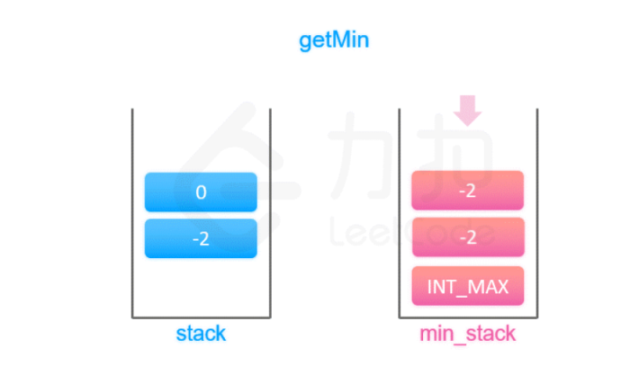

就是每次push一个元素，都在最小栈中保留当前元素加入后最小值，pop的时候栈顶和最小栈栈顶都pop一个元素

空间换时间

---

## 目标和

todo: 动态规划
给定一个非负整数数组，a1, a2, ..., an, 和一个目标数，S。现在你有两个符号 `+` 和 `-`。对于数组中的任意一个整数，你都可以从 `+` 或 `-`中选择一个符号添加在前面。

返回可以使最终数组和为目标数 S 的所有添加符号的方法数。

 

**示例：**

```
输入：nums: [1, 1, 1, 1, 1], S: 3
输出：5
解释：

-1+1+1+1+1 = 3
+1-1+1+1+1 = 3
+1+1-1+1+1 = 3
+1+1+1-1+1 = 3
+1+1+1+1-1 = 3

一共有5种方法让最终目标和为3。
```

**dp[i][j] 表示用数组中的前 i 个元素，组成和为 j 的方案数**

```js
这道题也是一个常见的背包问题，我们可以用类似求解背包问题的方法来求出可能的方法数。

我们用 dp[i][j] 表示用数组中的前 i 个元素，组成和为 j 的方案数。考虑第 i 个数 nums[i]，它可以被添加 + 或 -，因此状态转移方程如下：


dp[i][j] = dp[i - 1][j - nums[i]] + dp[i - 1][j + nums[i]]
也可以写成递推的形式：


dp[i][j + nums[i]] += dp[i - 1][j]
dp[i][j - nums[i]] += dp[i - 1][j]
由于数组中所有数的和不超过 1000，那么 j 的最小值可以达到 -1000。在很多语言中，是不允许数组的下标为负数的，因此我们需要给 dp[i][j] 的第二维预先增加 1000，即：


dp[i][j + nums[i] + 1000] += dp[i - 1][j + 1000]
dp[i][j - nums[i] + 1000] += dp[i - 1][j + 1000]
下面的幻灯片中，为了表述方便，我们将数组中所有数的和控制在 [-6, 6] 之间，仅将 dp[i][j] 的第二维预先增加 6。


1 / 7

Java

public class Solution {
    public int findTargetSumWays(int[] nums, int S) {
        int[][] dp = new int[nums.length][2001];
        dp[0][nums[0] + 1000] = 1;
        dp[0][-nums[0] + 1000] += 1;
        for (int i = 1; i < nums.length; i++) {
            for (int sum = -1000; sum <= 1000; sum++) {
                if (dp[i - 1][sum + 1000] > 0) {
                    dp[i][sum + nums[i] + 1000] += dp[i - 1][sum + 1000];
                    dp[i][sum - nums[i] + 1000] += dp[i - 1][sum + 1000];
                }
            }
        }
        return S > 1000 ? 0 : dp[nums.length - 1][S + 1000];
    }
}
```

---

## 比特位计数

```js
归纳
设 dp(n) 为数字n二进制中1的个数
n为奇数
dp(n) = dp(n-1) + 1
n为偶数
dp(n) = dp(n/2)
初始化
result = [0]

/**
 * @param {number} num
 * @return {number[]}
 */
var countBits = function(num) {
    let result = [0];
    let n = 1;
    while(n <= num){
        let count = 0;
        if(n & 1 ==1){
            result[n] = result[n-1]+1;
        }else{
            result[n] = result[n>>1]
        }
        n++;
    }
    return result;
};
```

----

## 最佳买卖股票时机含冷冻期

难度中等522收藏分享切换为英文关注反馈

给定一个整数数组，其中第 *i* 个元素代表了第 *i* 天的股票价格 。

设计一个算法计算出最大利润。在满足以下约束条件下，你可以尽可能地完成更多的交易（多次买卖一支股票）:

- 你不能同时参与多笔交易（你必须在再次购买前出售掉之前的股票）。
- 卖出股票后，你无法在第二天买入股票 (即冷冻期为 1 天)。

**动态规划，状态是状态，不是说可以做的动作，状态分类一定要清晰。有哪些状态！**

**一个状态，有多种来源，去最大的，就是收益最好的**


```js
class Solution {
    public int maxProfit(int[] prices) {
        if (prices == null || prices.length < 2) return 0;
        int[][] dp = new int[prices.length][3];
        dp[0][0] = -prices[0];
        for (int i = 1; i < prices.length; i++) {
            dp[i][0] = Math.max(dp[i - 1][0], dp[i - 1][2] - prices[i]);
            dp[i][1] = dp[i - 1][0] + prices[i];
            dp[i][2] = Math.max(dp[i - 1][1], dp[i - 1][2]);
        }
        int maxProfit = Math.max(dp[prices.length - 1][1], dp[prices.length - 1][2]);
        return maxProfit;
    }
}

```

当天结束之后的状态。买卖后的状态

----

## 二叉树路径和

关于递归其实有个很玄的现象，就是如果对于一个递归，你要深入的深究它执行的每一步，但这种情况往往会把人绕晕，我认为我们老老实实实的写好一下两样递归的要素就行，其他交给递归去处理：

中止调用的条件
递归主体
这道题中，利用两个递归，咋一看很复杂，其实两个递归是各司其职，界限分明。

一个递归求从任意一个节点开始有多少条满足条件的路径。
一个递归是遍历整棵树，求各个节点开始各有多少满足条件的路径数，各路径数相加即可得出符合条件的总路径数

```js
var pathSum = function(root, sum) { //root为根节点， sum为规定的路径权值和
    if(!root) return 0 //若节点为空，返回0
    let page = findDown(root,sum) //从根节点开始有多少满足条件的路径数，findDown函数是求从单个节点开始满足条件的路径数
    let sum1 = pathSum(root.left, sum) //遍历左子树求符合条件的路径数，
    let sum2 = pathSum(root.right, sum) //遍历右子树求符合条件的路径数
    return page + sum1 +sum2; //得出总路径数

};

function findDown(tNode, sum) { // 求从单个节点开始满足条件的路径数，tNode为当前节点，sum为规定的路径权值和
    if(!tNode) return 0 //若节点为空，返回0
    let flag = tNode.val === sum ? 1 : 0 // 当前节点权值刚好等于sum则算为1，否则为0
    let leftSum = findDown(tNode.left, sum - tNode.val) //剩下的权值要子树来凑，先看左子树能不能凑出来
    let rightSum = findDown(tNode.right, sum-tNode.val) //再看右子树是否能凑出来
    return flag  + leftSum + rightSum // 返回符合条件的路径数
}
```

----

#### 6. 最小覆盖子串

todo: 动态规划，回溯，二叉树递归，滑动窗口

难度困难713收藏分享切换为英文关注反馈

给你一个字符串 S、一个字符串 T 。请你设计一种算法，可以在 O(n) 的时间复杂度内，从字符串 S 里面找出：包含 T 所有字符的最小子串。

 

**示例：**

```
输入：S = "ADOBECODEBANC", T = "ABC"
输出："BANC"
```

 

**提示：**

- 如果 S 中不存这样的子串，则返回空字符串 `""`。
- 如果 S 中存在这样的子串，我们保证它是唯一的答案。

```js
const minWindow = (s, t) => {
  let minLen = Infinity, resL; // minLen初始尽量大，保证第一次就能被赋值
  let map = {};                // 存储目标字符和对应的缺失个数
  let missingType = 0;         // 当前缺失的字符种类数
  for (const char of t) {      // t为baac的话，map为{a:2,b:1,c:1}
    if (!map[char]) {
      missingType++;           // 需要找齐的种类数 +1
      map[char] = 1;
    } else { 
      map[char]++;
    }
  }
  let left = 0, right = 0;             // 左右指针
  for (; right < s.length; right++) {  // 主旋律是扩张窗口，超出s串就结束循环
    let rightChar = s[right];          // 获取right指向的新字符
    if (map[rightChar] !== undefined) map[rightChar]--; // 是目标字符，它的缺失个数-1
    if (map[rightChar] == 0) missingType--;             // 它的缺失个数变0，缺失的种类就-1
    while (missingType == 0) {         // 当前窗口包含所有字符的前提下尽量收缩窗口
      if (right - left + 1 < minLen) { // 求窗口宽度，如果比minLen小就更新minLen
        minLen = right - left + 1;
        resL = left;                   // 并更新最小窗口的起点
      }
      let leftChar = s[left];          // 获取左指针指向的字符
      if (map[leftChar] !== undefined) map[leftChar]++; // 目标字符被舍弃，缺失个数+1
      if (map[leftChar] > 0) missingType++; // 如果缺失个数变>0，缺失的种类+1
      left++;                          // 收缩窗口
    }
  }
  return s.substring(resL, resL + minLen); // 根据起点和minLen截取子串
};

```

---

## 二叉搜索转为累加树

给定一个二叉搜索树（Binary Search Tree），**把它转换成为累加树（Greater Tree)，使得每个节点的值是原来的节点值加上所有大于它的节点值之和。**

 

例如：

输入: 原始二叉搜索树:
              5
            /   \
           2     13

输出: 转换为累加树:
             18
            /   \
          20     13

**这题我们采用 右 -> 根 -> 左 的顺序，遍历的过程中累加起来即可**
**因为二叉搜索树的特点是：右节点值 > 根节点 > 左节点**

```js
考点：反向的中序遍历
中序遍历：左 -> 根 -> 右
这题我们采用 右 -> 根 -> 左 的顺序，遍历的过程中累加起来即可
因为二叉搜索树的特点是：右节点值 > 根节点 > 左节点
代码

/**
 * Definition for a binary tree node.
 * function TreeNode(val) {
 *     this.val = val;
 *     this.left = this.right = null;
 * }
 */
/**
 * @param {TreeNode} root
 * @return {TreeNode}
 */

var convertBST = function(root) {
  function convert(node) {
    if (node === null) return 0;
    
    convert(node.right);
    sum += node.val;
    node.val = sum;
    convert(node.left);
  }
  
  let sum = 0;
  
  convert(root);
  
  return root;
};
```

---

## 身高重建队列


假设有打乱顺序的一群人站成一个队列。 每个人由一个整数对`(h, k)`表示，其中`h`是这个人的身高，`k`是排在这个人前面且身高大于或等于`h`的人数。 编写一个算法来重建这个队列。

**注意：**
总人数少于1100人。

**示例**

**身高比自己高的先排好序列了，当前元素的k，就是该元素的index，**

```
输入:
[[7,0], [4,4], [7,1], [5,0], [6,1], [5,2]]

输出:
[[5,0], [7,0], [5,2], [6,1], [4,4], [7,1]]
```

没看懂

```
首先解释一下题目：
给定一群人的一个队列，要求重新排序。队列中每个人由一个整数对(h, k)表示，其中h是这个人的身高，k表示在新队列中要求排在这个人前面且身高大于或等于h的人数。注：队列排序即数值排序

更通俗一点就是：假设有一个队列，已知每个人的身高h和排在该人前面的更高或一样高的人数k，现在给你打乱顺序后的数组，要求恢复原来的队列。

考虑将这群人依次加入新队列中，加入时需符合k的要求。注意到，一个人的k值实际上与身高更矮的人的位置无关，所以如果身高比之更高的人已经排好队了，这个人加入这个新队列的位置就可以根据k值确定了。因此，身高较高的人应该先加入，我们先对队列按身高降序排序。此外，对于相同身高的人，k值较小的人位置在前，优先加入。

python代码

class Solution:
    def reconstructQueue(self, people: List[List[int]]) -> List[List[int]]:
        if len(people) <= 1:
            return people
        
        ## 对队列排序，先按h降序，再按k升序
        people = sorted(people, key = lambda x: (-x[0], x[1]))
        new_people = [people[0]]    # 这个人是从前往后、从上往下看到的第一个人
        for i in people[1:]:
            new_people.insert(i[1], i)
        return new_people
```

---

## 打家劫舍

在上次打劫完一条街道之后和一圈房屋后，小偷又发现了一个新的可行窃的地区。这个地区只有一个入口，我们称之为“根”。 除了“根”之外，每栋房子有且只有一个“父“房子与之相连。一番侦察之后，聪明的小偷意识到“这个地方的所有房屋的排列类似于一棵二叉树”。 如果两个直接相连的房子在同一天晚上被打劫，房屋将自动报警。

计算在不触动警报的情况下，小偷一晚能够盗取的最高金额。

示例 1:

输入: [3,2,3,null,3,null,1]

     3
    / \
   2   3
    \   \ 
     3   1

输出: 7 
解释: 小偷一晚能够盗取的最高金额 = 3 + 3 + 1 = 7.
示例 2:

输入: [3,4,5,1,3,null,1]

     3
    / \
   4   5
  / \   \ 
 1   3   1

输出: 9
解释: 小偷一晚能够盗取的最高金额 = 4 + 5 = 9、、

**当前节点选择不偷：当前节点能偷到的最大钱数 = 左孩子能偷到的钱 + 右孩子能偷到的钱**
**当前节点选择偷：当前节点能偷到的最大钱数 = 左孩子选择自己不偷时能得到的钱 + 右孩子选择不偷时能得到的钱 + 当前节点的钱数**

```js
任何一个节点能偷到的最大钱的状态可以定义为

当前节点选择不偷：当前节点能偷到的最大钱数 = 左孩子能偷到的钱 + 右孩子能偷到的钱
当前节点选择偷：当前节点能偷到的最大钱数 = 左孩子选择自己不偷时能得到的钱 + 右孩子选择不偷时能得到的钱 + 当前节点的钱数
表示为公式如下


root[0] = Math.max(rob(root.left)[0], rob(root.left)[1]) + Math.max(rob(root.right)[0], rob(root.right)[1])
root[1] = rob(root.left)[0] + rob(root.right)[0] + root.val;
将公式做个变换就是代码啦

Java

public int rob(TreeNode root) {
    int[] result = robInternal(root);
    return Math.max(result[0], result[1]);
}

public int[] robInternal(TreeNode root) {
    if (root == null) return new int[2];
    int[] result = new int[2];

    int[] left = robInternal(root.left);
    int[] right = robInternal(root.right);

    result[0] = Math.max(left[0], left[1]) + Math.max(right[0], right[1]);
    result[1] = left[0] + right[0] + root.val;

    return result;
}
```

---

## 两数之和

每遍历一个元素就存起来，s-当前元素，如果身下的之前已经遍历过就表示找到了

```js
var twoSum = function(nums, target) {
  const hashSet = {}
  for (let i = 0; i<nums.length;i++) {
    const val = target - nums[i]
    if (val in hashSet) {
      return [hashSet[val], i]
    }
    hashSet[nums[i]] = i
  }
};
```

---

## 乘积最大

两个负数相乘可能会变最大

**同时记录乘积最大值和乘积最小值**

```js
var maxProduct = function(nums) {
  let max = nums[0];
  let min = nums[0];
  let res = nums[0];

  for (let i = 1; i < nums.length; i++) {
    let tmp = min;
    min = Math.min(nums[i], Math.min(max * nums[i], min * nums[i])); // 取最小
    max = Math.max(nums[i], Math.max(max * nums[i], tmp * nums[i])); /// 取最大
    res = Math.max(res, max);
  }
  return res;
};
```

----

## 简化绝对路径

思路
将path以'/'分割成数组，如 /a/./b/../../c/分割成[ '', 'a', '.', 'b', '..', '..', 'c', '' ]。 新建一个栈stack为当前的路径，遍历path分割后的数组元素:

**遇到正常的字母时，推入 stack 中**
**遇到 .. 时，stack 弹出最近一个路径**
**遇到 . 或者为空时，不修改当前 stack。**
**最后返回 '/' + stack.join('/') 为新的路径**
题解
javascript

var simplifyPath = function(path) {
    const stack = [];
    const pathArr = path.split('/');
    

    for (let item of pathArr) {
        if (item === '' || item === '.') {
            continue;
        } else if (item === '..') {
            stack.pop();
        } else {
            stack.push(item);
        }
    }
    
    return '/' + stack.join('/');
}

----

### 三数之和，

- 1.为了方便去重，我们**首先将数组排序**
- 2.对数组进行遍历，取当前遍历的数`nums[i]`为一个基准数，遍历数后面的数组为寻找数组
- 3.在寻找数组中设定两个起点，最左侧的`left`(`i+1`)和最右侧的`right`(`length-1`)
- 4.判断`nums[i] + nums[left] + nums[right]`是否等于0，如果等于0，加入结果，并分别将`left`和`right`移动一位
- 5.如果结果大于0，将`right`向左移动一位，向结果逼近
- 5.如果结果小于0，将`left`向右移动一位，向结果逼近

---

## 数组中第k大的元素

**在未排序的数组中找到第 k 个最大的元素。请注意，你需要找的是数组排序后的第 k 个最大的元素，而不是第 k 个不同的元素。**

**利用快速排序，一次遍历能确定一个元素的位置，通过这个位置，来分区，然后找到对应的k位置的元素**

-----

### [最长连续序列](https://leetcode-cn.com/problems/longest-consecutive-sequence/)

**在候选节点中找到，能作为起点的**，**就是n-1不存在序列中，然后已该起点向右出发计数，得到最大连续序列**

数组经常出现的就是set，双指针，栈

```js
var longestConsecutive = (nums) => {
  const set = new Set(nums) // set存放数组的全部数字
  let max = 0
  for (let i = 0; i < nums.length; i++) {
    if (!set.has(nums[i] - 1)) { // nums[i]没有左邻居，是序列的起点
      let cur = nums[i]
      let count = 1
      while (set.has(cur + 1)) { // cur有右邻居cur+1
        cur++ // 更新cur
        count++ 
      }
      max = Math.max(max, count) // cur不再有右邻居，检查count是否最大
    }
  }
  return max
}
```

----

#### [60. 第k个排列](https://leetcode-cn.com/problems/permutation-sequence/)

难度中等312收藏分享切换为英文关注反馈

给出集合 `[1,2,3,…,*n*]`，其所有元素共有 *n*! 种排列。

按大小顺序列出所有排列情况，并一一标记，当 *n* = 3 时, 所有排列如下：

1. `"123"`
2. `"132"`
3. `"213"`
4. `"231"`
5. `"312"`
6. `"321"`

给定 *n* 和 *k*，返回第 *k* 个排列。

**说明：**

- 给定 *n* 的范围是 [1, 9]。
- 给定 *k* 的范围是[1,  *n*!]。

**示例 1:**

> 这种最快的方法就是： 利用n !公式，一个个推算出来

---

## 接雨水

这么一想，可以发现这道题的思路其实很简单。具体来说，仅仅对于位置 i，能装下多少水呢？


能装 2 格水。为什么恰好是两格水呢？因为 height[i] 的高度为 0，而这里最多能盛 2 格水，2-0=2。

为什么位置 i 最多能盛 2 格水呢？因为，位置 i 能达到的水柱高度和其左边的最高柱子、右边的最高柱子有关，我们分别称这两个柱子高度为 l_max 和 r_max；位置 i 最大的水柱高度就是 min(l_max, r_max)。

更进一步，对于位置 i，能够装的水为：


water[i] = min(
               # 左边最高的柱子
               max(height[0..i]),  
               # 右边最高的柱子
               max(height[i..end]) 
            ) - height[i]
    


这就是本问题的核心思路，我们可以简单写一个暴力算法：

int trap(vector<int>& height) {
    int n = height.size();
    int ans = 0;
    for (int i = 1; i < n - 1; i++) {
        int l_max = 0, r_max = 0;
        // 找右边最高的柱子
        for (int j = i; j < n; j++)
            r_max = max(r_max, height[j]);
        // 找左边最高的柱子
        for (int j = i; j >= 0; j--)
            l_max = max(l_max, height[j]);
        // 如果自己就是最高的话，
        // l_max == r_max == height[i]
        ans += min(l_max, r_max) - height[i];
    }
    return ans;
}

现在看看双指针解法中，整个过程

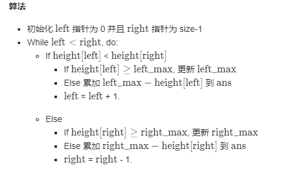

只要左边比右边max的要小，就说明，左边max-当前高度，一定能积累到水，然后就是一直移动，计算左边

右边的道理和左边一样，只要一边比较小，就可以一直移动，计算水的量


---

## 链表排序

#### [排序链表](https://leetcode-cn.com/problems/sort-list/)

难度中等715收藏分享切换为英文关注反馈

在 *O*(*n* log *n*) 时间复杂度和常数级空间复杂度下，对链表进行排序。

**示例 1:**

```
输入: 4->2->1->3
输出: 1->2->3->4
```

**示例 2:**

```
输入: -1->5->3->4->0
输出: -1->0->3->4->5
```

归并排序

```js
let sortList = function(head) {
    return mergeSortRec(head)
}

// 归并排序
// 若分裂后的两个链表长度不为 1，则继续分裂
// 直到分裂后的链表长度都为 1，
// 然后合并小链表
let mergeSortRec = function (head) {
    if(!head || !head.next) {
        return head
    }

    // 获取中间节点
    let middle = middleNode(head)
    // 分裂成两个链表
    let temp = middle.next
    middle.next = null
    let left = head, right = temp
    // 继续分裂（递归分裂）
    left = mergeSortRec(left)
    right = mergeSortRec(right)
    // 合并两个有序链表
    return mergeTwoLists(left, right)
}

// 获取中间节点
// - 如果链表长度为奇数，则返回中间节点
// - 如果链表长度为偶数，则有两个中间节点，这里返回第一个
let middleNode = function(head) {
    let fast = head, slow = head
    while(fast && fast.next && fast.next.next) {
        slow = slow.next
        fast = fast.next.next
    }
    return slow
}

// 合并两个有序链表
let mergeTwoLists = function(l1, l2) {
    let preHead = new ListNode(-1);
    let cur = preHead;
    while(l1 && l2){
        if(l1.val < l2.val){
            cur.next = l1;
            l1 = l1.next;
        }else{
            cur.next = l2;
            l2 = l2.next;
        }
        cur = cur.next;
    }
    cur.next = l1 || l2;
    return preHead.next;
}
```

----

## 最近的公共父节点

**使用dfs找到两个节点的唯一路径，之后反向遍历两个数组，找到第一个同时存在的元素**

```js
// 找到该节点唯一的路径
// 反向遍历两个数组，求找出第一个在另一个数组中也存在的节点，返回该节点
var lowestCommonAncestor = function(root, p, q) {
   let pPath=[],res = []
   getPath(root,p,pPath,res)
   let qPath = [],resq = []
   getPath(root,q,qPath,resq)
   let result = null
   for(let j=resq.length-1;j>-1;j--){
      let tem = res.filter(item=>{
        return resq[j].val == item.val
      })
      if(tem.length>0){
        result = resq[j]
        break
      }
   }
   return result
}; 
function getPath(root,k,path,res){
    if(!root) return
    path.push(root)
    if(root.val!=k.val){
        getPath(root.left,k,path,res)
        getPath(root.right,k,path,res)
        path.pop(root)
    } else {
      res.push(...path)
    }
}
```

---

## 最小正方形，动态规划

转换方程比较难想

```
方法二：动态规划
方法一虽然直观，但是时间复杂度太高，有没有办法降低时间复杂度呢？

可以使用动态规划降低时间复杂度。我们用 dp(i, j)dp(i,j) 表示以 (i, j)(i,j) 为右下角，且只包含 11 的正方形的边长最大值。如果我们能计算出所有 dp(i, j)dp(i,j) 的值，那么其中的最大值即为矩阵中只包含 11 的正方形的边长最大值，其平方即为最大正方形的面积。

那么如何计算 dpdp 中的每个元素值呢？对于每个位置 (i, j)(i,j)，检查在矩阵中该位置的值：

如果该位置的值是 00，则 dp(i, j) = 0dp(i,j)=0，因为当前位置不可能在由 11 组成的正方形中；

如果该位置的值是 11，则 dp(i, j)dp(i,j) 的值由其上方、左方和左上方的三个相邻位置的 dpdp 值决定。具体而言，当前位置的元素值等于三个相邻位置的元素中的最小值加 11，状态转移方程如下：

dp(i, j)=min(dp(i−1, j), dp(i−1, j−1), dp(i, j−1))+1
dp(i,j)=min(dp(i−1,j),dp(i−1,j−1),dp(i,j−1))+1

```

---

## 二叉树路径和

不从根节点开始，但是一定是向下的

```js
// 每个节点为开始，的数量组合
var pathSum = function(root, sum) { //root为根节点， sum为规定的路径权值和
    if(!root) return 0 //若节点为空，返回0
    let page = findDown(root,sum) //从根节点开始有多少满足条件的路径数，findDown函数是求从单个节点开始满足条件的路径数
    let sum1 = pathSum(root.left, sum) //遍历左子树求符合条件的路径数，
    let sum2 = pathSum(root.right, sum) //遍历右子树求符合条件的路径数
    return page + sum1 +sum2; //得出总路径数

};

function findDown(tNode, sum) { // 求从单个节点开始满足条件的路径数，tNode为当前节点，sum为规定的路径权值和
    if(!tNode) return 0 //若节点为空，返回0
    let flag = tNode.val === sum ? 1 : 0 // 当前节点权值刚好等于sum则算为1，否则为0
    let leftSum = findDown(tNode.left, sum - tNode.val) //剩下的权值要子树来凑，先看左子树能不能凑出来
    let rightSum = findDown(tNode.right, sum-tNode.val) //再看右子树是否能凑出来
    return flag  + leftSum + rightSum // 返回符合条件的路径数
}
```

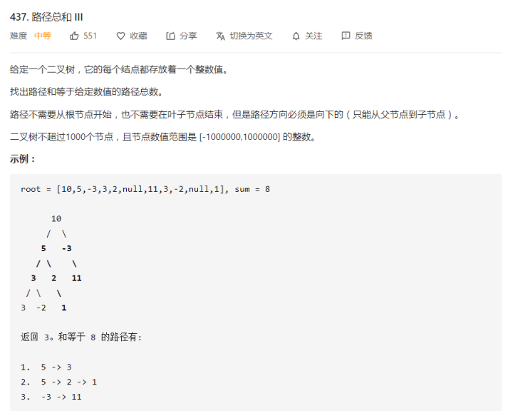

```js
// 这两个参数，不一样，上面那个会在不断递归中发生改变，并传递。如果要用数字类型为一个存储量，可以不在递归函数中传递。而是用全局变量。
// 如果想要每次递归状态不一样，则用参数
//　当前是用result来记录最大的路径
var maxPathSum = function(root) {
  let result = -Infinity
    let maxP=  function(root){
        if(root == null) return 0
        let left = maxP(root.left)
        let right = maxP(root.right)
        result=(Math.max(left+root.val,right+root.val,result,left+root.val+right,root.val))
        return Math.max(left+root.val,right+root.val,root.val)
    }
    maxP(root)
    return result
};
```

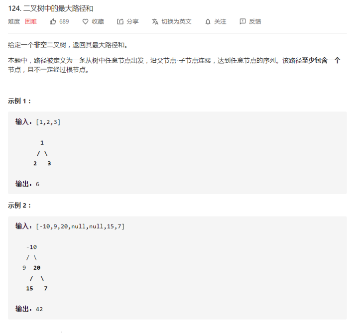

这题太难，只能记答案了

----

## 判断字符串是不是斐波那契数

这题的关键点就在于如何找到开头两个数字 n1, n2。找到了这两个数字，后面就可以用 n = n1 + n2 的规则通过一次遍历来判断是否符合斐波那契规则。找开头俩数字只能暴搜了，代码如下：

dfs二维，就是固定前面两个元素，这种可能就需要枚举，然后判断每一次的固定n1 n2能不能推导出后面，就判定这组固定n1 n2能不能组成斐波那契