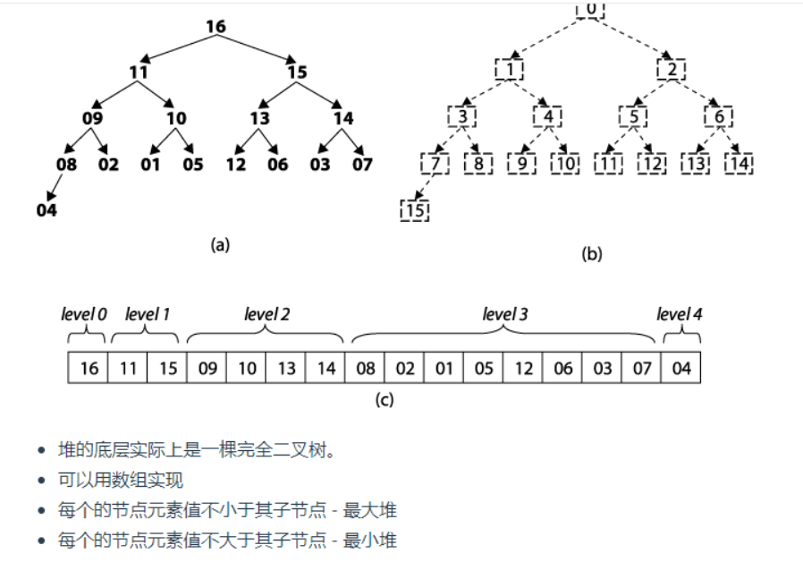

# 堆



```js
    function Heap(type = 'min') {
      this.type = type;
      this.value = [];
    }

    Heap.prototype.create = function () {
      const length = this.value.length;
      for (let i = Math.floor((length / 2) - 1); i >= 0; i--) {
        this.ajust(i, length);
      }
    }

    Heap.prototype.ajust = function (index, length) {
      const array = this.value;
      for (let i = 2 * index + 1; i < length; i = 2 * i + 1) {
        if (i + 1 < length) {
          if ((this.type === 'max' && array[i + 1] > array[i]) ||
            (this.type === 'min' && array[i + 1] < array[i])) {
            i++;
          }
        }
        if ((this.type === 'max' && array[index] < [array[i]]) ||
          (this.type === 'min' && array[index] > [array[i]])) {
          [array[index], array[i]] = [array[i], array[index]];
          index = i;
        } else {
          break;
        }
      }
    }

    Heap.prototype.add = function (element) {
      const array = this.value;
      array.push(element);
      if (array.length > 1) {
        let index = array.length - 1;
        let target = Math.floor((index - 1) / 2);
        while (target >= 0) {
          if ((this.type === 'min' && array[index] < array[target]) ||
            (this.type === 'max' && array[index] > array[target])) {
            [array[index], array[target]] = [array[target], array[index]]
            index = target;
            target = Math.floor((index - 1) / 2);
          } else {
            break;
          }
        }
      }
    }

    Heap.prototype.pop = function () {
      const array = this.value;
      let result = null;
      if (array.length > 1) {
        result = array[0];
        array[0] = array.pop();
        this.ajust(0, array.length);
      } else if (array.length === 1) {
        return array.pop();
      }
      return result;
    }

    var heap = new Heap('max');
    heap.add(6)
    heap.add(10)
    console.log(heap.value);
    console.log(heap.pop());
    console.log(heap.value);
```


```js
    const maxHeap = new Heap('max');
    const minHeap = new Heap('min');
    let count = 0;
    function Insert(num) {
      count++;
      if (count % 2 === 1) {
        maxHeap.add(num);
        minHeap.add(maxHeap.pop());
      } else {
        minHeap.add(num);
        maxHeap.add(minHeap.pop());
      }
    }
    function GetMedian() {
      if (count % 2 === 1) {
        return minHeap.value[0];
      } else {
        return (minHeap.value[0] + maxHeap.value[0]) / 2
      }
    }

    function Heap(type = 'min') {
      this.type = type;
      this.value = [];
    }

    Heap.prototype.create = function () {
      const length = this.value.length;
      for (let i = Math.floor((length / 2) - 1); i >= 0; i--) {
        this.ajust(i, length);
      }
    }

    Heap.prototype.ajust = function (index, length) {
      const array = this.value;
      for (let i = 2 * index + 1; i < length; i = 2 * i + 1) {
        if (i + 1 < length) {
          if ((this.type === 'max' && array[i + 1] > array[i]) ||
            (this.type === 'min' && array[i + 1] < array[i])) {
            i++;
          }
        }
        if ((this.type === 'max' && array[index] < [array[i]]) ||
          (this.type === 'min' && array[index] > [array[i]])) {
          [array[index], array[i]] = [array[i], array[index]];
          index = i;
        } else {
          break;
        }
      }
    }

    Heap.prototype.add = function (element) {
      const array = this.value;
      array.push(element);
      if (array.length > 1) {
        let index = array.length - 1;
        let target = Math.floor((index - 1) / 2);
        while (target >= 0) {
          if ((this.type === 'min' && array[index] < array[target]) ||
            (this.type === 'max' && array[index] > array[target])) {
            [array[index], array[target]] = [array[target], array[index]]
            index = target;
            target = Math.floor((index - 1) / 2);
          } else {
            break;
          }
        }
      }
    }

    Heap.prototype.pop = function () {
      const array = this.value;
      let result = null;
      if (array.length > 1) {
        result = array[0];
        array[0] = array.pop();
        this.ajust(0, array.length);
      } else if (array.length === 1) {
        return array.pop();
      }
      return result;
    }
```

堆排序很复杂

取中位数，核心就是建立一个大堆和小堆，小堆的数都比大堆大

怎么做到呢

if (count % 2 === 1) {
        maxHeap.add(num);
        minHeap.add(maxHeap.pop());
      } else {
        minHeap.add(num);
        maxHeap.add(minHeap.pop());
      }
    }

每次往对应堆中加一个，另一个堆中的元素，这样就保证最小堆元素比最大堆中每一个都大

输入`n`个整数，找出其中最小的K个数。例如输入`4,5,1,6,2,7,3,8`这`8`个数字，则最小的`4`个数字是`1,2,3,4`。

## [#](http://www.conardli.top/docs/dataStructure/堆/最小的k个数.html#思路)思路

思路1:

先排序，再取前k个数，最小时间复杂度`nlogn`。

思路2:

1.把前`k`个数构建一个大顶堆

2.从第`k`个数开始，和大顶堆的最大值进行比较，若比最大值小，交换两个数的位置，重新构建大顶堆

3.一次遍历之后大顶堆里的数就是整个数据里最小的`k`个数。

时间复杂度`nlogk`，优于思路1。

## [#](http://www.conardli.top/docs/dataStructure/堆/最小的k个数.html#代码)代码

```js
    function GetLeastNumbers_Solution(input, k) {
      if (k > input.length) {
        return [];
      }
      createHeap(input, k);
      for (let i = k; i < input.length; i++) {
        // 当前值比最小的k个值中的最大值小
        if (input[i] < input[0]) {
          [input[i], input[0]] = [input[0], input[i]];
          ajustHeap(input, 0, k);
        }
      }
      return input.splice(0, k);
    }

    // 构建大顶堆
    function createHeap(arr, length) {
      for (let i = Math.floor(length / 2) - 1; i >= 0; i--) {
        ajustHeap(arr, i, length);
      }
    }

    function ajustHeap(arr, index, length) {
      for (let i = 2 * index + 1; i < length; i = 2 * i + 1) {
        if (i + 1 < length && arr[i + 1] > arr[i]) {
          i++;
        }
        if (arr[index] < arr[i]) {
          [arr[index], arr[i]] = [arr[i], arr[index]];
          index = i;
        } else {
          break;
        }
      }
    }
```

堆排序应该会比其他快

那么如何重新调整一个堆排序这个比较重要，就是，操作那个层级数组来重构堆

---

堆是完全二叉树，但不是二叉搜索树，所以，左边节点不一定小于右边。所以重构树，只要当前节点比他下一层面子节点大就行。

