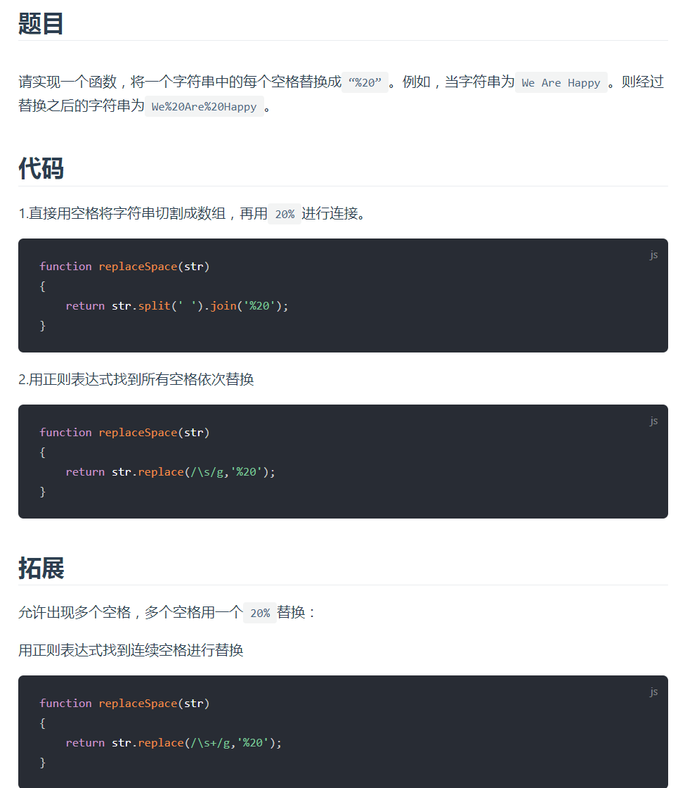
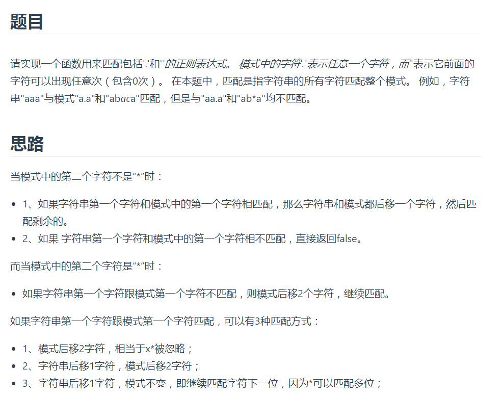
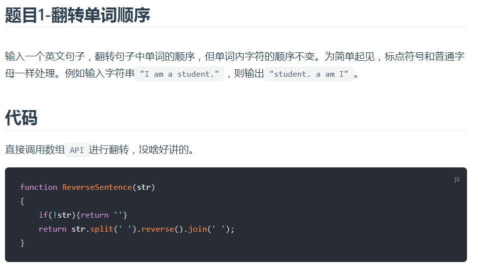

## 表示数值的字符串


##  替换空格



## 正则表达式匹配



不想看，看不懂

##  字符串的排列

输入一个字符串,按字典序打印出该字符串中字符的所有排列。例如输入字符串`abc`,则打印出由字符`a,b,c`所能排列出来的所有字符串`abc,acb,bac,bca,cab`和`cba`。

## [#](http://www.conardli.top/docs/dataStructure/字符串/字符串的排列.html#思路)思路

使用回溯法

记录一个字符（`temp`），用于存储当前需要进入排列的字符

记录一个字符串（`current`），用于记录当前已经排列好的字符

记录一个队列（`queue`），用于存储还未被排列的字符

- 每次排列将`temp`添加到`current`
- 如果`queue`为空，则本次排列完成，将`curret`加入到结果数组中，结束递归
- 如果`queue`不为空，说明还有未排列的字符
- 递归排列`queue`中剩余的字符
- 为了不影响后续排列，每次递归完成，将当前递归的字符`temp`加回队列

## [#](http://www.conardli.top/docs/dataStructure/字符串/字符串的排列.html#代码)代码

> 记录一个当前排列字符temp

```js
    function Permutation(str) {
      const result = [];
      if (str) {
        queue = str.split('')
        PermutationCore(queue, result);
      }
      result.sort();
      return [... new Set(result)];
    }

    function PermutationCore(queue, result, temp = "", current = "") {
      current += temp;
      if (queue.length === 0) {
        result.push(current);
        return;
      }
      for (let i = 0; i < queue.length; i++) {
        temp = queue.shift();
        PermutationCore(queue, result, temp, current);
        queue.push(temp);
      }
    }
```

看不懂，头疼，脑子不好使了

## 字符串翻转




## 字符流中第一个不重复的字符

