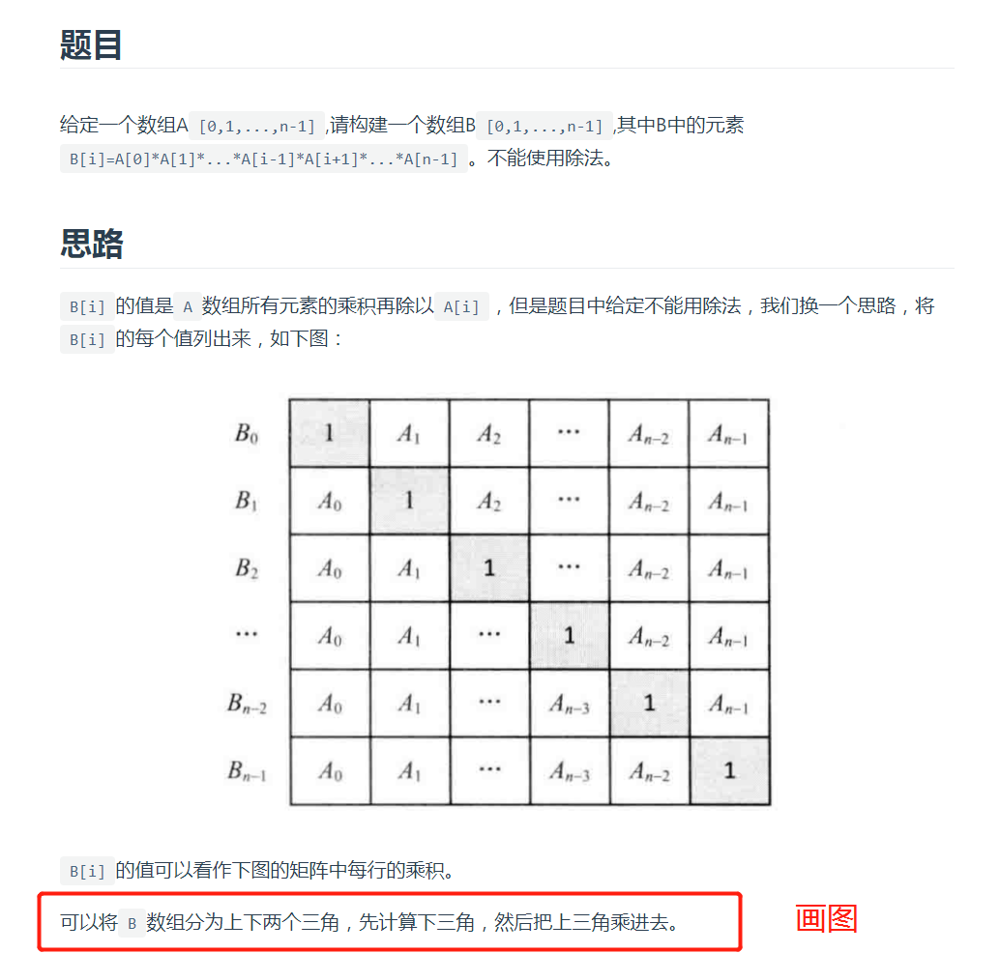
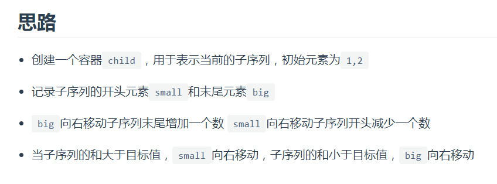
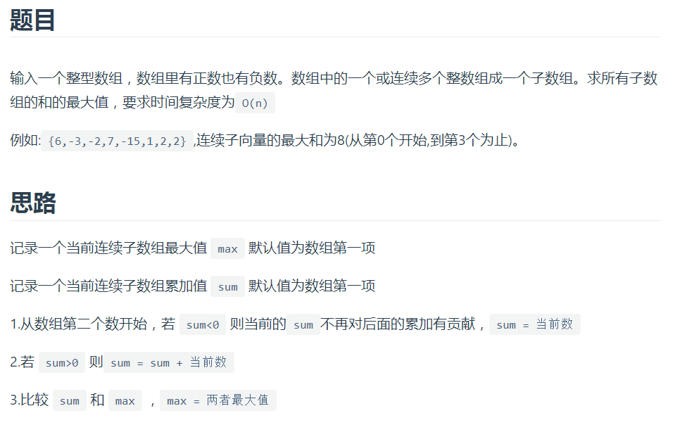
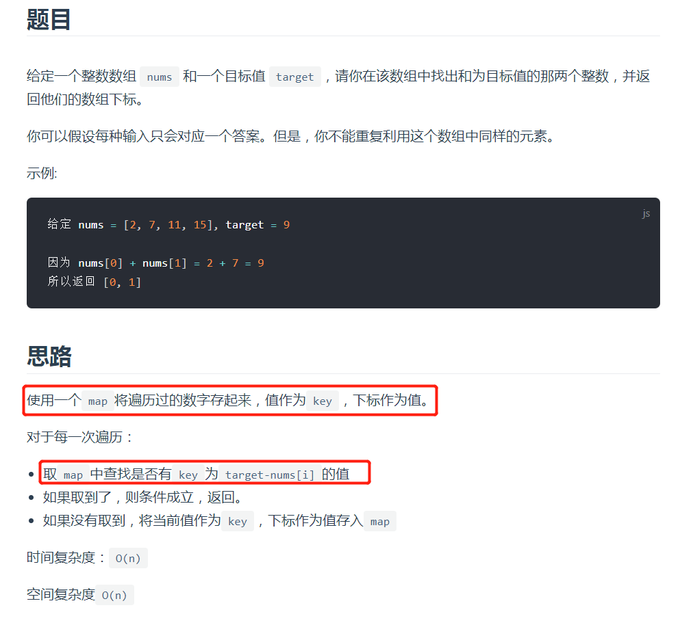
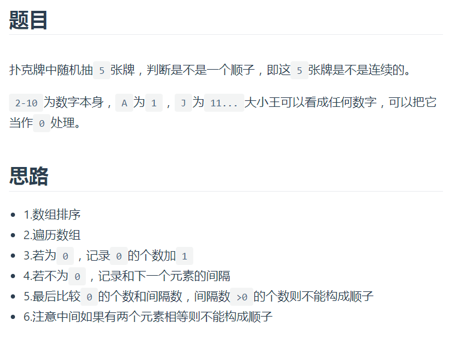
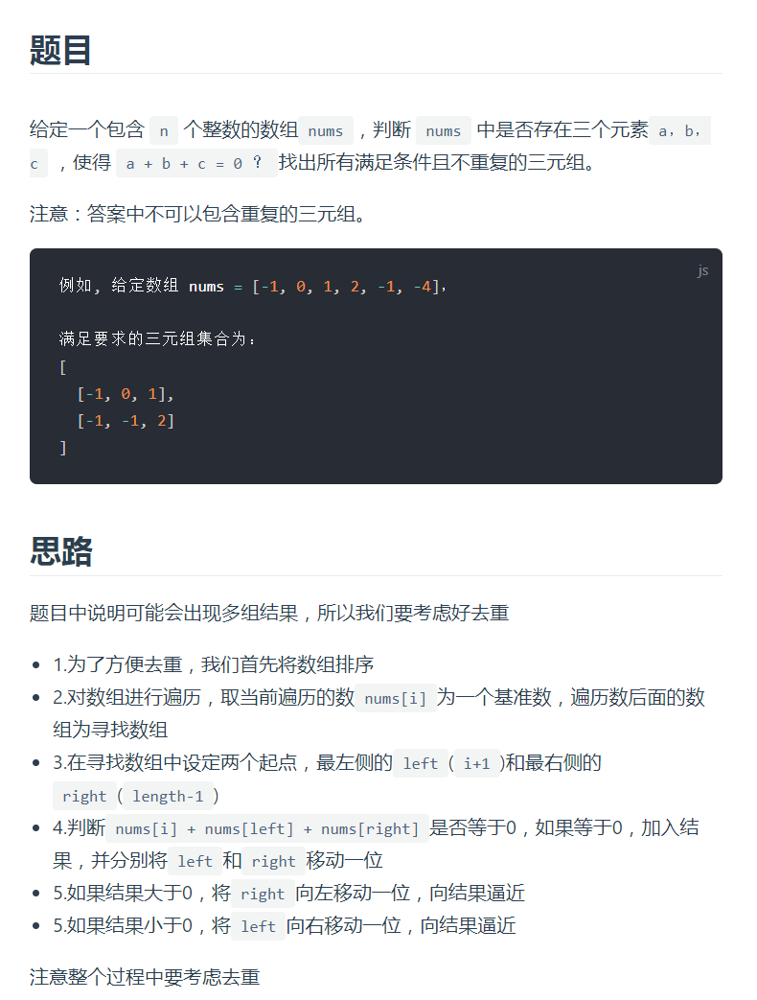
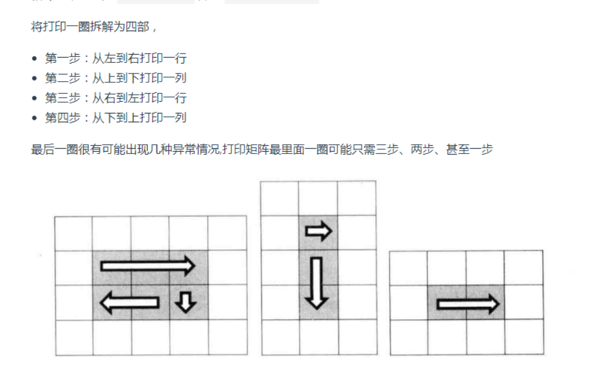
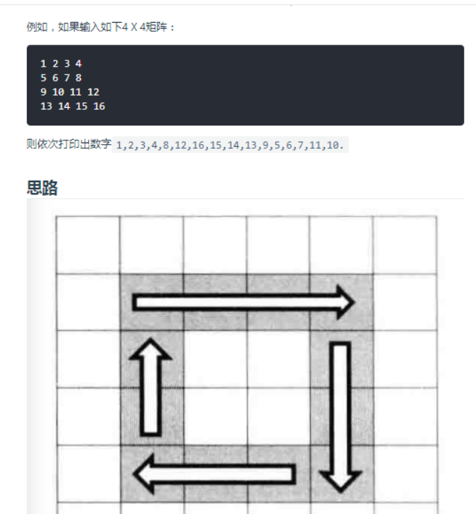

# 数组

输入一个正整数数组，把数组里所有数字拼接起来排成一个数，打印能拼接出的所有数字中最小的一个。

例如输入数组`{3，32，321}`，则打印出这三个数字能排成的最小数字为`321323`

```js
    function PrintMinNumber(numbers) {
      if (!numbers || numbers.length === 0) {
        return "";
      }
      return numbers.sort(compare).join('');
    }

    function compare(a, b) {
      const front = "" + a + b;
      const behind = "" + b + a;
      return front - behind;
    }
```

---

在一个字符串(`0<=字符串长度<=10000`，全部由字母组成)中找到第一个只出现一次的字符,并返回它的位置, 如果没有则返回`-1`（需要区分大小写）。

思路1:

**用一个`map`存储每个字符出现的字数**

第一次循环存储次数，第二次循环找到第一个出现一次的字符。

时间复杂度`O(n)`、空间复杂度`O(n)`

思路二：

使用`js`的`array`提供的`indexOf`和`lastIndexOf`方法

遍历字符串，比较每个字符第一次和最后一次出现的位置是否相同。

`indexOf`的时间复杂度为`O(n)`，所以整体的时间复杂度为O(n2)，空间复杂度为`0`。

---

输入一个整数数组，实现一个函数来调整该数组中数字的顺序，使得所有的奇数位于数组的前半部分，所有的偶数位于数组的后半部分

设定两个指针

第一个指针start从数组第一个元素出发，向尾部前进

第二个指针end从数组的最后一个元素出发，向头部前进

start遍历到偶数，end遍历到奇数时，交换两个数的位置

当start>end时，完成交换

```js
    function reOrderArray(array) {
      if (Array.isArray(array)) {
        let start = 0;
        let end = array.length - 1;
        while (start < end) {
          while (array[start] % 2 === 1) {
            start++;
          }
          while (array[end] % 2 === 0) {
            end--;
          }
          if (start < end) {
            [array[start], array[end]] = [array[end], array[start]]
          }
        }
      }
      return array;
    }
```

暂时变量，双指针，栈，数组，队列。这些都是解决问题的方法。递归外部变量，内部变量，递归状态中的返回值

---



```
    function multiply(array) {
      const result = [];
      if (Array.isArray(array) && array.length > 0) {
        // 计算下三角
        result[0] = 1;
        for (let i = 1; i < array.length; i++) {
          result[i] = result[i - 1] * array[i - 1];
        }
        // 乘上三角
        let temp = 1;
        for (let i = array.length - 2; i >= 0; i--) {
          temp = temp * array[i + 1];
          result[i] = result[i] * temp;
        }
      }
      return result;
    }
```


123456789 10 11 12 13 14 15 

数组找某一种情况的题目，双指针最好是最好的



```js
    function FindContinuousSequence(sum) {
      const result = [];
      const child = [1, 2];
      let big = 2;
      let small = 1;
      let currentSum = 3;
      while (big < sum) {
        while (currentSum < sum && big < sum) {
          child.push(++big);
          currentSum += big;
        }
        while (currentSum > sum && small < big) {
          child.shift();
          currentSum -= small++;
        }
        if (currentSum === sum && child.length > 1) {
          result.push(child.slice());
          child.push(++big);
          currentSum += big;
        }
      }
      return result;
    }
```

这道题目很厉害

如果前面的累加结果为负值，就应该及时丢弃，不然负数加如何一个数字都不是最大的。

```js
    function FindGreatestSumOfSubArray(array) {
      if (Array.isArray(array) && array.length > 0) {
        let sum = array[0];
        let max = array[0];
        for (let i = 1; i < array.length; i++) {
          if (sum < 0) {
            sum = array[i];
          } else {
            sum = sum + array[i];
          }
          if (sum > max) {
            max = sum;
          }
        }
        return max;
      }
      return 0;
    }
```



利用map中查询key值，查看是否存在

```js
   var twoSum = function (nums, target) {
      const map = {};
      if (Array.isArray(nums)) {
        for (let i = 0; i < nums.length; i++) {
          if (map[target - nums[i]] != undefined) {
            return [map[target - nums[i]], i];
          } else {
            map[nums[i]] = i;
          }
        }
      }
      return [];
    };
```

这样就只存储了一次

就有些问题存在了

----



```JS
    function IsContinuous(numbers) {
      if (numbers && numbers.length > 0) {
        numbers.sort();
        let kingNum = 0;
        let spaceNum = 0;
        for (let i = 0; i < numbers.length - 1; i++) {
          if (numbers[i] === 0) {
            kingNum++;
          } else {
            debugger
            const space = numbers[i + 1] - numbers[i];
            if (space == 0) {
              return false;
            } else {
              spaceNum += space - 1;
            }
          }
        }
        return kingNum - spaceNum >= 0;
      }
      return false;
    }
    console.log(IsContinuous([2,0,3,0,5]))
```


先排序，然后计算，每一个数字之间间隔，能不能用王填上，如果能，就是顺子

---



三数之和

就是遍历每个数组，用双指针，

```js
    var threeSum = function (nums) {
      const result = [];
      nums.sort((a, b) => a - b);
      for (let i = 0; i < nums.length; i++) {
        // 跳过重复数字
        if (i && nums[i] === nums[i - 1]) { continue; }
        let left = i + 1;
        let right = nums.length - 1;
        while (left < right) {
          const sum = nums[i] + nums[left] + nums[right];
          if (sum > 0) {
            right--;
          } else if (sum < 0) {
            left++;
          } else {
            result.push([nums[i], nums[left++], nums[right--]]);
            // 跳过重复数字
            while (nums[left] === nums[left - 1]) {
              left++;
            }
            // 跳过重复数字
            while (nums[right] === nums[right + 1]) {
              right--;
            }
          }
        }
      }
      return result;
    }
```

---

数组中的逆序对

使用归并排序的方式完成

没看懂，不知道归并排序是啥，现在看这个

[http://www.conardli.top/docs/dataStructure/%E6%95%B0%E7%BB%84/%E6%95%B0%E7%BB%84%E4%B8%AD%E7%9A%84%E9%80%86%E5%BA%8F%E5%AF%B9.html#%E9%A2%98%E7%9B%AE](http://www.conardli.top/docs/dataStructure/数组/数组中的逆序对.html#题目)

---




```js
    // 顺时针打印
    function printMatrix(matrix) {
      var start = 0;
      var rows = matrix.length;
      var coloums = matrix[0].length;
      var result = [];
      if (!rows || !coloums) {
        return false;
      }
      while (coloums > start * 2 && rows > start * 2) {
        printCircle(matrix, start, coloums, rows, result);
        start++;
      }
      return result;
    }

    // 打印一圈
    function printCircle(matrix, start, coloums, rows, result) {
      var entX = coloums - start - 1;
      var endY = rows - start - 1;
      for (var i = start; i <= entX; i++) {
        result.push(matrix[start][i]);
      }
      if (endY > start) {
        for (var i = start + 1; i <= endY; i++) {
          result.push(matrix[i][entX]);
        }
        if (entX > start) {
          for (var i = entX - 1; i >= start; i--) {
            result.push(matrix[endY][i]);
          }
          if (endY > start + 1) {
            for (var i = endY - 1; i > start; i--) {
              result.push(matrix[i][start]);
            }
          }
        }
      }
    }
```

 

---

四叔之和

1，排序 2，固定一个元素，在剩下的元素里面找三个和为固定元素的相反值

3，三个数之和就用之前的三数方法，固定一个元素，双指针移动找到两数之和。

----

统计一个数字在排序数组中出现的次数

二分查找（看查找的时候来看）