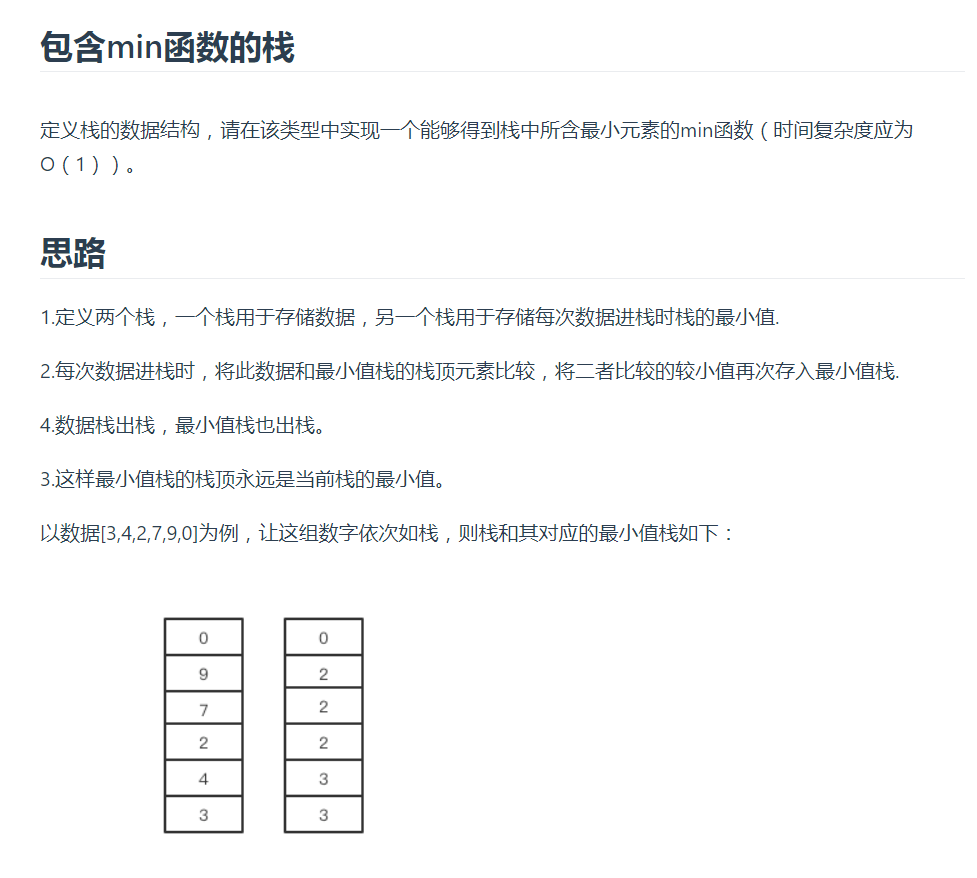
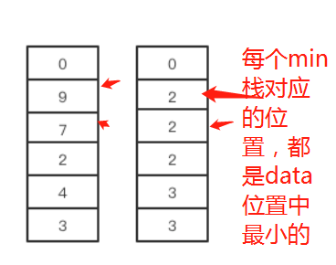
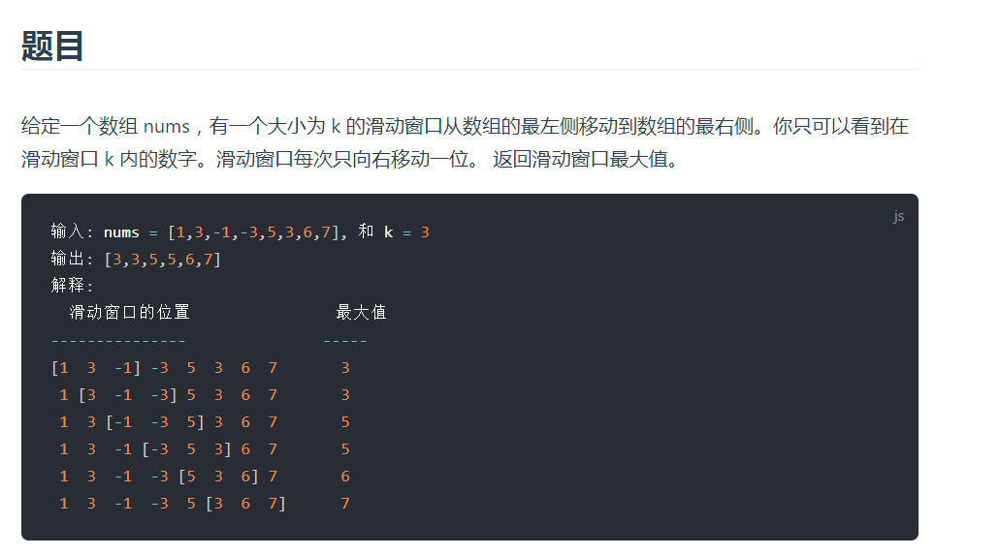
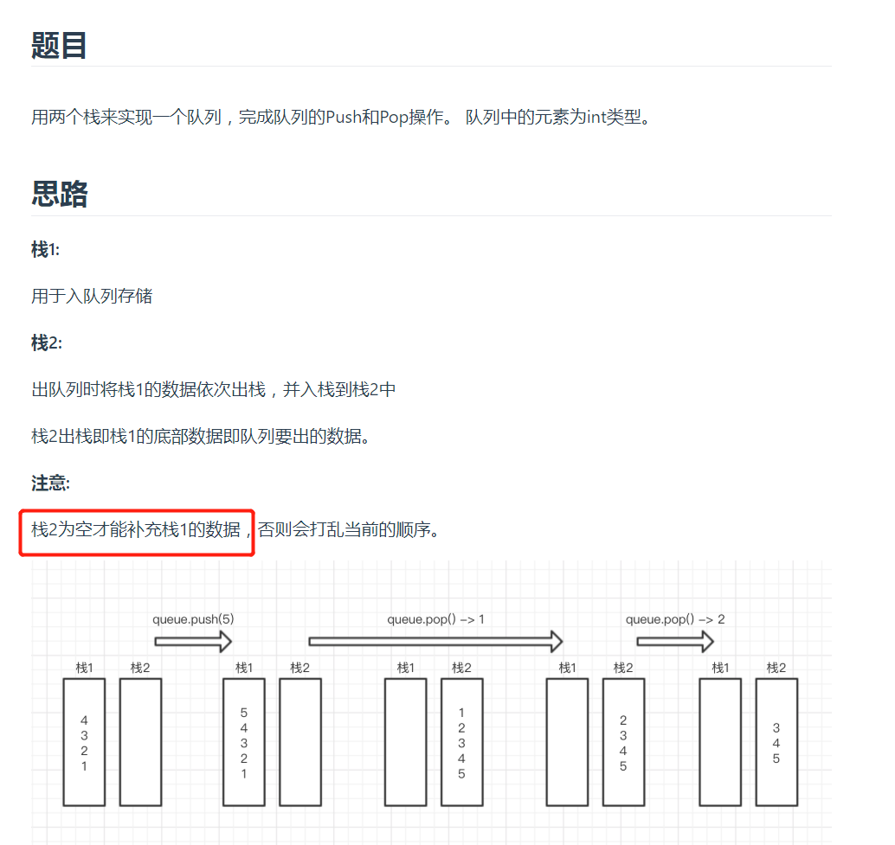

# 栈和队列

包含min函数的栈

要保证，往栈中添加数据的时候，要保证最小栈中栈顶元素，是对应数据栈中最小的元素。这样每次pop，剩下的min栈还是可用，

如何作用，就是每次向min栈中添加元素，如果新data比min栈中小，就加这个新元素，如果不是，则重复添加min栈栈顶元素

## 滑动窗口的最大值

维护一个变量，这个变量存储这每个窗口的最大值

当窗口移动一格，就是加一个新元素，减少一个旧元素，如果新加的元素比当前最大值大就加入，如果不大，并且减少的元素是最大的

上面这个不成立

是在是看不到懂，这个滑动窗口的策略，wtf wtm

放弃，跳过

## 用两个栈实现队列

## 栈的压入弹出序列

