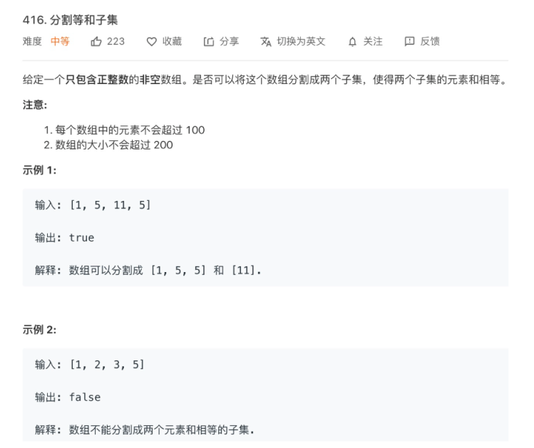
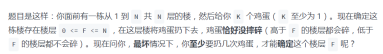
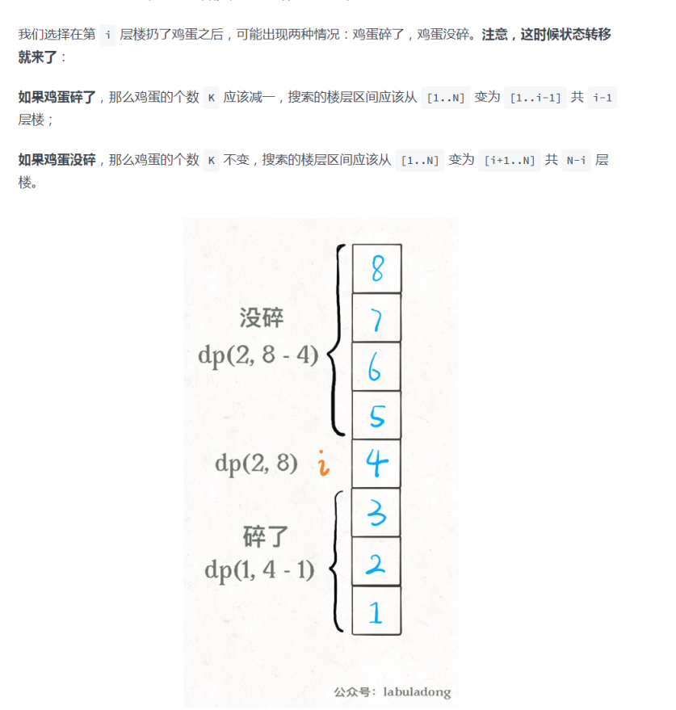
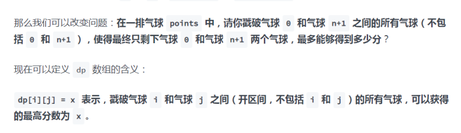

# 动态规划

遍历加递归（很明显就是两个变量，如果一个变量想不清楚，**就想两个变量**）

给定一个包含非负整数的 `m x n` 网格，请找出一条从左上角到右下角的路径，使得路径上的数字总和为最小。

说明：每次只能向下或者向右移动一步。

示例:

```js
输入:
[
  [1,3,1],
  [1,5,1],
  [4,2,1]
]
输出: 7
解释: 因为路径 1→3→1→1→1 的总和最小。
```

思路

新建一个额外的 dpdp 数组，与原矩阵大小相同。在这个矩阵中，`dp(i, j)dp(i,j)` 表示从坐标 `(i, j)(i,j)` 到右下角的最小路径权值。

我们初始化右下角的 `dpdp` 值为对应的原矩阵值，然后去填整个矩阵，对于每个元素考虑移动到右边或者下面，因此获得最小路径和我们有如下递推公式：

```js
dp(i,j)=grid(i,j)+min(dp(i+1,j),dp(i,j+1))
```

时间复杂度 ：`O(mn)O(mn)` 空间复杂度 ：`O(mn)O(mn)`

代码

```js
var minPathSum = function (grid) {
	var m = grid.length;
	var n = grid[0].length;
	for (var i = 0; i < m; i++) {
		for (var j = 0; j < n; j++) {
			if (i === 0 && j !== 0) {
				grid[i][j] += grid[i][j - 1];
			} else if (j === 0 && i !== 0) {
				grid[i][j] += grid[i - 1][j];
			} else if (i !== 0 && j !== 0) {
				grid[i][j] += Math.min(grid[i - 1][j], grid[i][j - 1]);
			}
		}
	}
	return grid[m - 1][n - 1];
};
```

什么最多最小  动态规划

和为x，什么什么的就是dfs


## 小偷

你是一个专业的小偷，计划偷窃沿街的房屋。每间房内都藏有一定的现金，影响你偷窃的唯一制约因素就是相邻的房屋装有相互连通的防盗系统，如果两间相邻的房屋在同一晚上被小偷闯入，系统会自动报警。

给定一个代表每个房屋存放金额的非负整数数组，计算你在不触动警报装置的情况下，能够偷窃到的最高金额。

```js
示例 1:

输入: [1,2,3,1]
输出: 4
解释: 偷窃 1 号房屋 (金额 = 1) ，然后偷窃 3 号房屋 (金额 = 3)。
     偷窃到的最高金额 = 1 + 3 = 4 。
示例 2:

输入: [2,7,9,3,1]
输出: 12
解释: 偷窃 1 号房屋 (金额 = 2), 偷窃 3 号房屋 (金额 = 9)，接着偷窃 5 号房屋 (金额 = 1)。
     偷窃到的最高金额 = 2 + 9 + 1 = 12 。
```

思路

考虑所有可能的抢劫方案过于困难。一个自然而然的想法是首先从最简单的情况开始。记：

`f(k)` = 从前 k 个房屋中能抢劫到的最大数额，`Ai` = 第 i 个房屋的钱数。

首先看`n = 1` 的情况，显然 `f(1) = A1`。

再看 `n = 2`，`f(2) = max(A1, A2)`。

对于 `n = 3`，有两个选项:

抢第三个房子，将数额与第一个房子相加。

不抢第三个房子，保持现有最大数额。

显然，你想选择数额更大的选项。于是，可以总结出公式：

```
f(k) = max(f(k – 2) + Ak, f(k – 1))
```

代码

```js
    var rob = function (nums) {
      var len = nums.length;
      if (len < 2) {
        return nums[len - 1] ? nums[len - 1] : 0;
      }
      var current = [nums[0], Math.max(nums[0], nums[1])];
      for (var k = 2; k < len; k++) {
        current[k] = Math.max(current[k - 2] + nums[k], current[k - 1]);
      }
      return current[len - 1];
    };
```

递归中列出公式+边界情况


思路就是: 求这个最大的路径，那么是不是只需要找到k-1个元素组成的最大路径再加k就行。主要是把一个答案转换成 ，小范围的元素的答案。注意是思考答案


递归应该画递归树

也可以画出dp表格，a0a1a2a3a4a5


----

## 背包问题

```
dp[i][w]` 表示：对于前 `i` 个物品，当前背包的容量为 `w` 时，这种情况下可以装下的最大价值是 `dp[i][w]
```

**如果你没有把这第** **`i`** **个物品装入背包**，那么很显然，最大价值 `dp[i][w]` 应该等于 `dp[i-1][w]`，继承之前的结果。

**如果你把这第** **`i`** **个物品装入了背包**，那么 `dp[i][w]` 应该等于 `dp[i-1][w - wt[i-1]] + val[i-1]`。

首先，由于 `i` 是从 1 开始的，所以 `val` 和 `wt` 的索引是 `i-1` 时表示第 `i` 个物品的价值和重量。

而 `dp[i-1][w - wt[i-1]]` 也很好理解：你如果装了第 `i` 个物品，就要寻求剩余重量 `w - wt[i-1]` 限制下的最大价值，加上第 `i` 个物品的价值 `val[i-1]`。

综上就是两种选择，我们都已经分析完毕，也就是写出来了状态转移方程，可以进一步细化代码：

```c++
for i in [1..N]:
    for w in [1..W]:
        dp[i][w] = max(
            dp[i-1][w],
            dp[i-1][w - wt[i-1]] + val[i-1]
        )
return dp[N][W]
```

这次动态规划问题，不想之前那种求最大连续子串和，而是一个二维的问题

前期不断维护不同重量，前n个物品的最大价值，在后面遍历做决策时就能用上

### 完全背包问题，就是这个背包必须装满

https://labuladong.gitbook.io/algo/dong-tai-gui-hua-xi-lie/bei-bao-ling-qian

```js
int change(int amount, int[] coins) {
    int n = coins.length;
    int[][] dp = amount int[n + 1][amount + 1];
    // base case
    for (int i = 0; i <= n; i++) 
        dp[i][0] = 1;

    for (int i = 1; i <= n; i++) {
        for (int j = 1; j <= amount; j++)
            if (j - coins[i-1] >= 0)
                dp[i][j] = dp[i - 1][j] 
                         + dp[i][j - coins[i-1]];
            else 
                dp[i][j] = dp[i - 1][j];
    }
    return dp[n][amount];
}
```

背包二维，问题，一定是两个循环，然后找出`dp[i][j]`的转化状态

这里面隐含的转化状态就是：`dp[i][j] = dp[i - 1][j] + dp[i][j - coins[i-1]];`

1235中面额 组成5

`dp[3][j]`求解，就是等于由1，2组成能j的种类数，加上，包含3的种类数

包含3的种类数，等于j减去3的面值剩余的总数，由1，2，3这三种面值能组成的剩余的面值总数的种类数

二者想加。这个重点理解转化状态中的，` dp[i][j - coins[i-1]]`

## 子集背包问题




其中数学规律: 把数组分成两个和相等的子数组了。说明就是两个和相等的子数组的和为数组和的一半。那就是

**给一个可装载重量为** **`sum / 2`** **的背包和** **`N`** **个物品，每个物品的重量为** **`nums[i]`****。现在让你装物品，是否存在一种装法，能够恰好将背包装满**？

```java
bool canPartition(vector<int>& nums) {
    int sum = 0;
    for (int num : nums) sum += num;
    // 和为奇数时，不可能划分成两个和相等的集合
    if (sum % 2 != 0) return false;
    int n = nums.size();
    sum = sum / 2;
    vector<vector<bool>> 
        dp(n + 1, vector<bool>(sum + 1, false));
    // base case
    for (int i = 0; i <= n; i++)
        dp[i][0] = true;

    for (int i = 1; i <= n; i++) {
        for (int j = 1; j <= sum; j++) {
            if (j - nums[i - 1] < 0) {
               // 背包容量不足，不能装入第 i 个物品
                dp[i][j] = dp[i - 1][j]; 
            } else {
                // 装入或不装入背包
                dp[i][j] = dp[i - 1][j] | dp[i - 1][j-nums[i-1]];
            }
        }
    }
    return dp[n][sum];
}
```

---

## 编辑距离 很难

## 高楼扔鸡蛋





---

## 戳气球

数学规律


```java
int maxCoins(int[] nums) {
    int n = nums.length;
    // 添加两侧的虚拟气球
    int[] points = new int[n + 2];
    points[0] = points[n + 1] = 1;
    for (int i = 1; i <= n; i++) {
        points[i] = nums[i - 1];
    }
    // base case 已经都被初始化为 0
    int[][] dp = new int[n + 2][n + 2];
    // 开始状态转移
    // i 应该从下往上
    for (int i = n; i >= 0; i--) {
        // j 应该从左往右
        for (int j = i + 1; j < n + 2; j++) {
            // 最后戳破的气球是哪个？
            for (int k = i + 1; k < j; k++) {
                // 择优做选择
                dp[i][j] = Math.max(
                    dp[i][j], 
                    dp[i][k] + dp[k][j] + points[i]*points[j]*points[k]
                );
            }
        }
    }
    return dp[0][n + 1];
}
```



