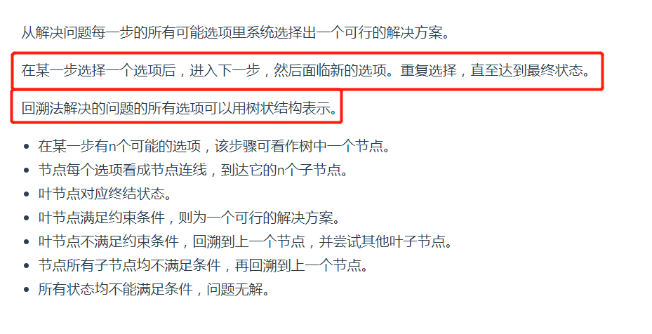
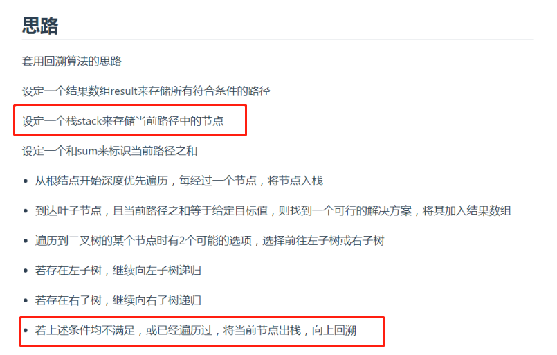

-----

## 二叉树中和为某一个值的路径



## 字符串的排列

## 和为sum的n个数

给定无序、不重复的数组`data`，取出 `n` 个数，使其相加和为`sum`

## [#](http://www.conardli.top/docs/algorithm/回溯算法/和为sum的n个数.html#思路)思路

基于上面字符串排列题目的变形，我们从`array`中取出`n`个数的全排列，在取的同时判断是否符合条件。

## [#](http://www.conardli.top/docs/algorithm/回溯算法/和为sum的n个数.html#代码)代码

```js
    function getAllCombin(array, n, sum, temp) {
      if (temp.length === n) {
        if (temp.reduce((t, c) => t + c) === sum) {
          return temp;
        }
        return;
      }
      for (let i = 0; i < array.length; i++) {
        const current = array.shift();
        temp.push(current);
        const result = getAllCombin(array, n, sum, temp);
        if (result) {
          return result;
        }
        temp.pop();
        array.push(current);
      }
    }
    const arr = [1, 2, 3, 4, 5, 6];

    console.log(getAllCombin(arr, 3, 10, []));
```

就是不停是循环，使用三数之和等于sum

 不停回溯，遍历了所有有可能的情况。

## 矩阵中的路径


## 机器人的运动范围

## n皇后问题

