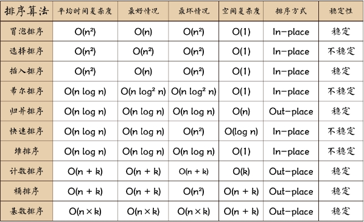
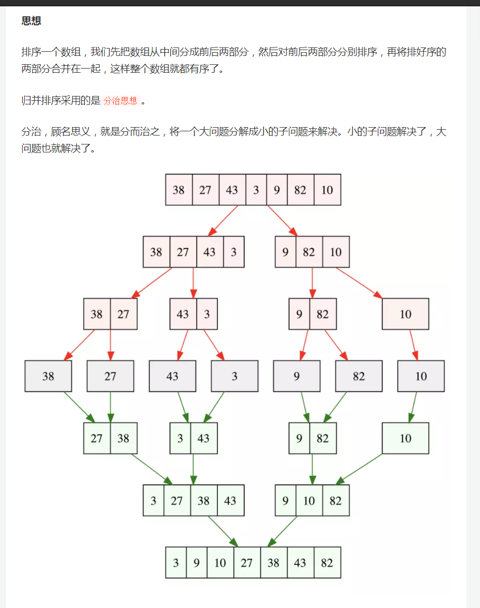
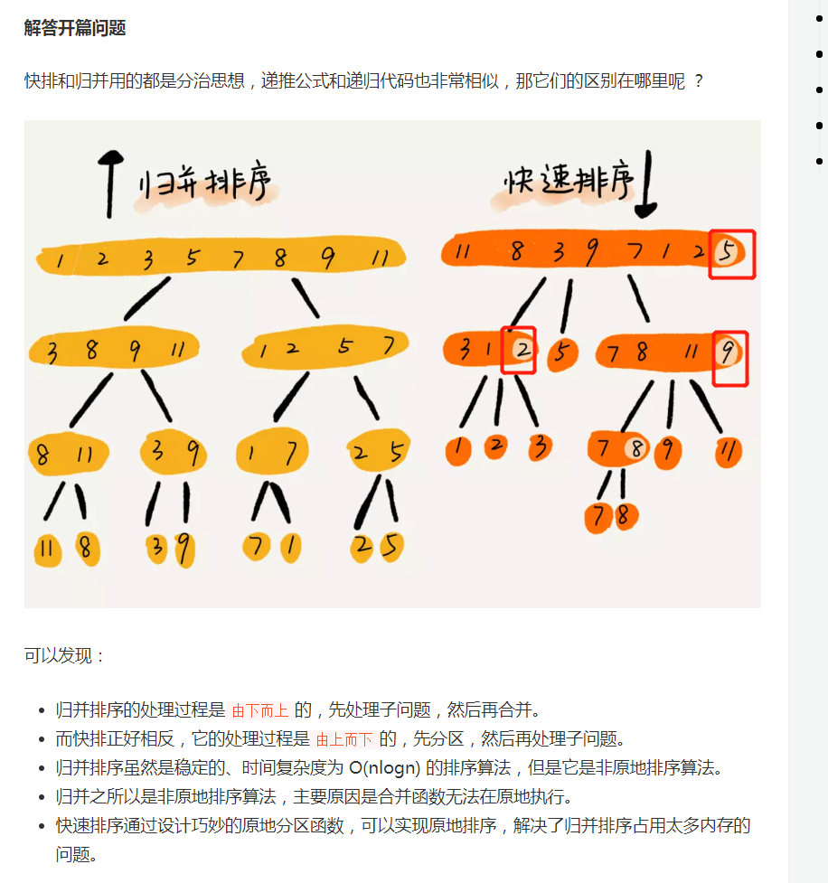
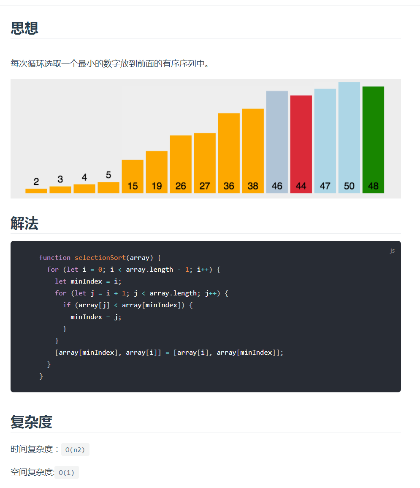
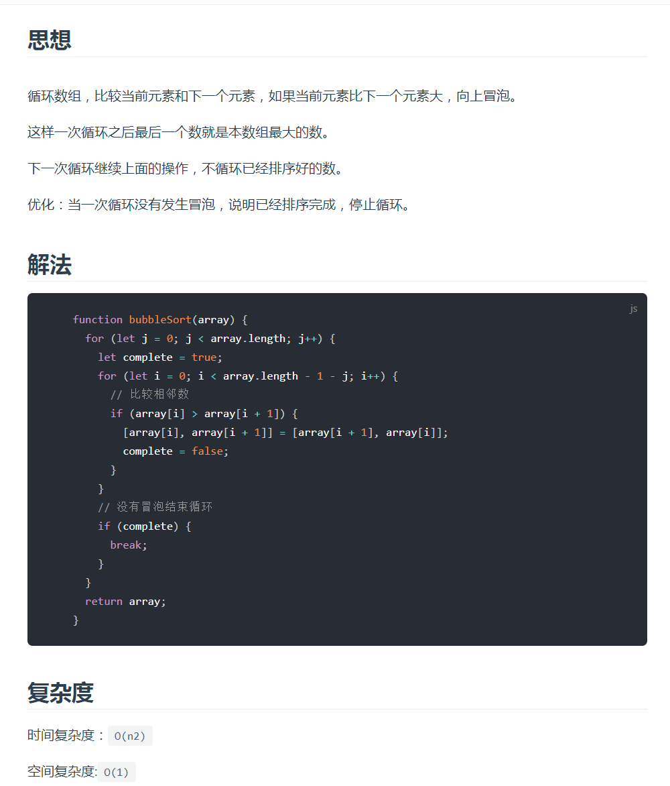

```js
// 创建堆，其实是对data数组做一个结构调整，使其具有堆的特性
function buildHeap(data) {
    var len = data.length;
    for(var i=Math.floor(len/2); i>=0; i--) {
        heapAjust(data, i, len);
    }
}
// 堆调整函数，即调整当前data为大根堆
function heapAjust(data, i, len) {
    var child = 2*i + 1;
    // 如果有孩子结点，默认情况是左孩子
    while(child <= len) { // 最后判断是否到了最后，该孩子不存在
        var temp = data[i];
        // 如果右孩子存在且其值大于左孩子的值，则将child指向右孩子
        if(child + 1 <= len && data[child] < data[child + 1]) {
            child = child + 1;
        }
        // 如果当前结点的值小于其孩子结点的值，则交换，直至循环结束
        if(data[i] < data[child]) {
            data[i] = data[child];
            data[child] = temp;
            i = child;
            child = 2*i + 1
        }else {
            break
        }
    }
}
// 排序
function heapSort(data) {
    var data = data.slice(0);
    // 将data数组改造为“堆”的结构
    buildHeap(data);

    var len = data.length;
    // 下面需要注意的时候参数的边界，参考文档里面程序中i的值是不对的
    for(var i=len-1; i>=0; i--) {
        swap(data, i, 0);
        heapAjust(data, 0, i-1);
    }
    return data;
}
const arr = [62, 88, 58, 47, 35, 73, 51, 99, 37, 93];
var newArr = heapSort(arr);
console.log(newArr);  // [35, 37, 47, 51, 58, 62, 73, 88, 93, 99]
```

**堆排序**

# 排序



### 插入排序

将左侧序列看成一个有序序列，每次将一个数字插入该有序序列。

插入时，从有序序列最右侧开始比较，若比较的数较大，后移一位。


## 解法

```js
    function insertSort(array) {
      for (let i = 1; i < array.length; i++) {
        let target = i;
        for (let j = i - 1; j >= 0; j--) {
          if (array[target] < array[j]) {
            [array[target], array[j]] = [array[j], array[target]]
            target = j;
          } else {
            break;
          }
        }
      }
      return array;
    }
```

## 复杂度

时间复杂度：`O(n2)`

空间复杂度:`O(1)`

## 稳定性

稳定

### 堆排序

我们直接把堆顶的元素与第n个元素交换位置，再把前(n-1)个元素堆化，再把堆顶元素与第(n-1)个元素交换位置，再把前(n-2)个元素堆化，..，，进行下去，最后，数组中的元素就整个变成倒序的了，也就排序完了。

复杂度

时间复杂度：`O(nlogn)`

空间复杂度:`O(1)

稳定性

不稳定

如何堆化

### 归并排序



```js
const mergeSort = arr => {
	//采用自上而下的递归方法
	const len = arr.length;
	if (len < 2) {
		return arr;
	}
	// length >> 1 和 Math.floor(len / 2) 等价
	let middle = Math.floor(len / 2),
		left = arr.slice(0, middle),
		right = arr.slice(middle); // 拆分为两个子数组
	return merge(mergeSort(left), mergeSort(right));
};

const merge = (left, right) => {
	const result = [];

	while (left.length && right.length) {
		// 注意: 判断的条件是小于或等于，如果只是小于，那么排序将不稳定.
		if (left[0] <= right[0]) {
			result.push(left.shift());
		} else {
			result.push(right.shift());
		}
	}

	while (left.length) result.push(left.shift());

	while (right.length) result.push(right.shift());

	return result;
};
```

递归实现

**分析**

- 第一，归并排序是原地排序算法吗 ？ 这是因为归并排序的合并函数，在合并两个有序数组为一个有序数组时，需要借助额外的存储空间。 实际上，尽管每次合并操作都需要申请额外的内存空间，但在合并完成之后，临时开辟的内存空间就被释放掉了。在任意时刻，CPU 只会有一个函数在执行，也就只会有一个临时的内存空间在使用。临时内存空间最大也不会超过 n 个数据的大小，所以空间复杂度是 O(n)。 所以，归并排序不是原地排序算法。
- 第二，归并排序是稳定的排序算法吗 ？ merge 方法里面的 left[0] <= right[0] ，保证了值相同的元素，在合并前后的先后顺序不变。归并排序是一种稳定的排序方法。
- 第三，归并排序的时间复杂度是多少 ？ 从效率上看，归并排序可算是排序算法中的`佼佼者`。假设数组长度为 n，那么拆分数组共需 logn 步, 又每步都是一个普通的合并子数组的过程，时间复杂度为 O(n)，故其综合时间复杂度为 O(nlogn)。 最佳情况：T(n) = O(nlogn)。 最差情况：T(n) = O(nlogn)。 平均情况：T(n) = O(nlogn)。

### 快速排序



快速排序，用最后一个元素作为基准，把身下元素分成比自己大的和比自己小的

### 选择排序



### 冒泡排序



## 插入排序

