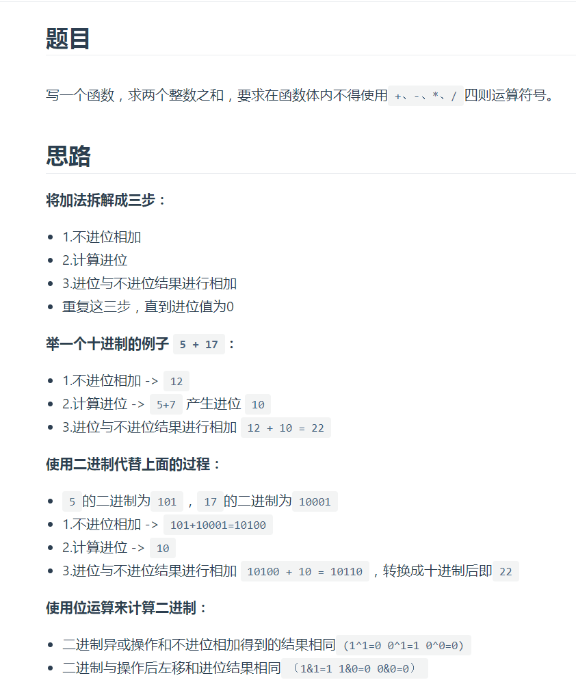
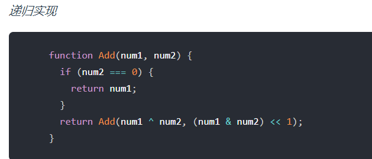
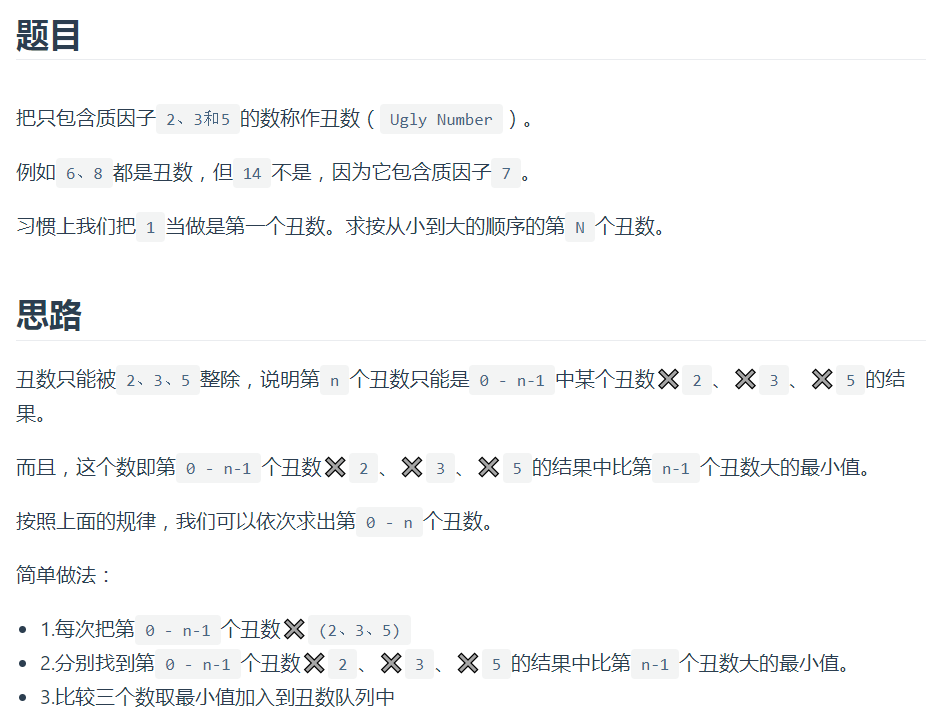
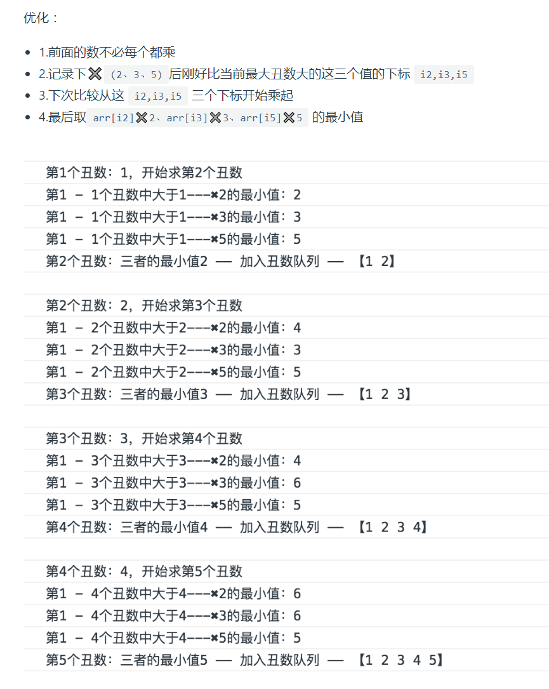
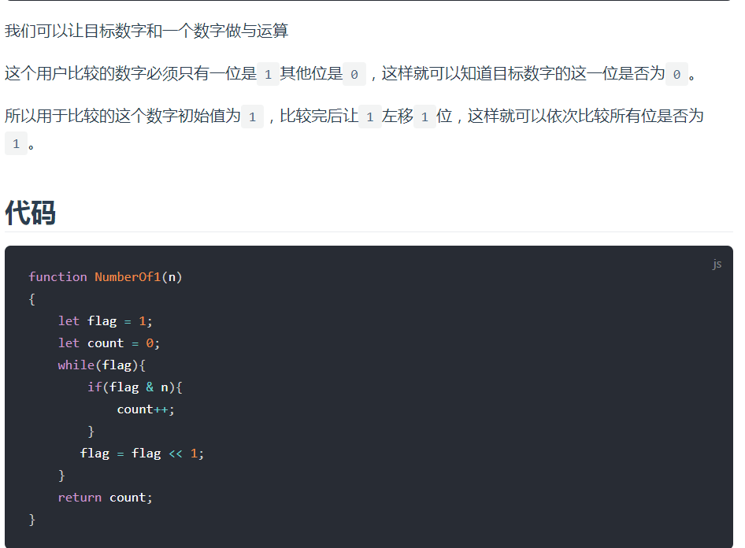
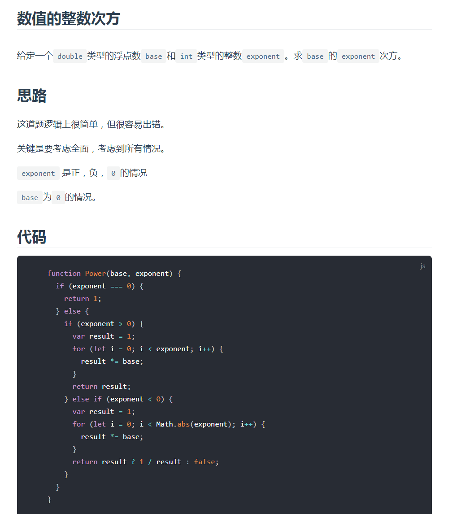

## 不用加减乘除做加法





## 丑数





```js
    function GetUglyNumber_Solution(index) {
      if (index <= 0) {
        return 0;
      }
      let arr = [1];
      let i2 = i3 = i5 = 0;
      let cur = 0;
      while (arr.length < index) {
        arr.push(Math.min(arr[i2] * 2, arr[i3] * 3, arr[i5] * 5));
        const current = arr[arr.length - 1];
        while (arr[i2] * 2 <= current) {
          i2++;
        }
        while (arr[i3] * 3 <= current) {
          i3++;
        }
        while (arr[i5] * 5 <= current) {
          i5++;
        }
      }
      return arr[index - 1];
    }
    
```

## 二进制1的个数



