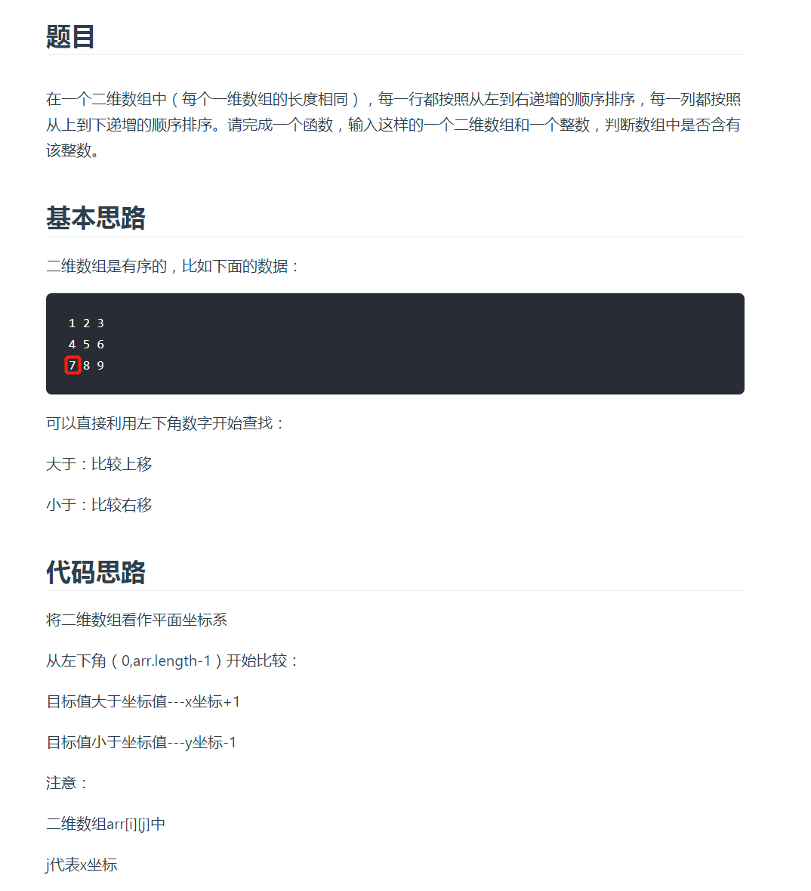
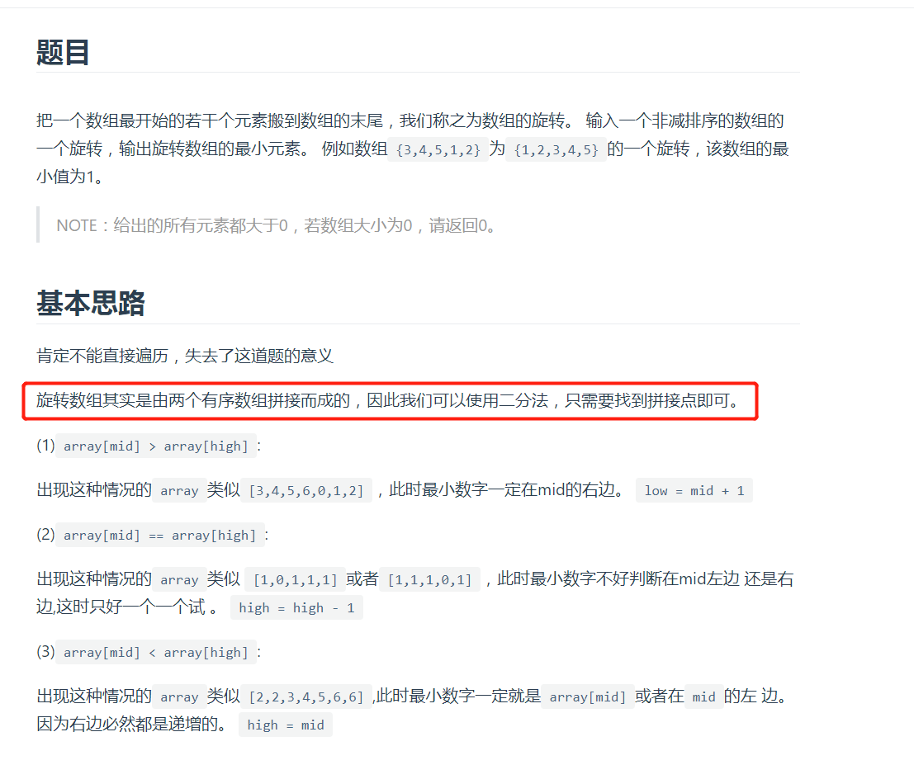
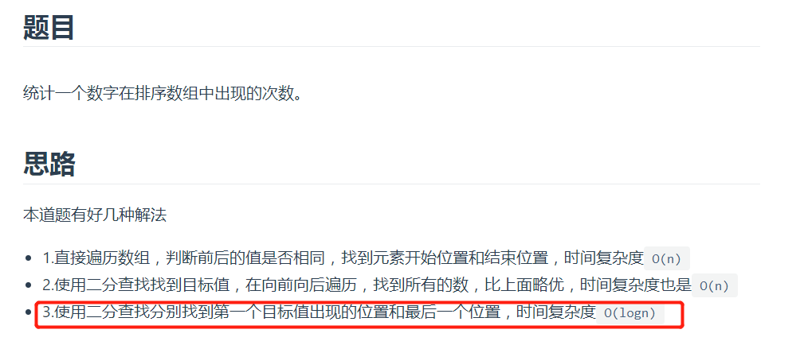

# 查找

## 二维数组查找



左下元素是很有关系的，明确的大小关系，比右边的元素小，比下面的元素大

```js
    function Find(target, array) {
      let i = array.length - 1; // y坐标
      let j = 0; // x坐标
      return compare(target, array, i, j);
    }

    function compare(target, array, i, j) {
      if (array[i] === undefined || array[i][j] === undefined) {
        return false;
      }
      const temp = array[i][j];
      if (target === temp) {
        return true;
      }
      else if (target > temp) {
        return compare(target, array, i, j+1);
      }
      else if (target < temp) {
        return compare(target, array, i-1, j);
      }
    }
```

旋转数组的最小数字



```js
function minNumberInRotateArray(arr)
{
    let len = arr.length;
    if(len == 0)  return 0;
    let low = 0, high = len - 1;
    while(low < high) {
        let mid = low + Math.floor((high-low)/2);
        if(arr[mid] > arr[high]) {
            low = mid + 1;
        } else if(arr[mid] == arr[high]) {
            high = high - 1;
        } else {
            high = mid;
        }
    }
 
    return arr[low];
}
```

## 在排序数组中查找数字



```js
    function GetNumberOfK(data, k) {
      if (data && data.length > 0 && k != null) {
        const firstIndex = getFirstK(data, 0, data.length - 1, k);
        const lastIndex = getLastK(data, 0, data.length - 1, k);
        if (firstIndex != -1 && lastIndex != -1) {
          return lastIndex - firstIndex + 1;
        }
      }
      return 0;
    }

    function getFirstK(data, first, last, k) {
      if (first > last) {
        return -1;
      }
      const mid = parseInt((first + last) / 2);
      if (data[mid] === k) {
        if (data[mid - 1] != k) {
          return mid;
        } else {
          return getFirstK(data, first, mid-1, k);
        }
      } else if (data[mid] > k) {
        return getFirstK(data, first, mid - 1, k);
      } else if (data[mid] < k) {
        return getFirstK(data, mid + 1, last, k);
      }
    }

    function getLastK(data, first, last, k) {
      if (first > last) {
        return -1;
      }
      const mid = parseInt((first + last) / 2);
      if (data[mid] === k) {
        if (data[mid + 1] != k) {
          return mid;
        } else {
          return getLastK(data, mid + 1, last, k);
        }
      } else if (data[mid] > k) {
        return getLastK(data, first, mid - 1, k);
      } else if (data[mid] < k) {
        return getLastK(data, mid + 1, last, k);
      }
    }
```

