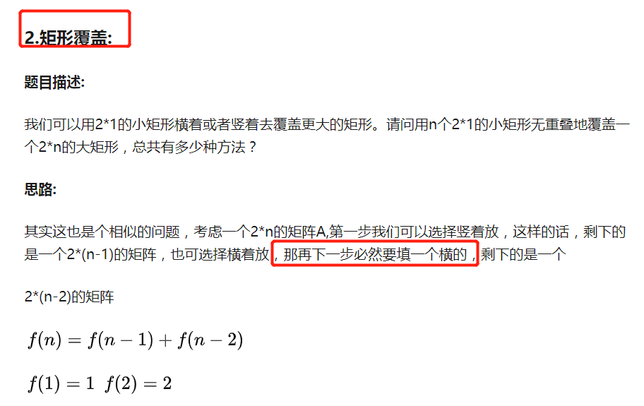

变态跳台阶

一只青蛙一次可以跳上1级台阶，也可以跳上2级……它也可以跳上n级。求该青蛙跳上一个n级的台阶总共有多少种跳法

## **题目描述**

一只青蛙一次可以跳上1级台阶，也可以跳上2级……它也可以跳上n级。求该青蛙跳上一个n级的台阶总共有多少种跳法。

## **解题思路**

```text
f(1) = 1
f(2) = f(2-1) + f(2-2)        
f(3) = f(3-1) + f(3-2) + f(3-3) 
...
f(n) = f(n-1) + f(n-2) + f(n-3) + ... + f(n-(n-1)) + f(n-n) 
```

因为青蛙可以跳上任意级的台阶，所以以青蛙跳上一个 4 级的台阶为例进行分析，它可以在开始直接跳 4 级到 4 级台阶，也可以从 1 级台阶上往上跳 3 个台阶到 4 级，也可以从 2 级台阶往上跳 2 个台阶到 4 级，还可以从 3 级台阶上跳 3 级到 4 级。所以`f(4) = f(4-1) + f(4-2) + f(4-3) + f(4-4)`
可以得出以下的公式：

```text
f(n) = f(n-1)+f(n-2)+...+f(n-(n-1)) + f(n-n) 
=> f(0) + f(1) + f(2) + f(3) + ... + f(n-1)
又因为：
f(n-1) = f(0) + f(1)+f(2)+f(3) + ... + f((n-1)-1) 
       = f(0) + f(1) + f(2) + f(3) + ... + f(n-2)
f(n) = f(0) + f(1) + f(2) + f(3) + ... + f(n-2) + f(n-1) = f(n-1) + f(n-1)
     = 2 * f(n-1)
```

最后可以得到
f(n) = 1, (n=0)
f(n) = 1, (n=1)
f(n) = 2*f(n-1),(n>=2)


## **参考代码**

```java
public class Solution {
    public int JumpFloorII(int target) {
        if(target<=0)
            return 0;
        if(target == 1||target ==2)
            return target;
        else
            return 2*JumpFloorII(target-1);
    }
}
```

------

## 矩形覆盖




```js
public class Solution {
    public int RectCover(int target) {
		if(target<=0){
            return 0;
        }
		if(target==1){
            return 1;
        }
        if(target==2){
            return 2;
        }
        int numOne = 1;
        int numTwo = 2;
        for(int i=3;i<=target;i++){
            numTwo += numOne;
            numOne = numTwo - numOne;
        }
        return numTwo;
    }
}
```

