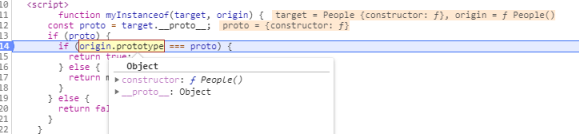

## 继承

有下面两个类，下面实现`Man`继承`People`：

```js
    function People() {
      this.type = 'prople'
    }

    People.prototype.eat = function () {
      console.log('吃东西啦');
    }

    function Man(name) {
      this.name = name;
      this.color = 'black';
    }
```

## 原型继承

> 将父类指向子类的原型。

```js
Man.prototype = new People();
```

缺点：原型是所有子类实例共享的，改变一个其他也会改变。

------

## 构造继承

> 在子类构造函数中调用父类构造函数

```js
    function Man(name) {
      People.call(this);
    }
```

缺点：不能继承父类原型，函数在构造函数中，每个子类实例不能共享函数，浪费内存。

## 组合继承

> 使用构造继承继承父类参数，使用原型继承继承父类函数

```js
    function Man(name) {
      People.call(this);
    }

    Man.prototype = People.prototype;
```

缺点：父类原型和子类原型是同一个对象，无法区分子类真正是由谁构造。

## 寄生组合继承

> 在组合继承的基础上，子类继承一个由父类原型生成的空对象。

```js
    function Man(name) {
      People.call(this);
    }

    Man.prototype = Object.create(People.prototype, {
      constructor: {
        value: Man
      }
    })
// 实际上是执行了这两个
 Man.prototype = People.prototype;
Man.prototype.constructor = Man
```

**为什么要这样写**

1，让属性每个实例都是单独的互不影响

2，让方法是每个实例公用

3，并保证Man的构造函数还是Man

这个是最终答案


## inherits函数：


```js
function inherits(ctor, superCtor) {
  ctor.super_ = superCtor;
  ctor.prototype = Object.create(superCtor.prototype, {
    constructor: {
      value: ctor,
      enumerable: false,
      writable: true,
      configurable: true
    }
  });
}; 
```

使用：

```js
function Man() {
  People.call(this);
  //...
}
inherits(Man, People);

Man.prototype.fun = ...
```

## instanceof

`instanceof` 运算符用来检测 `constructor.prototype `是否存在于参数 `object` 的原型链上。

```js
// 定义构造函数
function C(){} 
function D(){} 

var o = new C();


o instanceof C; // true，因为 Object.getPrototypeOf(o) === C.prototype
```

```js
a instanceof Object
```

判断`Object`的prototype是否在`a`的原型链上。

```
object instanceof constructor
```

### 参数

- `object`

  某个实例对象

- `constructor`

  某个构造函数

## 实现

```js
    function myInstanceof(target, origin) {
      const proto = target.__proto__;
      if (proto) {
        if (origin.prototype === proto) {
          return true;
        } else {
          return myInstanceof(proto, origin)
        }
      } else {
        return false;
      }
    }
```



测试代码

```js
        function myInstanceof(target, origin) {
      const proto = target.__proto__;
      if (proto) {
        if (origin.prototype === proto) {
          return true;
        } else {
          return myInstanceof(proto, origin)
        }
      } else {
        return false;
      }
    }
    function People() {
      this.type = 'prople'
    }
    function Man(name) {
      People.call(this);
    }

    Man.prototype = Object.create(People.prototype, {
      constructor: {
        value: Man
      }
    })

  console.log(myInstanceof(new Man('a'),People))
```

`不停的.__proto__`

