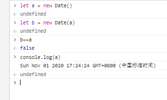

# 深拷贝

## 简单的深拷贝

```js

function cloneDeep1(source) {
    var target = {};
    Object.keys(source).forEach(key=>{
            if (typeof source[key] === 'object') {
                target[key] = cloneDeep1(source[key]); // 注意这里
            } else {
                target[key] = source[key];
            }  
   		 }
    })
    return target;
}

```

一个简单的深拷贝就完成了，但是这个实现还存在很多问题。

- 1、没有对传入参数进行校验，传入 `null` 时应该返回 `null` 而不是 `{}`
- 2、对于对象的判断逻辑不严谨，因为 `typeof null === 'object'`
- 3、没有考虑数组的兼容

```js
function cloneDeep2(source) {

    if (!isObject(source)) return source; // 非对象返回自身
      
    var target = Array.isArray(source) ? [] : {};
    for(var key in source) {
        if (Object.prototype.hasOwnProperty.call(source, key)) {
            if (isObject(source[key])) {
                target[key] = cloneDeep2(source[key]); // 注意这里
            } else {
                target[key] = source[key];
            }
        }
    }
    return target;
}
```

我们知道 `JSON` 无法深拷贝循环引用，遇到这种情况会抛出异常。

```
// 木易杨
// 此处 a 是文章开始的测试用例
a.circleRef = a;

JSON.parse(JSON.stringify(a));
// TypeError: Converting circular structure to JSON
```


```js
function cloneDeep3(source, hash = new WeakMap()) {

    if (!isObject(source)) return source; 
    if (hash.has(source)) return hash.get(source); // 新增代码，查哈希表
      
    var target = Array.isArray(source) ? [] : {};
    hash.set(source, target); // 新增代码，哈希表设值
    
    for(var key in source) {
        if (Object.prototype.hasOwnProperty.call(source, key)) {
            if (isObject(source[key])) {
                target[key] = cloneDeep3(source[key], hash); // 新增代码，传入哈希表
            } else {
                target[key] = source[key];
            }
        }
    }
    return target;
}
```

https://juejin.im/post/5c45112e6fb9a04a027aa8fe

todo：详细深拷贝

-------

## 简单版本深拷贝 && 终极深拷贝

```js
function clone(target) {
    if (typeof target === 'object') {
        let cloneTarget = Array.isArray(target) ? [] : {};
        for (const key in target) { // 可继承属性也会被迭代？？
            cloneTarget[key] = clone(target[key]);
        }
        return cloneTarget;
    } else {
        return target;
    }
};
function isObject(target) {
    const type = typeof target;
    return target !== null && (type === 'object' || type === 'function');
}
function clone(target,map = new WeakMap()){
  if(!isObject(target)){
    let cloneTarget = Array.isArray(target) ? [] : {}
    if (map.get(target)) {
        return map.get(target);
    }
    map.set(target, cloneTarget);
    const keys = Array.isArray(target) ? cloneTarget : Object.keys(target);
    for(const key in keys){
      cloneTarget[key] = clone(target[key],map)
    }
    return cloneTarget
  } else {
    return target
  }
}
```

上面可以做到，深拷贝数组和对象，并且能解决循环递归

后面是遍历优化，针对不同类型就行深拷贝（也是要看，熟悉js api）

```js
// 只是使用了数组用了while循环，然后对象用了Object.keys  这个放最后，这个最不重要
function forEach(array, iteratee) {
    let index = -1;
    const length = array.length;
    while (++index < length) {
        iteratee(array[index], index);
    }
    return array;
}
function clone(target, map = new WeakMap()) {
    if (typeof target === 'object') {
        const isArray = Array.isArray(target);
        let cloneTarget = isArray ? [] : {};

        if (map.get(target)) {
            return map.get(target);
        }
        map.set(target, cloneTarget);

        const keys = isArray ? undefined : Object.keys(target);
        forEach(keys || target, (value, key) => {
            if (keys) {
                key = value;
            }
            cloneTarget[key] = clone2(target[key], map);
        });

        return cloneTarget;
    } else {
        return target;
    }
}
```

## 其他数据类型

在上面的代码中，我们其实只考虑了普通的`object`和`array`两种数据类型，实际上所有的引用类型远远不止这两个，还有很多，下面我们先尝试获取对象准确的类型。

### 合理的判断引用类型

首先，判断是否为引用类型，我们还需要考虑`function`和`null`两种特殊的数据类型：

```
function isObject(target) {
    const type = typeof target;
    return target !== null && (type === 'object' || type === 'function');
}
复制代码
    if (!isObject(target)) {
        return target;
    }
    // ...
复制代码
```

### 获取数据类型

我们可以使用`toString`来获取准确的引用类型：

> 每一个引用类型都有`toString`方法，默认情况下，`toString()`方法被每个`Object`对象继承。如果此方法在自定义对象中未被覆盖，t`oString()` 返回 `"[object type]"`，其中type是对象的类型。

注意，上面提到了如果此方法在自定义对象中未被覆盖，`toString`才会达到预想的效果，事实上，大部分引用类型比如`Array、Date、RegExp`等都重写了`toString`方法。

我们可以直接调用`Object`原型上未被覆盖的`toString()`方法，使用`call`来改变`this`指向来达到我们想要的效果。

```
function getType(target) {
    return Object.prototype.toString.call(target);
}
复制代码
```


下面我们抽离出一些常用的数据类型以便后面使用：

```
const mapTag = '[object Map]';
const setTag = '[object Set]';
const arrayTag = '[object Array]';
const objectTag = '[object Object]';

const boolTag = '[object Boolean]';
const dateTag = '[object Date]';
const errorTag = '[object Error]';
const numberTag = '[object Number]';
const regexpTag = '[object RegExp]';
const stringTag = '[object String]';
const symbolTag = '[object Symbol]';

复制代码
```

在上面的集中类型中，我们简单将他们分为两类：

- 可以继续遍历的类型
- 不可以继续遍历的类型

我们分别为它们做不同的拷贝。

### 可继续遍历的类型

上面我们已经考虑的`object`、`array`都属于可以继续遍历的类型，因为它们内存都还可以存储其他数据类型的数据，另外还有`Map`，`Set`等都是可以继续遍历的类型，这里我们只考虑这四种，如果你有兴趣可以继续探索其他类型。

有序这几种类型还需要继续进行递归，我们首先需要获取它们的初始化数据，例如上面的`[]`和`{}`，我们可以通过拿到`constructor`的方式来通用的获取。

例如：`const target = {}`就是`const target = new Object()`的语法糖。另外这种方法还有一个好处：因为我们还使用了原对象的构造方法，所以它可以保留对象原型上的数据，如果直接使用普通的`{}`，那么原型必然是丢失了的。

```
function getInit(target) {
    const Ctor = target.constructor;
    return new Ctor();
}
复制代码
```

下面，我们改写`clone`函数，对可继续遍历的数据类型进行处理：

```
function clone(target, map = new WeakMap()) {

    // 克隆原始类型
    if (!isObject(target)) {
        return target;
    }

    // 初始化
    const type = getType(target);
    let cloneTarget;
    if (deepTag.includes(type)) {
        cloneTarget = getInit(target, type);
    }

    // 防止循环引用
    if (map.get(target)) {
        return map.get(target);
    }
    map.set(target, cloneTarget);

    // 克隆set
    if (type === setTag) {
        target.forEach(value => {
            cloneTarget.add(clone(value,map));
        });
        return cloneTarget;
    }

    // 克隆map
    if (type === mapTag) {
        target.forEach((value, key) => {
            cloneTarget.set(key, clone(value,map));
        });
        return cloneTarget;
    }

    // 克隆对象和数组
    const keys = type === arrayTag ? undefined : Object.keys(target);
    forEach(keys || target, (value, key) => {
        if (keys) {
            key = value;
        }
        cloneTarget[key] = clone(target[key], map);
    });

    return cloneTarget;
}
复制代码
```

我们执行[clone5.test.js](https://github.com/ConardLi/ConardLi.github.io/blob/master/demo/deepClone/test/clone5.test.js)对下面的测试用例进行测试：

```
const target = {
    field1: 1,
    field2: undefined,
    field3: {
        child: 'child'
    },
    field4: [2, 4, 8],
    empty: null,
    map,
    set,
};
复制代码
```

执行结果：


没有问题，里大功告成又进一步，下面我们继续处理其他类型：

### 不可继续遍历的类型

其他剩余的类型我们把它们统一归类成不可处理的数据类型，我们依次进行处理：

`Bool`、`Number`、`String`、`String`、`Date`、`Error`这几种类型我们都可以直接用构造函数和原始数据创建一个新对象：

```js
function cloneOtherType(targe, type) {
    const Ctor = targe.constructor;
    switch (type) {
        case boolTag:
        case numberTag:
        case stringTag:
        case errorTag:
        case dateTag:
            return new Ctor(targe); // date,就直接new date
        case regexpTag:
            return cloneReg(targe);
        case symbolTag:
            return cloneSymbol(targe);
        default:
            return null;
    }
}
复制代码
```



克隆`Symbol`类型：

```js
function cloneSymbol(targe) {
    return Object(Symbol.prototype.valueOf.call(targe));
}

克隆正则：

function cloneReg(targe) {
    const reFlags = /\w*$/;
    const result = new targe.constructor(targe.source, reFlags.exec(targe));
    result.lastIndex = targe.lastIndex;
    return result;
}
复制代码
```

实际上还有很多数据类型我这里没有写到，有兴趣的话可以继续探索实现一下。

能写到这里，面试官已经看到了你考虑问题的严谨性，你对变量和类型的理解，对`JS API`的熟练程度，相信面试官已经开始对你刮目相看了。

### 克隆函数（直接返回）

最后，我把克隆函数单独拎出来了，实际上克隆函数是没有实际应用场景的，两个对象使用一个在内存中处于同一个地址的函数也是没有任何问题的，我特意看了下`lodash`对函数的处理：

```
 const isFunc = typeof value == 'function'
 if (isFunc || !cloneableTags[tag]) {
        return object ? value : {}
 }
复制代码
```

可见这里如果发现是函数的话就会直接返回了，没有做特殊的处理，但是我发现不少面试官还是热衷于问这个问题的，而且据我了解能写出来的少之又少。。。

实际上这个方法并没有什么难度，主要就是考察你对基础的掌握扎实不扎实。

首先，我们可以通过`prototype`来区分下箭头函数和普通函数，箭头函数是没有`prototype`的。

我们可以直接使用`eval`和函数字符串来重新生成一个箭头函数，注意这种方法是不适用于普通函数的。

我们可以使用正则来处理普通函数：

分别使用正则取出函数体和函数参数，然后使用`new Function ([arg1[, arg2[, ...argN]],] functionBody)`构造函数重新构造一个新的函数：

```
function cloneFunction(func) {
    const bodyReg = /(?<={)(.|\n)+(?=})/m;
    const paramReg = /(?<=\().+(?=\)\s+{)/;
    const funcString = func.toString();
    if (func.prototype) {
        console.log('普通函数');
        const param = paramReg.exec(funcString);
        const body = bodyReg.exec(funcString);
        if (body) {
            console.log('匹配到函数体：', body[0]);
            if (param) {
                const paramArr = param[0].split(',');
                console.log('匹配到参数：', paramArr);
                return new Function(...paramArr, body[0]);
            } else {
                return new Function(body[0]);
            }
        } else {
            return null;
        }
    } else {
        return eval(funcString);
    }
}
```

作者：ConardLi
链接：https://juejin.im/post/5d6aa4f96fb9a06b112ad5b1
来源：掘金
著作权归作者所有。商业转载请联系作者获得授权，非商业转载请注明出处。

----

有个精简版本，

```js
// 木易杨
function cloneDeep4(source, hash = new WeakMap()) {
  if (!isObject(source)) return source; 
  if (hash.has(source)) return hash.get(source); 
  let target = Array.isArray(source) ? [] : {};
  hash.set(source, target);
  // ============= 新增代码Object.getOwnPropertySymbols() 方法返回一个给定对象自身的所有 Symbol 属性的数组。
  let symKeys = Object.getOwnPropertySymbols(source); // 查找
  if (symKeys.length) { // 查找成功 
​    symKeys.forEach(symKey => {
​      if (isObject(source[symKey])) {
​        target[symKey] = cloneDeep4(source[symKey], hash); 
​      } else {
​        target[symKey] = source[symKey];
​      }  
​    });
  }
  // =============
  for(let key in source) {
​    if (Object.prototype.hasOwnProperty.call(source, key)) {
​      if (isObject(source[key])) {
​        target[key] = cloneDeep4(source[key], hash); 
​      } else {
​        target[key] = source[key];
​      }
​    }
  }
  return target;
}
```