# dfs

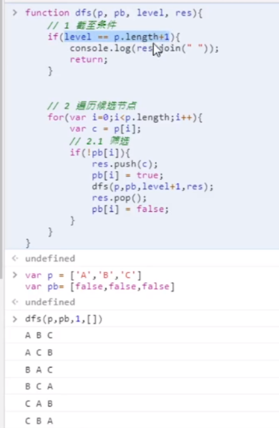

dfs深度遍历（递归），需要那些参数，p（候选节点）pb（标记候选节点）level（当前底几层）res（结果）

1，退出条件

2，遍历候选元素

3，筛选候选元素

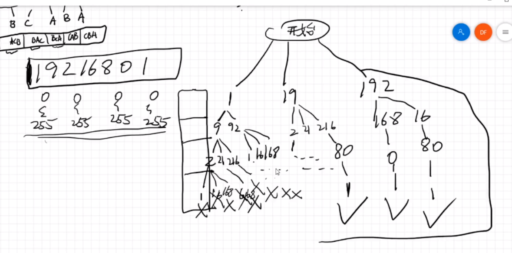

截止条件，每个坑位不能大于255，不能用0开头，不能超过四个坑位

候选条件，从o开始，我们可以选一个，可以选两个，选三个，候选人是1（一位） 19（2位） 192（三位）

用index表示当前遍历的位置

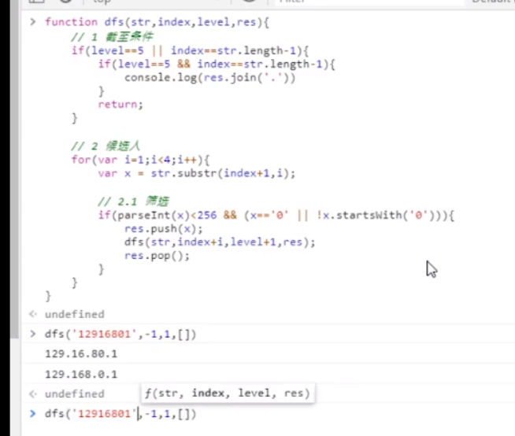

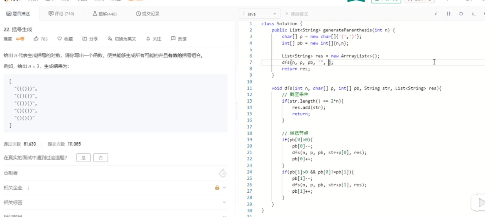

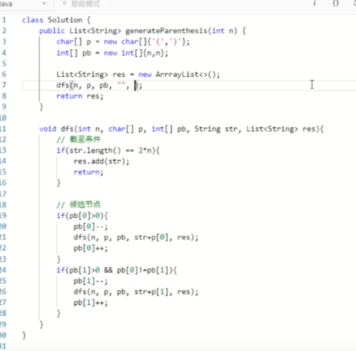

候选节点是三个）和三个（，不能重复，所以用count来表示，第一层只能选（或者），一共就是把这三个（或者三个）用完为止，有效的情况就是，（）数量相等的情况下，不能再加一个）。也就是加了之后，）的数量不能大于（。count值刚好能表明（和）的数量相不相等。

不重复的全排列， 112三个的不重复全排列，就用count表明还有几个1能用，几个2能用

二叉树从根节点到叶子节点和为target的题目，

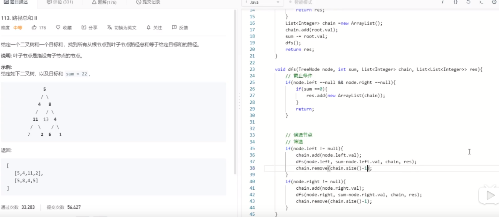

回溯套路

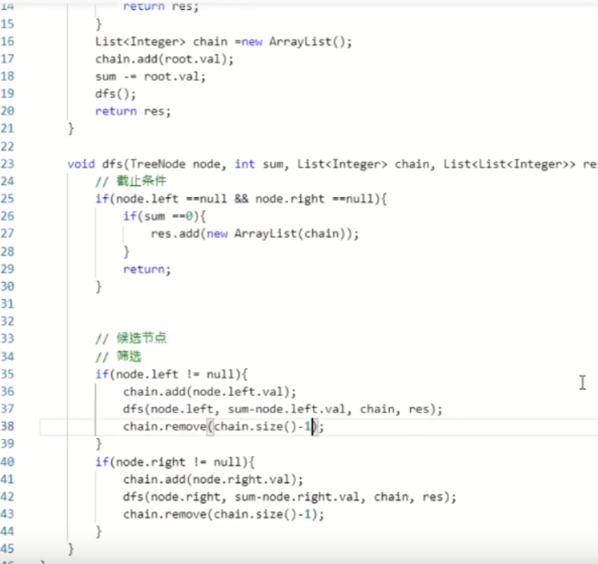

我做的是简单版本的，如果找到一条和为target的路径，那么就是成功。

这个是要把所有路径存起来，当前选了左节点，dfs之后，要把已选的列表pop出去。

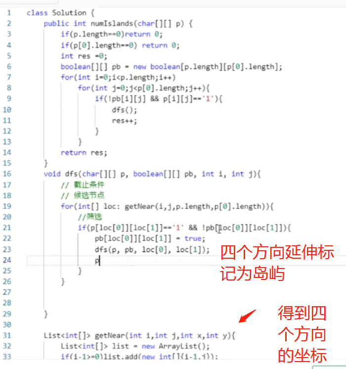

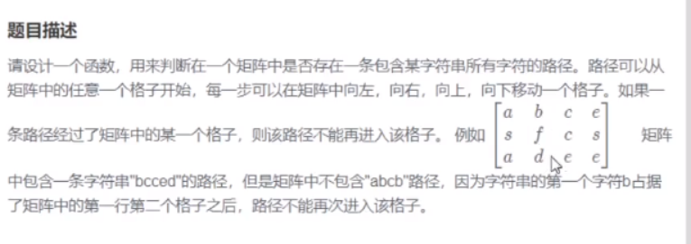

二位矩阵中的存不存在对应的路径配

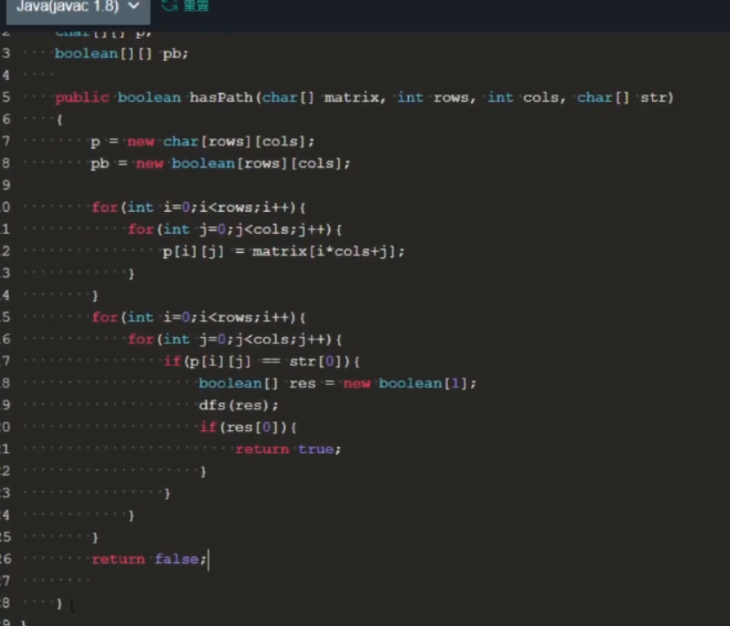

这一步和上面一提相同，每个节点都可能进去dfs，条件是该节点等于字符串的第一个元素

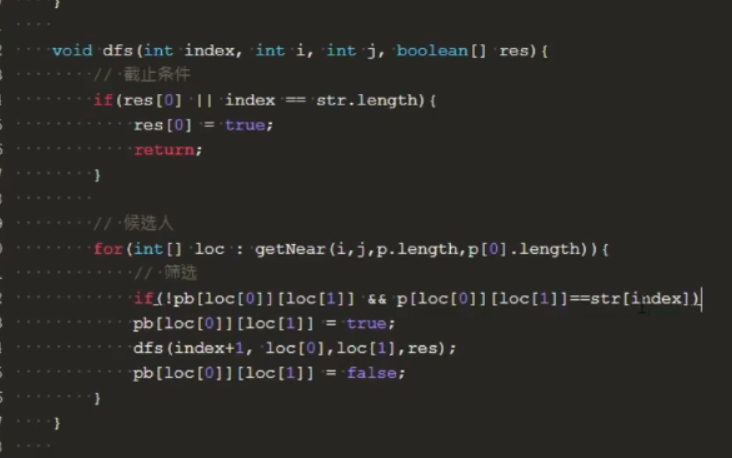

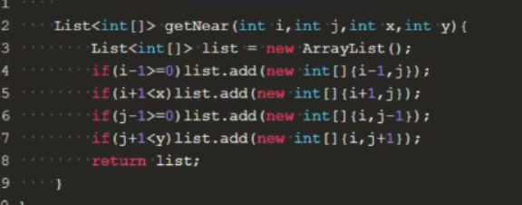

所有的位置都是第一次dfs的候选节点，然后就是再深一层，就是可以有上下左右四个方向的候选节点，继续dfs

----

## 动态规划

动态规划没有公式可以套，只能说要把dp想好，dp的转换公式想明白

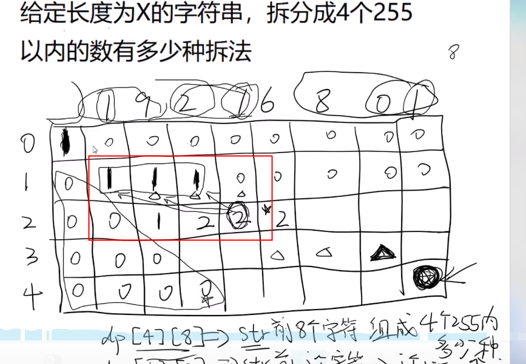

dp是一维还是二维，要看有几个维度的变化

---

之后要把二叉树后序遍历非递归的算法研究下