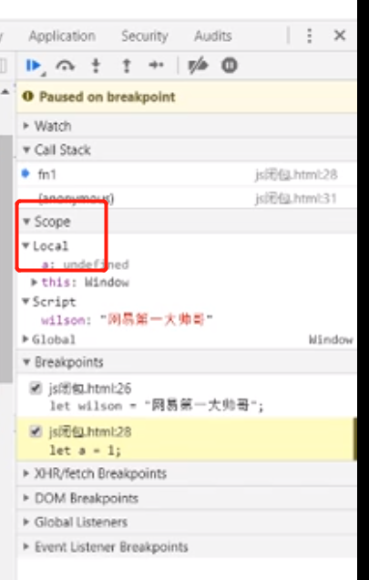
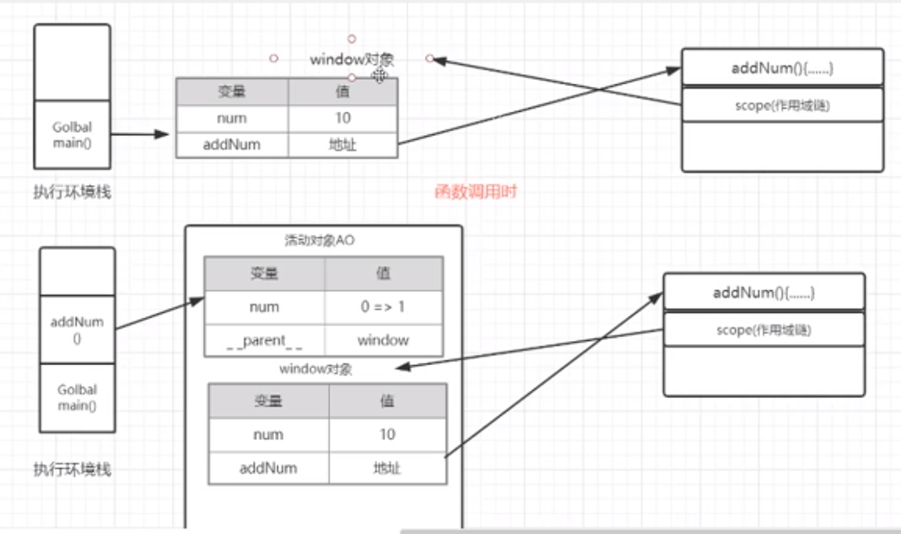
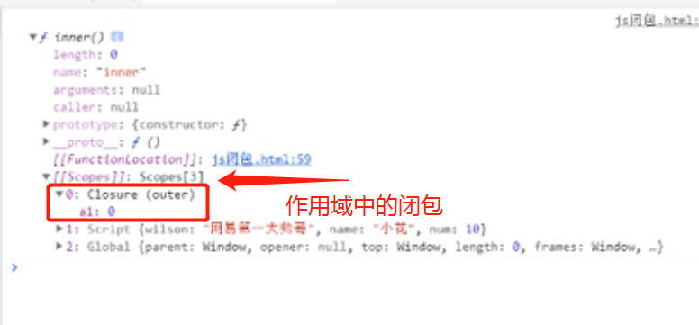
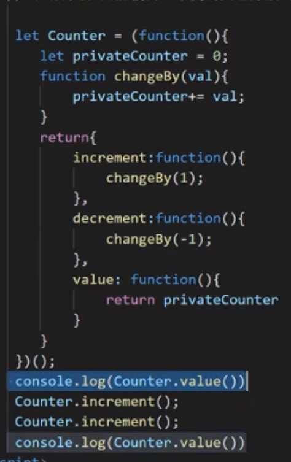

# js闭包

# js的闭包

 面试题，也许问的不是要一个问题的答案，而是说出面试官心里的答案。因为面试官觉得他心里的答案是最好的，最底层的。所以回答问题需要往这方面靠。面试官想让我回答什么底层知识

1，作用域与作用域链

2，闭包的构成及应用场景

3，闭包性能考量

如果面试官问这个闭包，直接把这三方面一起说出来

scope作用域

local局部 作用域，当前作用域

active object（AO）

v8引擎解析js原理

当函数用完了，函数出栈了，连同这个函数的活动对象一起被销毁了，失去引用，被垃圾回收机制回收了

闭包中的变量被引用了，所以没有随着活动对象被释放

#### 闭包应用

允许函数和其相关的某些数据或者操作关联起来

闭包这里没将清除，得好好再补充下

防抖节流，工厂函数，用闭包模拟私有方法

运用闭包的原理，根据闭包的特性，做实际的应用

而不是罗列应用功能

（多做一些题目）

在js中，只能用闭包模拟私有变量

真的是令人迷惑，把错的答案，将好，很多，害的我一直看下去，怀疑人生了

没有，我的闭包理解没有问题

今天学习有所收货

---

