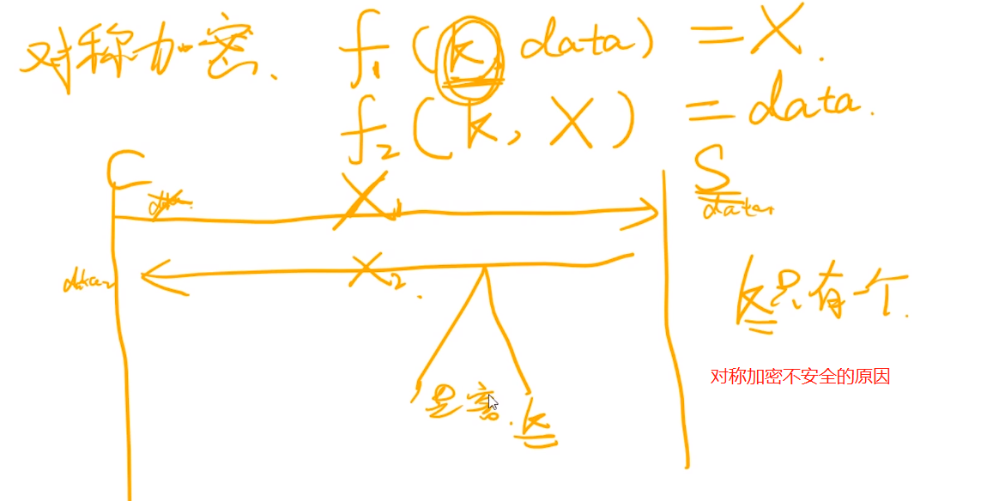
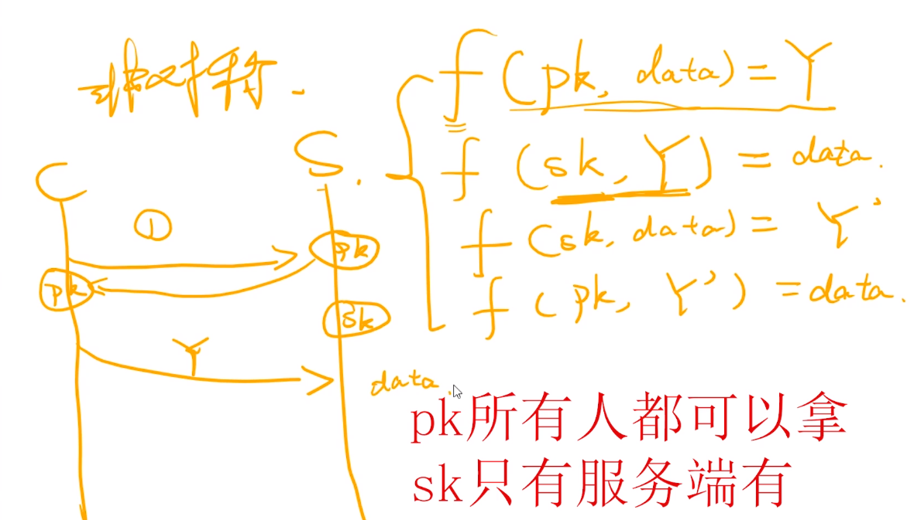
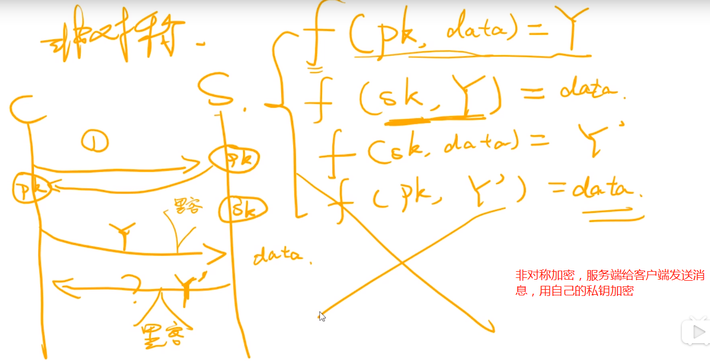
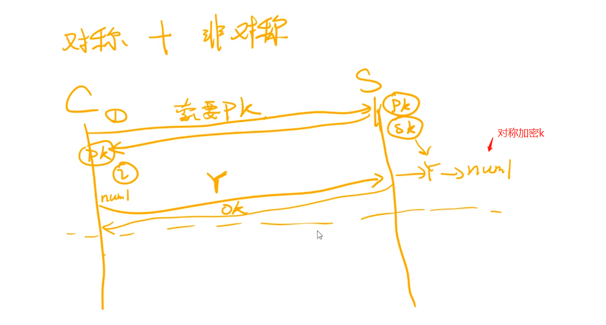
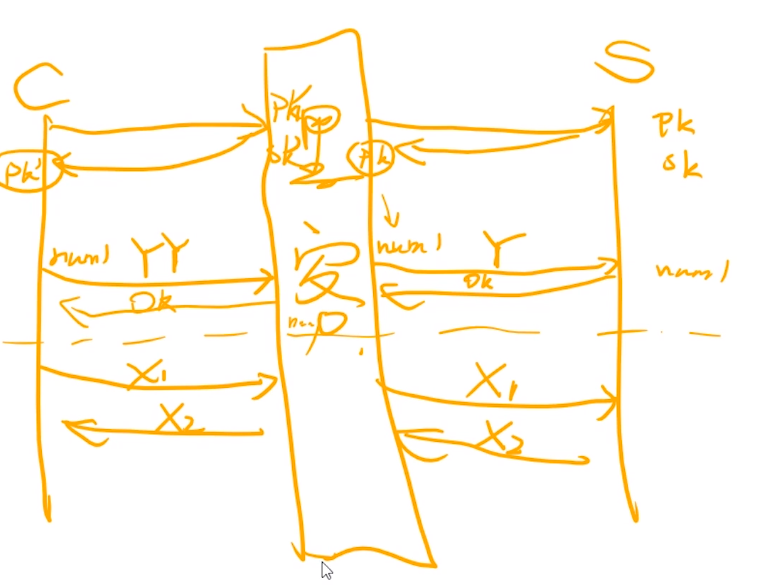
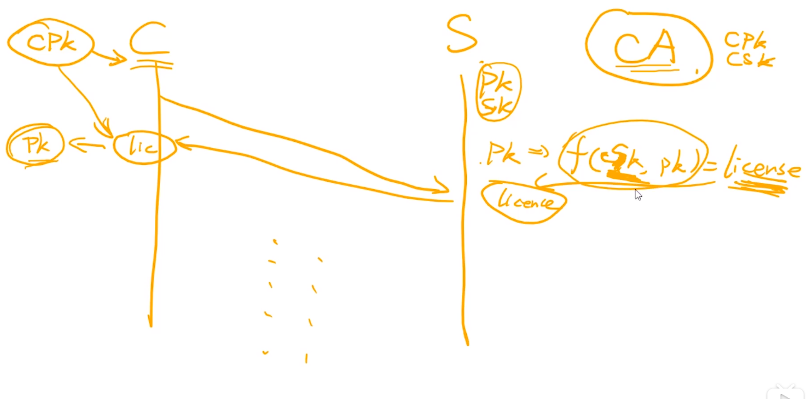
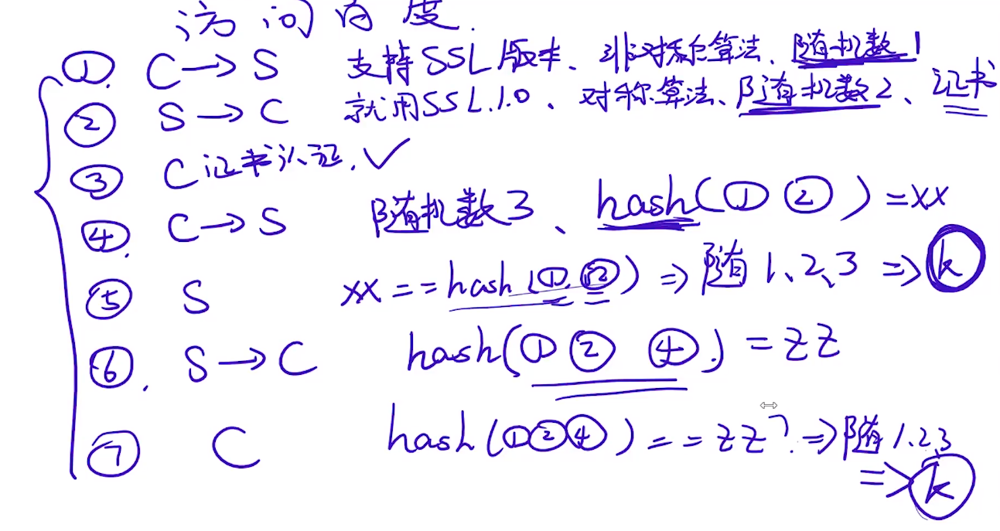

大家都是使用同一个k，那么就等于没有加密，不可能每个用户一个k

服务端无法给客户端发送消息，不能用公钥加密，客户端没有私钥

非对称加密，如果每个用户都有一个k，那么是安全的

对称加密，只能客户端给服务端发送消息是安全的

让客户端用对称加密的算法发送对称加密的k，这个k是客户端随机生成的，保证了每个客户不一样

最大问题：中间人问题

操作系统中写死了大量的ca机构的公钥

第二种情况，ca颁发证书

协商的过程是怎么样的

‘把随机数字搞清楚，底层深挖清楚

现在至少知道为啥用对称加密+非对称加密能保证安全性

"不管是客户端还是服务器，都需要随机数，这样生成的密钥才不会每次都一样。由于SSL协议中证书是静态的，因此十分有必要引入一种随机因素来保证协商出来的密钥的随机性。

pre master的存在在于SSL协议不信任每个主机都能产生完全随机的随机数，如果随机数不随机，那么pre master secret就有可能被猜出来，那么仅适用pre master secret作为密钥就不合适了，因此必须引入新的随机因素，那么客户端和服务器加上pre master secret三个随机数一同生成的密钥就不容易被猜出了，一个伪随机可能完全不随机，可是是三个伪随机就十分接近随机了，每增加一个自由度，随机性增加的可不是一。"

使用三个随机数，是为了对称加密中的k，不容易被猜出来，不重复

---

（1）生成对话密钥一共需要三个随机数。

（2）握手之后的对话使用"对话密钥"加密（对称加密），服务器的公钥和私钥只用于加密和解密"对话密钥"（非对称加密），无其他作用。

（3）服务器公钥放在服务器的数字证书之中。

第一步，爱丽丝给出协议版本号、一个客户端生成的随机数（Client random），以及客户端支持的加密方法。

第二步，鲍勃确认双方使用的加密方法，并给出数字证书、以及一个服务器生成的随机数（Server random）。

第三步，爱丽丝确认数字证书有效，然后生成一个新的随机数（Premaster secret），并使用数字证书中的公钥，加密这个随机数，发给鲍勃。

第四步，鲍勃使用自己的私钥，获取爱丽丝发来的随机数（即Premaster secret）。

第五步，爱丽丝和鲍勃根据约定的加密方法，使用前面的三个随机数，生成"对话密钥"（session key），用来加密接下来的整个对话过程。

ca的私钥对服务器公钥加密成证书，

---

上面三个随机数，有两个能被中间人拿到

整个握手阶段都不加密（也没法加密），都是明文的。因此，如果有人窃听通信，他可以知道双方选择的加密方法，以及三个随机数中的两个。整个通话的安全，只取决于第三个随机数（Premaster secret）能不能被破解。

虽然理论上，只要服务器的公钥足够长（比如2048位），那么Premaster secret可以保证不被破解。但是为了足够安全，我们可以考虑把握手阶段的算法从默认的[RSA算法](http://www.ruanyifeng.com/blog/2013/06/rsa_algorithm_part_one.html)，改为 [Diffie-Hellman算法](http://zh.wikipedia.org/wiki/迪菲－赫尔曼密钥交换)（简称DH算法）。

采用DH算法后，Premaster secret不需要传递，双方只要交换各自的参数，就可以算出这个随机数。

上图中，第三步和第四步由传递Premaster secret变成了传递DH算法所需的参数，然后双方各自算出Premaster secret。这样就提高了安全性

session ID的思想很简单，就是每一次对话都有一个编号（session ID）。如果对话中断，下次重连的时候，只要客户端给出这个编号，且服务器有这个编号的记录，双方就可以重新使用已有的"对话密钥"，而不必重新生成一把。

----

