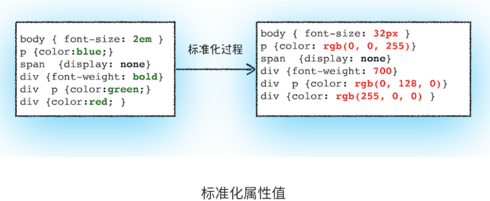
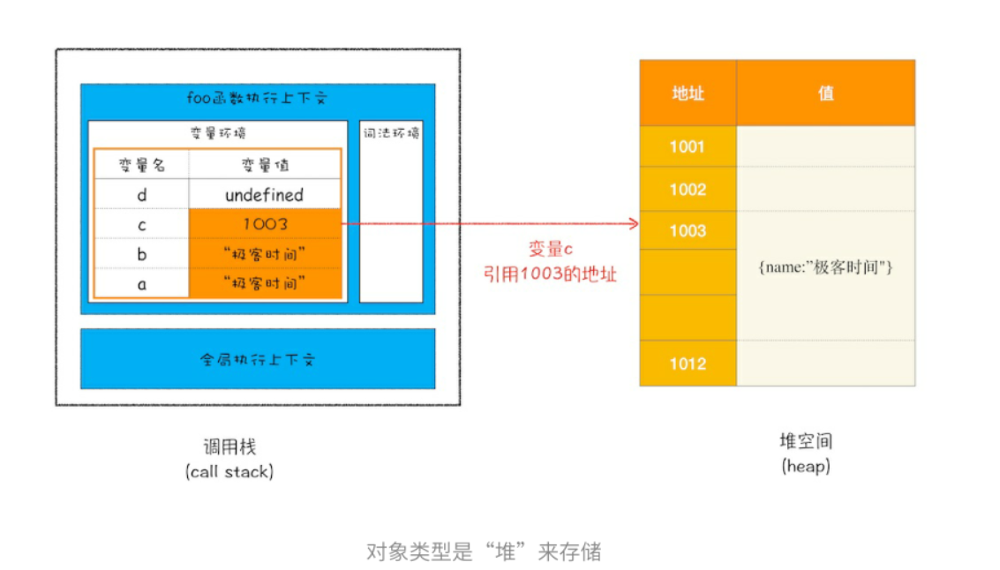
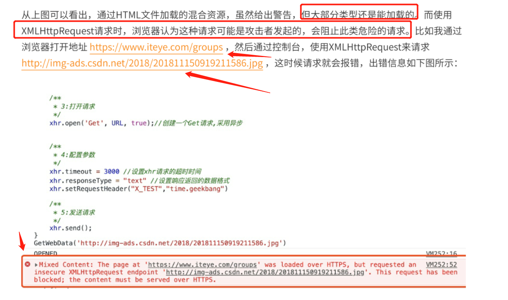
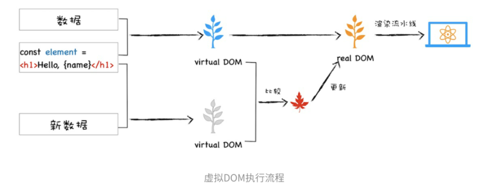
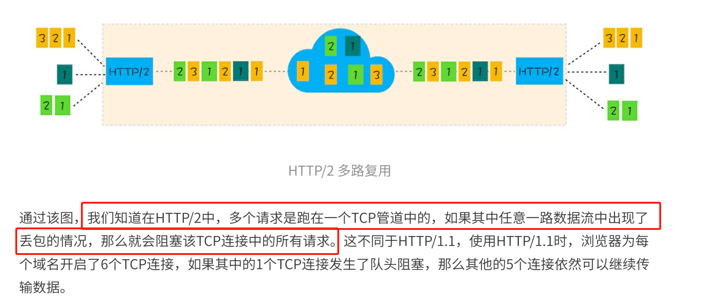
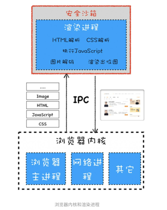

# 浏览器工作原理与实践

## 宏观视角下的浏览器 (6讲)

### 01 | Chrome架构：仅仅打开了1个页面，为什么有4个进程？

进程和线程之间的关系

1. **进程中的任意⼀线程执⾏出错，都会导致整个进程的崩溃**。
2. 线程之间共享进程中的数据
3. **当⼀个进程关闭之后，操作系统会回收进程所占⽤的内存**
4. 进程之间的内容相互隔离

单进程浏览器是指浏览器的
所有功能模块都是运⾏在同⼀个进程⾥

不稳定，不流畅，不稳定


早期chrome架构，红框解释沙箱

（为什么渲染进程需要放在沙箱中，让页面和系统隔离，

（核心就是，把一些数据存储交互网络的操作全部放到浏览器内核中，防止渲染进程有漏洞，攻击我们的系统

（浏览器内核就是浏览器主进程

目前架构

- 浏览器进程。主要负责界⾯显⽰、⽤⼾交互、⼦进程管理，同时提供存储等功能。
  渲染进程。核⼼任务是将 HTML、CSS 和 JavaScript 转换为⽤⼾可以与之交互的⽹⻚，排版引擎Blink和
  JavaScript引擎V8都是运⾏在该进程中，默认情况下，Chrome会为每个Tab标签创建⼀个渲染进程。出
  于安全考虑，渲染进程都是运⾏在沙箱模式下。
- GPU进程。其实，Chrome刚开始发布的时候是没有GPU进程的。⽽GPU的使⽤初衷是为了实现3D CSS的
  效果，只是随后⽹⻚、Chrome的UI界⾯都选择采⽤GPU来绘制，这使得GPU成为浏览器普遍的需求。最
  后，Chrome在其多进程架构上也引⼊了GPU进程。
- ⽹络进程。主要负责⻚⾯的⽹络资源加载，之前是作为⼀个模块运⾏在浏览器进程⾥⾯的，直⾄最近才独
  ⽴出来，成为⼀个单独的进程。
- 插件进程。主要是负责插件的运⾏，因插件易崩溃，所以需要通过插件进程来隔离，以保证插件进程崩溃
  不会对浏览器和⻚⾯造成影响

多进程架构的问题

- 更⾼的资源占⽤。因为每个进程都会包含公共基础结构的副本（如JavaScript运⾏环境），这就意味着浏
  览器会消耗更多的内存资源。
- 更复杂的体系架构。浏览器各模块之间耦合性⾼、扩展性差等问题，会导致现在的架构已经很难适应新的
  需求了

未来⾯向服务的架构
为了解决这些问题，在2016年，Chrome官⽅团队使⽤“**⾯向服务的架构”（Services Oriented**
**Architecture，简称SOA）**的思想设计了新的Chrome架构。也就是说 Chrome 整体架构会朝向现代操作系
统所采⽤的“⾯向服务的架构” ⽅向发展，原来的各种模块会被重构成独⽴的服务（Service），每个服务
（Service）都可以在独⽴的进程中运⾏，访问服务（Service）必须使⽤定义好的接⼝，通过IPC来通信，
从⽽构建⼀个更内聚、松耦合、易于维护和扩展的系统，更好实现 Chrome 简单、稳定、⾼速、安全的⽬
标。如果你对⾯向服务的架构感兴趣，你可以去⽹上搜索下资料，这⾥就不过多介绍了。
Chrome最终要把UI、数据库、⽂件、设备、⽹络等模块重构为基础服务，类似操作系统底层服务，下⾯是
Chrome“⾯向服务的架构”的进程模型图：


###　TCP协议：如何保证页面文件能被完整送达浏览器？

每学两节休息一下

从数据包的角度，如何保证页面文件能被完整送达浏览器

**数据包如何送达主机**

**主机如何将数据包转交给应⽤**

**数据是如何被完整地送达应⽤程序**

这三个⻆度来为你讲述数据的传输过程

1. IP：把数据包送达⽬的主机

   计算机的地址就称为IP地址，访问任何⽹站实际上只是你的计算机向另外⼀台计算机请求信息

   2. UDP：把数据包送达应⽤程序
   IP是⾮常底层的协议，只负责把数据包传送到对⽅电脑，但是对⽅电脑并不知道把数据包交给哪个程序，是交给浏览器还是交给王者荣耀？因此，需要基于IP之上开发能和应⽤打交道的协议，最常⻅的是“⽤⼾数据包协议（User Datagram Protocol）”，简称UDP。
   UDP中⼀个最重要的信息是端⼝号，端⼝号其实就是⼀个数字，每个想访问⽹络的程序都需要绑定⼀个端⼝号。通过端⼝号UDP就能把指定的数据包发送给指定的程序了，所以IP通过IP地址信息把数据包发送给指定的电脑，⽽**UDP通过端⼝号把数据包分发给正确的程序**。和IP头⼀样，端⼝号会被装进UDP头⾥⾯，UDP头再和原始数据包合并组成新的UDP数据包。UDP头中除了⽬的端⼝，还有源端⼝号等信息

   >在使⽤UDP发送数据时，有各种因素会导致数据包出错，虽然UDP可以校验数据是否正确，但是对于错误的数据包，**UDP并不提供重发机制，只是丢弃当前的包**，⽽且UDP在发送之后也⽆法知道是否能达到⽬的地。**虽说UDP不能保证数据可靠性，但是传输速度却⾮常快**，所以UDP会应⽤在⼀些关注速度、但不那么严格要求数据完整性的领域，如在线视频、互动游戏等。

   3. TCP：把数据完整地送达应⽤程序TCP（Transmission Control Protocol，传输控制协议）是⼀种⾯向
       连接的、可靠的、基于字节流的传输层通信协议

     对于数据包丢失的情况，TCP提供重传机制；
     TCP引⼊了数据包排序机制，⽤来保证把乱序的数据包组合成⼀个完整的⽂件。

     和UDP头⼀样，TCP头除了包含了⽬标端⼝和本机端⼝号外，还提供了⽤于排序的序列号，以便接收端通过序号来重排数据包

     它的连接可分为三个阶段：建⽴连接、传输数据和断开连接

     

     接收端需要对每个数据包进⾏确认操作，也就是接收端在接收到数据包
     之后，需要发送确认数据包给发送端。所以当发送端发送了⼀个数据包之后，在规定时间内没有接收到接
     收端反馈的确认消息，则判断为数据包丢失，并触发发送端的重发机制

     HTTP协议和TCP协议都是TCP/IP协议簇的⼦集。
     HTTP协议属于应⽤层，TCP协议属于传输层，HTTP协议位于TCP协议的上层
   
   

###  HTTP请求流程：为什么很多站点第二次打开速度会很快？

1. 构建请求
⾸先，浏览器构建请求⾏信息（如下所⽰），构建好后，浏览器准备发起⽹络请求。
2. 查找缓存
**在真正发起⽹络请求之前，浏览器会先在浏览器缓存中查询是否有要请求的⽂件。**其中，浏览器缓存是⼀种
在本地保存资源副本，以供下次请求时直接使⽤的技术。
3. 准备IP地址和端⼝


负责把域名和IP地址做⼀⼀映射关系。这套域名映射为IP的系统就叫做“域名系统”，简称DNS（Domain Name System）。
所以，这样⼀路推导下来，**你会发现在第⼀步浏览器会请求DNS返回域名对应的IP**。**当然浏览器还提供了**
**DNS数据缓存服务**，如果某个域名已经解析过了，那么浏览器会缓存解析的结果，以供下次查询时直接使
⽤，这样也会减少⼀次⽹络请求。
拿到IP之后，接下来就需要获取端⼝号了。通常情况下，如果URL没有特别指明端⼝号，那么HTTP协议默
认是80端⼝

4. 等待TCP队列

   现在已经把端⼝和IP地址都准备好了，那么下⼀步是不是可以建⽴TCP连接了呢？
   答案依然是“不⾏”。**Chrome有个机制，同⼀个域名同时最多只能建⽴6个TCP连接**，如果在同⼀个域名下
   HTTP⽹络请求的第⼀步是做什么呢？结合上图看，是和服务器建⽴TCP连接。
   那建⽴连接的信息都有了吗？上⼀篇⽂章中，我们讲到建⽴TCP连接的第⼀步就是需要准备IP地址和端⼝
   号。
   那怎么获取IP地址和端⼝号呢？这得看看我们现在有什么，我们有⼀个URL地址，那么是否可以利⽤URL
   地址来获取IP和端⼝信息呢？
   同时有10个请求发⽣，那么其中4个请求会进⼊排队等待状态，直⾄进⾏中的请求完成。
   当然，如果当前请求数量少于6，会直接进⼊下⼀步，建⽴TCP连接。

5. 建⽴TCP连接

6. 发送HTTP请求

   在浏览器发送请求⾏命令之后，还要以请求头形式发送其他⼀些信息，把浏览器的⼀些基础信息告诉服务
   器。⽐如包含了浏览器所使⽤的操作系统、浏览器内核等信息，以及当前请求的域名信息、浏览器端的
   Cookie信息，等等

服务器端处理HTTP请求流程

随后，正如浏览器会随同请求发送请求头⼀样，服务器也会随同响应向浏览器发送响应头。响应头包含了服
务器⾃⾝的⼀些信息，⽐如服务器⽣成返回数据的时间、返回的数据类型（JSON、HTML、流媒体等类
型），以及服务器要在客⼾端保存的Cookie等信息

2. 断开连接
通常情况下，⼀旦服务器向客⼾端返回了请求数据，它就要关闭 TCP 连接。不过如果浏览器或者服务器在
其头信息中加⼊了：`Connection:Keep-Alive `
那么TCP连接在发送后将仍然保持打开状态，这样浏览器就可以继续通过同⼀个TCP连接发送请求。⽐如，⼀个Web⻚⾯中内嵌的图⽚就都来⾃**同⼀个Web站点，**如果初始化了⼀个持久连接，你就可以复⽤该连接，以请求其他资源，⽽不需要
重新再建⽴新的TCP连接。
3. 重定向
到这⾥似乎请求流程快结束了，不过还有⼀种情况你需要了解下，⽐如当你在浏览器中打开geekbang.org
后，你会发现最终打开的⻚⾯地址是 https://www.geekbang.org。
这两个URL之所以不⼀样，是因为涉及到了⼀个重定向操作。
从图中你可以看到，响应⾏返回的状态码是301，状态301就是告诉浏览器，我需要重定向到另外⼀个⽹
址，**⽽需要重定向的⽹址正是包含在响应头的Location字段中**，接下来，浏览器获取Location字段中的地
址，并使⽤该地址重新导航，这就是⼀个完整重定向的执⾏流程。

(dns缓存浏览器资源缓存)

当服务器返回HTTP响应头给浏览器时，浏览器是通过**响应头中的Cache-Control字段**来设置是否缓存该资源

这也就意味着，在该缓存资源还未过期的情况下, 如果再次请求该资源，会直接返回缓存中的资源给浏览
器。Cache-Control:Max-age=2000**但如果缓存过期了**（如何判断是否过期），浏览器则会继续发起⽹络请求，并且在HTTP请求头中带上：If-None-Match:"4f80f-13c-3a1xb12a"
服务器收到请求头后，会根据If-None-Match的值来判断请求的资源是否有更新。

（解释： 如果服务器设置这个请求缓存策略是max-age，浏览器根据这个字段的值判断上次请求的资源是否超过这个时间，如果超过则再次请求，并带上字段If-None-Match:"4f80f-13c-3a1xb12a",让服务器根据这个值判断资源是否更新）

（持久化登录）

如果正确的话，会⽣成⼀段表⽰⽤⼾⾝份的字符串，并把该字符串写到响应头的Set-Cookie字段⾥，如下所⽰，然后把响应头发送给浏览器。Set-Cookie: UID=3431uad;

浏览器在接收到服务器的响应头后，开始解析响应头，如果遇到响应头⾥含有Set-Cookie字段的情况，浏
览器就会把这个字段信息保存到本地。⽐如把UID=3431uad保持到本地。
当⽤⼾再次访问时，浏览器会发起HTTP请求，但在发起请求之前，浏览器会读取之前保存的Cookie数
据，并把数据写进请求头⾥的Cookie字段⾥（如下所⽰），然后浏览器再将请求头发送给服务器


从关键的几个问题，角度思考问题，最终要做什么和现在有什么一步步分析。学透所有知识，能帮助我们站在一个更高的维度思考问题，学习知识

###  

###　04 | 导航流程：从输入URL到页面展示，这中间发生了什么？


整个过程需要各个进程之间的配合

- 浏览器进程主要负责**⽤⼾交互**、**⼦进程管理和⽂件储存**等功能。
- ⽹络进程是⾯向渲染进程和浏览器进程等提供⽹络下载功能。
- 渲染进程的主要职责是把从⽹络下载的HTML、JavaScript、CSS、图⽚等资源解析为可以显⽰和交互的
  ⻚⾯。因为渲染进程所有的内容都是通过⽹络获取的，会存在⼀些恶意代码利⽤浏览器漏洞对系统进⾏攻
  击，所以运⾏在渲染进程⾥⾯的代码是不被信任的。这也是为什么Chrome会让渲染进程运⾏在安全沙箱
  ⾥，就是为了保证系统的安全。

- ⾸先，⽤⼾从浏览器进程⾥输⼊请求信息；

- 然后，⽹络进程发起URL请求；

- 服务器响应URL请求之后，浏览器进程就⼜要开始准备渲染进程了；

- 渲染进程准备好之后，需要先向渲染进程提交⻚⾯数据，我们称之为提交⽂档阶段；

- 渲染进程接收完⽂档信息之后，便开始解析⻚⾯和加载⼦资源，完成⻚⾯的渲染。

  这其中，⽤⼾发出URL请求到⻚⾯开始解析的这个过程，就叫做导航

回答这道面试题

1. ⽤⼾输⼊
    当⽤⼾在地址栏中输⼊⼀个查询关键字时，**地址栏会判断输⼊的关键字是搜索内容，还是请求的URL**。
    当⽤⼾输⼊关键字并键⼊回⻋之后，浏览器便进⼊下图的状态：
    开始加载URL浏览器状态

  - 如果是搜索内容，**地址栏会使⽤浏览器默认的搜索引擎，来合成新的带搜索关键字的URL**。

  - 如果判断输⼊内容符合URL规则，⽐如输⼊的是 time.geekbang.org，那么地址栏会**根据规则，把这段内**
    **容加上协议，合成为完整的URL**，如 https://time.geekbang.org

2. URL请求过程
       接下来，便进⼊了⻚⾯资源请求过程。这时，浏览器进程会通过**进程间通信（IPC）把URL请求发送⾄⽹络进程**，⽹络进程接收到URL请求后，会在这⾥发起真正的URL请求流程。那具体流程是怎样的呢？
       ⾸先，**⽹络进程会查找本地缓存是否缓存了该资源。如果有缓存资源，那么直接返回资源给浏览器进程**；如果在缓存中没有查找到资源，那么直接进⼊⽹络请求流程。这请求前的**第⼀步是要进⾏DNS解析**，以获取请
       求域名的服务器IP地址。如果请求协议是HTTPS，**那么还需要建⽴TLS连接**。接下来就是利**⽤IP地址和服务器建⽴TCP连接**。连接建⽴之后，**浏览器端会构建请求⾏、请求头等信息，并把和该域名相关的Cookie等数据附加到请求头中，然后向服务器发送构建的请求信息**。服务器接收到请求信息后，会根据请求信息⽣成响应数据（包括响应⾏、响应头和响应体等信息），并发给**⽹络进程。等⽹络进程接收了响应⾏和响应头之后，就开始解析响应头的内容了**。（为了⽅便讲述，下⾯我将服务器返回的响应头和响应⾏统称为响应头。）
   
   ​	这里讲的不详细，并没有说tls连接是在tcp之前还是之后，我缺一个详细的http请求流程，以及后续，拿到html如何渲染。加上这些才是真正完整的一个

  （1）重定向
  在接收到服务器返回的响应头后，⽹络进程开始解析响应头，如果发

（2）响应数据类型处理

Content-Type是HTTP头中⼀个⾮常重要的字段， 它告诉浏览器服务器返回的响应
体数据是什么类型，然后浏览器会根据Content-Type的值来决定如何显⽰响应体的内容

从返回的响应头信息来看，其C**ontent-Type的值是application/octet-stream，显⽰数据是字节流类型**的，
通常情况下，浏览器会按照下载类型来处理该请求不同Content-Type的后续处理流程也截然不同。如果Content-Type字段的值**被浏览器判断为下载类型，那么该请求会被提交给浏览器的下载管理器，同时该URL请求的导航流程就此结束**。但如果是HTML，那么浏览器则会继续进⾏导航流程。由于Chrome的⻚⾯渲染是运⾏在渲染进程中的，所以接下来就需要准备渲染进程了

3. 准备渲染进程
默认情况下，Chrome会为每个⻚⾯分配⼀个渲染进程，也就是说，每打开⼀个新⻚⾯就会配套创建⼀个新
的渲染进程。但是，也有⼀些例外，在某些情况下，浏览器会让多个⻚⾯直接运⾏在同⼀个渲染进程中

那什么情况下多个⻚⾯会同时运⾏在⼀个渲染进程中呢？
要解决这个问题，我们就需要先了解下什么是**同⼀站点**（same-site）。具体地讲，我们将“同⼀站点”定
**义为根域名（例如，geekbang.org）加上协议（例如，https:// 或者http://），还包含了该根域名下的所有**
**⼦域名和不同的端⼝**，⽐如下⾯这三个：（协议加根域名相同）子域名和端口可以不一样

https://time.geekbang.org
https://www.geekbang.org
https://www.geekbang.org:8080

总结来说，打开⼀个新⻚⾯采⽤的渲染进程策略就是：

通常情况下，打开新的⻚⾯都会使⽤单独的渲染进程；
如果从A⻚⾯打开B⻚⾯，**且A和B都属于同⼀站点的话，**那么B⻚⾯复⽤A⻚⾯的渲染进程；如果是其他情
况，浏览器进程则会为B创建⼀个新的渲染进程

渲染进程准备好之后，还不能⽴即进⼊⽂档解析状态，因为此时的⽂档数据还在⽹络进程中，并没有提交给
渲染进程，所以下⼀步就进⼊了提交⽂档阶段。

4. 提交⽂档
    ⾸先要明确⼀点，这⾥的“⽂档”是指URL请求的响应体数据。
  - “提交⽂档”的消息是由浏览器进程发出的，渲染进程接收到“提交⽂档”的消息后，会和⽹络进程建⽴
    传输数据的“管道”。
  - 等⽂档数据传输完成之后，渲染进程会返回“确认提交”的消息给浏览器进程。
  - 浏览器进程在收到“确认提交”的消息后，**会更新浏览器界⾯状态，包括了安全状态、地址栏的URL、前**
    **进后退的历史状态，并更新Web⻚**⾯

结合⽼师的讲义，⾃⼰总结了下，不考虑⽤⼾输⼊搜索关键字的情况：
1，⽤⼾输⼊url并回⻋
2，浏览器进程检查url，组装协议，构成完整的url
3，浏览器进程通过进程间通信（IPC）把url请求发送给⽹络进程
4，⽹络进程接收到url请求后检查本地缓存是否缓存了该请求资源，如果有则将该资源返回给浏览器进程（这其中的缓存策略是什么？？？）
5，如果没有，⽹络进程向web服务器发起http请求（⽹络请求），请求流程如下：
5.1 进⾏DNS解析，获取服务器ip地址，端⼝（端⼝是通过dns解析获取的吗？这⾥有个疑问，没有端口就是默认80.有就直接那url中
5.2 利⽤ip地址和服务器建⽴tcp连接
5.3 构建请求头信息
5.4 发送请求头信息
5.5 服务器响应后，⽹络进程接收响应头和响应信息，并解析响应内容
6，⽹络进程解析响应流程；
6.1 检查状态码，如果是301/302，则需要重定向，从Location⾃动中读取地址，重新进⾏第4步
（301/302跳转也会读取本地缓存吗？这⾥有个疑问），如果是200，则继续处理请求。
6.2 200响应处理：
检查响应类型Content-Type，如果是字节流类型，则将该请求提交给下载管理器，该导航流程结束，不
再进⾏后续的渲染，如果是html则通知浏览器进程准备渲染进程准备进⾏渲染。
7，准备渲染进程
7.1 **浏览器进程检查当前url是否和之前打开的渲染进程根域名是否相同，如果相同，则复⽤原来的进程，**
**如果不同，则开启新的渲染进程**

8. 传输数据、更新状态
    8.1 渲染进程准备好后，浏览器向渲染进程发起“提交⽂档”的消息，渲染进程接收到消息和⽹络进程建
    ⽴传输数据的“管道”
    **8.2 渲染进程接收完数据后，向浏览器发送“确认提交”**
    **8.3 浏览器进程接收到确认消息后更新浏览器界⾯状态：安全、地址栏url、前进后退的历史状态、更新w**
    **eb⻚⾯。**


  #### 05 | 渲染流程（上）：HTML、CSS和JavaScript，是如何变成页面的？

#### 

按照渲染的时间顺序，流⽔线可分为如下⼏个⼦阶段：**构建DOM树、样式计算、布局阶段、分**
**层、绘制、分块、光栅化和合成**

构建DOM树
为什么要构建DOM树呢？这是因为浏览器⽆法直接理解和使⽤HTML，所以需要将HTML转换为
浏览器能够理解的结构——DOM树。

样式计算（Recalculate Style）
样式计算的⽬的是为了计算出DOM节点中每个元素的具体样式，这个阶段⼤体可分为三步来完
成。

1. 把CSS转换为浏览器能够理解的结构

浏览器也是⽆法直接理解这些纯⽂本的CSS样式，所以当渲染引擎接收到
CSS⽂本时，会执⾏⼀个转换操作，将CSS⽂本转换为浏览器可以理解的结构——
styleSheets

2. 转换样式表中的属性值，使其标准化
现在我们已经把现有的CSS⽂本转化为浏览器可以理解的结构了，那么接下来就要对其进⾏属性
值的标准化操作。需要将所有值转换为渲染引擎容易理解的、标准化的计算值



3. 计算出DOM树中每个节点的具体样式
    现在样式的属性已被标准化了，接下来就需要计算DOM树中每个节点的样式属性了，如何计算
    呢？
    这就涉及到CSS的继承规则和层叠规则了。
    ⾸先是CSS继承。CSS继承就是每个DOM节点都包含有⽗节点的样式。这么说可能有点抽象，
    我们可以结合具体例⼦，看下⾯这样⼀张样式表是如何应⽤到DOM节点上的。

  

  userAgent样式是浏览器默认样式，用户没写则用该样式

  布局阶段
  Chrome在布局阶段需要完成两个任务：创建布局树和布局计算。

  1. 创建布局树

    你可能注意到了DOM树还含有很多不可⻅的元素，⽐如head标签，还有使⽤了display:none属性
    的元素。所以在显⽰之前，我们还要额外地构建⼀棵**只包含可⻅元素布局树**。
    为了构建布局树，浏览器⼤体上完成了下⾯这些⼯作：**遍历DOM树中的所有可⻅节点，并把这些节点加到布局中；⽽不可⻅的节点会被布局树忽略掉，**。
  2. 布局计算

    现在我们有了⼀棵完整的布局树。那么接下来，就要计算**布局树节点的坐标位置**了。布局的计算
    过程⾮常复杂，我们这⾥先跳过不讲，等到后⾯章节中我再做详细的介绍。

  **问题：如果下载CSS⽂件阻塞了，会阻塞DOM树的合成吗？会阻塞⻚⾯的显**
  **⽰吗？**

  关于下载css⽂件阻塞的问题，我理解 
  1 **不会阻塞dom树的构建**，原因Html转化为dom树的过程，发现⽂件请求会交给⽹络进程去请
  求对应⽂件，渲染进程继续解析Html。 
  2 会阻塞⻚⾯的显⽰，**当计算样式的时候需要等待css⽂件的资源进⾏层叠样式**。资源阻塞
  了，会进⾏等待，直到⽹络超时，network直接报出相应错误，渲染进程继续层叠样式计算 

  1. css加载不会阻塞DOM树的解析
  2. css加载会阻塞DOM树的渲染
  3. css加载会阻塞后面js语句的执行
  4. `JS` 阻塞 `DOM` 解析，但浏览器会"偷看"`DOM`，预先下载相关资源。
  5. 浏览器遇到 ``且没有`defer`或`async`属性的 标签时，会触发页面渲染，因而如果前面`CSS`资源尚未加载完毕时，浏览器会等待它加载完毕在执行脚本。

  js会阻塞dom的解析和页面渲染，因为js代码中可能会操作dom

  ### 06 | 渲染流程（下）：HTML、CSS和JavaScript，是如何变成页面的？

  

  **并不是布局树的每个节点都包含⼀个图层，如果⼀个节点没有对应的层，那么这个节点就从属**
  **于⽗节点的图层**
  第⼀点，拥有层叠上下⽂属性的元素会被提升为单独的⼀层。

  第⼆点，需要剪裁（clip）的地⽅也会被创建为图层。

  画好每个图层，再生成位图，变成图片

  

  

  “重排”“重绘”和“合成”

  （布局，分层，合成）

  (dom树css树，**对布局树进行分层，并生成分层树，为每个图层生成绘制列表**，提交给合成线程，合成线程将图层分成土块，在光栅化线程池中将土块转化为位图，然后浏览器进程接受完成信号，生成页面，显示到显示器)

  重排更新整个流水线，开销最大

  重绘

  如果修改了元素的背景颜⾊，那么布局阶段将不会被执⾏，因为并没有引起⼏何位置的变
  换，所以就直接进⼊了绘制阶段，然后执⾏之后的⼀系列⼦阶段，这个过程就叫重绘。相较于重排操作，重
  绘省去了布局和分层阶段，所以执⾏效率会⽐重排操作要⾼⼀些

  合成

  我们使⽤了CSS的transform来实现动画效果，这可以避开重排和重绘阶段，直接在⾮主线程上
  执⾏合成动画操作。这样的效率是最⾼的，因为是在⾮主线程上合成，并没有占⽤主线程的资源，另外也避
  开了布局和绘制两个⼦阶段，所以相对于重绘和重排，合成能⼤⼤提升绘制效率。

  思考：减少重绘重排

  减少重排重绘，相当于少了渲染进程的主线程和⾮主线程的很多计算和操作，能够加快web的展⽰。
  1 **触发repaint reflow的操作尽量放在⼀起**，⽐如改变dom⾼度和设置margin分开写，可能会出发两次重
  排
  2 通过虚拟dom层计算出操作总得差异，⼀起提交给浏览器。之前还⽤过createdocumentfragment来汇
  总append的dom,来**减少触发重排重绘次数**（vue中就是这么做的）

## 浏览器中的JavaScript执行机制 (5讲)

### 07 | 变量提升：JavaScript代码是按顺序执行的吗？

- js代码执⾏过程中，需要先做变量提升，⽽之所以需要实现变量提升，是因为JavaScript代码在
  **执⾏之前需要先编译**。
- 在**编译阶段，变量和函数会被存放到变量环境中**，**变量的默认值会被设置为undefined**；在代码执⾏阶
  段，**JavaScript引擎会从变量环境中去查找⾃定义的变量和函数。**
- 如果在编译阶段，存在两个相同的函数，那么最终存放在变量环境中的是最后定义的那个，这是因为后定
  义的会覆盖掉之前定义的


### 08 | 调用栈：为什么JavaScript代码会出现栈溢出？

- 每一个函数，JavaScript引擎会为其创建执⾏上下⽂，并把该执⾏上下⽂压⼊调⽤栈，然后JavaScript引擎开始执⾏函数代码。
- 如果在⼀个函数A中调⽤了另外⼀个函数B，那么JavaScript引擎会为B函数创建执⾏上下⽂，并将B函数的执⾏上下⽂压⼊栈顶。
- 当前函数执⾏完毕后，JavaScript引擎会将该函数的执⾏上下⽂弹出栈。
- 当分配的调⽤栈空间被占满时，会引发“堆栈溢出”问题。

### 09 | 块级作用域：var缺陷以及为什么要引入let和const？

- 部通过var声明的变量，在编译阶段全都被存放到变量环境⾥⾯了。
- 通过let声明的变量，**在编译阶段会被存放到词法环境（Lexical Environment）中**。
- **在函数的作⽤域内部，通过let声明的变量并没有被存放到词法环境中**

变量环境-词法环境-作用域

先编译，编译生成执行上下文和可执行变量，执行上下文包括变量环境和词法环境。

词法环境，就是定义好的词法意义上的调用栈，**查找变量，就是先顺着词法环境中的栈找，找不到，再到变量环境中找（词法环境的规则是不是，前面的代码不能调用后面的代码中定义的变量？**

（还是很不清楚

每个函数都有一个执行上下文，当这个函数执行完，这个执行上下文就会被弹出

- 函数内部通过var声明的变量，在编译阶段全都被存放到变量环境⾥⾯了。
- 通过let声明的变量，在编译阶段会被存放到词法环境（Lexical Environment）中。
- 在函数的作⽤域内部，通过let声明的变量并没有被存放到词法环境中

**这三句没看懂**

这几个点还是需要好好研究下

### 10 | 作用域链和闭包 ：代码中出现相同的变量，JavaScript引擎是如何选择的？

词法作⽤域
词法作⽤域就是指作⽤域是**由代码中函数声明的位置来决定的**，所以词法作⽤域是静态的作⽤域，通过它就
能够预测代码在执⾏过程中如何查找标识符。

（词法是函数声明位置来决定的，所以先查词法再查变量，let只会放在词法环境中，那问题来了，什么会放在词法作用域中？

let、const声明的变量，外部环境引用保存在词法环境组件中。
var和function声明的变量和保存在环境变量组件中。

作用域

决定了一段代码能够访问到那些数据，这些数据存放在词法环境对象内。

作用域链

当执行一个函数时，引擎会将函数的执行环境推入执行栈并生成作用域链。

作用域链的顶部永远是当前环境的词法环境对象，下一个词法环境对象来自于包含环境，下下个词法环境对象来自于包含环境的包含环境。作用域链的尾部是全局词法环境对象。

作用域链是一个链表的形式。当我们在一个函数内部调用某一个变量时，会从作用域链顶部开始查找。如果在当前执行环境内存在定义则返回，否则会在当前环境的词法环境组件中引用的外部环境引用中查找。然后重复前面的逻辑，直到找到全局词法环境对象（外部引用环境为null）如果仍然未找到会抛出异常。

（这些不懂，之后补充，如何查找一个变量，作用域链是什么，之后研究通透


需要把这个弄清楚了，之前学过现在忘记了

### 11 | this：从JavaScript执行上下文的视角讲清楚this

##　V8工作原理 (3讲)

###  栈空间和堆空间：数据是如何存储的？


其实JavaScript中的数据类型⼀种有8种


内存空间





###  垃圾回收：垃圾数据是如何自动回收的？

调⽤栈中的数据是如何回收的

所以说，当⼀个函数执⾏结束之后，JavaScript引擎会通过向下移动ESP来销毁该函数保存在栈中的执⾏上下⽂

堆中的数据是如何回收的

要回收堆中的垃圾数据，就需要⽤到JavaScript中的垃圾回收器了


垃圾回收器统一的执行流程


副垃圾回收器

新⽣代中⽤**Scavenge算法**来处理。所谓Scavenge算法，是把新⽣代空间对半划分为两个区域，⼀半是对象区域，⼀半是空闲区域 （垃圾处理还是在老生代里面）

新加⼊的对象都会存放到对象区域，当对象区域快被写满时，就需要执⾏⼀次垃圾清理操作

也正是因为新⽣区的空间不⼤，所以很容易被存活的对象装满整个区域。为了解决这个问题，JavaScript引擎采⽤了**对象晋升策略**，**也就是经过两次垃圾回收依然还存活的对象**，**会被移动到⽼⽣区中**

Cheney算法是一种采用复制的方式实现的垃圾回收算法。它将堆内存一分为二，每一部分空间称为semispace。在这两个semispace空间中，只有一个处于使用中，另一个处于闲置状态。**处于使用状态的semispace空间称为From空间，处于闲置状态的空间称为To空间。**

当我们分配对象时，先是在From空间中进行分配。当开始进行垃圾回收时，会检查From空间中的存活对象，这些存活对象将被复制到To空间中，而(From空间内的)非存活对象占用的空间将会被释放。完成复制后，From空间和To空间的角色发生对换(**即以前的From空间释放后变为To;To空间在复制存活的对象后,变为From空间**)。简而言之，在垃圾回收过程中，就是通过将存活对象在两个semispace空间之间进行复制。


**晋升条件:**
对象晋升的条件主要有两个，一个是对象是否经历过Scavenge回收，一个是To空间的内存占用比超过25%限制。

主垃圾回收器

主垃圾回收器主要负责⽼⽣区中的垃圾回收。除了新⽣区中晋升的对象，**⼀些⼤的对象会直接被分配到⽼⽣区**。因此⽼⽣区中的对象有两个特点，⼀个是对象占⽤空间⼤，另⼀个是对象存活时间⻓

主垃圾回收器是采⽤**标记-清除（Mark-Sweep）的算法**进⾏垃圾回收的

⾸先是标记过程阶段。标记阶段就是从⼀组根元素开始，递归遍历这组根元素，在这个遍历过程中，能到达的元素称为活动对象，没有到达的元素就可以判断为垃圾数据。

接下来就是垃圾的清除过程。它和副垃圾回收器的垃圾清除过程完全不同，你可以理解这个过程是清除掉红⾊标记数据的过程

上⾯的标记过程和清除过程就是标记-清除算法，不过对⼀块内存多次执⾏标记-清除算法后，会产⽣⼤量不连续的内存碎⽚。⽽碎⽚过多会导致⼤对象⽆法分配到⾜够的连续内存，于是⼜产⽣了另外⼀种算法⸺标记-整理（Mark-Compact），这个标记过程仍然与标记-清除算法⾥的是⼀样的，但后续步骤不是直接对可回收对象进⾏清理，⽽是让所有存活的对象都向⼀端移动，然后直接清理掉端边界以外的内存


全停顿
现在你知道了V8是使⽤副垃圾回收器和主垃圾回收器处理垃圾回收的，不过由于JavaScript是运⾏在主线程之上的，⼀旦执⾏垃圾回收算法，都需要将正在执⾏的JavaScript脚本暂停下来，待垃圾回收完毕后再恢复脚本执⾏。我们把这种⾏为叫做全停顿（Stop-The-World）


为了降低⽼⽣代的垃圾回收⽽造成的卡顿，V8将标记过程分为⼀个个的⼦标记过程，同时让垃圾回收标记和JavaScript应⽤逻辑交替进⾏，直到标记阶段完成，我们把这个算法称为**增量标记（IncrementalMarking）算法。**如下图所⽰：

思考题：你是如何判断JavaScript中内存泄漏的？可以结合⼀些你在⼯作中避免内存泄漏的⽅法

1. 如何判断内存泄漏的？⼀般是感官上的⻓时间运⾏⻚⾯卡顿，猜可能会有内存泄漏。通过DynaTrace（
IE）profiles等⼯具⼀段时间收集数据，观察对象的使⽤情况。然后判断是否存在内存泄漏。修改后验证
2. ⼯作中避免内存泄漏⽅法：确定不使⽤的临时变量置为null，当前es6普及场景下少使⽤闭包也是⼀种
⽅法

###  编译器和解释器：V8是如何执行一段JavaScript代码的？

编译器和解释器

编译型语⾔在程序执⾏之前，需要经过编译器的编译过程，并且编译之后会直接保留机器能读懂的⼆进制⽂
件，这样每次运⾏程序时，都可以直接运⾏该⼆进制⽂件，⽽不需要再次重新编译了。⽐如C/C++、GO等都是编译型语⾔。
⽽由解释型语⾔编写的程序，在每次运⾏时都需要通过解释器对程序进⾏动态解释和执⾏。⽐如Python、
JavaScript等都属于解释型语⾔


V8是如何执⾏⼀段JavaScript代码的


1. ⽣成抽象语法树（AST）和执⾏上下⽂

  将源代码转换为抽象语法树，并⽣成执⾏上下⽂，⽽执⾏上下⽂我们在前⾯的⽂章中已经介绍过很多了，主要是代码在执⾏过程中的环境信息

  AST是⾮常重要的⼀种数据结构，在很多项⽬中有着⼴泛的应⽤。其中最著名的⼀个项⽬是Babel。Babel是⼀个被⼴泛使⽤的代码转码器，可以将ES6代码转为ES5代码，这意味着你可以现在就⽤ES6编写程序，⽽不⽤担⼼现有环境是否⽀持ES6。Babel的⼯作原理就是先将ES6源码转换为AST，然后再将ES6语法的AST转换为ES5语法的AST，最后利⽤ES5的AST⽣成JavaScript源代码。除了Babel外，还有ESLint也使⽤AST。ESLint是⼀个⽤来检查JavaScript编写规范的插件，其检测流程也是需要将源码转换为AST，然后再利⽤AST来检查代码规范化的问题

第⼀阶段是分词（tokenize），⼜称为词法分析，其作⽤是将⼀⾏⾏的源码拆解成⼀个个token。所
谓token，指的是语法上不可能再分的、最⼩的单个字符或字符串。你可以参考下图来更好地理解什么
token


第⼆阶段是解析（parse），⼜称为语法分析，其作⽤是将上⼀步⽣成的token数据，根据语法规则转为
AST。如果源码符合语法规则，这⼀步就会顺利完成。但如果源码存在语法错误，这⼀步就会终⽌，并抛出
⼀个“语法错误”。这就是AST的⽣成过程，先分词，再解析。

2. ⽣成字节码

   字节码就是介于AST和机器码之间的⼀种代码。但是与特定类型的机器码⽆关，字节码需要通过解释器将其转换为机器码后才能执⾏。

   

3. 执⾏代码

   通常，如果有⼀段第⼀次执⾏的字节码，解释器Ignition会逐条解释执⾏。**在执⾏字节码的过程中，如果发**
   **现有热点代码（HotSpot），⽐如⼀段代码被重复执⾏多次，这种就称为热点代码**，那么后台的编译器
   **TurboFan就会把该段热点的字节码编译为⾼效的机器码**，然后当再次执⾏这段被优化的代码时，只需要执⾏编译后的机器码就可以了，这样就⼤⼤提升了代码的执⾏效率其实字节码配合解释器和编译器是最近⼀段时间很⽕的技术，⽐如Java和Python的虚拟机也都是基于这种技术实现的，我们把这种技术称为即时编译（JIT）。具体到V8，就是指解释器Ignition在解释执⾏字节码
   的同时，收集代码信息，当它发现某⼀部分代码变热了之后，TurboFan编译器便闪亮登场，把热点的字节码转换为机器码，并把转换后的机器码保存起来，以备下次使⽤。
   对于JavaScript⼯作引擎，除了V8使⽤了“字节码+JIT”技术之外，苹果的SquirrelFish Extreme和Mozilla
   的SpiderMonkey也都使⽤了该技术

   

   JavaScript的性能优化

   1. 提升单次脚本的执⾏速度，避免JavaScript的⻓任务霸占主线程，这样可以使得⻚⾯快速响应交互；
   2. 避免⼤的内联脚本，因为在解析HTML的过程中，解析和编译也会占⽤主线程；
   3. 减少JavaScript⽂件的容量，因为更⼩的⽂件会提升下载速度，并且占⽤更低的内存

   思考题：你是怎么理解“V8执⾏时间越久，执⾏效率越⾼”这个性质的？

   **V8执⾏时间越久，越容易发现热点代码，执⾏转换为机器码的代码，⾃然执⾏效率会越⾼**

## 浏览器中的页面循环系统 (6讲)

### 15 | 消息队列和事件循环：页面是怎么“活”起来的？

在线程运⾏过程中处理新任务


**那么如何设计好⼀个线程模型，能让其能够接收其他线程发送的消息呢？**
**⼀个通⽤模式是使⽤消息队列。在解释如何实现之前，我们先说说什么是消息队列，**


处理其他进程发送过来的任务


**第⼀个问题是如何处理⾼优先级的任务**

通常我们把消息队列中的任务称为宏任务**，每个宏任务中都包含了⼀个微任务队列，在执⾏宏任务的过程**
**中，如果DOM有变化，那么就会将该变化添加到微任务列表中**，这样就不会影响到宏任务的继续执⾏，因
此也就解决了执⾏效率的问题

等宏任务中的主要功能都直接完成之后，这时候，**渲染引擎并不着急去执⾏下⼀个宏任务，⽽是执⾏当前宏任务中的微任务，因为DOM变化的事件都保存在这些微任务队列中，这样也就解决了实时性问题**

第⼆个是如何解决单个任务执⾏时⻓过久的问题。


思考题是：结合消息队列和事件循环，你认为微任务是什么？引⼊微任务能带来什么优势呢？

### 16 | WebAPI：setTimeout是如何实现的？

setTimeout和XMLHttpRequest这两个WebAPI来介绍事件循环的应
⽤

使⽤setTimeout的⼀些注意事项

1. 如果当前任务执⾏时间过久，会影延迟到期定时器任务的执⾏

   通过setTimeout设置的回调任务被放⼊了消息队列中并且等待下⼀次执⾏，这⾥并不是⽴即执⾏的；**要执⾏消息队列中的下个任务，需要等待当前的任务执⾏完成**，由于当前这段代码要执⾏5000次的for循环，所以当前这个任务的执⾏时间会⽐较久⼀点。这势必会影响到下个任务的执⾏时间。

2. 如果setTimeout存在嵌套调⽤，那么系统会设置最短时间间隔为4毫秒

3. 未激活的⻚⾯，setTimeout执⾏最⼩间隔是1000毫秒（没懂）

4. 延时执⾏时间有最⼤值

   如果setTimeout设置的延迟值⼤于 2147483647毫秒（⼤约24.8天）时就会溢出，这导致定时器会被⽴即执⾏

5. 使⽤setTimeout设置的回调函数中的this不符合直觉

你需要⽹上搜索了解下requestAnimationFrame的⼯作机制，并对⽐
setTimeout，然后分析出requestAnimationFrame实现的动画效果⽐setTimeout好的原因

使⽤ requestAnimationFrame 不需要设置具体的时间，由系统来决定回调函数的执⾏时间，requestAni
mationFrame ⾥⾯的回调函数是在⻚⾯刷新之前执⾏，它跟着屏幕的刷新频率⾛，保证每个刷新间隔只
执⾏⼀次，内如果⻚⾯未激活的话，requestAnimationFrame 也会停⽌渲染，这样既可以保证⻚⾯的流
畅性，⼜能节省主线程执⾏函数的开销

**有单独的setTimeout线程，当时间到了，就会把回调函数放入宏任务栈中等待执行**

### 17 | WebAPI：XMLHttpRequest是怎么实现的？

不过在XMLHttpRequest出现之前，如果服务器数据有更新，依然需要重新刷新整个⻚⾯。⽽
XMLHttpRequest提供了从Web服务器获取数据的能⼒，如果你想要更新某条数据，只需要通过
XMLHttpRequest请求服务器提供的接⼝，就可以获取到服务器的数据，然后再操作DOM来更新⻚⾯内容，

回调函数 VS 系统调⽤栈

第⼀种是把异步函数做成⼀个任务，添加到信息队列尾部；
第⼆种是把异步函数添加到微任务队列中，这样就可以在当前任务的末尾处执⾏微任务了

```js
function GetWebData(URL){
    /**
     * 1:新建XMLHttpRequest请求对象
     */
    let xhr = new XMLHttpRequest()
    /**
     * 2:注册相关事件回调处理函数 
     */
    xhr.onreadystatechange = function () {
        switch(xhr.readyState){
          case 0: //请求未初始化
            console.log("请求未初始化")
            break;
          case 1://OPENED
            console.log("OPENED")
            break;
          case 2://HEADERS_RECEIVED
            console.log("HEADERS_RECEIVED")
上⾯是⼀段利⽤了XMLHttpRequest来请求数据的代码，再结合上⾯的流程图，我们可以分析下这段代码是
怎么执⾏的。
第⼀步：创建XMLHttpRequest对象。
当执⾏到let xhr = new XMLHttpRequest()后，JavaScript会创建⼀个XMLHttpRequest对象xhr，
⽤来执⾏实际的⽹络请求操作。
第⼆步：为xhr对象注册回调函数。
因为⽹络请求⽐较耗时，所以要注册回调函数，这样后台任务执⾏完成之后就会通过调⽤回调函数来告诉其
执⾏结果。
XMLHttpRequest的回调函数主要有下⾯⼏种：
            break;
          case 3://LOADING  
            console.log("LOADING")
            break;
          case 4://DONE
            if(this.status == 200||this.status == 304){
                console.log(this.responseText);
                }
            console.log("DONE")
            break;
        }
    }
    xhr.ontimeout = function(e) { console.log('ontimeout') }
    xhr.onerror = function(e) { console.log('onerror') }
    /**
     * 3:打开请求
     */
    xhr.open('Get', URL, true);//创建⼀个Get请求,采⽤异步
    /**
     * 4:配置参数
     */
    xhr.timeout = 3000 //设置xhr请求的超时时间
    xhr.responseType = "text" //设置响应返回的数据格式
    xhr.setRequestHeader("X_TEST","time.geekbang")
    /**
     * 5:发送请求
     */
    xhr.send();
}
```

XMLHttpRequest使⽤过程中的“坑”

1. 跨域问题

2. HTTPS混合内容的问题

   

   

   

### 18 | 宏任务和微任务：不是所有任务都是一个待遇

**微任务：还在当前宏任务中，能拿到当前宏任务的上下执行环境**

宏任务
前⾯我们已经介绍过了，⻚⾯中的⼤部分任务都是在主线程上执⾏的，这些任务包括了：

- 渲染事件（如解析DOM、计算布局、绘制）；

- ⽤⼾交互事件（如⿏标点击、滚动⻚⾯、放⼤缩⼩等）；

- JavaScript脚本执⾏事件；

- ⽹络请求完成、⽂件读写完成事件

  为了协调这些任务有条不紊地在主线程上执⾏，⻚⾯进程引⼊了消息队列和事件循环机制，渲染进程内部会维护多个消息队列，⽐如延迟执⾏队列和普通的消息队列。**然后主线程采⽤⼀个for循环，不断地从这些任务队列中取出任务并执⾏任务。我们把这些消息队列中的任务称为宏任务**。

消息队列中宏任务的执⾏过程

- 先从多个消息队列中选出⼀个最⽼的任务，这个任务称为oldestTask；
- 然后循环系统记录任务开始执⾏的时间，并把这个oldestTask设置为当前正在执⾏的任务；
- 当任务执⾏完成之后，删除当前正在执⾏的任务，并从对应的消息队列中删除掉这个oldestTask；
- 最后统计执⾏完成的时⻓等信息

微任务
微任务就是⼀个需要异步执⾏的函数，执⾏时机是在主函数执⾏结束之后、当前宏任务结束之前。

每个宏任务都关联了⼀个微任务队列

- 第⼀种⽅式是使⽤MutationObserver监控某个DOM节点，然后再通过JavaScript来修改这个节点，或者为
  这个节点添加、删除部分⼦节点，当DOM节点发⽣变化时，就会产⽣DOM变化记录的微任务。
- 第⼆种⽅式是使⽤Promise，当调⽤Promise.resolve()或者Promise.reject()的时候，也会产⽣微任务。
  通过DOM节点变化产⽣的微任务或者使⽤Promise产⽣的微任务都会被JavaScript引擎按照顺序保存到微任务队列中。

在执⾏微任务过程中产⽣的新的微任务
并不会推迟到下个宏任务中执⾏，⽽是在当前的宏任务中继续执⾏。


直到2000年的时候引⼊了Mutation Event，Mutation Event采⽤了观察者的设计模式，当DOM 有变动时就
会⽴刻触发相应的事件，这种⽅式属于**同步回调**

**⼀次触发异步调⽤**，这时候，微任务就可以上场了，在每次DOM节点发⽣变化的时候，渲染引擎将变化记录封装成微任务，并将微任务添加进当前的微任务队列中。这样当执⾏到检查点的时候，V8引擎就会按照顺序执⾏微任务了。
综上所述， MutationObserver采⽤了“异步+微任务”的策略。

### 19 | Promise：使用Promise，告别回调函数

promise解决异步编码风格问题

现在我们知道了Promise通过回调函数延迟绑定和回调函数返回值穿透的技术，解决了循环嵌套

```js
unction Bromise(executor) {
    var onResolve_ = null
    var onReject_ = null
     //模拟实现resolve和then，暂不⽀持rejcet
    this.then = function (onResolve, onReject) {
        onResolve_ = onResolve
    };
    function resolve(value) {
          //setTimeout(()=>{
            onResolve_(value)
           // },0)
    }
    executor(resolve, null);
}
```

手动实现promise

只不过使用定时器效率不高，promise是生成微任务

多层嵌套的问题；
2. 每种任务的处理结果存在两种可能性（成功或失败），那么需要在每种任务执⾏结束后分别处理这两种
可能性。
Promise通过回调函数延迟绑定、**回调函数返回值穿透和错误“冒泡”技术**解决了上⾯的两个问题。

问题：1. Promise中为什么要引⼊微任务？
2. Promise中是如何实现回调函数返回值穿透的？
3. Promise出错后，是怎么通过“冒泡”传递给最后那个捕获异常的函数？

promise需要深入学习


为什么promise.then()中方法执行后的返回值，是这个表达式的返回值

let x2 = x1.then()onResovle


### 20 | async/await：使用同步的方式去写异步代码

⽣成器 VS 协程
⽣成器函数是⼀个带星号函数，⽽且是可以暂停执⾏和恢复执⾏的。

那么接下来我们就来简单介绍下JavaScript引擎V8是如何**实现⼀个函数的暂停和恢复的**

要搞懂函数为何能暂停和恢复，那你⾸先要了解协程的概念。协程是⼀种⽐线程更加轻量级的存在。你可以
把协程看成是跑在线程上的任务，⼀个线程上可以存在多个协程，但是在线程上同时只能执⾏⼀个协程，⽐
如当前执⾏的是A协程，要启动B协程，那么A协程就需要将主线程的控制权交给B协程，这就体现在A协程
暂停执⾏，B协程恢复执⾏；同样，也可以从B协程中启动A协程。通常，如果从A协程启动B协程，我们就
把A协程称为B协程的⽗协程。
**正如⼀个进程可以拥有多个线程⼀样，⼀个线程也可以拥有多个协程**。最重要的是，协程不是被操作系统内
核所管理，⽽完全是由程序所控制（也就是在⽤⼾态执⾏）。这样带来的好处就是性能得到了很⼤的提升，
不会像线程切换那样消耗资源。

V8是如何切换到⽗协程的调⽤栈？

第⼀点：gen协程和⽗协程是在主线程上交互执⾏的，并不是并发执⾏的，它们之前的切换是通过yield和
gen.next来配合完成的。
第⼆点：当在gen协程中调⽤了yield⽅法时，**JavaScript引擎会保存gen协程当前的调⽤栈信息，并恢复⽗**
**协程的调⽤栈信息**。同样，当在⽗协程中执⾏gen.next时，JavaScript引擎会保存⽗协程的调⽤栈信息，并
恢复gen协程的调⽤栈信息


async/await

1. async

async是⼀个通过异步执⾏并隐式返回 Promise 作为结果的函数。对async函数的理解，这⾥需要重点关注两个词：**异步执⾏和隐式返回 Promise**

2. await

   流程（协程）
   
   每个yeild就是当前协程交出控制权去做另外一件事情

## 浏览器中的页面 (8讲)

### 21 | Chrome开发者工具：利用网络面板做性能分析

chrome开发工具的介绍

1，控制器


介绍时间面板的作用


排队：1，资源优先级，重要的jscsshtml会排在前面，每个域名只有6个tcp链接，前期准备分配磁盘也需要等待

如果你使⽤了代理服务器，还会增加⼀个Proxy Negotiation阶段，也就是代理协商阶段，它表⽰代理服务器连接协商所⽤的时间

就到了Initial connection/SSL阶段了，也就是和服务器建⽴连接的阶段，这包括了建⽴TCP连接所花费的时间；不过如果你使⽤了HTTPS协议，那么还需要⼀个额外的SSL握⼿时间，这个过程主要是⽤来协商⼀些加密信息的


**优化时间线上耗时项**
了解了时间线⾯板上的各项含义之后，我们就可以根据这个请求的时间线来实现相关的优化操作了。

1. 排队（Queuing）时间过久
    排队时间过久，⼤概率是由浏览器为每个域名最多维护6个连接导致的。那么基于这个原因，你就可以让1个
    站点下⾯的资源放在多个域名下⾯，⽐如放到3个域名下⾯，这样就可以同时⽀持18个连接了，这种⽅案称
    为域名分⽚技术。除了**域名分⽚技术**外，**我个⼈还建议你把站点升级到HTTP2，因为HTTP2已经没有每个**
    **域名最多维护6个TCP连接的限制了**。

2. 第⼀字节时间（TTFB）时间过久
    这可能的原因有如下：

  **服务器⽣成⻚⾯数据的时间过久**。对于动态⽹⻚来说，服务器收到⽤⼾打开⼀个⻚⾯的请求时，⾸先要从
  数据库中读取该⻚⾯需要的数据，然后把这些数据传⼊到模板中，模板渲染后，再返回给⽤⼾。服务器在
  处理这个数据的过程中，可能某个环节会出问题。
  **⽹络的原因**。⽐如使⽤了低带宽的服务器，或者本来⽤的是电信的服务器，可联通的⽹络⽤⼾要来访问你
  的服务器，这样也会拖慢⽹速。
  **发送请求头时带上了多余的⽤⼾信息**。⽐如⼀些不必要的Cookie信息，服务器接收到这些Cookie信息之
  后可能需要对每⼀项都做处理，这样就加⼤了服务器的处理时⻓。

  对于这三种问题，你要有针对性地出⼀些解决⽅案。⾯对第⼀种服务器的问题，你可以想办法去提⾼服务器
  的处理速度，⽐如通过增加各种缓存的技术；针对第⼆种⽹络问题，你可以使⽤CDN来缓存⼀些静态⽂件；
  ⾄于第三种，你在发送请求时就去尽可能地减少⼀些不必要的Cookie数据信息。

3. Content Download时间过久
    如果单个请求的Content Download花费了⼤量时间，有可能是字节数太多的原因导致的。这时候你就需要**减少⽂件⼤⼩，⽐如压缩、去掉源码中不必要的注释等⽅法**。

### 22 | DOM树：JavaScript是如何影响DOM树构建的？

介绍DOM树是怎么⽣成的。

第⼀个是在解析过程中遇到JavaScript脚本，DOM解析器是如何处理的？

第⼆个是DOM解析器是如何处理跨站点资源的？

DOM树如何⽣成

HTML解析器（HTMLParser）的模块，它的职责就是负责将HTML字节流转换为DOM结构

**HTML解析器并不是等整个⽂档加载完成之后再解析的，⽽是⽹络进程加载了多少数据，HTML解析器便解析多少数据。**


**JavaScript是如何影响DOM⽣成的**

但是解析到**<script>标签**时，渲染引擎判断这是⼀段脚本，此时
HTML解析器就会暂停DOM的解析，因为接下来的JavaScript可能要修改当前已经⽣成的DOM结构

**在⻚⾯中引⼊JavaScript⽂件**

需要重点关注下载环境，因**为JavaScript⽂件的下载过程会阻塞DOM解**析，⽽通常下载⼜是⾮常耗时的，会受到⽹络环境、JavaScript⽂件⼤⼩等因素的影响。不过Chrome浏览器做了很多优化，其中⼀个主要的优化是预解析操作。当渲染引擎收到字节流之后，会开启⼀个预解析线程，⽤来分析HTML⽂件中包含的JavaScript、CSS等相关⽂件，解析到相关⽂件之后，**预解析线程会提前下载这些⽂件**。

js阻塞dom生成优化

- **⽤CDN来加速JavaScript⽂件的加载，**压缩JavaScript⽂件的体积。

- **另外，如果JavaScript⽂件中没有操作DOM相关代码，就可以将该JavaScript脚本设置为异步加载，通过async 或defer来标记代码**

async和defer虽然都是异步的，不过还有⼀些差异，使⽤async标志的脚本⽂件⼀旦加载完成，会⽴即执
⾏；⽽使⽤了defer标记的脚本⽂件，需要等到DOMContentLoaded事件之后执⾏。

js阻塞cssdom生成

JavaScript代码出现了 div1.style.color = ‘red' 的语句，它是⽤来操纵CSSOM的，所以在执⾏JavaScript之前，需要先解析JavaScript语句之上所有的CSS样式。所以如果代码⾥引⽤了外部的CSS⽂件，那么在执⾏JavaScript之前，还需要等待外部的CSS⽂件下载完成，并解析⽣成CSSOM对象之后，才能执⾏JavaScript脚本。⽽JavaScript引擎在解析JavaScript之前，是不知道JavaScript是否操纵了CSSOM的，所以渲染引擎在遇到JavaScript脚本时，不管该脚本是否操纵了CSSOM，都会执⾏CSS⽂件下载，解析操作，再执⾏JavaScript脚本。所以说JavaScript脚本是依赖样式表的，这⼜多了⼀个阻塞过程

### 23 | 渲染流水线：CSS如何影响首次加载时的白屏时间？


**预解析**

提交数据之后渲染进程会创建⼀个空⽩⻚⾯，我们通常把这段时间称为解析⽩屏，并等待
CSS⽂件和JavaScript⽂件的加载完成，⽣成CSSOM和DOM，然后合成布局树，最后还要经过⼀系列的
步骤准备⾸次渲染

为了缩短⽩屏时间，我们来挨个分析这个阶段的主要任务，包括了**解析HTML、下载CSS、下载JavaScript、⽣成CSSOM、执⾏JavaScript、⽣成布局树、绘制⻚⾯**⼀系列操作。通常情况下的瓶颈主要体现在**下载CSS⽂件、下载JavaScript⽂件和执⾏JavaScript**

策略-鸡肋

- 通过内联JavaScript、内联CSS来移除这两种类型的⽂件下载，这样获取到HTML⽂件之后就可以直接开
  始渲染流程了。
- 但并不是所有的场合都适合内联，那么还可以尽量减少⽂件⼤⼩，**⽐如通过webpack等⼯具移除⼀些不**
  **必要的注释，并压缩JavaScript⽂件。**
- 还可以将⼀些不需要在解析HTML阶段使⽤的JavaScript标记上sync或者defer。
  对于⼤的CSS⽂件，可以通过媒体查询属性，将其拆分为多个不同⽤途的CSS⽂件，这样只有在特定的场
- 景下才会加载特定的CSS⽂件


### 24 | 分层和合成机制：为什么CSS动画比JavaScript高效？


要解决卡顿问题，就要解决每帧⽣成时间过久的问题，为此Chrome对浏览器渲染⽅式做了⼤量的⼯作，其
中最卓有成效的策略就是引⼊了分层和合成机制。**分层和合成机制代表了当今最先进的渲染技术**，所以接下
来我们就来分析下什么是合成和渲染技术

分层、分块和合成（了解）


**如何利⽤分层技术优化代码**

这段代码就是提前告诉渲染引擎box元素将要做⼏何变换和透明度变换操作，这时候渲染引擎会将该元素单独实现⼀帧，等这些变换发⽣时，渲染引擎会通过**合成线程**直接去处理变换**，这些变换并没有涉及到主线程**，这就⼤⼤提升了渲染的效率。**这也是CSS动画⽐JavaScript动画⾼效的原因**
.box {
will-change: transform, opacity;
}。
所以，如果涉及到⼀些可以使⽤合成线程来处理CSS特效或者动画的情况**，就尽量使⽤will-change来提前**
**告诉渲染引擎，让它为该元素准备独⽴的层**。但是凡事都有两⾯性，每当渲染引擎为⼀个元素准备⼀个独⽴
层的时候，它占⽤的内存也会⼤⼤增加，因为从层树开始，后续每个阶段都会多⼀个层结构，这些都需要额
外的内存，所以你需要恰当地使⽤ will-change

**这里是重点**

### 25 | 页面性能：如何系统地优化页面？

这⾥我们所谈论的⻚⾯优化，其实就是要让⻚⾯更快地显⽰和响应

重点关注加载阶段和交互阶段，因为影响到我们体验的因素主要都在这两个阶段


网络请求时间的优化原则就
是减少关键资源个数，降低关键资源⼤⼩，降低关键资源的RTT次数


⼀个⼤的原则就是让单个帧的⽣成速度变快


从上图可以看出，在foo函数内部重复执⾏计算样式和布局，这会⼤⼤影响当前函数的执⾏效率。这种情况的避免⽅式和强制同步布局⼀样，**都是尽量不要在修改DOM结构时再去查询⼀些相关值**


总结：在加载阶段，核⼼的优化原则是：优化关键资源的加载速度，减少关键资源的个数，降低关键资源的RTT次数。
在交互阶段，核⼼的优化原则是：尽量减少⼀帧的⽣成时间。可以通过减少单次JavaScript的执⾏时间、避免强制同步布局、避免布局抖动、尽量采⽤CSS的合成动画、避免频繁的垃圾回收等⽅式来减少⼀帧⽣成的时⻓

### 26 | 虚拟DOM：虚拟DOM和实际的DOM有何不同？




React Fiber更新机制。通过上图我们知道，当有数据更新时，React会⽣成⼀个新的虚拟DOM，然后拿新的虚拟DOM和之前的虚拟DOM进⾏⽐较，这个过程会找出变化的节点，然后再将变化的节点应⽤到DOM上

协程的另外
⼀个称呼就是Fiber，所以在这⾥我们可以把Fiber和协程关联起来，那么所谓的Fiber reconciler相信你也很
清楚了，就是在执⾏算法的过程中出让主线程，这样就解决了Stack reconciler函数占⽤时间过久的问题（？？？？）

写的比较浅，没有全面深入

思考题：虚拟dom解决了那些问题

1. 频繁更新dom引起的性能问题
2. 将真实DOM和js操作解耦，减少js操作dom复杂性。

### 27 | 渐进式网页应用（PWA）：它究竟解决了Web应用的哪些问题？


PWA提出了两种解决⽅案：通过引⼊Service Worker来试着解决离线存储和消息推送的问题，通过引⼊manifest.json来解决⼀级⼊⼝的问题


### 28 | WebComponent：像搭积木一样构建Web应用

对内⾼内聚，对外低耦合


## 浏览器中的网络 (3讲)

### 29 | HTTP/1：HTTP性能优化


那么该如何实现多种类型⽂件的下载呢？

那HTTP/1.0是怎么通过请求头和响应头来⽀持多种不同类型的数据呢？

accept: text/html
accept-encoding: gzip, deflate, br
accept-Charset: ISO-8859-1,utf-8
accept-language: zh-CN,zh- 

有的请求服务器可能⽆法处理，或者处理出错，这时候就需要告诉浏览器服务器最终处理该请求的情况，
这就引⼊了状态码。状态码是通过响应⾏的⽅式来通知浏览器的。
为了减轻服务器的压⼒，在HTTP/1.0中提供了Cache机制，⽤来缓存已经下载过的数据。
服务器需要统计客⼾端的基础信息，⽐如Windows和macOS的⽤⼾数量分别是多少，所以HTTP/1.0的请
求头中还加⼊了⽤⼾代理的字段

TTP/1.1中增加了持久连接的⽅法，它的特点是在⼀个TCP连接上可以传输多个HTTP
请求，只要浏览器或者服务器没有明确断开连接，那么该TCP连接会⼀直保持。

HTTP/1.1中增加了持久连接的⽅法，它的特点是在⼀个T**CP连接上可以传输多个HTTP**
**请求**，只要浏览器或者服务器没有明确断开连接，那么该TCP连接会⼀直保持


### 30｜HTTP/2：如何提升网络速度？

HTTP/1.1的主要问题
虽然HTTP/1.1采取了很多优化资源加载速度的策略，也取得了⼀定的效果，但是HTTP/1.1对带宽的利⽤率
却并不理想，这也是HTTP/1.1的⼀个核⼼问题。

第⼀个原因，TCP的慢启动。

第⼆个原因，同时开启了多条TCP连接，那么这些连接会竞争固定的带宽。

第三个原因，HTTP/1.1队头阻塞的问题。

**HTTP/2的多路复⽤**

基于此，HTTP/2的思路就是⼀个域名只使⽤⼀个TCP⻓连接来传输数据，这样整个⻚⾯资源的下载过程只
需要⼀次慢启动，同时也避免了多个TCP连接竞争带宽所带来的问题。
另外，就是队头阻塞的问题，**等待请求完成后才能去请求下⼀个资源**，这种⽅式⽆疑是最慢的，所以
HTTP/2需要实现资源的并⾏请求，也就是任何时候都可以将请求发送给服务器，⽽并不需要等待其他请求
的完成，然后服务器也可以随时返回处理好的请求资源给浏览器。
所以，HTTP/2的解决⽅案可以总结为：⼀个域名只使⽤⼀个TCP⻓连接和消除队头阻塞问题。


HTTP/2使⽤了多路复⽤技术，可以将请求分成⼀帧⼀帧的数据去传输，这样带来了⼀个额外的好处，就是
当收到⼀个优先级⾼的请求时，⽐如接收到JavaScript或者CSS关键资源的请求，服务器可以暂停之前的请
求来优先处理关键资源的请求

**多路复⽤的实现**


**HTTP/2其他特性**

. 可以设置请求的优先级

2. 服务器推送

3. 

   思考题：⽽TCP协议依然存在数据包级别的队头阻塞问题，那么你觉得TCP的队头阻塞是如何影响到HTTP/2性能的呢

   在tcp层 Tls层以上的数据都是tcp层的数据，tcp层对每个数据包都有编号，分为1，2，3 .... tcp保证双向
   稳定可靠的传输，如果2包数据丢失，1号包和3号包来了，那么在超时重传时间还没有收到2编号数据包
   ，服务端会发送2号数据包，客服端收到之后，发出确认，服务端才会继续发送其他数据，客服端数据才
   会呈现给上层应⽤层，这样tcp层的阻塞就发⽣了

### 31｜HTTP/3：甩掉TCP、TLS 的包袱，构建高效网络

TCP的队头阻塞





## 浏览器安全 (5讲)

### 32 | 同源策略：为什么XMLHttpRequest不能跨域请求资源？

浏览器安全可以分为三⼤块⸺**Web⻚⾯安全、浏览器⽹络安全和浏览器系统安全**

**什么是同源策略**

如果两个URL的**协议、域名和端⼝**都相同，我们就称这两个URL同源

同源策略主要表现在**DOM、Web数据和⽹络**这三个层⾯。
第⼀个，**DOM层⾯**。同源策略限制了来⾃不同源的JavaScript脚本对当前DOM对象读和写的操作

第⼆个，数据层⾯。同源策略限制了不同源的站点读取当前站点的Cookie、IndexDB、LocalStorage等数
据

第三个，⽹络层⾯。同源策略限制了通过XMLHttpRequest等⽅式将站点的数据发送给不同源的站点

如Cookie、IndexDB、LoacalStorage等数据通过XSS的⼿段发送
给服务器。具体来讲就是，当你不⼩⼼点击了⻚⾯中的⼀个恶意链接时，恶意JavaScript代码可以读取⻚⾯
数据并将其发送给服务器，如下⾯这段伪代码

为了解决XSS攻击，浏览器中引⼊了内容安全策略，称为CSP。CSP的
核⼼思想是让服务器决定浏览器能够加载哪些资源，让服务器决定浏览器是否能够执⾏内联JavaScript代
码。通过这些⼿段就可以⼤⼤减少XSS攻击。


### 33 | 跨站脚本攻击（XSS）：为什么Cookie中有HttpOnly属性？


窃取cookie等数据信息


**如何阻⽌XSS攻击**

1. 服务器对输⼊脚本进⾏过滤或转码

2. 充分利⽤CSP

   

   


### 34 | CSRF攻击：陌生链接不要随便点


**那SameSite是怎么防⽌CSRF攻击的呢？**


服务器的策略是优先判断Origin，如果请求头中没有包含Origin属性，再根据实际情况判断是否使⽤
Referer值。

. CSRF Token
除了使⽤以上两种⽅式来防⽌CSRF攻击之外，还可以采⽤CSRF Token来验证，这个流程⽐较好理解，⼤致
分为两步。
第⼀步，在浏览器向服务器发起请求时，服务器⽣成⼀个CSRF Token。CSRF Token其实就是服务器⽣成的
字符串，然后将该字符串植⼊到返回的⻚⾯中。你可以参考下⾯⽰例代码：

第⼆步，在浏览器端如果要发起转账的请求，那么需要带上⻚⾯中的CSRF Token，然后服务器会验证该
Token是否合法。如果是从第三⽅站点发出的请求，那么将⽆法获取到CSRF Token的值，所以即使发出了
请求，服务器也会因为CSRF Token不正确⽽拒绝请求

<!DOCTYPE html>
<html>
<body>
    <form action="https://time.geekbang.org/sendcoin" method="POST">
      <input type="hidden" name="csrf-token" value="nc98P987bcpncYhoadjoiydc9ajDlcn">
      <input type="text" name="user">
      <input type="text" name="number">
      <input type="submit">
    </form>
</body>

### 35 | 安全沙箱：页面和系统之间的隔离墙

（核心就是，把一些数据存储交互网络的操作全部放到浏览器内核中，防止渲染进程有漏洞，攻击我们的系统


我们知道安全沙箱最⼩的保护单位是进程，并且能限制进程对操作系统资源的访问和修改，这就意味着如果
要让安全沙箱应⽤在某个进程上，那么这个进程必须没有读写操作系统的功能，⽐如读写本地⽂件、发起⽹
络请求、调⽤GPU接⼝等

于安全沙箱需要负责确保渲染进程⽆法直接访问⽤⼾的⽂件系统，但是在渲染进程内部有访问Cookie的需求、有上传⽂件的需求，为了解决这些⽂件的访问需求，所以现代浏览器将读写⽂件的操作全部放在了浏览器内核中实现，然后通过IPC将操作结果转发给渲染进程





思考题：你认为安全沙箱能防⽌XSS或者CSRF⼀类的攻击的吗？为什么


### 36 | HTTPS：让数据传输更安全


密钥可以用来加密也可以用来解密，非对称，就是一对密钥，只能彼此可以解开对方加的密


数字证书的申请和验证


**申请ca，需要准备一个私钥和公钥，公钥拿来向ca机构申请数字签名，私钥用来对数字签名加密。**

**这中间不是很清晰啊，还需要多加确定。**


