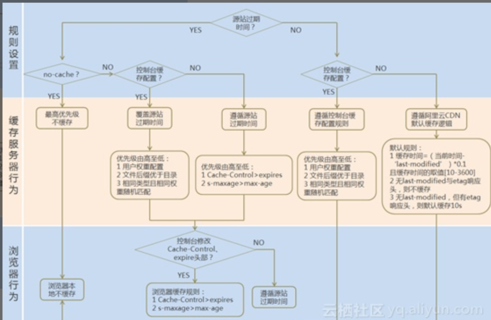

# cdn的缓存策略是什么？

CDN 节点缓存策略一般都会遵循 HTTP 标准协议，又拍云在没有匹配到自定义缓存规则且源服务器也没有返回任何有效缓存头的情况下，默认配置策略如下：

1. 针对静态资源，所有正常状态码（大于等于 200 小于 400）均缓存 8 天。特别地，301 响应缓存 2 小时，302 响应缓存 20 分钟；
2. 针对动态资源，程序会自动识别，则不进行缓存；
3. 对于其他大于等于 400 的不正常响应，则不进行缓存；

缓存节点通知浏览器缓存的具体时间由 HTTP 响应头里面的 Cache-Control 和 Expires 响应头控制。

### CDN 缓存的不足

CDN 缓存不仅减少了用户的访问延时，相应的也减少了源服务器的负载，但这里需要注意，当源服务器资源更新后，如果 CDN 节点上缓存数据还未过期，用户访问到的依旧是过期的缓存资源，这会导致用户最终访问出现偏差。因此，开发者需要手动刷新相关资源，使 CDN 缓存保持为最新的状态。



大概率都是和http相同，也支持用户控制台缓存配置

\1. CDN 处理一个资源是否缓存首先是需要看源站针对于该资源配置的缓存设置。因为源站的不缓存策略是用户自身控制的，因此是有最高的优先级的，当源站配置了缓存规则则转 2 。而如果没有进行任何配置的话则转 3 ，而对于浏览器缓存情况转 7 。

\2. 当源站配置了以下的规则时， CDN 会认为该资源源站不允许 CDN 缓存，并且这种情况下浏览器也是不会做缓存的，因此会每次请求该资源时都回源站，无法进行缓存加速，如果没有则转 4 ：

1）有s-maxage=0，no-cache，no-store，private其中一种

2）如果没有s-maxage或者s-maxage=0，并且有max-age=0.

3）带Pragma: no-cache

\3. 在源站没有配置缓存规则需判断 CDN 控制台是否配置缓存规则，如果配置了缓存规则转 4 ，如果没有配置缓存规则转 5 。

\4. 需判断 CDN 控制台是否有配置缓存规则，如果配置了缓存规则的话那么

CDN 上的缓存策略将覆盖源站的缓存策略，而控制台缓存配置的优先级为：

1）权重越高的优先级越好；

2）同等优先级后缀名优先级高于目录优先级；

3）相同权重且相同优先级则随机匹配（建议避免第三种场景），如果没有配置缓存规则则转 6 。

\5. 需根据源站的缓存规则进行缓存，常见的源站缓存规则有 Cache-Control和 Expires 头，根据 HTTP 协议 Cache-Control 的优先级高于 Expires 头，并且 s-maxage 设置高于 max-age 设置。

\6. 需遵循 CDN 默认缓存规则，默认缓存规则包括：

1）对于 response 头没有包括 Etag 或者 Last-Modified 头的文件默认是不缓存的（一般认为此类文件为动态文件）；

2）没有 Last-Modified 头的文件默认但是有 Etag 头的缓存 10 秒；

3）对于有 Last-Modified 头的会按照(当前时间 - Last-Modified 时间) * 0.1，并且将其限制在 [10,3600] 区间内。

\7. 对于源站设置了不缓存的规则时浏览器是不缓存的；如果 CDN 修改了 Cache-Control 或者 Expires 头时，浏览器会按照该修改头缓存；如果没有修改即会按照源站的策略缓存。


根据配置，可以根据文件类型等来设置缓存时间。同样的情况下cdn的缓存优先级比http的高

# CDN 常见的状态码是哪几个？

```
via:cache46.l2et2[0,200-0,H], cache60.l2et2[0,0], cache7.cn286[0,200-0,H], cache8.cn286[3,0]
x-cache:HIT TCP_HIT dirn:11:60349972
x-swift-cachetime:31535950
x-swift-savetime:Tue, 28 Jun 2016 04:04:29 GMT
```

这在问什么，状态码

cdn缓存是一种服务端缓存，CDN服务商将源站的资源缓存到遍布全国的高性能加速节点上，当用户访问相应的业务资源时，用户会被调度至最接近的节点最近的节点ip返回给用户，在web性能优化中，它主要起到了，缓解源站压力，优化不同用户的访问速度与体验的作用。

X-Swift-SaveTime：内容开始在CDN上缓存的时间。如上图，即2015-09-22 06:33:49开始在CDN缓存。由于系统时间是GMT时间，所以需要折算成北京时间，也就是2015-09-22 14:33:49开始缓存。

X-Swift-CacheTime 是CDN的默认缓存时间，以秒为单位。图中的86400，即缓存24小时。

Age：该内容在CDN上已经缓存了的时间。图中的163s即该内容已经在CDN缓存了163秒。根据时间，从2015-09-22 14:33:49开始缓存的，当前时间则为2015-09-22 14:36:32。您可以和电脑当前时间进行对比。
