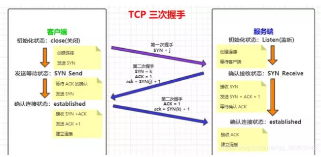

tcp的三次握手四次挥手

第一，为了确认双方的接收与发送能力是否正常。第二，指定自己的初始化序列号，为后面的可靠传送做准备。第三，如果是 https 协议的话，三次握手这个过程，还会进行数字证书的验证以及加密密钥的生成到

#####  `ACK`

这个标识可以理解为发送端发送数据到接收端，发送的时候 ACK 为 0，标识接收端还未应答，一旦接收端接收数据之后，就将 ACK 置为 1，发送端接收到之后，就知道了接收端已经接收了数据。

`SYN`

> 表示「同步序列号」，是 TCP 握手的发送的第一个数据包

##### `FIN`

> 表示发送端已经达到数据末尾，也就是说双方的数据传送完成，没有数据可以传送了，发送FIN标志位的 TCP 数据包后，连接将被断开。这个标志的数据包也经常被用于进行端口扫描。

### 5、为什么不是一次、二次握手？

> 防止了服务器端的一直等待而浪费资源。

**为了防止已失效的连接请求报文段突然又传送到了服务端，因而产生错误。如果此时客户端发送的延迟的握手信息**服务器收到，然后服务器进行响应，认为客户端要和它建立连接，此时客户端并没有这个意思，但 `server` 却以为新的运输连接已经建立，并一直等待 `client` 发来数据。这样，`server` 的很多资源就白白浪费掉了。

### TCP四次分手总结

由于TCP连接是全双工的，因此每个方向都必须单独进行关闭。这个原则是当一方完成它的数据发送任务后就能发送一个FIN来终止这个方向的连接。收到一个 FIN只意味着这一方向上没有数据流动，一个TCP连接在收到一个FIN后仍能发送数据。首先进行关闭的一方将执行主动关闭，而另一方执行被动关闭。

1. **客户端A发送一个FIN，**用来关闭客户A到服务器B的数据传送(报文段4)。
2. **服务器B收到这个FIN**，它发回一个ACK，确认序号为收到的序号加1(报文段5)。和SYN一样，一个FIN将占用一个序号。
3. **服务器B关闭与客户端A的连接**，发送一个FIN给客户端A(报文段6)。
4. **客户端A发回ACK报文确认**，并将确认序号设置为收到序号加1(报文段7)。

t1、第一次握手：客户端给服务器发送一个 SYN 报文。

2、第二次握手：服务器收到 SYN 报文之后，会应答一个 SYN+ACK 报文。

3、第三次握手：客户端收到 SYN+ACK 报文之后，会回应一个 ACK 报文。

4、服务器收到 ACK 报文之后，三次握手建立完成。

2msl time。结束握手

##### 为什么要等待2MSL？

主机1等待2MSL后依然没有收到回复，则证明Server端已正常关闭，那好，主机1也可以关闭连接了

MSL：**报文段最大生存时间，它是任何报文段被丢弃前在网络内的最长时间**。
原因有二：

- **保证TCP协议的全双工连接能够可靠关闭**
- **保证这次连接的重复数据段从网络中消失**

**1，如果不等待，直接关了。关之前发送的ack数组报丢失了，那主机2就不知道自己的fin是否发成功，就会重发fin，这样主机2就是未关闭的。**

**2，如果主机1不等待，直接关闭。立马建立了新的链接。但是上一个链接的旧数据，因为网络原因又发送到了主机2，就造成了数据混乱。**

### TCP流量控制

 如果发送方把数据发送得过快，接收方可能会来不及接收，这就会造成数据的丢失。所谓**流量控制**就是让发送方的发送速率不要太快，要让接收方来得及接收。

利用**滑动窗口机制**可以很方便地在TCP连接上实现对发送方的流量控制。

设A向B发送数据。在连接建立时，B告诉了A：“我的接收窗口是 rwnd = 400 ”(这里的 rwnd 表示 receiver window) 。因此，发送方的发送窗口不能超过接收方给出的接收窗口的数值。

tcp面向字节流，可靠，全双工的传输层协议

（快重传，漫回复，快慢拥塞，没看考的不多）
链接：https://juejin.im/post/598ba1d06fb9a03c4d6464ab

tcp报文结构

报文首

TCP 的首部包括以下内容：    

1. 源端口 source port    
2. 目的端口 destination port    
3. 序号 sequence number    
4. 确认号 acknowledgment number    
5. 数据偏移 offset    
6. 保留 reserved    
7. 标志位 tcp flags    
8. 窗口大小 window size    
9. 检验和 checksum    
10. 紧急指针 urgent pointer    
11. 选项 tcp options

