# 透视http协议

开篇词 (1讲)
开篇词｜To Be a HTTP Hero免费
## 破冰篇 (7讲)
### 01 | 时势与英雄：HTTP的前世今生

todo：http1.1中管道是什么

### 02 | HTTP是什么？HTTP又不是什么？

http：超文本传输协议

### 03 | HTTP世界全览（上）：与HTTP相关的各种概念 

cdn

**cdn就是用来缓存很远的服务器的资源**

### 04 | HTTP世界全览（下）：与HTTP相关的各种协议

### 05 | 常说的“四层”和“七层”到底是什么？“五层”“六层”哪去了？ 

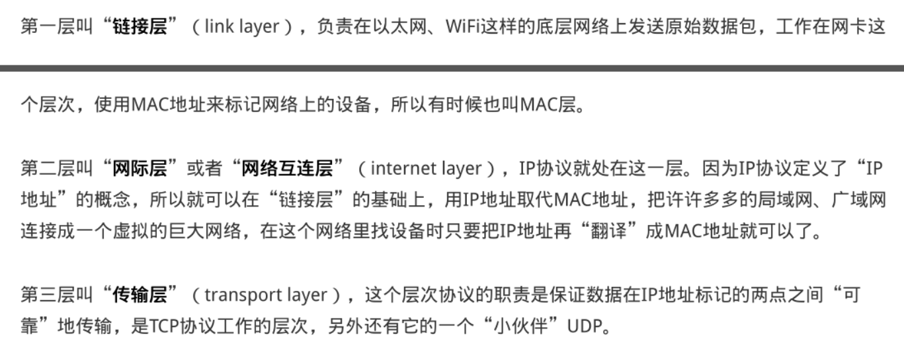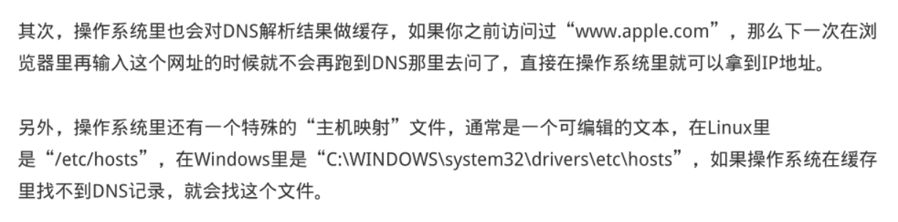

### 06 | 域名里有哪些门道？

### 07 | 自己动手，搭建HTTP实验环境

工具

一套抓包工具和服务器

## 基础篇 (7讲)

### 08 | 键入网址再按下回车，后面究竟发生了什么？

再简要叙述一下这次最简单的浏览器HTTP请求过程：
1.浏览器从地址栏的输入中获得服务器的IP地址和端口号；
2.浏览器用TCP的三次握手与服务器建立连接；
3.浏览器向服务器发送拼好的报文；
4.服务器收到报文后处理请求，同样拼好报文再发给浏览器；
5.浏览器解析报文，渲染输出页面

抓包图

### 09 | HTTP报文是什么样子的？

HTTP协议规定报文必须有header，但可以没有body，而且在header之后必须要有一个“空行”，也就
是“CRLF”，十六机制的“0D0A”

空行：最后一个响应头部之后是一个空行，发送回车符和换行符，通知服务器以下不再有响应头部。

头部字段是key-value的形式，key和value之间用“:”分隔，最后用CRLF换行表示字段结束。比如在“Host:
127.0.0.1”这一行里key就是“Host”，value就是“127.0.0.1”

常用头字段

首先要说的是Host字段，它属于请求字段，只能出现在请求头里，它同时也是唯一一个HTTP/1.1规范里要
求必须出现的字段，也就是说，如果请求头里没有Host，那这就是一个错误的报文

# [HTTP host头](https://www.cnblogs.com/amyzhu/p/8186516.html)

前几天，将一个host误配置为https，导致对方服务解析异常，排查半天，才发现是host导致，故整理一下HTTP host作用。
**Host**：指定请求服务器的域名/IP地址和端口号。
作用：同一台机器上，可能部署多个app，通过解析host+端口，指定具体访问站点。
host的要点：

1. HTTP/1.0不带host,HTTP/1.1新增host头。
2. host可以是域名，也可以是IP，也可以跟端口号。
3. host可以由程序自定义，某些程序为了防止运营商或者绕过防火墙，可以定义虚假host。
4. HTTP/1.1中的host可以为空值但不可以不带。如果不带host头，会返回400 Bad request。
5. http响应头不包含host字段。
6. 部分站点不校验host，可以传任意值

User-Agent是请求字段，只出现在请求头里。它使用一个字符串来描述发起HTTP请求的客户端，服务器可
以依据它来返回最合适此浏览器显示的页面

Date字段是一个通用字段，但通常出现在响应头里，表示HTTP报文创建的时间，客户端可以使用这个时间
再搭配其他字段决定缓存策略。
Server字段是响应字段，只能出现在响应头里。它告诉客户端当前正在提供Web服务的软件名称和版本号，
例如在我们的实验环境里它就是“Server: openresty/1.15.8.1”，即使用的是OpenResty 1.15.8.1。
Server字段也不是必须要出现的，因为这会把服务器的一部分信息暴露给外界，如果这个版本恰好存在
bug，那么黑客就有可能利用bug攻陷服务器。所以，有的网站响应头里要么没有这个字段，要么就给出一
个完全无关的描述信息

实体字段里要说的一个是**Content-Length**，它表示报文里body的长度，也就是请求头或响应头空行后面数
据的长度。服务器看到这个字段，就知道了后续有多少数据，可以直接接收。如果没有这个字段，那么
body就是不定长的，需要使用chunked方式分段传输。

### 10 | 应该如何理解请求方法？

### 11 | 你能写出正确的网址吗？

下面的这张图显示了URI最常用的形式，由scheme、host:port、path和query四个部分组成，但有的部分可
以视情况省略

### 12 | 响应状态码该怎么用？

400是请求头报错

### 13 | HTTP有哪些特点？

### 14 | HTTP有哪些优点？又有哪些缺点？

## 进阶篇 (8讲)

### 15 | 海纳百川：HTTP的实体数据

但仅有MIME type还不够，因为HTTP在传输时为了节约带宽，有时候还会压缩数据，为了不要让浏览器继
续“猜”，还需要有一个“Encoding type”，告诉数据是用的什么编码格式，这样对方才能正确解压缩，
还原出原始的数据。
比起MIME type来说，Encoding type就少了很多，常用的只有下面三种：

HTTP协议为此定义了两个Accept请求头字段和两个Content实体头字段，用于客户端和服务器进行“内容协
商”。也就是说，客户端用Accept头告诉服务器希望接收什么样的数据，而服务器用Content头告诉客户端
实际发送了什么样的数据

不过这两个字段是可以省略的，**如果请求报文里没有Accept-Encoding字段，就表示客户端不支持压缩数**
**据；如果响应报文里没有Content-Encoding字段，就表示响应数据没有被压缩**

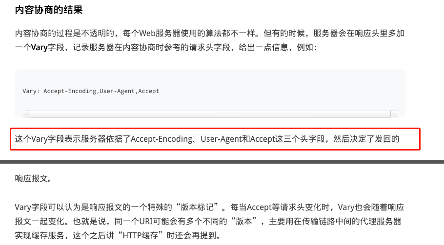

post请求需要带上！！

### 16 | 把大象装进冰箱：HTTP传输大文件的方法

分块传输

思考题

### 17 | 排队也要讲效率：HTTP的连接管理

http1.1长连接，是指，在一个tcp链接里面，多次发送请求，但不是同时发送

所以会有队头堵塞问题，域名分片技术可以缓解，就是将一个连接里面的请求，放到多个tcp中。缓解了压力。占用了多个tcp资源

### 18 | 四通八达：HTTP的重定向和跳转

、

### 19 | 让我知道你是谁：HTTP的Cookie机制

### 20 | 生鲜速递：HTTP的缓存控制

服务器的缓存控制

我把**服务器的缓存控制策略**画了一个流程图，对照着它你就可以在今后的后台开发里明确“Cache-
Control”的用法了

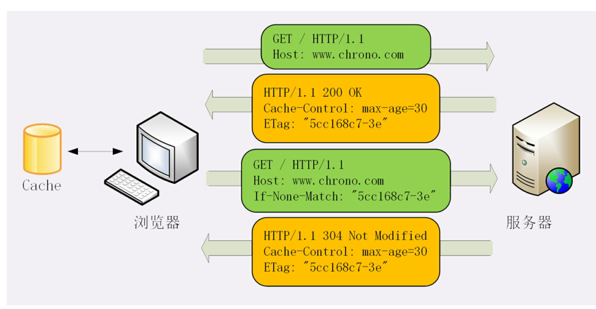

这块还是没有讲清楚啊，和之前浏览器原理老师不在一个水平上

之后照着之前看过的图解http，再理解一遍+面试题

**`If-Modified-Since`** 是一个条件式请求首部，服务器只在所请求的资源在给定的日期时间之后对内容进行过修改的情况下才会将资源返回，状态码为 [`200`](https://developer.mozilla.org/zh-CN/docs/Web/HTTP/Status/200) 。如果请求的资源从那时起未经修改，那么返回一个不带有消息主体的 [`304`](https://developer.mozilla.org/zh-CN/docs/Web/HTTP/Status/304) 响应，而在 [`Last-Modified`](https://developer.mozilla.org/zh-CN/docs/Web/HTTP/Headers/Last-Modified) 首部中会带有上次修改时间。 不同于  [`If-Unmodified-Since`](https://developer.mozilla.org/zh-CN/docs/Web/HTTP/Headers/If-Unmodified-Since), `If-Modified-Since` 只可以用在 [`GET`](https://developer.mozilla.org/zh-CN/docs/Web/HTTP/Methods/GET) 或 [`HEAD`](https://developer.mozilla.org/zh-CN/docs/Web/HTTP/Methods/HEAD) 请求中。

当与 [`If-None-Match`](https://developer.mozilla.org/zh-CN/docs/Web/HTTP/Headers/If-None-Match) 一同出现时，它（**`If-Modified-Since`**）会被忽略掉，除非服务器不支持 `If-None-Match`

**`If-None-Match`** 是一个条件式请求首部。对于 GET[`GET`](https://developer.mozilla.org/zh-CN/docs/Web/HTTP/Methods/GET) 和 [`HEAD`](https://developer.mozilla.org/zh-CN/docs/Web/HTTP/Methods/HEAD) 请求方法来说，当且仅当服务器上没有任何资源的 [`ETag`](https://developer.mozilla.org/zh-CN/docs/Web/HTTP/Headers/ETag) 属性值与这个首部中列出的相匹配的时候，服务器端会才返回所请求的资源，响应码为 [`200`](https://developer.mozilla.org/zh-CN/docs/Web/HTTP/Status/200) 。对于其他方法来说，当且仅当最终确认没有已存在的资源的 [`ETag`](https://developer.mozilla.org/zh-CN/docs/Web/HTTP/Headers/ETag) 属性值与这个首部中所列出的相匹配的时候，才会对请求进行相应的处理。

**HTTP `HEAD` 方法** 请求资源的头部信息, 并且这些头部与 HTTP [`GET`](https://developer.mozilla.org/zh-CN/docs/Web/HTTP/Methods/GET) 方法请求时返回的一致. 该请求方法的一个使用场景是在下载一个大文件前先获取其大小再决定是否要下载, 以此可以节约带宽资源

上面的那个流程里面，有不停的判断，判断缓存是否失效。就用这个判断。

### 21 | 良心中间商：HTTP的代理服务

‘

因为HTTP/1.0默认是短连接

### 22 | 冷链周转：HTTP的缓存代理

这段话呼应了上面的，先判断，然后当需要判断缓存是否还可以用的时候，就用if-modified-since字段。可以直接用缓存就用。

这几个字段不明确

客户端发出，服务端根据字段来使用缓存

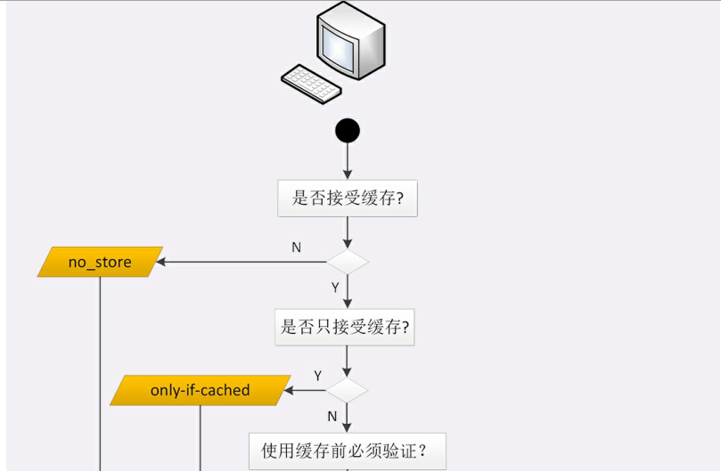

## 安全篇 (7讲)

### 23 | HTTPS是什么？SSL/TLS又是什么？

### 24 | 固若金汤的根本（上）：对称加密与非对称加密

将会话秘钥(对称加密)，使用非对称加密传输。传输成功之后，就使用对称加密通信

用非对称加密，对 对称加密的秘钥（之前的随机数产生对称算法的秘钥），进行传输加密

所以如何拿到对应的非对称的公钥和秘钥

### 25 | 固若金汤的根本（下）：数字签名与证书

**摘要就是，用同样的算法对摘要的内容进行摘要计算，得到的摘要如何和收到的摘要相同，那么就可证明数据的完整性。重点是如何对摘要进行加密传输**

摘要，用来确保数据的完整性

**采用会话秘钥对摘要进行加密。减少加密的量。但又保证了安全性**

确保明文的完整性

数字签名，用非对称加密的私钥加密摘要

**数字签名就是使用非对称加密的摘要**

**要实现好的数字签名，就必须先交换公钥，，如何确认公钥的安全性。就需要使用ca来验证**

**ca给各个公钥进行签名**

### 26 | 信任始于握手：TLS1.2连接过程解析

1，交换随机数和套件信息

2，服务器**发送自己的证书**，**还有自己的公钥，还有用私钥加密的签名认证**，开始走证书链逐级验证，**确认证书的真实性，再用证书公钥验证签名(确定数据的完整性)**，就确认了服务器的身份（用ca公钥解密证书，拿到的就是服务器公钥呀，那再发的公钥应该是一次性的公钥，证书里面的公钥是特殊的，只能用信任，而数字签名是用ca里面的公钥，这就解释清楚了。）

3，**客户端按照密码套件的要求，也生成一个椭圆曲线的公钥（Client Params）**，用“Client KeyExchange”消息发给服务器（这里双方都有了对方的公钥（非对称公钥））

现在客户端和服务器手里都拿到了**密钥交换算法**的两个参数（Client Params、Server Params）（客户服务端端公钥），就用
**ECDHE(非对称加密算法)算法一阵算，算出了一个新的东西，叫“Pre-Master”，其实也是一个随机数（主要-会话秘钥）**。

**客户端服务端的两个随机数，加双方公钥算出的随机数，三个数字计算成为了秘钥**

（有了主密钥和派生的会话密钥，握手就快结束了。客户端发一个“Change Cipher Spec”，然后再发一
个“Finished”消息，把之前所有发送的数据做个摘要，再加密一下，让服务器做个验证）

4，**客户端将这些数据做个摘要把，再加密一下，发给服务器验证**。服务端也这样

服务器也是同样的操作，发“Change Cipher Spec”和“Finished”消息，双方都验证加密解密OK，握手正
式结束，后面就收发被加密的HTTP请求和响应了

**可以了tls过程已经很明确了**

大体的流程没有变，**只是“Pre-Master”不再需要用算法生成，而是客户端直接生成随机数**，然后用服务器
的公钥加密，通过“Client Key Exchange”消息发给服务器。服务器再用私钥解密，这样双方也实现了共享
三个随机数，就可以生成主密钥。

**所以rsa比tls 椭圆算法慢，因为双方都有对方的公钥的时候，tls使用的算法，双方可以直接算出对应的会话秘钥。最后确认下就可以。而rsa需要等客户端生成之后才能拿到会话秘钥。所以抢跑**

重要的是整个握手流程

这个比较好理解ssl的整个流程

显示客户端服务端协商用哪个密码套件

然后服务器发送证书和公钥

客户端生成会话秘钥，用服务器公钥发给服务器

之后就用会话秘钥进行加密计算

（是不是还漏了一个摘要传输所有握手信息？？）

tls

每一步为安全做的意义，需要结合之前的知识在复习

### 27 | 更好更快的握手：TLS1.3特性解析

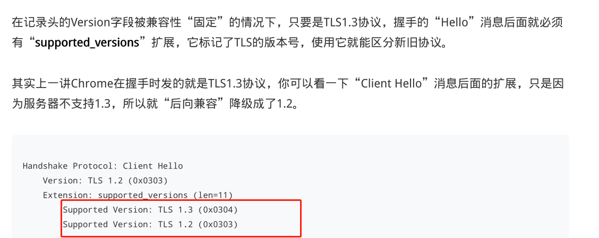

强化安全

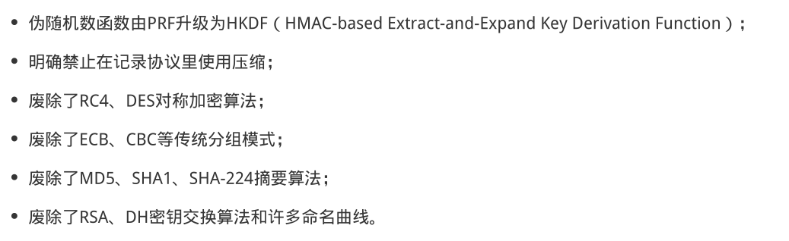

**ecdh算法那和aes对称加密算法，摘要sha256**

1.3这一块要重点理解

### 28 | 连接太慢该怎么办：HTTPS的优化

28-连接太慢该怎么办：HTTPS的优化
你可能或多或少听别人说过，“HTTPS的连接很慢”。那么“慢”的原因是什么呢？
通过前两讲的学习，你可以看到，HTTPS连接大致上可以划分为两个部分，第一个是建立连接时的非对称加
密握手，第二个是握手后的对称加密报文传输。
由于目前流行的AES、ChaCha20性能都很好，还有硬件优化，报文传输的性能损耗可以说是非常地小，小
到几乎可以忽略不计了。

所以，通常所说的“HTTPS连接慢”指的就是刚开始建立连接的那段时间。
在TCP建连之后，正式数据传输之前，HTTPS比HTTP增加了一个TLS握手的步骤，这个步骤最长可以花费两
个消息往返，也就是2-RTT。而且在握手消息的网络耗时之外，还会有其他的一些“隐形”消耗，比如：

产生用于密钥交换的临时公私钥对（ECDHE）；
验证证书时访问CA获取CRL或者OCSP；
非对称加密解密处理“Pre-Master”

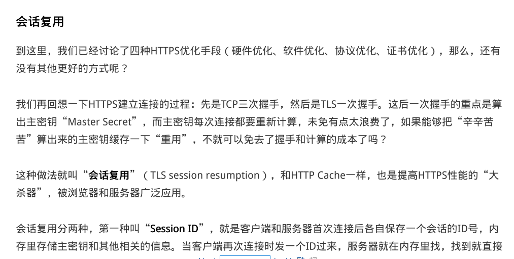

### 29 | 我应该迁移到HTTPS吗？

## 飞翔篇 (4讲)

### 30 | 时代之风（上）：HTTP/2特性概览

### 31 | 时代之风（下）：HTTP/2内核剖析

头部压缩算法

确⽴了连接之后，HTTP/2就开始准备请求报⽂。
因为语义上它与HTTP/1兼容，所以报⽂还是由“Header+Body”构成的，但在请求发送前，必须要
PRI * HTTP/2.0\r\n\r\nSM\r\n\r\n
⽤“HPACK”算法来压缩头部数据。
“HPACK”算法是专⻔为压缩HTTP头部定制的算法，与gzip、zlib等压缩算法不同，它是⼀个“有状
态”的算法，需要客⼾端和服务器各⾃维护⼀份“索引表”，也可以说是“字典”（这有点类似brotli），
压缩和解压缩就是查表和更新表的操作。
为了⽅便管理和压缩，HTTP/2废除了原有的起始⾏概念，把起始⾏⾥⾯的请求⽅法、URI、状态码等统⼀转
换成了头字段的形式，并且给这些“不是头字段的头字段”起了个特别的名字⸺“伪头字段”（pseudo-
header fields）。⽽起始⾏⾥的版本号和错误原因短语因为没什么⼤⽤，顺便也给废除了。
为了与“真头字段”区分开来，这些“伪头字段”会在名字前加⼀个“:”，⽐如“:authority”
“:method” “:status”，分别表⽰的是域名、请求⽅法和状态码。
现在HTTP报⽂头就简单了，全都是“Key-Value”形式的字段，于是HTTP/2就为⼀些最常⽤的头字段定义
了⼀个只读的“静态表”（Static Table）。
下⾯的这个表格列出了“静态表”的⼀部分，这样只要查表就可以知道字段名和对应的值，⽐如数
字“2”代表“GET”，数字“8”代表状态码200。
但如果表⾥只有Key没有Value，或者是⾃定义字段根本找不到该怎么办呢？
这就要⽤到“动态表”（Dynamic Table），它添加在静态表后⾯，结构相同，但会在编码解码的时候随时
更新。
⽐如说，第⼀次发送请求时的“user-agent”字段⻓是⼀百多个字节，⽤哈夫曼压缩编码发送之后，客⼾端
和服务器都更新⾃⼰的动态表，添加⼀个新的索引号“65”。那么下⼀次发送的时候就不⽤再重复发那么多
字节了，只要⽤⼀个字节发送编号就好。

流状态转换

这节主要讲了http2的实现原理，流包的字段，和如何控制流，还有排序

### 32 | 未来之路：HTTP/3展望

HTTP/3协议
了解了QUIC之后，再来看HTTP/3就容易多了。
因为QUIC本⾝就已经⽀持了加密、流和多路复⽤，所以HTTP/3的⼯作减轻了很多，把流控制都交给QUIC
去做。调⽤的不再是TLS的安全接⼝，也不是Socket API，⽽是专⻔的QUIC函数。不过这个“QUIC函
数”还没有形成标准，必须要绑定到某⼀个具体的实现库。
HTTP/3⾥仍然使⽤流来发送“请求-响应”，但它⾃⾝不需要像HTTP/2那样再去定义流，⽽是直接使⽤
QUIC的流，相当于做了⼀个“概念映射”。
HTTP/3⾥的“双向流”可以完全对应到HTTP/2的流，⽽“单向流”在HTTP/3⾥⽤来实现控制和推送，近
似地对应HTTP/2的0号流。
由于流管理被“下放”到了QUIC，所以HTTP/3⾥帧的结构也变简单了。
帧头只有两个字段：类型和⻓度，⽽且同样都采⽤变⻓编码，最⼩只需要两个字节。
HTTP/3⾥的帧仍然分成数据帧和控制帧两类，HEADERS帧和DATA帧传输数据，但其他⼀些帧因为在下层
的QUIC⾥有了替代，所以在HTTP/3⾥就都消失了，⽐如RST_STREAM、WINDOW_UPDATE、PING等。
头部压缩算法在HTTP/3⾥升级成了“QPACK”，使⽤⽅式上也做了改变。虽然也分成静态表和动态表，但
在流上发送HEADERS帧时不能更新字段，只能引⽤，索引表的更新需要在专⻔的单向流上发送指令来管
理，解决了HPACK的“队头阻塞”问题。
另外，QPACK的字典也做了优化，静态表由之前的61个增加到了98个，⽽且序号从0开始，也就是
说“:authority”的编号是0

### 33 | 我应该迁移到HTTP/2吗？

核心在与，原来http1的时候为了减少请求，在http2上不好用

## 探索篇 (5讲)

### 34 | Nginx：高性能的Web服务器

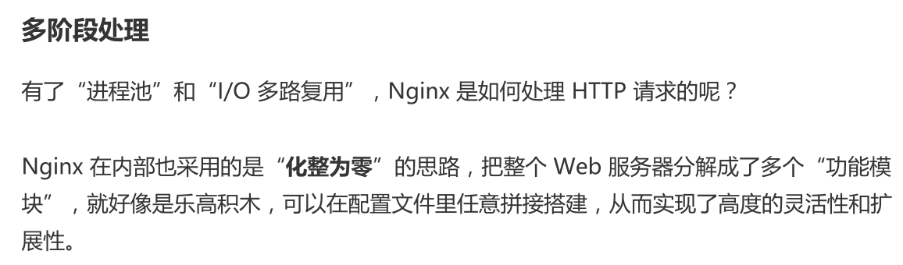

### 35 | OpenResty：更灵活的Web服务器

### 36 | WAF：保护我们的网络服务

### （上）

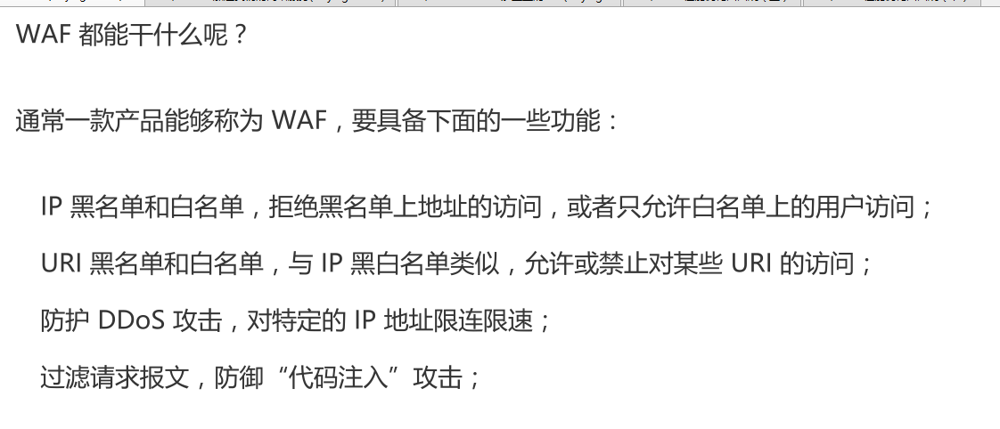

### 37 | CDN：加速我们的网络服务

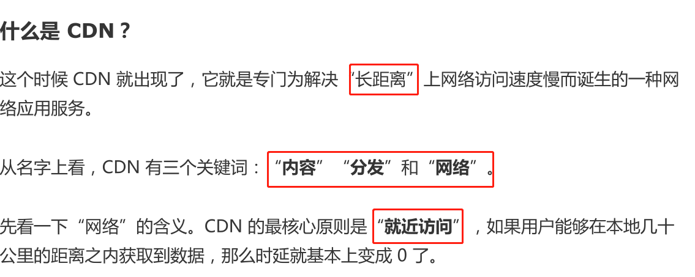

### 38 | WebSocket：沙盒里的TCP

更准确地说，“WebSocket”是一种基于 TCP 的轻量级网络通信协议，在地位上是与
HTTP“平级”的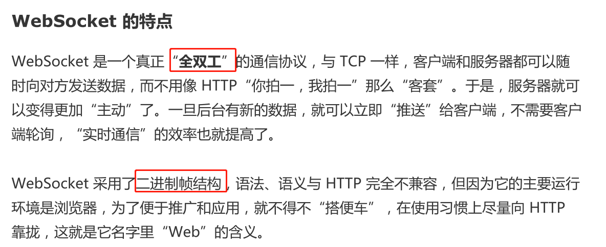

WebSocket 的帧结构

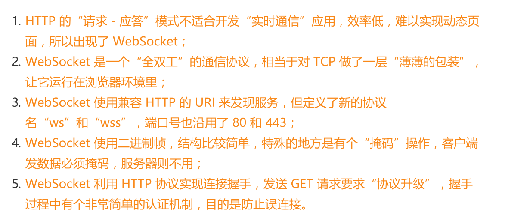

### 39 | HTTP性能优化面面观（上）

### 40 | HTTP性能优化面面观（下）

## 答疑篇 (2讲)

### 41 | Linux/Mac实验环境搭建与URI查询参数

### 42 | DHE/ECDHE算法的原理

## 结束语 (2讲)
结束语 | 做兴趣使然的Hero
结课测试 | 这些HTTP协议知识，你真的掌握了吗？

---

很强

