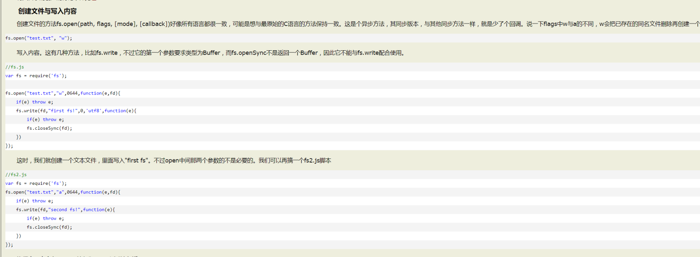

## `path.basename(path[, ext])`[#](http://nodejs.cn/api/path.html#path_path_basename_path_ext)

[中英对照](http://nodejs.cn/api/path/path_basename_path_ext.html)[提交修改](https://github.com/nodejscn/node-api-cn/edit/master/path/path_basename_path_ext.md)

版本历史

- `path` [](http://nodejs.cn/s/9Tw2bK)
- `ext` [](http://nodejs.cn/s/9Tw2bK) 可选的文件扩展名。
- 返回: [](http://nodejs.cn/s/9Tw2bK)

`path.basename()` 方法会返回 `path` 的最后一部分，类似于 Unix 的 `basename` 命令。 尾部的目录分隔符会被忽略，参见 [`path.sep`](http://nodejs.cn/s/io7vxJ)。

```js
path.basename('/目录1/目录2/文件.html');
// 返回: '文件.html'

path.basename('/目录1/目录2/文件.html', '.html');
```

## `path.dirname(path)`[#](http://nodejs.cn/api/path.html#path_path_dirname_path)

[中英对照](http://nodejs.cn/api/path/path_dirname_path.html)[提交修改](https://github.com/nodejscn/node-api-cn/edit/master/path/path_dirname_path.md)

版本历史

- `path` [](http://nodejs.cn/s/9Tw2bK)
- 返回: [](http://nodejs.cn/s/9Tw2bK)

`path.dirname()` 方法会返回 `path` 的目录名，类似于 Unix 的 `dirname` 命令。 尾部的目录分隔符会被忽略，参见 [`path.sep`](http://nodejs.cn/s/io7vxJ)。

```js
path.dirname('/目录1/目录2/目录3');
// 返回: '/目录1/目录2'
```

## `path.join([...paths])`[#](http://nodejs.cn/api/path.html#path_path_join_paths)

[中英对照](http://nodejs.cn/api/path/path_join_paths.html)[提交修改](https://github.com/nodejscn/node-api-cn/edit/master/path/path_join_paths.md)

新增于: v0.1.16

- `...paths` [](http://nodejs.cn/s/9Tw2bK) 路径片段的序列。
- 返回: [](http://nodejs.cn/s/9Tw2bK)

`path.join()` 方法会将所有给定的 `path` 片段连接到一起（使用平台特定的分隔符作为定界符），然后规范化生成的路径。

长度为零的 `path` 片段会被忽略。 如果连接后的路径字符串为长度为零的字符串，则返回 `'.'`，表示当前工作目录。

```js
path.join('/目录1', '目录2', '目录3/目录4', '目录5', '..');
// 返回: '/目录1/目录2/目录3/目录4'

path.join('目录1', {}, '目录2');
// 抛出 'TypeError: Path must be a string. Received {}'
```

## `path.parse(path)`[#](http://nodejs.cn/api/path.html#path_path_parse_path)

[中英对照](http://nodejs.cn/api/path/path_parse_path.html)[提交修改](https://github.com/nodejscn/node-api-cn/edit/master/path/path_parse_path.md)

新增于: v0.11.15

- `path` [](http://nodejs.cn/s/9Tw2bK)
- 返回: [](http://nodejs.cn/s/jzn6Ao)

`path.parse()` 方法会返回一个对象，其属性表示 `path` 的有效元素。 尾部的目录分隔符会被忽略，参见 [`path.sep`](http://nodejs.cn/s/io7vxJ)。

返回的对象具有以下属性：

- `dir` [](http://nodejs.cn/s/9Tw2bK)
- `root` [](http://nodejs.cn/s/9Tw2bK)
- `base` [](http://nodejs.cn/s/9Tw2bK)
- `name` [](http://nodejs.cn/s/9Tw2bK)
- `ext` [](http://nodejs.cn/s/9Tw2bK)

例如，在 POSIX 上：

```js
path.parse('/目录1/目录2/文件.txt');
// 返回:
// { root: '/',
//   dir: '/目录1/目录2',
//   base: '文件.txt',
//   ext: '.txt',
//   name: '文件' }
```

```

        // 解析成绝对路径
        const buildPath = path.resolve(projectRoot, module)
        const deployPath = path.resolve(deployRoot, modulePath[module])
        const { stdout, stderr } = await execCmd(cmd, buildPath)
        console.log(stdout)
        console.error(stderr)
        await fs.copy(`${buildPath}/dist`, deployPath)
```

## `path.resolve([...paths])`[#](http://nodejs.cn/api/path.html#path_path_resolve_paths)

[中英对照](http://nodejs.cn/api/path/path_resolve_paths.html)[提交修改](https://github.com/nodejscn/node-api-cn/edit/master/path/path_resolve_paths.md)

新增于: v0.3.4

- `...paths` [](http://nodejs.cn/s/9Tw2bK) 路径或路径片段的序列。
- 返回: [](http://nodejs.cn/s/9Tw2bK)

`path.resolve()` 方法会将路径或路径片段的序列解析为绝对路径。

给定的路径序列会从右到左进行处理，后面的每个 `path` 会被追加到前面，直到构造出绝对路径。 例如，给定的路径片段序列：`/目录1`、 `/目录2`、 `目录3`，调用 `path.resolve('/目录1', '/目录2', '目录3')` 会返回 `/目录2/目录3`，因为 `'目录3'` 不是绝对路径，但 `'/目录2' + '/' + '目录3'` 是。

如果在处理完所有给定的 `path` 片段之后还未生成绝对路径，则会使用当前工作目录。

生成的路径会被规范化，并且尾部的斜杠会被删除（除非路径被解析为根目录）。

零长度的 `path` 片段会被忽略。

如果没有传入 `path` 片段，则 `path.resolve()` 会返回当前工作目录的绝对路径。

```js
path.resolve('/目录1/目录2', './目录3');
// 返回: '/目录1/目录2/目录3'

path.resolve('/目录1/目录2', '/目录3/目录4/');
// 返回: '/目录3/目录4'

path.resolve('目录1', '目录2/目录3/', '../目录4/文件.gif');
// 如果当前工作目录是 /目录A/目录B，
// 则返回 '/目录A/目录B/目录1/目录2/目录4/文件.gif'
```

##### path.resolve()

path.resolve:方法会把一个路径或路径片段的序列解析为一个绝对路径。 例如：

```
const path = require('path');

const path1 = path.resolve('/a/b', '/c/d');
// 结果： /c/d
const path2 = path.resolve('/a/b', 'c/d');
// 输出： /a/b/c/d
const path3 = path.resolve('/a/b', '../c/d');
// 输出： /a/c/d
const path4 = path.resolve('a', 'b');
// 输出： /Users/xiao/work/test/a/b
```

-----



