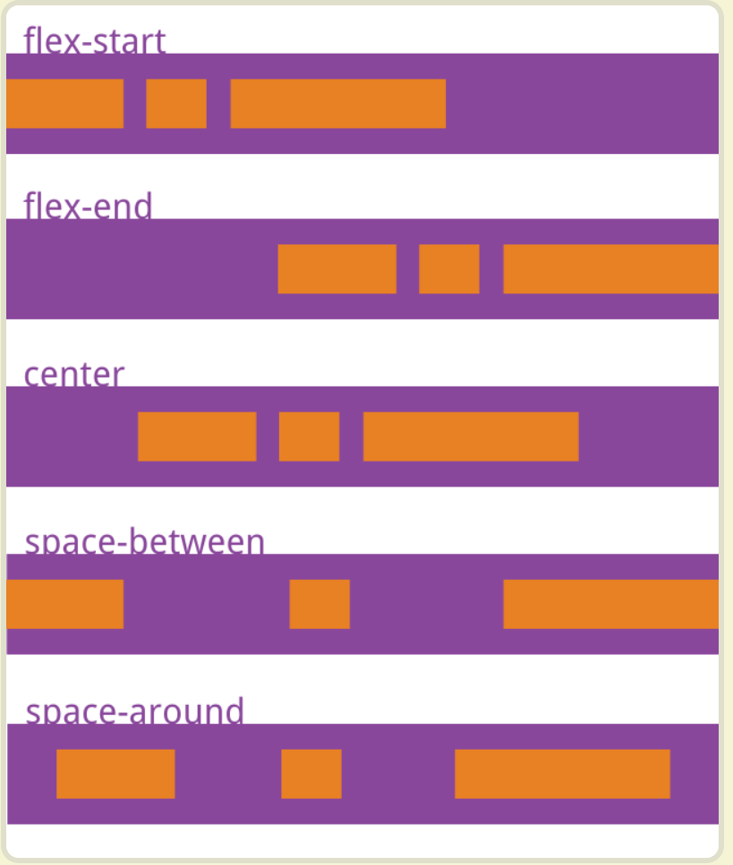
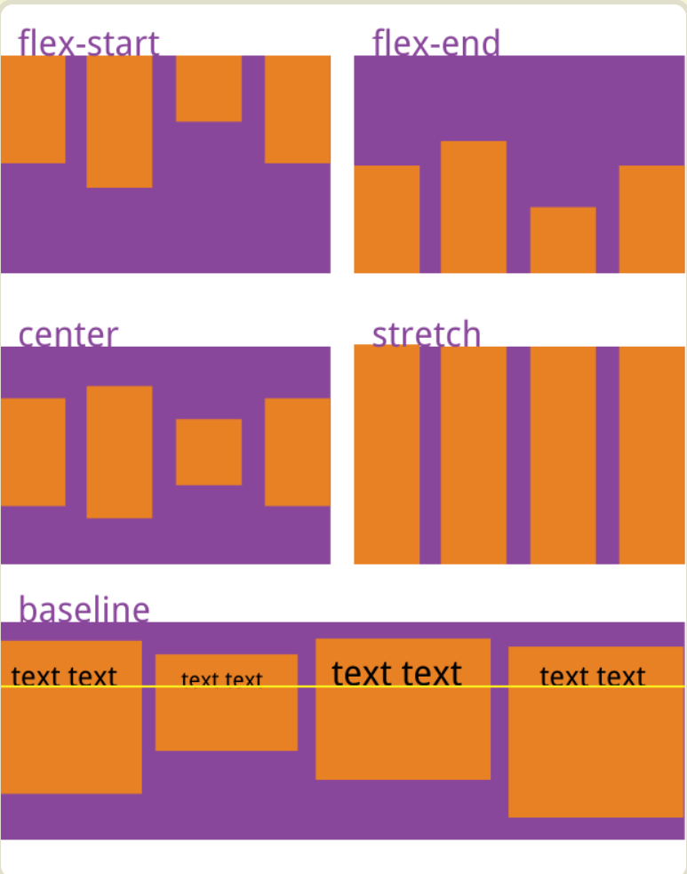
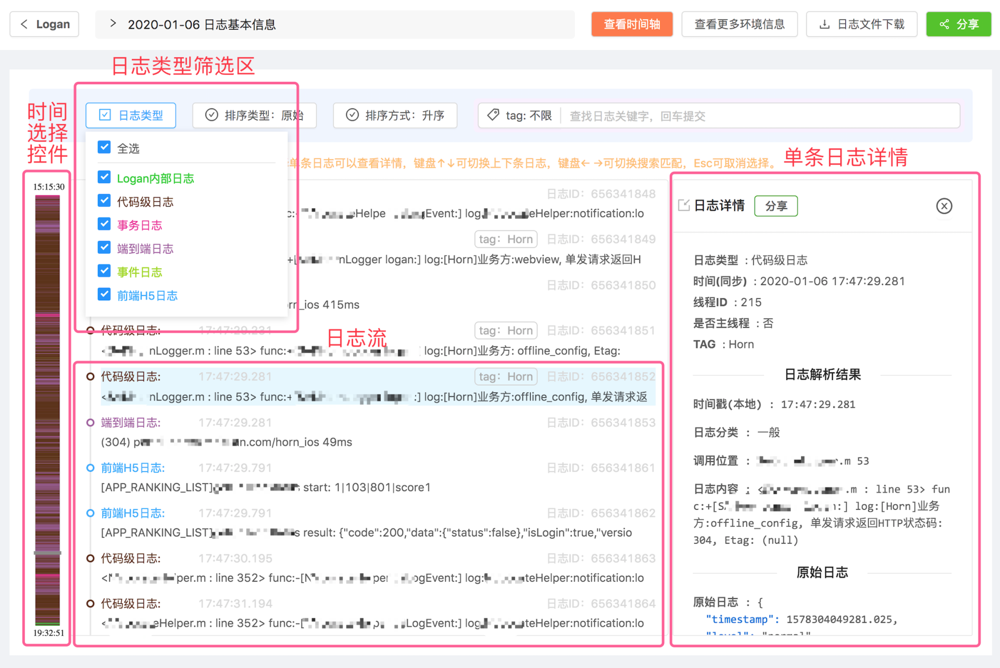
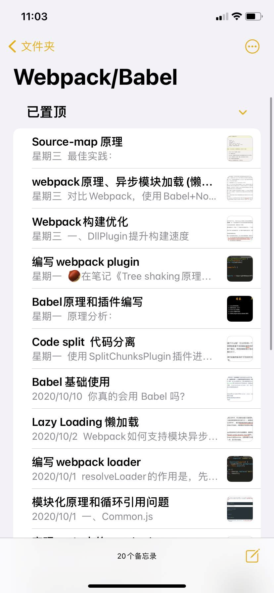
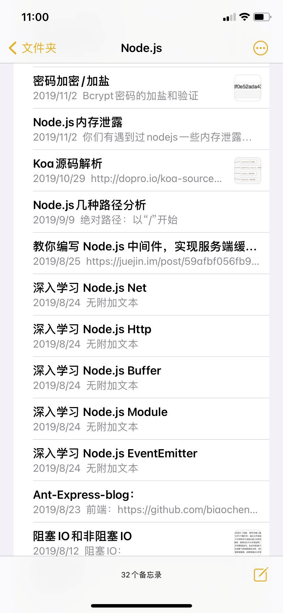
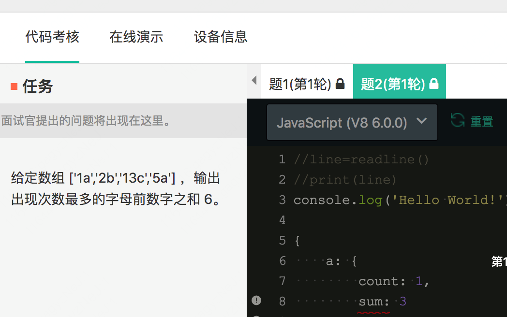
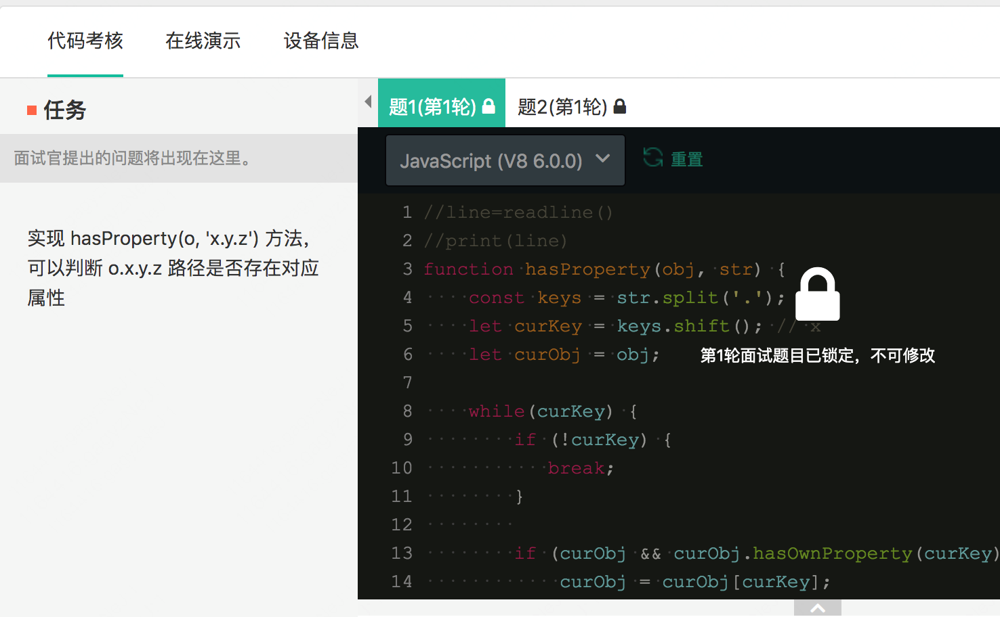
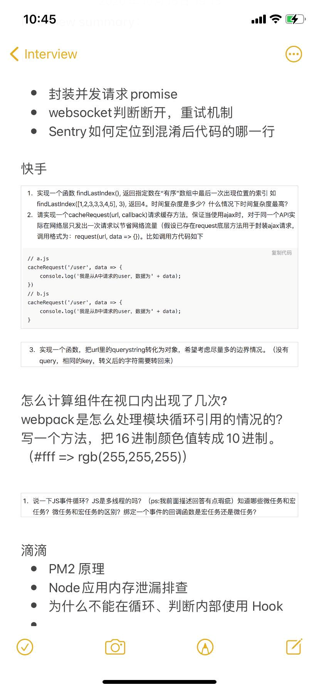

## 小米

1. css实现图片自适应宽高

没理解，背答案就行

1. css 自适应高度是指：max-width: 100%; max-height: 100% ？？？

2. 讲flex，手写出flex常用的属性，并且讲出作用

   默写一下

   > flex-direction
   >
   > flex-wrap
   >
   > flex-flow  (上面两个简写)
   >
   > justify-content 主轴的对齐方式
   >
   > 
   >
   > align-items  交叉轴如何对齐
   >
   > 
   >
   > align-content 多轴对齐方式
   >
   > 设置到项目上的属性
   >
   > order
   >
   > flex-grow 放大比例
   >
   > flex-shrink缩小
   >
   > flex-basis

3. BFC是什么（这个如何讲的透彻）待办吧，只知道那些，不知道怎么讲清楚


1. 项目里面的前端鉴权是怎么实现的？（实践，好好看看这个，看下裕浩的项目）

   https://juejin.im/post/6844903781704941576（里面的几种方式）

   https://segmentfault.com/a/1190000021143642（介绍了如何利用路由控制+路由元信息来前端控制）

   1. HTTP Basic Authentication (HTTP基本认证)

   2. session-cookie

   3. Token 验证(包括JWT,SSO)

   4. OAuth(开放授权)

      

      最简单的token组成:uid(用户唯一的身份标识)、time(当前时间的时间戳)、sign(签名，由token的前几位+盐以哈希算法压缩成一定长的十六进制字符串，可以防止恶意第三方拼接token请求服务器)。还可以把不变的参数也放进token，避免多次查库。。

      **Token需要查库验证token 是否有效，而JWT不用查库或者少查库，直接在服务端进行校验，并且不用查库。因为用户的信息及加密信息在第二部分payload和第三部分签证中已经生成，只要在服务端进行校验就行，并且校验也是JWT自己实现的。**

      > jwt介绍JWT原理
      >
      > JWT 的原理是，服务器认证以后，生成一个 JSON 对象，发回给用户.之后用户与服务器通信的时候.服务器完全只靠这个对象认定用户身份。为了防止用户篡改数据，服务器在生成这个对象的时候，**会加上签名**。
      >
      > jwt最大的特点就是: **服务器就不保存任何 session 数据了，也就是说，服务器变成无状态了，从而比较容易实现扩展。**
      >
      > ### JWT 的数据结构
      >
      > 它是一个很长的**字符串**，中间用点（.）分隔成三个部分。
      >
      > 分别是:Header（头部）.Payload（负载）.Signature（签名）
      >
      > - **Header :** 部分是一个 JSON 对象，描述 JWT 的元数据，例如:`{ "alg": "HS256","typ": "JWT"}`.alg属性表示签名的算法.默认是 HMAC SHA256（写成 HS256）；typ属性表示这个令牌（token）的类型（type），JWT 令牌统一写为JWT。
      >
      > 头部的 JSON 对象使用 Base64URL 算法转成字符串。
      >
      > - **Payload:** 部分也是一个 JSON 对象，用来存放实际需要传递的数据。这个 JSON 对象也要使用 Base64URL 算法转成字符串。
      >
      > **注意:** **JWT 默认是不加密的，任何人都可以读到，所以不要把秘密信息放在这个部分**
      >
      >作者：shotCat
      > 链接：https://juejin.im/post/6844903781704941576
      > 来源：掘金
      > 著作权归作者所有。商业转载请联系作者获得授权，非商业转载请注明出处。
   
2. **浏览器渲染过程，回流重绘等等，**

抓住问题重点，来回答，把原来理解的更加落实核心

浏览器渲染过程

1. 解析HTML生成DOM树。
2. 解析CSS生成CSSOM规则树。
3. 将DOM树与CSSOM规则树合并在一起生成渲染树。
4. 遍历渲染树开始布局，计算每个节点的位置大小信息。
5. 将渲染树每个节点绘制到屏幕。

回流重绘（当dom修改时，如果改变的只影响元素的外观，则重绘，如果改变布局显示，则重排）

- 重绘:当render tree中的一些元素需要更新属性，而这些属性只是影响元素的外观、风格，而不会影响布局的，比如background-color。
- 回流:当render tree中的一部分(或全部)因为元素的规模尺寸、布局、隐藏等改变而需要重新构建

#### 3）如何减少回流、重绘

- 使用 transform 替代 top
- 使用 visibility 替换 display: none ，因为前者只会引起重绘，后者会引发回流（改变了布局）
- 不要把节点的属性值放在一个循环里当成循环里的变量。

```
for(let i = 0; i < 1000; i++) {
    // 获取 offsetTop 会导致回流，因为需要去获取正确的值
    console.log(document.querySelector('.test').style.offsetTop)
}
```

- 不要使用 table 布局，可能很小的一个小改动会造成整个 table 的重新布局
- 动画实现的速度的选择，动画速度越快，回流次数越多，也可以选择使用 requestAnimationFrame
- CSS 选择符从右往左匹配查找，避免节点层级过多
- 将频繁重绘或者回流的节点设置为图层，图层能够阻止该节点的渲染行为影响别的节点。比如对于 video 标签来说，浏览器会自动将该节点变为图层。


1. 讲vue-lazyloader的原理，手写伪代码  （那我说我写了一个打包工具，应该很厉害）

vue-lazyload（https://juejin.im/post/6844903972935827464#heading-6）（并不是很难）

- 实现图片的懒加载
- 鼠标滚动到视图的相对高度 ( preload: 比例 )，请求显示图片
- 鼠标滚动，节流方式请求数据

**load、DOMContentLoaded等等事件的触发顺序**(今天从这里开始，看这些面试题，掘金小册里面有讲)

> get

**讲express框架的设计思想** （todo）

中间件串行

这个要好好准备，node，去学习原理

**线上日志是如何处理的**


- **存储方面**：利用浏览器的 IndexedDB 作为本地日志的大容量存储容器。
- **日志安全方面**：使用混合加密模式确保本地已存的隐私日志数据不会被破解。




**简历没写可能不会问，就了解下，有个不错的思路**

**讲nodejs的eventEmitter的实现**

这个怎么讲

**讲express的中间件系统是如何设计的** （今天看这个）

其实中间件执行逻辑没有什么特别的不同，都是依赖函数调用栈的执行顺序，抬杠一点讲都可以叫做洋葱模型。Koa 依靠 async/await（generator + co）让异步操作可以变成同步写法，更好理解。最关键的不是这些中间的执行顺序，而是响应的时机，Express 使用 res.end() 是立即返回，这样想要做出些响应前的操作变得比较麻烦；而 Koa 是在所有中间件中使用 ctx.body 设置响应数据，但是并不立即响应，而是在所有中间件执行结束后，再调用 res.end(ctx.body) 进行响应，这样就为响应前的操作预留了空间，所以是请求与响应都在最外层，中间件处理是一层层进行，所以被理解成洋葱模型，个人拙见。

这个流程可以从源码 compse(middlewares) 后形成的函数执行处看到，这个合并的函数执行后有个 .then((ctx) => { res.end(ctx.body) }) 的操作，我们也可以通过在不同中间件中都设置 ctx.body，会发现响应数据被一次次覆盖。

核心就是请求的响应的时机不同，express是在调用res.send就结束响应了，而koa则是在中间件调用完成之后，在洋葱的最外层，由koa调用res.send方法。


而对于express有些人说express的中间件是线性执行的，从上到下依次执行，仔细分析这句话好像啥也没说。

接着咱们看一下一段express中间件执行的代码：

```javascript
const connect = require('express')

const app = connect()

app.use(function m1 (req, res, next) {
  console.log('m1')
  next()
  console.log('m1 end')
})

app.use(function m2 (req, res, next) {
  console.log('m2')
  next()
  console.log('m2 end')
})

app.use(function m3 (req, res, next) {
  console.log('m3')
  res.end('hello')
})

app.listen(8080)
```

执行结果如下：

```javascript
m1
m2
m3
m2 end
m1 end
```

什么情况，彻底懵逼状态，这和koa好像没哈区别吗，express按照这个结果也是洋葱型啊。

先别急，再仔细看一下两段代码，先来看express，按照开发者的思路，在m3中间件中调用了res.send之后，请求-处理-响应这个流程就结束了，但是程序还在执行，为什么会是这个样子呢？这需要了解一下express中间的实现原理，express调用中间件的原理最终运行时是这个样子的，伪代码如下：

```javascript
app.use(function middleware1(req, res, next) {
    console.log('middleware1 开始')
        // next()
        (function (req, res, next) {
            console.log('middleware2 开始')
                // next()
                (function (req, res, next) {
                    console.log('middleware3 开始')
                        // next()
                        (function handler(req, res, next) {
                            res.send("end")
                            console.log('123456')
                        })()
                    console.log('middleware3 结束')
                })()
            console.log('middleware2 结束')
        })()
    console.log('middleware1 结束')
})
```

可以看到express的中间件的原理就是一层层函数的嵌套，虽然最内部的函数调用res.send结束的请求，但是程序依然在运行。并且这个运行的结果也类似koa的洋葱。这里面有一点需要注意，express结束请求是在最内部函数。这很重要

## `Express`与`Koa`的区别

**中间件的执行顺序：**
 其实在两种框架中，中间件的执行顺序都是**自上而下**的
 然而最大的区别就是：

- `Express` 中间件链是基于回调的
- `Koa` 是基于 Promise 的

**模型：**

- `Express`为 线性模型


- `Koa`为 洋葱型模型


**功能：** `Express`包含了一个完整的应用程序框架，具有**路由、模板等**功能。

`Koa`的核心模块只是 中间件内核，但是`Koa`却有这些功能的选项，但他们是**单独的模块**，用的时候需要 npm 安装

所以，`Koa`的模块化程度更高，因此，如果你只需要核心请求应答上下文对象，则`Koa`占用空间非常小。相比较而言，`Express`较为庞大，内置了一整套中间件功能，好处是对于大部分应用场合你可以省掉自己选择和组合模块的时间。

。

讲vue-lazyloader源码以及设计


使用es5实现es6的class

```js
function Man(name) {
      People.call(this);
    }

    Man.prototype = Object.create(People.prototype, {
      constructor: {
        value: Man
      }
    })
```

**websocket握手过程**

> 

这个也很重要

**浏览器的事件循环和nodejs事件循环的区别**

Node的事件循环是libuv实现的，https://user-images.githubusercontent.com/20101525/53734427-eba9e880-3ebe-11e9-8511-eb4948e336ae.png)大体的task（宏任务）执行顺序是这样的

timers定时器：本阶段执行已经安排的 setTimeout() 和 setInterval() 的回调函数。

pending callbacks待定回调：执行延迟到下一个循环迭代的 I/O 回调

idle, prepare：仅系统内部使用。

poll 轮询：检索新的 I/O 事件;执行与 I/O 相关的回调（几乎所有情况下，除了关闭的回调函数，它们由计时器和 setImmediate() 排定的之外），其余情况 node 将在此处阻塞。

check 检测：setImmediate() 回调函数在这里执行。

close callbacks 关闭的回调函数：一些准备关闭的回调函数，如：socket.on('close', ...)。

**微任务和宏任务在Node的执行顺序**

Node 10以前：执行完一个阶段的所有任务执行完nextTick队列里面的内容然后执行完微任务队列的内容

Node 11以后： 和浏览器的行为统一了，都是每执行一个宏任务就执行完微任务队列。


仔细看看这个

------

猿辅导

1. **手写vue的mixin方法**

   全局注册一个混入（mixin），影响之后创建的每个Vue.js实例。

```js
import { mergeOptions } from '../util/index'
 
export function initMixin(Vue){
 Vue.mixin = function(minxin){
  this.options = mergeOptions(this.options,mixin);
  return this;
 }
}
```

```js
Vue.use = function(plugin){
 const installedPlugins = (this._installedPlugins || (this._installedPlugins = []));
 if(installedPlugins.indexOf(plugin)>-1){
  return this;
 }
 <!-- 其他参数 -->
 const args = toArray(arguments,1);
 args.unshift(this);
 if(typeof plugin.install === 'function'){
  plugin.install.apply(plugin,args);
 }else if(typeof plugin === 'function'){
  plugin.apply(null,plugin,args);
 }
 installedPlugins.push(plugin);
 return this;
}
```

使用一个插件，第一次执行插件的install方法，并传入vue，之后加入到插件队里，再次use，创建过的插件就不再加入，而是直接用

1. 手写promise的all方法


1. 现场出了一个移动端的小需求

百度（百度好像偏简单）

1. **express设计原理**，**面试官对动态路由匹配一直追问下去**，但是这里的源码设计我确实是忘了，一路讨论下去扯到了字符串的前缀树...（太深入，没看，以后要好好准备，被追问）

主要看这个：

1. 实现一个事件发布订阅类，其实就是eventEmitter

腾讯面试风格和腾讯教育差不多，是否可以考虑去腾讯，既然有了一个面试经验

搜狗

1. **vue里面哪儿不会用到双向绑定**
2. **如何实现一个可设置过期时间的localStorage**

------

## 今日头条-广告系统（过）

### 一面

1. 讲项目
2. 讲lazyloader实现
3. **用docker做了什么**

> 基础知识，要学的话，看看网上有没有docker教程。。先放着

1. 用webpack做了什么
2. 手写一个算法题
3. 讲flex
4. vue响应式原理
5. es6

### 二面

1. JavaScript异步
2. 优化项目
3. vue原理，包括计算属性、依赖收集等等
4. **用JavaScript的异步实现sleep函数**

```js
function sleep (time) {
  return new Promise((resolve) => setTimeout(resolve, time));
}

// 用法
sleep(500).then(() => {
    // 这里写sleep之后需要去做的事情
})
```


1. 算法题

### 三面

1. 手写快排，时间复杂度，优化
2. 手写实现jsonp
3. 项目部署，线上问题等等
4. websocket握手过程 (背一下)

### 四面

1. 对vuex的理解，单向数据流
2. 设计一个单点登录的系统，类似阿里系那种
3. 手写一个算法

### 五面

1. 实现一个联想搜索组件
2. 手写函数防抖和节流

这些都是什么： 根据简历来问，座椅简历上每个点，单独拿出来，去网上搜面试题

---

其次，因为我是在小厂，所以可能项目复杂度没那么高，我就尽量把手头上用到过的东西都搞明白设计原理，比如**vue、express、vue-lazyloader、promise**等等，**平时也会造一些轮子**，其实这些对业务开发都是有好处的，起码可以让你知道自己在写啥。 最后，计算机基础也是抛不开的，LeetCode刷200题左右，常见的排序、搜索、树遍历算法都要会，而且以这几个为基础的变形也要能看出来。

1，造轮子（可遇不可求，明年早点开始面试吧，不浪费时间了），项目架构设计

2，简历上写的全部都准备好

可以去github找一个比较完整的项目自己跑起来，然后自己给自己提需求来研发，把项目中遇到的技术弄懂

算法题过关，（可以现在为编程题，算法题准备）想想，对于明年来说，一场场面试，自己来不及准备的东西是什么，在今年年前提前准备好

准备面试---项目亮点---技术亮点

vue-lazyloader

平时工作的时候用到的库和框架多去理解一些原理

项目方面就是工作的时候多思考多重构

根据parseInt的规则分几种情况来做

----

面试谈薪资一定要说准，说道对应的范围

- 算法：完整地精读《剑指Offer》，对里面的60+道题尝试复现，笔记记录技巧并尝试举一反三；9-10月集中刷 leetcode 140+道，按照力扣网站上的“探索”模块刷题效率更高；

思考总结：除了基础技术知识的掌握，候选人的综合能力也是面试考察的重点。在“大前端”思维下，我们需要考虑：前端性能优化、Node.js 工具链、异常监控和部署打包等问题；在综合软技能上，我们需要提前总结以下几点：对业务系统的理解、研发流程的推进、开发难题的攻关和团队协作的实践等。

1. **是否有进行过 node 开发；简单介绍一下你开发的这一个 webpack 插件的功能和原理**
1. **如何预防/减少 Node.js 程序的崩溃，有没有实际操作的案例**

> 1，守护进程cluster（原理肯定要看看）
>
> 2，错误捕获，try-catch   unhanderexception
>
> 3，pm2
>
> 针对以上需求，思路应该是：
>
> ->启动守护进程
>
> ->依次启动各个子进程，并将返回的object进程实例存下来
>
> ->监听子进程的exit事件
>
> ->触发子进程exit事件后再次启动子进程
>
> ->监听守护进程exit事件,退出时杀死所有子进程
>
> ```js
> process.on('unhandledRejection', (reason, promise) => {
>   console.log('Unhandled Rejection:', reason)
>   // 在这里处理
> })
> ```
>
> #### 第二个问题 steam中未处理的错误事件(流的错误处理，如何做)
>
> 永远要处理promise的rejection，监听unhandledRejection事件只是做为处理rejection的最后一道防线，并协助debug以及收集错误报告。具体的每个promise都应该自行catch处理rejection。
>
> 在处理stream流的时候，一定要处理错误。
>
> 在处理`*Sync()`函数以及`JSON.parse()`时，一定要用`try/catch`包起来或者放入promise中。
>
> 

1. **Web Worker 的局限性；如何使用动态的 JS 代码生成动态的 Web Worker 实例（ArrayBuffer + URL.createObjectURL）**

没接触过，看不懂阿，以后看

1. webpack 优化的方法和配置

这种能讲的题目，一定要好好准备起来，把这些题目

1. webpack 开发插件的原理，简单介绍你的插件
2. **webpack watch 本身的 cache 机制**

> https://segmentfault.com/a/1190000008111793
>
> 整个过程太难了，要么找通俗易懂的，要么补下前置知识
>
> 再把webpack整个流程+源码补一下
>
> #### CachePlugin 加载
>
> 第三个部分的入口是触发`webpack `编译流程中的 `compilation` 事件，事件触发主要引起 `CachePlugin` 插件逻辑的加载。
>
> 在 `watch` 过程中，会发现一个规律是，编译时间在编译第一次之后，后面的编译会增加很多，原因是 `watch` 模式正在流程中，会默认开启 [`cache`](https://webpack.github.io/docs/configuration.html#cache) 配置。在 `webpack` 中 `cache` 选项则是对应 `CachePlugin` 的加载：
>
> ```js
> webpack/lib/WebpackOptionsApply.js
> 
> if(options.cache === undefined ? options.watch : options.cache) {
>   var CachePlugin = require("./CachePlugin");
>   compiler.apply(new CachePlugin(typeof options.cache === "object" ? options.cache : null));
> }
> ```
>
> ### part3. 判断是否需要编译
>
> 在完成了编译文件路径查找之后，即将开始对文件进行编译，由输入输出来看可以粗略的当做字符串转换流程，而这个流程是 `webpack` 中最耗时的流程，`webpack` 在开始实际的 `loader` 处理编译之前，进行是否已有缓存的判断。
>
> `webpack` 中的缓存机制保证了在多次编译的场景下，以增量变更编译的方式保证编译速度。文章内容大致截取了 `webpack` 编译流程的部分结点进行分析。
>
> 前置知识不够，没办法理解
>
> 得专门准备webpack源码
>
> https://segmentfault.com/a/1190000008394560


1. **Koa/Express 中的中间件是什么**

\- 应用级中间件 - 路由级中间件 - 错误处理中间件 - 内置中间件 - 第三方中间件

### 什么是 Express 中间件？

- 中间件在字面上的意思是你在软件的一层和另一层中间放置的任何东西。
- Express 中间件是在对 Express 服务器请求的生命周期内所执行的函数。
- 每个中间件都可以访问其被附加到的所有路由的 HTTP 请求和响应。
- 另外，中间件可以终止 HTTP 请求，也可以用 next 将其传递给另一个中间件函数。中间件的这种“链”使你可以对代码进行划分并创建可重用的中间件。

1. **如何提高Node.js 程序的稳健性**

todo

1. RESTful API

2. webpack 打包的整个流程，简述 webpack 插件的开发和功能

3. Commonjs 原理

4. **Service Worker的作用；如何划分缓存策略，对同源/非同源的资源是如何处理缓存的**

   todo： 问题： service worker 能不能缓存不同源的文件（这个也要重新学下，）

   有一个需要特别说明的是service worker文件的路径，你一定注意到了在这个例子中，service worker文件被放在这个域的根目录下，这意味着service worker和网站同源。换句话说，这个service work将会收到这个域下的所有fetch事件。如果我将service worker文件注册为`/example/sw.js`，那么，service worker只能收到`/example/`路径下的fetch事件（例如： /example/page1/, /example/page2/）。

   service worker可以缓存，只要设置了cors

   1. **Service Worker 的注册时机与页面资源请求代理相关问题；资源缓存的策略**

   我们需要监听 fetch 事件，每当用户向服务器发起请求的时候这个事件就会被触发。有一点需要注意，**页面的路径不能大于 Service Worker 的 scope**，不然 fetch 事件是无法被触发的。

   ### Non-CORS默认不支持

   默认情况下，从第三方URL跨域得到一个资源将会失败，除非对方支持了CORS。你可以添加一个non-CORS选项到Request去避免失败。代价是这么做会返回一个“不透明”的response，意味着你不能得知这个请求究竟是成功了还是失败了。

   ```js
   cache.addAll(urlsToPrefetch.map(function(urlToPrefetch) {
     return new Request(urlToPrefetch, { mode: 'no-cors' });
   })).then(function() {
     console.log('All resources have been fetched and cached.');
   });
   ```

   不同源的请求，被fetch监听，到，如果是cors是可以缓存，如不是就添加non-cors选项

   

基本所有的技术终面都会问到以下主观性问题：项目难点、项目研发流程、技术选型、团队情况、团队内部的贡献（技术分享、维护工具）、沟通技巧、个人职业规划；最后的“你还有什么问题要问我吗”是了解团队和公司情况的一个极好的机会，我一般会提问：

- 能否对我的回答做总结性点评、对我有没有什么建议
- **团队当前的技术栈和业务方向**
- 团队在公司内外维护的公共组件 or 开源产品，和在社区的活跃度
- **未来加入这个团队后，我的角色、职责和 leader 对我的期望**

经历这次求职，其实我也更加深刻地认识到前端工程经历这15年的发展，已经进入了一个比较平稳的状态：**初级人员饱和、高级人才稀缺。初级新人找到突破口的唯一办法就是在专业技能熟练的基础上，往不同方向横向挖掘亮点，如可视化产品开发、Node.js 工具链开发等，以实际业务为基石，踏踏实实提升自我水平才是最重要的事**~求职的过程中我也一度迷茫过、自我怀疑过，感谢智广、剑诀、少杰、钺钺和予南这些深瞳小伙伴对我的鼓励和建议，也希望这篇文章能够给正在求职的小伙伴带来一点帮助😎~


----

1. webpack的构建流程
2. plugins和loader的区别
3. webpack构建优化方式有哪些
4. webpack的分包策略

1. promise
2. async/await原理
3. 手写订阅发布模式
4. bind原理
5. new原理

1. 状态码
2. http协议中的缓存控制
3. keep-alive和多路复用的区别
4. http2.0的特性
5. 头部压缩原理
6. tcp握手
7. udp和tcp区别
8. dns原理
9. https原理

1. eventLoop
2. 关键渲染路径
3. 加载原理
4. DOM树和渲染树区别
5. 回流和重绘

1. 白屏优化方案
2. 长列表优化方案

Node相关问题

1. egg了解吗
2. 洋葱模型
3. node的eventLoop和浏览器的区别
4. **如何保证node的高可用，容灾等措施**
5. **node如何发布**

进阶的方向














https://www.jianshu.com/p/66e00077fac3

https://juejin.im/post/6844903573386428423#heading-0

答案是没有的。而且将打包代码执行，其执行结果跟上面的一模一样。失望的 webpack，居然检测不了循环加载。在这里举例的是 commonjs 例子，ES Modules 经试验也展现同样的结果。
但方法总比困难多，在这里推荐使用 webpack 插件 circular-dependency-plugin ，能够检测所有存在循环依赖的地方，尽早检测错误，省去大量 debug 的时间。

除了webpack，他很可能会问Common.js,AMD的循环引用问题

https://zhuanlan.zhihu.com/p/162808604

-----

## 百度社招面试题


如何避免多重回调—promise，promise简单描述一下，如何在外部进行resolve()；

setTimeout和setInterval区别，如何互相实现？

form表单当前页面无刷新提交?target iframe；

 window.onload和$(document).ready()的区别，浏览器加载转圈结束时哪个时间点？

作者：恬一点
链接：https://www.nowcoder.com/discuss/346817
来源：牛客网


[百度]() 

 HTML5新特性(新增的标签, API等)，如localstorage的用法以及与cookie的区别，如何理解web语义化 

 CSS3新特性，如动画等 

 [前端]()兼容性处理(CSS hack技术) 

 有没有遇到过margin重叠的现象，如何解决？BFC 

 怎么理解JS模块化？有没有使用过webpack？ [唯品会]() 

-  web安全的一些知识，xss和csrf。 
-  如何解决相关的问题？ 
-  针对jwt细节问了我20多分钟

作者：深山一只狸
链接：https://www.nowcoder.com/discuss/400852
来源：牛客网


一面:

 •实现一个函数，判断输入是不是回文字符串。

 •两种以上方式实现已知或者未知宽度的垂直水平居中。

 •实现效果，点击容器内的图标，图标边框变成 border 1px solid red，点击空白处重置。

 •请简单实现双向数据绑定 mvvm。

 •实现 Storage，使得该对象为单例，并对 localStorage 进行封装设置值 setItem(key,value)和 getItem(key)

 •你的技术栈主要是 react，那你说说你用 react 有什么坑点？

 •我现在有一个 button，要用 react 在上面绑定点击事件，我要怎么做？

 •接上一个问题，你觉得你这样设置点击事件会有什么问题吗？

 •你说说 event loop 吧

 •说说事件流吧

 •我现在有一个进度条，进度条中间有一串文字，当我的进度条覆盖了文字之后，文字要去进度条反色，怎么实现？

 

 二面:

 •你为什么要离开上一家公司？

 •你觉得你理想的[前端]()地位是什么(问题其实与第一个问题有关联)

 •那你意识到问题所在，你又尝试过解决问题吗

 

 三面:

 •说一下你上一家公司的一个整体开发流程吧

 •react 的虚拟 dom 是怎么实现的

 •react 的渲染过程中，兄弟节点之间是怎么处理的？也就是 key 值不一样的时候。

 •我现在有一个数组[1,2,3,4]，请实现[算法]()，得到这个数组的全排列的数组，如[2,1,3,4]，•[2,1,4,3]。。。。你这个[算法]()的时间复杂度是多少

 •我现在有一个背包，容量为 m，然后有 n 个货物，重量分别为 w1,w2,w3…wn，每个货物的价值是 v1,v2,v3…vn，w 和 v 没有任何关系，请求背包能装下的最大价值。

 

 四面:

 •请说一下你的上一家公司的研发发布流程。

 •你说一下 webpack 的一些 plugin，怎么使用 webpack 对[项目]()进行优化。

 •看你简历上写了 canvas，你说一下为什么 canvas 的图片为什么过有跨域问题。

 •我现在有一个 canvas，上面随机布着一些黑块，请实现方法，计算 canvas 上有多少个黑块。

 •请手写实现一个 promise

 

 五面:

 •你说一下你的技术有什么特点

 •说一下你觉得你最得意的一个[项目]()？你这个[项目]()有什么缺陷，弊端吗？

 •现在有那么一个团队，假如让你来做技术架构，你会怎么做？

 •说一下你上一家公司的主要业务流程，你参与到其中了吗？