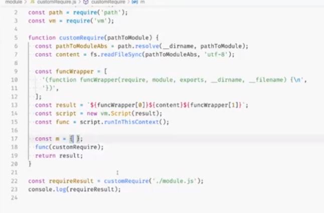

commonjs




1，读取文件，读成一个字符串，然后外面包裹一个函数，并注入变量，require ，module，exports，dirname filename

2，vm模块，可执行代码的解析。new vm.Script(result)  script.runinThisContext()。得到一个执行的函数

-----

 7.JS模块化Commonjs,UMD,CMD规范的了解，以及ES6的模块化跟其他几种的区别，以及出现的意义。ok

 简单介绍前端模块化，amd，cmd，commonjs es6的module 

 commonjs 和 es6的module哪个支持异步 

webpack模块化

这些模块化，是如何处理循环引用的问题  这个问题，

webpack详细原理目录好好看看

代码分割原理

### 什么是模块?

- 将一个复杂的程序依据一定的规则(规范)封装成几个块(文件), 并进行组合在一起
- 块的内部数据与实现是私有的, 只是向外部暴露一些接口(方法)与外部其它模块通信

理解原理：**看打包成什么**

## 二、模块化规范

### 1.CommonJS

**在服务器端，模块的加载是运行时同步加载的；在浏览器端，模块需要提前编译打包处理。**

#### (2)特点

- 所有代码都运行在模块作用域，不会污染全局作用域。
- 模块可以多次加载，但是只会在第一次加载时运行一次，然后运行结果就被缓存了，以后再加载，就直接读取缓存结果。要想让模块再次运行，必须清除缓存。
- 模块加载的顺序，按照其在代码中出现的顺序。

#### (3)基本语法

- 暴露模块：`module.exports = value`或`exports.xxx = value`
- 引入模块：`require(xxx)`,如果是第三方模块，xxx为模块名；如果是自定义模块，xxx为模块文件路径

底层源码学习，了解

**CommonJS模块的加载机制是，输入的是被输出的值的拷贝。也就是说，一旦输出一个值，模块内部的变化就影响不到这个值**

### 2.AMD

CommonJS规范加载模块是同步的，也就是说，只有加载完成，才能执行后面的操作。**AMD规范则是非同步加载模块，允许指定回调函数**。由于Node.js主要用于服务器编程，模块文件一般都已经存在于本地硬盘，所以加载起来比较快，不用考虑非同步加载的方式，所以CommonJS规范比较适用。但是，**如果是浏览器环境，要从服务器端加载模块，这时就必须采用非同步模式，因此浏览器端一般采用AMD规范**。此外AMD规范比CommonJS规范在浏览器端实现要来着早。

- 使用require.js

RequireJS是一个工具库，主要用于客户端的模块管理。它的模块管理遵守AMD规范，**RequireJS的基本思想是，通过define方法，将代码定义为模块；通过require方法，实现代码的模块加载**。

### 3.CMD

**CMD规范专门用于浏览器端，模块的加载是异步的，模块使用时才会加载执行**。CMD规范整合了CommonJS和AMD规范的特点。在 Sea.js 中，所有 JavaScript 模块都遵循 CMD模块定义规范。

**① CommonJS 模块输出的是一个值的拷贝，ES6 模块输出的是值的引用**。

**② CommonJS 模块是运行时加载，ES6 模块是编译时输出接口**。


amd,cmd都是用于浏览器端，异步加载，回调函数执行代码，而amd是依赖全放前面，提前加载，cmd是用到再加载

CommonJS模块是运行时加载，ES6 Module是编译时输出接口；？？？ （回去看看深入浅出nodejs怎么讲的）

CommonJS加载的是整个模块，将所有的接口全部加载进来，ES6 Module可以单独加载其中的某个接口；

CommonJS输出是值的拷贝，ES6 Module输出的是值的引用，被输出模块的内部的改变会影响引用的改变；

CommonJS `this`指向当前模块，ES6 Module `this`指向`undefined`;

-----

以上都是介绍，但是并没有说原理

## commonjs原理

```bash
[
  {
    "id":1,
    "source":"module.exports = function(x) {\n  console.log(x);\n};",
    "deps":{}
  },
  {
    "id":2,
    "source":"var foo = require(\"./foo\");\nfoo(\"Hi\");",
    "deps":{"./foo":1},
    "entry":true
  }
]
```

这是编译后的文件

```javascript
var module = {
  exports: {}
};

(function(module, exports) {
  exports.multiply = function (n) { return n * 1000 };
}(module, module.exports))

var f = module.exports.multiply;
f(5) // 5000 
```

https://segmentfault.com/a/1190000010349749

----

RequireJS

 Sea.js

原理

循环引用问题

wbepack 处理模块化

https://segmentfault.com/a/1190000010349749

-----

`AMD`（异步模块定义，推崇依赖前置）、`CMD`（通用模块定义，推崇依赖就近）。

AMD规范的实现主要有RequireJS，CMD规范的主要实现有SeaJS。但是SeaJS已经停止维护了

因为在ES6中已经有了模块化的实现，随着ES6的普及，第三方的模块化实现将会慢慢的淘汰

CommonJS的核心思想是通过`rquire`方法来同步加载依赖的其他模块，通过`module.exports`到处需要暴露的接口。

**commonjs底层也是用了，  var content = fs.readFileSync(filename, 'utf8');**

**readFileSync来实现同步加载**

**模块的加载实质上就是，注入exports、require、module三个全局变量**，**然后执行模块的源码，然后将模块的 exports 变量的值输出**

commonjs遇到循环引用的问题：

```js

Module._load = function(request, parent, isMain) {

  //  计算绝对路径
  var filename = Module._resolveFilename(request, parent);

  //  第一步：如果有缓存，取出缓存
  var cachedModule = Module._cache[filename];
  if (cachedModule) {
    return cachedModule.exports;
  }
  
  // 第二步：是否为内置模块
  if (NativeModule.exists(filename)) {
    return NativeModule.require(filename);
  }

  // 第三步：生成模块实例，存入缓存
  var module = new Module(filename, parent);
  Module._cache[filename] = module;

  // 第四步：加载模块
  try {
    module.load(filename);
    hadException = false;
  } finally {
    if (hadException) {
      delete Module._cache[filename];
    }
  }

  // 第五步：输出模块的exports属性
  return module.exports;
};
```

(1)import export是在编译的时候执行的，并且import的对象被修改，会导致源文件被修改。所以上述问题可以这样解决：授权登录后修改下import进来的网络请求对象的header!
(2)require module.exports是在代码执行阶段执行，它拷贝了一份源文件，所以修改require进来的内容并不会造成源文件的更改！

**循环引用问题**

**CommonJS的做法是，一旦出现某个模块被"循环加载"，就只输出已经执行的部分，还未执行的部分不会输出。**

**ES6模块的运行机制与CommonJS不一样，它遇到模块加载命令`import`时，不会去执行模块，而是只生成一个引用。等到真的需要用到时，再到模块里面去取值。**

**ES6根本不会关心是否发生了"循环加载"，只是生成一个指向被加载模块的引用，需要开发者自己保证，真正取值的时候能够取到值。**

> ```javascript
> // a.js
> import {bar} from './b.js';
> export function foo() {
>   bar();  
>   console.log('执行完毕');
> }
> foo();
> 
> // b.js
> import {foo} from './a.js';
> export function bar() {  
>   if (Math.random() > 0.5) {
>     foo();
>   }
> }
> ```

按照CommonJS规范，上面的代码是没法执行的。`a`先加载`b`，然后`b`又加载`a`，这时`a`还没有任何执行结果，所以输出结果为`null`，即对于`b.js`来说，变量`foo`的值等于`null`，后面的`foo()`就会报错。

但是，ES6可以执行上面的代码。

> ```bash
> $ babel-node a.js
> 
> 执行完毕
> ```

`a.js`之所以能够执行，原因就在于ES6加载的变量，都是动态引用其所在的模块。只要引用是存在的，代码就能执行。

**如何处理commonjs循环引用的问题**

**commonjs，遇到循环引用，直接返回已经执行的部分，es6是动态引入，在读到对应变量才去取值。所以只要保证读取的时候能读到就行**

http://www.ruanyifeng.com/blog/2015/11/circular-dependency.html

4.3 **require循环依赖**

我们一般使用的时候，都是依赖注入，如果是有循环依赖，那么可以直接利用require解决

```javascript
define('a',['b'],function(b){
    //dosomething
});
define('b',['a'],function(a){
    //dosomething
});
//为了解决循环依赖，在循环依赖发生的时候，引入require：
define('a',['b','require'],function(b,require){
    //dosomething
    require('b')
});
复制代码
```

通常情况下，你不应该使用require()的方式来获取一个模块，而是使用传递给模块构造函数的参数。循环依赖很罕见，通常表明，你可能要重新考虑这一设计。然而，有时需要这样用，在这种情况下，就使用上面那种指定require()的方式吧。

如果你熟悉 CommonJS 模块的写法，你也可以使用 exports 创建一个空对象来导出模块，这样定义的模块可以被其他模块立即使用。即使在循环依赖中，也可以安全的直接使用。 不过这只适用于导出的模块是对象，而不是一个函数:

**sea的循环依赖**

在a模块的回调函数中寻找a模块依赖的模块后（这时a模块的状态是SAVED了），会判断a模块所依赖的模块是否跟自己有循环依赖的关系，如果有，就不去下载，seajs是通过getPureDependencies方法进行判断的，由于这时b模块还不存在于cachedModules中，所以这里不会检查出a与b有循环依赖的关系。

因此，去下载b模块，下载好了之后，b模块的状态是FETCHED，然后解析b模块，这时就会从b模块的回调函数中寻找b模块依赖的模块，这里检查出来了是a模块，这时b模块的状态变成了SAVED的。然后判断a模块是否与自己（b模块）循环依赖。由于此时a模块存在，并且状态是SAVED，这时就会检查出来了有依赖，因此b模块的状态就会直接变成了READY

就是会先去判断和自身有没有循环依赖，如果有，就直接把当前模块状态变成ready

var STATUS = { 
　　'FETCHING': 1, // The module file is fetching now. 模块正在下载中 
　　'FETCHED': 2, // The module file has been fetched. 模块已下载 
　　'SAVED': 3, // The module info has been saved. 模块信息已保存 
　　'READY': 4, // All dependencies and self are ready to compile. 模块的依赖项都已下载，等待编译 
　　'COMPILING': 5, // The module is in compiling now. 模块正在编译中 
　　'COMPILED': 6 // The module is compiled and module.exports is available. 模块已编译 
}

----

RequireJS原理

　　requirejs 加载模块的核心思想是利用了动态加载脚本的异步性以及 onload 事件以毒攻毒，关于脚本的加载，我们需要注意一下几点：

- 　　在 HTML 中引入 <script> 标签是同步加载；
- 　　在脚本中动态加载是异步加载，且由于被加载的脚本在事件队列的后端，因此总是会在当前脚本之后执行；
- 　　使用 onload 和 onerror 事件可以监听脚本加载完成，以异步的事件来处理异步的事件；

---

 Sea.js原理

`AMD`（异步模块定义，推崇依赖前置）、`CMD`（通用模块定义，推崇依赖就近）。

**原理就是把一堆js预先用script的原始模式加载下来**

----

wbepack 处理模块化

重点： 

1）我们的模块被转换成了立即执行函数表达式(IIFE)，函数会自执行，进行模块的创建以及链接等；（runtime代码）

2）所有模块组装成对象作为函数的参数传入。对象的构成：{ [文件的路径]：[被包装后的模块内容] }；

3）每个模块都被构造的函数包裹。（模块代码的转换）

原来是将导出的变量绑定到exports上。由于age被标记为未使用，因此并不会被注册到exports上。而通过使用__webpack_require__.d将name绑定到exports，这里需要注意三点：

- 通过闭包传引用的方式（getter的实现）是为了实现ESM的规范：导出不是值的复制，而是共享的引用。使用时exports.name，会触发getter返回其当前值；
- 显式的为对象属性添加属性描述器{enumerable: true, get: getter}，由于set：undefined，严格模式（"use strict"）下，不能更改其值。
- 细心的童鞋会发现，__webpack_require__.d是被放到模块顶层首先被执行的，为什么呢？为了实现ESM的export的提升（变量|函数的区别，参见[模块化中ES的循环依赖部分](http://mp.weixin.qq.com/s?__biz=MzI1NDYzMjA4NQ==&mid=2247483729&idx=1&sn=24755ab915c04d61893712b16671103e&chksm=e9c308abdeb481bdc6c9099b552b921d3cb057e6cba56ce8263122a3bd9b552c5439dbfcf9c5&scene=21#wechat_redirect)），注意和后面介绍的模块初始化时放入缓存一起理解。

类似commonjs，但是导出了一个值的引用，设置了他的getter属性

```js
// define getter function for harmony exports__webpack_require__.d = function(exports, name, getter) {  //判断该变量是否已经挂载到exports上  if(!__webpack_require__.o(exports, name)) {    //给exports添加导出变量（接口），可枚举，通过getter读取自定义的值    
Object.defineProperty(exports, name, { enumerable: true, get: getter });  }};
```

可以看到，__webpack_require__.n主要是获取模块的default导出。判断模块是否为__esModule，是则直接返回module['default']值，不是则返回模块对象。因为CommonJs规范中，模块的默认导出就是module对象自身。（这里说的module即__webpack_require__.n(module)的参数，即module.exports对象，不要混淆）。

讲的太复杂了，最重要的一点，就是，根据是common还是es6，是通过是暴露值拷贝，还是设置getter方法，来实现值的动态引用

异步加载复习

1）将异步加载的模块标记为加载完成：installedChunks[chunkId] = 0;(不要忘记创建script异步获取模块时，设置了setTimeout和onScriptComplete做超时和异常捕获)

2）将异步加载的模块先缓存在全局维护的modules中（下载后并不立即执行模块内容），真正执行由调用__webpack_require__时负责；

3）**由于installedChunks中记录了模块对应的[resolve, reject, promise]，加载完成后调用resolve，触发回调函数。**


```
(function (modules) {/* 省略函数内容 */})
([
function (module, exports, __webpack_require__) {
    /* 模块index.js的代码 */
},
function (module, exports, __webpack_require__) {
    /* 模块bar.js的代码 */
}
]);
传入nodules这些参数，里面有__webpack_require__是webpack提供的，module，exports也是，然后进行模块的加载
```

```js
(function(modules) { // webpackBootstrap
    // The module cache
    var installedModules = {};
    // The require function
    function __webpack_require__(moduleId) {
        // Check if module is in cache
        if(installedModules[moduleId]) {
            return installedModules[moduleId].exports;
        }
        // Create a new module (and put it into the cache)
        var module = installedModules[moduleId] = {
            i: moduleId,
            l: false,
            exports: {}
        };
        // Execute the module function
        modules[moduleId].call(module.exports, module, module.exports, __webpack_require__);
        // Flag the module as loaded
        module.l = true;
        // Return the exports of the module
        return module.exports;
    }
    // expose the modules object (__webpack_modules__)
    __webpack_require__.m = modules;
    // expose the module cache
    __webpack_require__.c = installedModules; 
    // define getter function for harmony exports  为es6定义getter
    __webpack_require__.d = function(exports, name, getter) {
        if(!__webpack_require__.o(exports, name)) {
            Object.defineProperty(exports, name, {
                configurable: false,
                enumerable: true,
                get: getter
            });
        }
    };
    // getDefaultExport function for compatibility with non-harmony modules
    __webpack_require__.n = function(module) {
        var getter = module && module.__esModule ?
            function getDefault() { return module['default']; } :
            function getModuleExports() { return module; };
        __webpack_require__.d(getter, 'a', getter);
        return getter;
    };
    // Object.prototype.hasOwnProperty.call
    __webpack_require__.o = function(object, property) { return Object.prototype.hasOwnProperty.call(object, property); };
    // __webpack_public_path__
    __webpack_require__.p = "";
    // Load entry module and return exports
    return __webpack_require__(__webpack_require__.s = 0);
})
/************************************************************************/
([
/* 0 */
(function(module, exports, __webpack_require__) {

"use strict";

var bar = __webpack_require__(1);
bar.bar();

}),
/* 1 */
(function(module, exports, __webpack_require__) {

"use strict";

exports.bar = function () {
    return 1;
}

})
]);
```

0是index，后面的是index引用的模块

原理比较简单： 

webpack传入的第一个参数`module`是当前缓存的模块，包含当前模块的信息和`exports`；第二个参数`exports`是`module.exports`的引用，这也符合commonjs的规范；第三个`__webpack_require__ `则是`require`的实现。

在我们的模块中，就可以对外使用`module.exports`或`exports`进行导出，使用`__webpack_require__`导入需要的模块，代码跟commonjs完全一样。

传入已经缓存了的模块，还有当模块的信息，还有导出的exports。但三个就是webpacj+require，用于模块内部引入其他模块。先是判断缓存中是否有该模块，


加载模块函数，就是执行模块函数，得到module.exports

在这里**webpack_require**.n会判断module是否为es模块，当__esModule为true的时候，标识module为es模块，那么module.a默认返回module.default，否则返回module。

具体实现则是通过 **webpack_require**.d将具体操作绑定到属性a的getter方法上的。

然后var getter = module && module.__esModule ？function getDefault() { return module[‘default’]; } : function getModuleExports() { return module; }; 判断是es模块还是commonjs模块。就是多了一层包装，

**至此webapck模块化的定义以及基本实现就浮出水面了，本质原理是通过一个IIFE函数，把exports和require定义先包揽在里头，然后把各个模块当成参数传递过去。在IIFE函数内里调用整个项目的入口文件，再通过入口文件一一关联到其他的模块，从而形成一个庞大的树形结构。**

既然 webpack 不会因为循环引用导致打包出错，既然 webpack 不会因为循环引用导致打包出错，也就意味着项目中可能隐藏着未知的循环引用，怎么才能知道是否存在循环引用呢？有一个插件可以解决这个问题：`circular-dependency-plugin`。
作者：白胜
链接：https://www.imooc.com/article/260265
来源：慕课网
本文原创发布于慕课网 ，转载请注明出处，谢谢合作也就意味着项目中可能隐藏着未知的循环引用，怎么才能知道是否存在循环引用呢？有一个插件可以解决这个问题：`circular-dependency-plugin`。


-----

## 继续探究，webpack是如何加载es6模块和commonjs模块

- esModule的引用和commonJs的引用特点和区别
- esModule和commonJs是如何去处理循环加载的情况
- 为什么esModule需要有默认导出、并且是一个具体的值、而不是一个具体的表达式。


webpack对于es模块的实现，也是基于自己实现的`__webpack_require__ `和`__webpack_exports__ `，装换成类似于commonjs的形式。对于es模块和commonjs混用的情况，则需要通过`__webpack_require__.n`的形式做一层包装来实现。


看了下源码，就是在读到import就去加载，所以懒加载是把import放到一个函数里面。当路由访问到的时候，执行这个函数，再执行import语句

然后就是懒加载的流程,利用scrip标签jsonp获取模块代码,模块代码里面resovle,然后就可以在里面拿到代码,在then中执行业务代码.

webpack是把es6处理成类似commonjs的性质，只不过一个是值，一个有getter属性，来获得引用。也是立即函数，添加export require（看源码的过程中）


**es6是导出一个getter，用到的时候才去取值，只要保证使用的时候能拿到值就行，不然就是undefined。不是导致堆栈爆炸**

**commonjs，如果有遇到循环引用，就会先把当前执行的部分代码导出，也是不会有报错**

我们一般使用的时候，都是依赖注入，如果是有循环依赖，那么可以直接利用require解决

```javascript
define('a',['b'],function(b){
    //dosomething
});
define('b',['a'],function(a){
    //dosomething
});
//为了解决循环依赖，在循环依赖发生的时候，引入require：
define('a',['b','require'],function(b,require){
    //dosomething
    require('b')
});
复制代码
```

通常情况下，你不应该使用require()的方式来获取一个模块，而是使用传递给模块构造函数的参数。循环依赖很罕见，通常表明，你可能要重新考虑这一设计。然而，有时需要这样用，在这种情况下，就使用上面那种指定require()的方式吧。

**amd循环依赖，就直接把模块状态变成ready，避免了报错。**

webpack也是没有对循环引用进行处理，但是

```js
    function __webpack_require__(moduleId) {
      // Check if module is in cache
      if (installedModules[moduleId]) {
        return installedModules[moduleId].exports;
      }
      // Create a new module (and put it into the cache)
      var module = installedModules[moduleId] = {
        i: moduleId,
        l: false,
        exports: {}
      };
      // Execute the module function
      modules[moduleId].call(module.exports, module, module.exports, __webpack_require__);
      // Flag the module as loaded
      module.l = true;
      // Return the exports of the module
      return module.exports;
    }
```

看源码是，执行__webpack_require__的时候，**先判断是否有缓存，然后再定义好缓存，再执行代码。也就是循环引用的时候，只要执行了a，就有了缓存，再执行b时，b引用了a，拿到的是exports，不会报错，**

> 答案是没有的。而且将打包代码执行，其执行结果跟上面的一模一样。失望的 webpack，居然检测不了循环加载。在这里举例的是 commonjs 例子，ES Modules 经试验也展现同样的结果。
> 但方法总比困难多，在这里推荐使用 webpack 插件 circular-dependency-plugin ，能够检测所有存在循环依赖的地方，尽早检测错误，省去大量 debug 的时间。
>
> 循环依赖关系在复杂的软件工程中经常是必须的，循环依赖关系的存在并不总是意味着存在缺陷，但是如果您认为存在缺陷，这个模块可以帮您找到它。

commonjs es6说法不一样，但是结果是一样的，读到对应的引用时，当时的值是什么状况就是什么状况，不会一直一直重复读取

**够了可以了**

-----

```js
const { ss } = require('./lib');
const lib = require('./lib');
console.log('ss', ss);
console.log('lib', lib);
setTimeout(()=>{
    console.log('ss', ss);
    console.log('lib', lib);
},3000);
复制代码
// lib.js
module.exports.ss = 'ss1';
setTimeout(()=>{
    module.exports.ss = 'ss2';
    console.log('module.exports', module.exports);
},2000);

复制代码
执行结果
ss ss1
lib { ss: 'ss1' }
lib module.exports { ss: 'ss2' }
ss ss1
lib { ss: 'ss2' }
```

从执行结果可以看出

1. commonjs 导出的是module.exports这个对象，导出值给这个对象添加新的属性会影响导入值。
2. `const { ss } = require('./lib');` 相当于 `const { ss } = {ss:'ss1'};` 解构赋值，相当于`const ss = 'ss1';`所以导出对象修改ss不能使导入对象`ss`也变成2。


## 阶段性结论

commonjs的导出是值拷贝这句话是错误的，commonjs导出的是module.exports，commonjs的导入就是变量赋值。当module.exports的值是字符串、数字等原始类型时，赋值是值拷贝才会产生导出值改变不会导致导入值改变的现象


**commonjs导出的是module.exports，commonjs的导入就是变量赋值。当module.exports的值是字符串、数字等原始类型时，赋值是值拷贝才会产生导出值改变不会导致导入值改变的现象。 esmodule中的导入值更像一个指针，导入导出值都指向同一个同一个内存地址，所以导入值会随导出值变化而变化。**

1. commonjs 导出的是module.exports这个对象，导出值给这个对象添加新的属性会影响导入值。

   `const { ss } = require('./lib');` 相当于 `const { ss } = {ss:'ss1'};` 解构赋值，相当于`const ss = 'ss1';`所以导出对象修改ss不能使导入对象`ss`也变成2。

## module.exports初始的时候置为{},exports也指向这个空对象

exports指向exports，commonjs只人module.exports。如果直接给exports赋值没有，给他加属性有用

## export default 和 export 区别：

1.export与export default均可用于导出常量、函数、文件、模块等
 2.你可以在其它文件或模块中通过import+(常量 | 函数 | 文件 | 模块)名的方式，将其导入，以便能够对其进行使用
 3.在一个文件或模块中，export、import可以有多个，export default仅有一个
 4.通过export方式导出，在导入时要加{ }，export default则不需要

**let** sex = "boy"; **export** **default** sex（sex不能加大括号）也会给变量做赋值操作，把export default变量赋值给模块。所以之后改变接受不到变化


```
// index.js
import {a} from './lib.js';
import b from './lib.js';
console.log('a',a);
console.log('b',b);

setTimeout(()=>{
    console.log('a',a);
    console.log('b',b);
}, 3000);
复制代码
// lib.js
export let a = 1;
let b = 1;
export default b;
setTimeout(()=>{
    a = 2;
    b = 2;
    console.log('a', a);
    console.log('b', b);
}, 2000);
复制代码
执行结果
a 1
b 1
lib a 2
lib b 2
a 2
b 1
```

