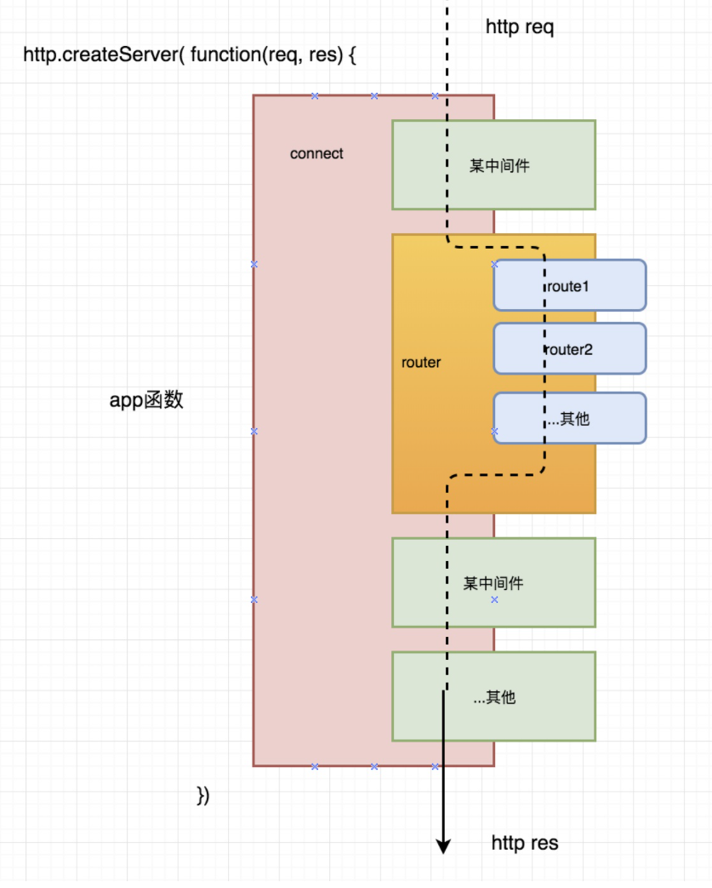

## express框架核心原理



express框架大家都已经都很熟悉，是NodeJS最流行的轻量web开发框架。他简单易用，却功能强大。最近一个月来一直反复研究调试express框架，深究其源码不觉为之惊叹，不论是原理与代码都非常简单，很容易理解也很受用，觉得有必要写个文章分享一下。本系列分2部分全面介绍express。上篇讲express框架主要原理和重要的组成部分，下篇是利用这些原理从零开发一个express框架（覆盖主要功能）；一篇理论一篇实战演练配合完全深入掌握express原理。

说明express源码可能会考，注意

## 适合读者

- 有较扎实的JavaScript的基础
- 了解NodeJS的http、fs、path等模块
- 了解express

## [express](https://link.zhihu.com/?target=http%3A//www.expressjs.com.cn/)框架提供的能力

可以在express的官网中看到express具备中间件的使用、路由、模板引擎、静态文件服务、设置代理等主要能力。后面将逐一讲解其实现。

- **NodeJS的http模块创建的服务**
- **express中间件思想的本质 - 异步串行化流程控制**
- **express的router实现原理**
- **模板引擎**
- **静态文件服务**

---

connect.js的具体内容先不关心，后面会重点介绍。可以看出connect是一个函数，运行返回一个app，app是一个形如function(req, res , next){ ... } 的函数。express的createApplication返回即是此app，用于http.createServer的回调。并在这个函数上混入的许多能力，如req、res的处理、模板引擎、静态文件服务、router的能力。

> 就是在express中，启动http.createServer，在里面回调一个函数，这个函数被混入了很多能力

用比较简单的伪代码表示如下

```js
const app = express();

// nodejs启动时，app函数内部被express增加了能力，如中间件的调用 
app.use(middleware)； // 中间件 
app.use(router)； // 路由 
app.engine('ejs'); // 模板引擎 
app.statifc('public') // 静态文件服务 
// ... 还有代理以及其他许多属性与方法

const server = http.createServer(
      function app(req, res){  // 此app函数即为express所构造
           // http请求时，req， res被混入许多属性与方法，做了很多处理
           // 串行匹配运行按顺序注册的各注册的中间件如：
           // 1、日志、cookie、bodyparser等开发者自己注册的中间件
           // 2、router中间件
           // 3、静态文件服务
           // 4、模板引擎处理
           // 经过匹配的中间件处理后输出返回
      }
);

server.listen(8000);
```

---

## express中管理运行中间件解析--connect.js

不难看出，app.use中间件时，只是把它放入一个数组中。当http请求时，app会从数组中逐个取出，进行匹配过滤，逐个运行。遍历完成后，运行finalhandler，结束一个http请求。可以从http请求的角度思考，一次请求它经历经历了多少东西。express的这个中间件架构就是负责管理与调用这些注册的中间件。**中间件顺序执行，通过next来继续下一个，一旦没有继续next，则流程结束。**

> 所以express，再一次请求进来的时候，经历了很多中间件，中间件存在数组里面，请求来了就按顺序一个个执行，知道没有了，流程结束。。**问题：中间件执行顺序**

## Router是一个内置在app函数上的中间件

上面的usedRouter是个开关，未开启则不加入router中间件，因为应用理论上也是可能不用到router的。当app[method] 如app.get('/user', fn)调用后，则触发this.use(this.router) 使用router中间件，同时把usedRouter设置为true。之后往router对象中加入fn回调函数。

第一次调用app.get('/user', fn)的时候，把router中间件加入，并把路由信息加入到路由对象中

```js
 this._router.addRoute(method, path, Array.prototype.slice.call(arguments, 1))
```

---

## 视图-模板引擎(前后端分离不用)

通过这两个函数设置views视图所在的路径、模板引擎类型，之后express就可以结合router提供的render page，data，render callback的数据进行视图渲染

实际上express仅仅只是做了调用；这里有个通用的支持各种模板引擎的模块[consolidate.js](https://link.zhihu.com/?target=https%3A//github.com/tj/consolidate.js)

## 静态文件服务

静态文件服务也是一个中间件，express做的事情也仅仅是引用。require一个serve-static，内置在app函数上。

```js
app.static = function (dir) {
    this.use(serveStatic(process.cwd() + '/' + dir), {});
};
```

当调用app.static时就会把静态文件服务中间件放入stack中，这里与express调用方式稍有不同，因为笔者觉得这么写更好更简单。

-----

**express核心主要是一个中间件串行控制方案，内置来router、静态文件服务中间件、扩展了req，res，其他功能都是集成了其他模块来加强的；确实是一个简单易用的web框架。**

**中间件的异步串行，，异步异步在哪里**

这篇教程只是解密了express，还要深入学习，更多资料辅助来学习这个


中间件的原理，node中间件的原理


如何更加深入学习，让面试官印象深刻

-----

https://www.kancloud.cn/cris/express/545327

https://juejin.im/post/6844903569376673799

介绍+原理

https://juejin.im/post/6844903569376673799#heading-1

待看，有点难看懂，

得系统学习下，排入计划中

https://segmentfault.com/a/1190000018340406