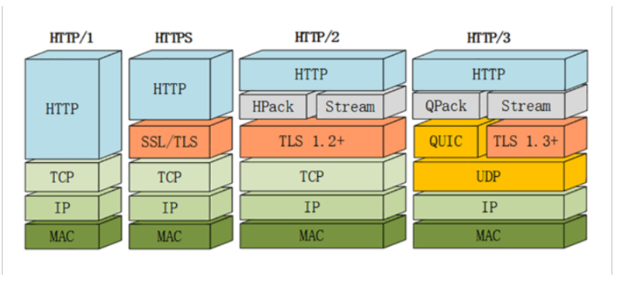
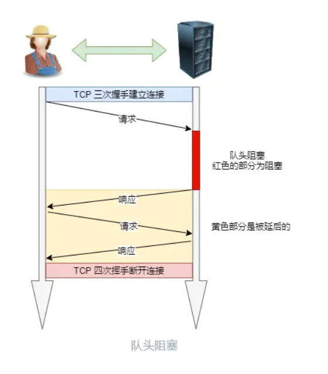

- QUIC 协议(Quick UDP Internet Connection)基于 UDP，正是看中了 UDP 的速度与效率。同时 QUIC 也整合了 TCP、TLS 和 HTTP/2 的优 点，并加以优化。
- 特点:

1. 减少了握手的延迟(1-RTT 或 0-RTT)
2. 多路复用，并且没有 TCP 的阻塞问题
3. 连接迁移，(主要是在客户端)当由 Wifi 转移到 4G 时，连接不 会被断开。

- 那 QUIC 解决队头阻塞问题的的方法:

1. QUIC 的传输单元是 Packet，加密单元也是 Packet，整个加密、 传输、解密都基于 Packet，这样就能避免 TLS 的队头阻塞问题;
2. QUIC 基于 UDP，UDP 的数据包在接收端没有处理顺序，即使中间 丢失一个包，也不会阻塞整条连接，其他的资源会被正常处理。

讲的不好

----

http3真正解决了队头阻塞的方式（从tcp层面解决了）TCP 改用 QUIC

找下视频，看看极客时间，怎么解决的

file:///C:/%E5%AD%A6%E4%B9%A0%E8%B5%84%E6%96%99/32%E4%B8%A83%E5%B1%95%E6%9C%9B.html

看完这个再下班

## QUIC 协议

从这张图里，你可以看到 HTTP/3 有一个关键的改变，那就是它把下层的 TCP“抽掉”了，换成了 UDP。因为 UDP 是无序的，包之间没有依赖关系，所以就从根本上解决了“队头阻塞

不需要建连和断连，通信成本低，也就非常灵活、高效，“可塑性”很强。

所以，QUIC 就选定了 UDP，在它之上把 TCP 的那一套连接管理、拥塞窗口、流量控制等“搬”了过来，“去其糟粕，取其精华”

就像 TCP 在 IP 的基础上实现了可靠传输一样，QUIC 也基于 UDP 实现了可靠传输，保证数据一定能够抵达目的地。它还引入了类似 HTTP/2 的“流”和“多路复用”，单个“流”是有序的，可能会因为丢包而阻塞，但其他“流”不会受到影响

因为 TLS1.3 已经在去年（2018）正式发布，所以 QUIC 就直接应用了 TLS1.3，顺便也就获得了 0-RTT、1-RTT 连接的好处。

**但 QUIC 并不是建立在 TLS 之上，而是内部“包含”了 TLS。它使用自己的帧“接管”了 TLS 里的“记录”，握手消息、警报消息都不使用 TLS 记录，直接封装成 QUIC 的帧发送，省掉了一次开销。**

QUIC 使用不透明的“**连接 ID**”来标记通信的两个端点，客户端和服务器可以自行选择一组 ID 来标记自己，这样就解除了 TCP 里连接对“IP 地址 + 端口”（即常说的四元组）的强绑定，支持“**连接迁移**”（Connection Migration）

手机会自动由 **4G 切换到 WiFi。这时 IP 地址会发生变化**，TCP 就必须重新建立连接。而 QUIC 连接里的两端连接 ID 不会变，所以连接在“逻辑上”没有中断，它就可以在新的 IP 地址上继续使用之前的连接，消除重连的成本，实现连接的无缝迁移。

1，quic是基于udp的，不需要建立连接和断链，并把tcp中，拥塞控制，链接管理加入进来，也加了可靠传输

2，quic协议包含了tls，只能加密通信，用自己的帧接管tls中消息，握手消息直接变成帧，省去一些开销

3，quic是把之前tcp淡定ip和端口，而换成链接id，这样当切换4g和wifiip变化的时候，也不需要重连

4，采用多流，多路复用，单个流有序，一个流丢包会阻塞，但是其他流不会受影响。

由于流管理被“下放”到了 QUIC，所以 HTTP/3 里帧的结构也变简单了。

头部压缩算法在 HTTP/3 里升级成了“**QPACK**”，使用方式上也做了改变。虽然也分成静态表和动态表，但在流上发送 HEADERS 帧时不能更新字段，只能引用，索引表的更新需要在专门的单向流上发送指令来管理，解决了 HPACK 的“队头阻塞”问题。

tcp+tls+多路复用 = quic

 **QUIC 是一个在 UDP 之上的伪 TCP + TLS + HTTP/2 的多路复用的协议。**

一个流就是一个请求响应，它阻塞不会影响其他流，所以不会发生队头阻塞

---

> 读者问：“为啥 ssl 的握手是 4 次？”

SSL/TLS 1.2 需要 4 握手，需要 2 个 RTT 的时延，我文中的图是把每个交互分开画了，实际上把他们合在一起发送，就是 4 次握手：

另外， SSL/TLS 1.3 优化了过程，只需要 1 个 RTT 往返时延，也就是只需要 3 次握手：

这两个

这两个不清楚，不知道几个=rtt，问道就凉凉，背一下

---

## HPACK

header 字段表将 header 字段映射到索引值，从而得到编码。这些 header 字段表可以在编码或解码新 header 字段时进行增量更新。

在编码形式中，header 字段以字面形式表示或作为对 header 字段表中的一个 header 字段的引用。因此，可以使用引用和字面值的混合来编码 header 字段的列表。

字面值可以直接编码，也可以使用静态霍夫曼编码(最高压缩比 8:5)。

编码器负责决定将哪些 header 字段作为新条目插入 header 字段表中。解码器执行对编码器指定的 header 字段表的修改，从而在此过程中重建 header 字段的列表。这使解码器保持简单并可以与多种编码器互操作。