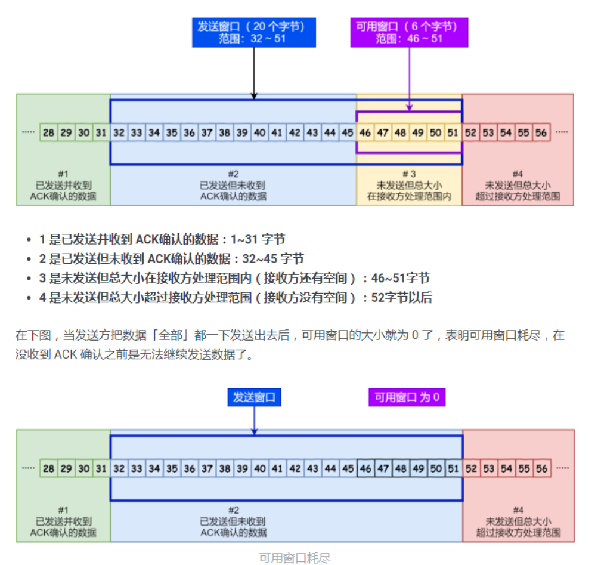

# tcp

为了实现可靠性传输，需要考虑很多事情，例如数据的破坏、丢包、重复以及分片顺序混乱等问题。如不能解决这些问题，也就无从谈起可靠传输。

那么，TCP 是通过序列号、确认应答、重发控制、连接管理以及窗口控制等机制实现可靠性传输的。

今天，将重点介绍 TCP 的**重传机制、滑动窗口、流量控制、拥塞控制。**

## 重传

所以 TCP 针对数据包丢失的情况，会用**重传机制**解决

### 超时重传

TCP 会在以下两种情况发生超时重传：

- 数据包丢失
- 确认应答丢失

根据上述的两种情况，我们可以得知，**超时重传时间 RTO 的值应该略大于报文往返 RTT 的值**

如果超时重发的数据，再次超时的时候，又需要重传的时候，TCP 的策略是**超时间隔加倍。**

也就是**每当遇到一次超时重传的时候，都会将下一次超时时间间隔设为先前值的两倍。两次超时，就说明网络环境差，不宜频繁反复发送。**

就是观阳说的那种，

### 快速重传

快速重传的工作方式是当收到三个相同的 ACK 报文时，会在定时器过期之前，重传丢失的报文段。

### SACK

这种方式需要在 TCP 头部「选项」字段里加一个 `SACK` 的东西，它**可以将缓存的地图发送给发送方**，这样发送方就可以知道哪些数据收到了，哪些数据没收到，知道了这些信息，就可以**只重传丢失的数据**。

如下图，发送方收到了三次同样的 ACK 确认报文，于是就会触发快速重发机制，通过 `SACK` 信息发现只有 `200~299` 这段数据丢失，则重发时，就只选择了这个 TCP 段进行重复

D-SACK

Duplicate SACK 又称 `D-SACK`，其主要**使用了 SACK 来告诉「发送方」有哪些数据被重复接收了**

## 滑动窗口



## 流量控制（双方发送的合适，发多少接多少，速率，消耗多少数据）

根据上图的流量控制，说明下每个过程： 1. 客户端发送 140 字节数据后，可用窗口变为 220 （360 - 140）。 2. 服务端收到 140 字节数据，**但是服务端非常繁忙，应用进程只读取了 40 个字节，还有 100 字节占用着缓冲区，于是接收窗口收缩到了 260 （360 - 100）**，最后发送确认信息时，将窗口大小通告给客户端。 3. 客户端收到确认和窗口通告报文后，发送窗口减少为 260。 4. 客户端发送 180 字节数据，此时可用窗口减少到 80。 5. 服务端收到 180 字节数据，**但是应用程序没有读取任何数据，这 180 字节直接就留在了缓冲区，于是接收窗口收缩到了 80 （260 - 180）**，并在发送确认信息时，通过窗口大小给客户端。 6. 客户端收到确认和窗口通告报文后，发送窗口减少为 80。 7. 客户端发送 80 字节数据后，可用窗口耗尽。 8. 服务端收到 80 字节数据，**但是应用程序依然没有读取任何数据，这 80 字节留在了缓冲区，于是接收窗口收缩到了 0**，并在发送确认信息时，通过窗口大小给客户端。 9. 客户端收到确认和窗口通告报文后，发送窗口减少为 0。

可见最后窗口都收缩为 0 了，也就是发生了窗口关闭。当发送方可用窗口变为 0 时，发送方实际上会定时发送窗口探测报文，以便知道接收方的窗口是否发生了改变，这个内容后面会说，这里先简单提一下。

> **也就是根据客户端和服务端消费的数据来，计算窗口的大小。如果窗口为0时，会发送窗口探测报文，便知道窗口是否发生变化**


当服务端系统资源非常紧张的时候，操心系统可能会直接减少了接收缓冲区大小，这时应用程序又无法及时读取缓存数据，那么这时候就有严重的事情发生了，会出现数据包丢失的现象。


发现数据大小超过了接收窗口的大小，于是就把数据包丢失了所以，如果发生了先减少缓存，再收缩窗口，就会出现丢包的现象。

**为了防止这种情况发生，TCP 规定是不允许同时减少缓存又收缩窗口的，而是采用先收缩窗口，过段时间再减少缓存，这样就可以避免了丢包情况。**

### 窗口关闭


如果接收窗口仍然为 0，那么收到这个报文的一方就会重新启动持续计时器；

如果接收窗口不是 0，那么死锁的局面就可以被打破了。


**窗口探测的次数一般为 3 次，每次大约 30-60 秒（不同的实现可能会不一样）。如果 3 次过后接收窗口还是 0 的话，有的 TCP 实现就会发 `RST` 报文来中断连接。**

于是，要解决糊涂窗口综合症，就解决上面两个问题就可以了

- **让接收方不通告小窗口给发送方**
- **让发送方避免发送小数据**

## 拥塞控制

**拥塞窗口 cwnd**是发送方维护的一个的状态变量，它会根据**网络的拥塞程度动态变化的**。

我们在前面提到过发送窗口 `swnd` 和接收窗口 `rwnd` 是约等于的关系，那么由于加入了拥塞窗口的概念后，此时发送窗口的值是swnd = min(cwnd, rwnd)，也就是拥塞窗口和接收窗口中的最小值。

拥塞窗口 `cwnd` 变化的规则：

- 只要网络中没有出现拥塞，`cwnd` 就会增大；
- 但网络中出现了拥塞，`cwnd` 就减少；

其实只要「发送方」没有在规定时间内接收到 ACK 应答报文，也就是**发生了超时重传，就会认为网络出现了用拥塞。**


**为了在「发送方」调节所要发送数据的量，定义了一个叫做「拥塞窗口」的概念。**(控制发送方，防止拥塞的时候发送太多数据)

拥塞控制主要是四个算法：

- 慢启动
- 拥塞避免
- 拥塞发生
- 快速恢复

----

# tcp三次握手四次挥手

http3 tcp udp

TCP 是**面向连接的、可靠的、基于字节流**的传输层通信协议。

UDP 不提供复杂的控制机制，利用 IP 提供面向「无连接」的通信服务。

UDP 协议真的非常简，头部只有 `8` 个字节（ 64 位），UDP 的头部格式如下：


UDP 头部格式

- 目标和源端口：主要是告诉 UDP 协议应该把报文发给哪个进程。
- 包长度：该字段保存了 UDP 首部的长度跟数据的长度之和。
- 校验和：校验和是为了提供可靠的 UDP 首部和数据而设计。

**TCP 和 UDP 区别：**

*1. 连接*

- TCP 是面向连接的传输层协议，传输数据前先要建立连接。
- UDP 是不需要连接，即刻传输数据。

*2. 服务对象*

- TCP 是一对一的两点服务，即一条连接只有两个端点。
- UDP 支持一对一、一对多、多对多的交互通信

*3. 可靠性*

- TCP 是可靠交付数据的，数据可以无差错、不丢失、不重复、按需到达。
- UDP 是尽最大努力交付，不保证可靠交付数据。

*4. 拥塞控制、流量控制*

- TCP 有拥塞控制和流量控制机制，保证数据传输的安全性。
- UDP 则没有，即使网络非常拥堵了，也不会影响 UDP 的发送速率。

*5. 首部开销*

- TCP 首部长度较长，会有一定的开销，首部在没有使用「选项」字段时是 `20` 个字节，如果使用了「选项」字段则会变长的。
- UDP 首部只有 8 个字节，并且是固定不变的，开销较小。

*6. 传输方式*

- TCP 是流式传输，没有边界，但保证顺序和可靠。
- UDP 是一个包一个包的发送，是有边界的，但可能会丢包和乱序。

*7. 分片不同*

- TCP 的数据大小如果大于 MSS 大小，则会在传输层进行分片，目标主机收到后，也同样在传输层组装 TCP 数据包，如果中途丢失了一个分片，只需要传输丢失的这个分片。
- UDP 的数据大小如果大于 MTU 大小，则会在 IP 层进行分片，目标主机收到后，在 IP 层组装完数据，接着再传给传输层，但是如果中途丢了一个分片，则就需要重传所有的数据包，这样传输效率非常差，所以通常 UDP 的报文应该小于 MTU。

**TCP 和 UDP 应用场景：**

由于 TCP 是面向连接，能保证数据的可靠性交付，因此经常用于：

- `FTP` 文件传输
- `HTTP` / `HTTPS`

由于 UDP 面向无连接，它可以随时发送数据，再加上UDP本身的处理既简单又高效，因此经常用于：

- 包总量较少的通信，如 `DNS` 、`SNMP` 等
- 视频、音频等多媒体通信
- 广播通信

> 为什么 UDP 头部没有「首部长度」字段，而 TCP 头部有「首部长度」字段呢？

原因是 TCP 有**可变长**的「选项」字段，而 UDP 头部长度则是**不会变化**的，无需多一个字段去记录 UDP 的首部长度。

> 为什么 UDP 头部有「包长度」字段，而 TCP 头部则没有「包长度」字段呢？

先说说 TCP 是如何计算负载数据长度：


其中 IP 总长度 和 IP 首部长度，在 IP 首部格式是已知的。TCP 首部长度，则是在 TCP 首部格式已知的，所以就可以求得 TCP 数据的长度。

大家这时就奇怪了问：“ UDP 也是基于 IP 层的呀，那 UDP 的数据长度也可以通过这个公式计算呀？ 为何还要有「包长度」呢？”

这么一问，确实感觉 UDP 「包长度」是冗余的。

**因为为了网络设备硬件设计和处理方便，首部长度需要是** **`4`****字节的整数倍。**

如果去掉 UDP 「包长度」字段，那 UDP 首部长度就不是 `4` 字节的整数倍了，所以小林觉得这可能是为了补全 UDP 首部长度是 `4` 字节的整数倍，才补充了「包长度」字段。

接下来以三个方面分析三次握手的原因：

- 三次握手才可以阻止重复历史连接的初始化（主要原因）
- 三次握手才可以同步双方的初始序列号
- 三次握手才可以避免资源浪费

*原因一：避免历史连接*

我们来看看 RFC 793 指出的 TCP 连接使用三次握手的**首要原因**：

*The principle reason for the three-way handshake is to prevent old duplicate connection initiations from causing confusion.*

简单来说，三次握手的**首要原因是为了防止旧的重复连接初始化造成混乱。**

客户端连续发送多次 SYN 建立连接的报文，在**网络拥堵**情况下：

- 一个「旧 SYN 报文」比「最新的 SYN 」 报文早到达了服务端；
- 那么此时服务端就会回一个 `SYN + ACK` 报文给客户端；
- 客户端收到后可以根据自身的上下文，判断这是一个历史连接（序列号过期或超时），那么客户端就会发送 `RST` 报文给服务端，表示中止这一次连接。

## syn攻击

我们都知道 TCP 连接建立是需要三次握手，假设攻击者短时间伪造不同 IP 地址的 `SYN` 报文，服务端每接收到一个 `SYN` 报文，就进入`SYN_RCVD` 状态，但服务端发送出去的 `ACK + SYN` 报文，无法得到未知 IP 主机的 `ACK` 应答，久而久之就会**占满服务端的 SYN 接收队列（未连接队列）**，使得服务器不能为正常用户服务。

*避免 SYN 攻击方式一*

其中一种解决方式是通过修改 Linux 内核参数，控制队列大小和当队列满时应做什么处理。

- 当网卡接收数据包的速度大于内核处理的速度时，会有一个队列保存这些数据包。控制该队列的最大值如下参数：


```
net.core.netdev_max_backlog
```

- SYN_RCVD 状态连接的最大个数：


```
net.ipv4.tcp_max_syn_backlog
```

- 超出处理能时，对新的 SYN 直接回报 RST，丢弃连接：


```
net.ipv4.tcp_abort_on_overflow
```

> 太多未建立连接的syn直接rst掉

受到 SYN 攻击：

- 如果不断受到 SYN 攻击，就会导致「 SYN 队列」被占满。

`tcp_syncookies` 的方式可以应对 SYN 攻击的方法：


```
net.ipv4.tcp_syncookies = 1
```


tcp_syncookies 应对 SYN 攻击

- 当 「 SYN 队列」满之后，后续服务器收到 SYN 包，不进入「 SYN 队列」；
- 计算出一个 `cookie` 值，再以 SYN + ACK 中的「序列号」返回客户端，
- 服务端接收到客户端的应答报文时，服务器会检查这个 ACK 包的合法性。如果合法，直接放入到「 Accept 队列」。 
- 最后应用通过调用 `accpet()` socket 接口，从「 Accept 队列」取出的连接。

> 满了不接，而是直接回复一个cookie

## 03 TCP 连接断开

你可以看到，每个方向都需要**一个 FIN 和一个 ACK**，因此通常被称为**四次挥手**。

这里一点需要注意是：**主动关闭连接的，才有 TIME_WAIT 状态。**

> 为什么 TIME_WAIT 等待的时间是 2MSL？

`MSL` 是 Maximum Segment Lifetime，**报文最大生存时间**，它是任何报文在网络上存在的最长时间，超过这个时间报文将被丢弃。因为 TCP 报文基于是 IP 协议的，而 IP 头中有一个 `TTL` 字段，是 IP 数据报可以经过的最大路由数，每经过一个处理他的路由器此值就减 1，当此值为 0 则数据报将被丢弃，同时发送 ICMP 报文通知源主机。

MSL 与 TTL 的区别： MSL 的单位是时间，而 TTL 是经过路由跳数。所以 **MSL 应该要大于等于 TTL 消耗为 0 的时间**，以确保报文已被自然消亡。

TIME_WAIT 等待 2 倍的 MSL，比较合理的解释是： 网络中可能存在来自发送方的数据包，当这些发送方的数据包被接收方处理后又会向对方发送响应，所以**一来一回需要等待 2 倍的时间**。

服务器收到了 `ACK` 应答报文后，就进入了 `CLOSED` 状态，至此服务端已经完成连接的关闭。

客户端在经过 `2MSL` 一段时间后，自动进入 `CLOSED` 状态，至此客户端也完成连接的关闭。


需要 TIME-WAIT 状态，主要是两个原因：

- 防止具有相同「四元组」的「旧」数据包被收到；
- 保证「被动关闭连接」的一方能被正确的关闭，即保证最后的 ACK 能让被动关闭方接收，从而帮助其正常关闭；

TCP 有一个机制是**保活机制**。这个机制的原理是这样的：

定义一个时间段，在这个时间段内，如果没有任何连接相关的活动，TCP 保活机制会开始作用，每隔一个时间间隔，发送一个探测报文，该探测报文包含的数据非常少，如果连续几个探测报文都没有得到响应，则认为当前的 TCP 连接已经死亡，系统内核将错误信息通知给上层应用程序

----

# 23个tcp疑难杂症


**首先可以看到 TCP 包只有端口，没有 IP。**

Seq 就是 Sequence Number 即序号，它是用来解决乱序问题的。

ACK 就是 Acknowledgement Numer 即确认号，它是用来解决丢包情况的，告诉发送方这个包我收到啦。

标志位就是 TCP flags 用来标记这个包是什么类型的，用来控制 TPC 的状态。

窗口就是滑动窗口，Sliding Window，用来流控。

因为**握手的重点就是同步初始序列号**

## SYN 超时了怎么处理？

也就是 client 发送 SYN 至 server 然后就挂了，此时 server 发送 SYN+ACK 就一直得不到回复，怎么办？

我脑海中一想到的就是重试，但是不能连续快速重试多次，你想一下，假设 client 掉线了，你总得给它点时间恢复吧，所以呢需要**慢慢重试，阶梯性重试**。

**在 Linux 中就是默认重试 5 次，并且就是阶梯性的重试，间隔就是1s、2s、4s、8s、16s，再第五次发出之后还得等 32s 才能知道这次重试的结果，所以说总共等63s 才能断开连接。**

## SYN Flood 攻击

SYN 队列满了之后 TCP 根据自己的 ip、端口、然后对方的 ip、端口，对方 SYN 的序号，时间戳等一波操作生成一个特殊的序号（即 cookie）发回去，如果对方是正常的 client 会把这个序号发回来，然后 server 根据这个序号建连。

或者调整 tcp_synack_retries 减少重试的次数，设置 tcp_max_syn_backlog 增加 SYN 队列数，设置 tcp_abort_on_overflow SYN 队列满了直接拒绝连接。


为什么挥手需要四次？**因为 TCP 是全双工协议**，也就是说双方都要关闭，每一方都向对方发送 FIN 和回应 ACK。


**那么为什么要等 2MSL 呢？**

- 就是怕被动关闭方没有收到最后的 ACK，如果被动方由于网络原因没有到，那么它会再次发送 FIN， 此时如果主动关闭方已经 CLOSED 那就傻了，因此等一会儿。
- 假设立马断开连接，但是又重用了这个连接，就是五元组完全一致，并且序号还在合适的范围内，虽然概率很低但理论上也有可能，那么新的连接会被已关闭连接链路上的一些残留数据干扰，因此给予一定的时间来处理一些残留数据。

## 为什么还需要快速重传机制？

超时重传是按时间来驱动的，如果是网络状况真的不好的情况，超时重传没问题，但是如果网络状况好的时候，只是恰巧丢包了，那等这么长时间就没必要。

于是又引入了数据驱动的重传叫快速重传，什么意思呢？就是发送方如果连续三次收到对方相同的确认号，那么马上重传数据。

这就来回一趟的时间就叫 RTT，即 Round Trip Time，然后根据这个时间制定超时重传的时间 RTO，即 Retransmission Timeout。

## SACK 的引入是为了解决什么问题？

SACK 即 Selective Acknowledgment，它的引入就是为了解决发送方不知道该重传哪些数据的问题。

SACK 就是接收方会回传它已经接受到的数据，这样发送方就知道哪一些数据对方已经收到了，所以就可以选择性的发送丢失的数据。

如图，通过 ACK 告知我接下来要 5500 开始的数据，并一直更新 SACK，6000-6500 我收到了，6000-7000的数据我收到了，6000-7500的数据我收到了，发送方很明确的知道，5500-5999 的那一波数据应该是丢了，于是重传。

而且如果数据是多段不连续的， SACK 也可以发送，比如 SACK 0-500,1000-1500，2000-2500。就表明这几段已经收到了。

## 滑动窗口干嘛用？

我们已经知道了 TCP 有序号，并且还有重传，但是这还不够，因为我们不是愣头青，还需要根据情况来控制一下发送速率，因为网络是复杂多变的，有时候就会阻塞住，而有时候又很通畅。

## 如果接收方回复的窗口一直是 0 怎么办？

于是 TCP 有一个 Zero Window Probe 技术，发送方得知窗口是 0 之后，会去探测探测这个接收方到底行不行，也就是发送 ZWP 包给接收方。

具体看实现了，可以发送多次，然后还有间隔时间，多次之后都不行可以直接 RST。

## 假设接收方每次回应窗口都很小怎么办？

你想象一下，如果每次接收方都说我还能收 1 个字节，发送方该不该发？

TCP + IP 头部就 40 个字节了，这传输不划算啊，如果傻傻的一直发这就叫 Silly Window。

**那咋办，一想就是发送端等着，等养肥了再发，要么接收端自己自觉点，数据小于一个阈值就告诉发送端窗口此时是 0 算了，也等养肥了再告诉发送端。**

## 已经有滑动窗口了为什么还要拥塞控制？

前面我已经提到了，加了拥塞控制是因为 TCP 不仅仅就管两端之间的情况，还需要知晓一下整体的网络情形，毕竟只有大家都守规矩了道路才会通畅。

前面我们提到了重传，如果不管网络整体的情况，肯定就是对方没给 ACK ，那我就无脑重传。

如果此时网络状况很差，所有的连接都这样无脑重传，是不是网络情况就更差了，更加拥堵了？

## 拥塞控制怎么搞？

主要有以下几个步骤来搞：

1、慢启动，探探路。2、拥塞避免，感觉差不多了减速看看 3、拥塞发生快速重传/恢复


> 总结
>
> TCP 是面向连接的，提供可靠、有序的传输并且还提供流控和拥塞控制，单独提取出 TCP 层而不是在 IP层实现是因为 IP 层有更多的设备需要使用，加了复杂的逻辑不划算。
>
> 三次握手主要是为了定义初始序列号为了之后的传输打下基础，四次挥手是因为 TCP 是全双工协议，因此双方都得说拜拜。
>
> SYN 超时了就阶梯性重试，如果有 SYN攻击，可以加大半队列数，或减少重试次数，或直接拒绝。
>
> TIME_WAIT 是怕对方没收到最后一个 ACK，然后又发了 FIN 过来，并且也是等待处理网络上残留的数据，怕影响新连接。
>
> 
>
> TIME_WAIT 不建议设小，或者破坏 TIME_WAIT 机制，如果真想那么可以开启快速回收，或者重用，不过注意受益的对象。
>
> 超时重传是为了保证对端一定能收到包，快速重传是为了避免在偶尔丢包的时候需要等待超时这么长时间，SACK 是为了让发送方知道重传哪些。
>
> D-SACK 是为了让发送方知道这次重传的原因是对方真的没收到还是自己太心急了 RTO 整小了，不至于两眼一抹黑。
>
> 滑动窗口是为了平衡发送方的发送速率和接收方的接受数率，不至于瞎发，当然还需要注意 Silly Window 的情况，同时还要注意纳格算法和延迟确认不能一起搭配。
>
> 而滑动窗口还不够，还得有个拥塞控制，因为**出行你我他，安全靠大家**，TCP 还得跳出来看看关心下当前大局势。

---

tcp分包

图片说明：以太网数据包的负载是1500字节，TCP 数据包的负载在1400字节左右。以太网数据包（packet）的大小是固定的，最初是1518字节，后来增加到1522字节。其中， 1500 字节是负载（payload），22字节是头信息（head）。

## TCP 数据包的编号（SEQ）

一个包1400字节，那么一次性发送大量数据，就必须分成多个包。比如，一个 10MB 的文件，需要发送7100多个包。

发送的时候，TCP 协议为每个包编号（sequence number，简称 SEQ），以便接收的一方按照顺序还原。万一发生丢包，也可以知道丢失的是哪一个包。

第一个包的编号是一个随机数。为了便于理解，这里就把它称为1号包。假定这个包的负载长度是100字节，那么可以推算出下一个包的编号应该是101。这就是说，每个数据包都可以得到两个编号：自身的编号，以及下一个包的编号。接收方由此知道，应该按照什么顺序将它们还原成原始文件。应用程序收到组装好的原始数据，以浏览器为例，就会根据 HTTP 协议的`Content-Length`字段正确读出一段段的数据。这也意味着，一次 TCP 通信可以包括多个 HTTP 通信。