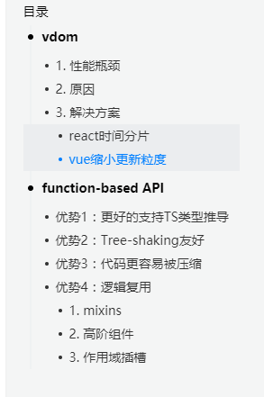
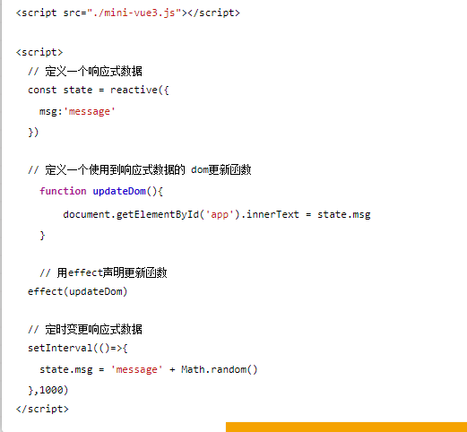

**Vue2 与 Vue3 的对比**

- 对 TypeScript 支持不友好（所有属性都放在了 this 对象上，难以推倒组件的数据类型）
- 大量的 API 挂载在 Vue 对象的原型上，难以实现 TreeShaking。
- 架构层面对跨平台 dom 渲染开发支持不友好
- CompositionAPI。受 ReactHook 启发
- 更方便的支持了 jsx
- Vue 3 的 Template 支持多个根标签，Vue 2 不支持
- 对虚拟 DOM 进行了重写、对模板的编译进行了优化操作

**一、setup 函数**

setup() 函数是 vue3 中，专门为组件提供的新属性。它为我们使用 vue3 的 Composition API 新特性提供了统一的入口, **setup 函数会在 beforeCreate 之后、created 之前执行, vue3 也是取消了这两个钩子，统一用 setup 代替, 该函数相当于一个生命周期函数**，vue 中过去的 data，methods，watch 等全部都用对应的新增 api 写在 setup()函数中

```js
setup(props, context) {
    context.attrs
    context.slots
    context.parent
    context.root
    context.emit
    context.refs

    return {

    }
  }
```

- props: 用来接收 props 数据
- context 用来定义上下文, 上下文对象中包含了一些有用的属性，这些属性在 vue 2.x 中需要通过 this 才能访问到, 在 setup() 函数中无法访问到 this，是个 undefined
- 返回值: return {}, 返回响应式数据, 模版中需要使用的函数

## 二、reactive 函数

reactive() 函数接收一个普通对象，返回一个响应式的数据对象, 想要使用创建的响应式数据也很简单，创建出来之后，在 setup 中 return 出去，直接在 template 中调用即可

```
<template>
  {{name}} // test
<template>

<script lang="ts">
import { defineComponent, reactive, ref, toRefs } from 'vue';
export default defineComponent({
  setup(props, context) {

    let state = reactive({
      name: 'test'
    });

    return state
  }
});
</script>
```

`import {defineComponent, onBeforeMount, onBeforeUnmount, onBeforeUpdate, onErrorCaptured, onMounted, onUnmounted, onUpdated } from 'vue';`

----

- Object.defineProperty => Proxy
- 重构了虚拟DOM
- OptionApi => Composition API

---

这里面可以问的问题太多了，明天细细的准备下

被**`toRaw`**之后的对象是没有被代理/跟踪的的普通对象

---


vue虚拟dom的修改

## vdom

### 1. 性能瓶颈

**新vdom生成：** 当数据更新时，虽然vue可以定位到**最小更新粒度为组件级别**，但在组件级别内，还是需要重新遍历模板生成新的`vdom`，**更新粒度不够小**。

**diff算法：**`diff`的工作量和组件模板大小成正相关。即使模板内只有少量的动态节点，也需要遍历整个组件去执行`diff`。

**总结**：`vdom`的更新粒度不够灵活，导致生成新的`vnode`和新旧`vnode diff`过程中，做了很多无用功，导致浪费性能.

### 2. 原因

`vdom`是从`react`而来的，`jsx`和手写的`render function`是完全动态的，过度的灵活性导致无法收集优化的信息，即你无法解读`js`的代码，来区分静态节点和动态节点。

如下图，很难识别出：只有`div`下的第二个`p`是动态节点。


### 3. 解决方案

#### `react`时间分片

在动态节点和数据的量都很大时，那么在数据更新时，`js`线程就会用很长的时间来执行`vdom`的相关计算，如果超过了16ms，造成交互或动画等等卡顿现象。而时间分片就是**把`vdom`的大量计算分成多个小任务，保证每个小任务在16ms内执行完，从而不会阻塞用户交互，避免卡顿现象**。

即`react`承认`vdom`的这些缺点，然后它从其他的层面来弥补缺点带来的问题。

#### `vue`缩小更新粒度

最大化利用的模板信息，把**更新的粒度**从**组件**缩小到**代码块**。

**即从组件模板中提取出动态节点、动态代码块，做`diff`时，只需要比较这些动态区域，而忽略掉静态节点，从而提升性能。**


再比如一个节点仅仅`class`属性为动态的，那么只需要`diff`这一个属性即可。进一步提升了性能。


总结：`vdom`的更新性能将与**动态内容的数量**相关，而不是模板整体大小。


https://juejin.im/post/6844904019236749325

---

## vue3中的虚拟dom


最后一个`_createVNode`第四个参数1，只有带这个参数的，才会被真正的追踪，静态节点不需要遍历，这个就是vue3优秀性能的主要来源，再看复杂一点的

```
<div id="app">
    <h1>技术摸鱼</h1>
    <p>今天天气真不错</p>

    <div>{{name}}</div>
    <div :class="{red:isRed}">摸鱼符</div>
    <button @click="handleClick">戳我</button>
    <input type="text" v-model="name">
    
</div>

复制代码
```

解析的结果 [在线预览](https://vue-next-template-explorer.netlify.app/#{"src"%3A"\n    技术摸鱼<%2Fh1>\n    今天天气真不错<%2Fp>\n\n    {{name}}<%2Fdiv>\n    摸鱼符<%2Fdiv>\n    戳我<%2Fbutton>\n    \n    \n<%2Fdiv>"%2C"ssr"%3Afalse%2C"options"%3A{"mode"%3A"module"%2C"prefixIdentifiers"%3Afalse%2C"optimizeBindings"%3Afalse%2C"hoistStatic"%3Afalse%2C"cacheHandlers"%3Afalse%2C"scopeId"%3Anull}})

``` js
import { createVNode as _createVNode, toDisplayString as _toDisplayString, openBlock as _openBlock, createBlock as _createBlock } from "vue"

export function render(_ctx, _cache) {
  return (_openBlock(), _createBlock("div", { id: "app" }, [
    _createVNode("h1", null, "技术摸鱼"),
    _createVNode("p", null, "今天天气真不错"),
    _createVNode("div", null, _toDisplayString(_ctx.name), 1 /* TEXT */),
    _createVNode("div", {
      class: {red:_ctx.isRed}
    }, "摸鱼符", 2 /* CLASS */),
    _createVNode("button", { onClick: _ctx.handleClick }, "戳我", 8 /* PROPS */, ["onClick"])
  ]))
}

// Check the console for the AST
```

> 再给组件创建节点的时候，通过第四个参数来区别是什么类型，没传就是静态节点，静态节点是不需要参与新旧dom变化。类型是通过位置与实现

### 事件缓存

绑定的`@click`会存在缓存里 [链接](https://vue-next-template-explorer.netlify.app/#{"src"%3A"\n  戳我<%2Fbutton>\n<%2Fdiv>\n"%2C"ssr"%3Afalse%2C"options"%3A{"mode"%3A"module"%2C"prefixIdentifiers"%3Afalse%2C"optimizeBindings"%3Afalse%2C"hoistStatic"%3Afalse%2C"cacheHandlers"%3Atrue%2C"scopeId"%3Anull}})

```
<div id="app">
  <button @click="handleClick">戳我</button>
</div>

复制代码
export function render(_ctx, _cache) {
  return (_openBlock(), _createBlock("div", { id: "app" }, [
    _createVNode("button", {
      onClick: _cache[1] || (_cache[1] = $event => (_ctx.handleClick($event)))
    }, "戳我")
  ]))
}

复制代码
```

传入的事件会自动生成并缓存一个内联函数再cache里，变为一个静态节点。这样就算我们自己写内联函数，也不会导致多余的重复渲染  真是优秀啊


会把函数缓存起来，不会重复定义函数

### React 16 Fiber

`React`走了另外一条路，既然主要问题是`diff`导致卡顿，于是`React`走了类似`cpu`调度的逻辑，把`vdom`这棵树，微观变成了链表，利用浏览器的空闲时间来做`diff`，如果超过了`16ms`，有动画或者用户交互的任务，就把主进程控制权还给浏览器，等空闲了继续，特别像等待女神的备胎


`diff`的逻辑，变成了单向的链表，任何时候主线程女神有空了，我们在继续蹭上去接盘做`diff`，大家研究下`requestIdleCallback`就知道，从浏览器角度看 是这样的


大概代码

```
requestIdelCallback(myNonEssentialWork);
// 等待女神空闲
function myNonEssentialWork (deadline) {
    // deadline.timeRemaining()>0 主线程女神还有事件
    // 还有diff任务没算玩
    while (deadline.timeRemaining() > 0 && tasks.length > 0) {
    doWorkIfNeeded();
    }
    // 女神没时间了，把女神还回去🤣
    if (tasks.length > 0){
        requestIdleCallback(myNonEssentialWork);
    }
}

复制代码
```

### Vue3

这里的静态提升和事件缓存刚才说过了，就不说了，其实我也很纳闷，这些静态标记和事件缓存，`React`本身也可以做，为啥就不实现了，连`shouldComponentUpdate`都得自己定义，为啥不把默认的组件都变成`pure`或者`memo`呢，唉，也许这就是人生把

`React`给你自由，`Vue`让你持久，可能也是现在国内Vue和React都如此受欢迎的原因把

`Vue3`通过`Proxy`响应式+组件内部`vdom`+静态标记，把任务颗粒度控制的足够细致，所以也不太需要`time-slice`了

-----


**静态树提升(Static Tree Hoisting)**

使用静态树提升，这意味着 Vue 3 的编译器将能够检测到什么是静态的，然后将其提升，从而降低了渲染成本。

- 跳过修补整棵树，从而降低渲染成本
- 即使多次出现也能正常工作


**静态属性提升** 使用静态属性提升，Vue 3打补丁时将跳过这些属性不会改变的节点。


把静态的节点和静态的属性提升放到上面，然后render中直接引用

### 你对Vue3.0的新特性有没有了解？

根据尤大的PPT总结，Vue3.0改进主要在以下几点：

- 更快
  - 虚拟DOM重写 1
  - 优化slots的生成  todo**优化 slots 的生成**
    目前在 Vue 中，当父组件重新渲染时，其子组件也必须重新渲染。使用Vue 3，可以单独重新渲染父级和子级。
  - 静态树提升 1
  - 静态属性提升 1
  - 基于Proxy的响应式系统  todo
- 更小：通过摇树优化核心库体积
- 更容易维护：TypeScript + 模块化 
- 更加友好
  - 跨平台：编译器核心和运行时核心与平台无关，使得Vue更容易与任何平台（Web、Android、iOS）一起使用
- 更容易使用
  - 改进的TypeScript支持，编辑器能提供强有力的类型检查和错误及警告
  - 更好的调试支持
  - 独立的响应化模块
  - Composition API

----

# Vue3响应式原理

# **vue2响应式痛点**

递归，消耗大 新增/删除属性，需要额外实现单独的API 数组，需要额外实现 Map Set Class等数据类型，无法响应式 修改语法有限制

当`data`中绑定的数据足够大的时候，有些数据可能没有用到，就能造成不必要的性能损失。在`Vue3`中，就避免了这种问题，在`Vue`初始化的时候只会对`data`这一层加上`proxy`，当获取其中数据的时候，才会为对应的数据添加响应式

```
instance.data = reactive(data);
function reactive(target, handler) {
  observed = new Proxy(target, handler)
}
function createGetter() {
  return function get(target, key) {
    let res = Reflect.get(target, key) 
    return isObject(res)
      ? reactive(res)
      : res;
  }
}
复制代码
```

例如

```
data: {
  status: {
    change: true,
  }
}
复制代码
```

只有当使用`status.change`的时候，才会创建对应的`proxy`。

## `WeakMap`

`WeakMap`是`es6`中新加的一种数据类型，它和`Map`有何区别

```
const m = new Map();
m.set('key', 'value')
const n = new WeakMap();
let obj = {};
n.set(obj, 'value')
obj = null;
n.has(obj);
复制代码
```

`Map`能够使用字符串来作为`key`，但是`WeakMap`只能让对象来作为`key`。`WeakMap`最大的优势是能够避免内存泄漏，例如在上面例子中是了，使用了`obj`作为`WeakMap`的`key`，当把`obj`置为`null`的时候，这时候`WeakMap`是无法获取到对应的`value`值，意思是这个数据已经被垃圾回收器回收掉。

effect

这里就像`vue2`中的`watcher`实现，`effectStack`是一个全局变量，当发布者`data`中的数据触发`get`操作的时候进行依赖收集，当触发`set`操作的时候，通知所有的订阅者更新。



代码中改变state的值，然后set中调用effect，执行修改state的方法。怎么和react很像

大致流程和之前差不多，只不过换成了effect和trick

----

### 问题一：如何做到深度的侦测数据的 ？

深度侦测数据是通过 `createGetter` 函数实现的，前面提到，当对多层级的对象操作时，`set` 并不能感知到，**但是 get 会触发**， 于此同时，利用 `Reflect.get()` 返回的“多层级对象中内层” ，再对“内层数据”做一次代理。

```
function createGetter() {
  return function get(target, key, receiver) {
    const res = Reflect.get(target, key, receiver)
    return isObject(res) ? reactive(res) : res
  }
}
复制代码
```

可以看到这里**判断了 Reflect 返回的数据是否还是对象**，如果是对象，则再走一次 `proxy` ，**从而获得了对对象内部的侦测**。

并且，每一次的 `proxy` 数据，都会保存在 `Map` 中，访问时会直接从中查找，从而提高性能。

vue 3.x 增加了v-slot的指令来代替原来2.6的slot，slot-scope属性

原因：这里引用了官方的说法，我们计划统一插槽类型，因此不再需要（从概念上）区分作用域插槽和非作用域插槽。一个插槽可能会或可能不会接收道具，但它们全都是插槽。有了这个概念上的统一，具有`slot`和`slot-scope`在两个特殊属性似乎没有必要，这将是很好的统一语法的单个构建下也是如此（统一插槽属性，便于学习）

插槽是统一写法，但是内部实现还是不一样，简化了

> **写法上，废弃了created和beforecreated两个生命钩子，用setup来替换，新加了捕获错误生命钩子，使用那些钩子，那些vue内置的功能或者组件，要按需引入，不区分slots作用域插槽和普通插槽**
>
> **实现上，用proxy替换了definedobejctPRoperty，优化了虚拟dom，添加了静态组件和静态属性，对绑定的函数也做了缓存，对ts更友好，更大支持treeshaking 组件什么都更加模块化**