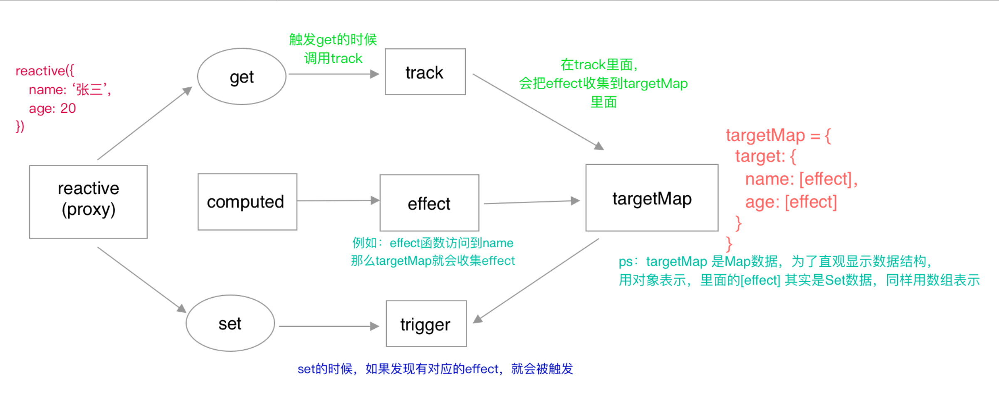
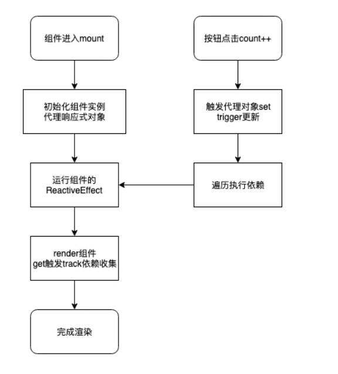

# vue3的数据响应原理和实现

# 

话说`vue3`已经发布，就引起了大量前端人员的关注，木得办法，学不动也得硬着头皮学呀，本篇文章就简单介绍一下「vue3的数据响应原理」，以及简单实现其`reactive`、`effect`、`computed`函数，希望能对大家理解`vue3`响应式有一点点的帮助。话不多说，看下面例子的代码和运行的结果。

```js
<div id="root"></div>
<button id="btn">年龄+1</button>
复制代码
const root = document.querySelector('#root')
const btn = document.querySelector('#btn')
const ob = reactive({
  name: '张三',
  age: 10
})

let cAge = computed(() => ob.age * 2)
effect(() => {
  root.innerHTML = `<h1>${ob.name}---${ob.age}---${cAge.value}</h1>`
})
btn.onclick = function () {
  ob.age += 1
}
```

> 主要有effect（数据变了，调用函数） reactive（把对象包装成双向数据绑定的变量）

**通过两个WeakMap我们就可以缓存起来代理过的对象，下次重复写的话，就会直接返回代理过的，不会又执行一边代理。**

通过weakMap来缓存已经代理过的对象

也是在proxy中代理，收集依赖，触发依赖


上面`handlers.get`函数里面`track`的作用是依赖收集，而`handlers.set`里面`trigger`是做派发更新的




很清晰，为啥这里是effect来，更新dom。实际上呢

effect 和computed差不多，

**`effect()` 函数用于定义副作用，它的参数就是副作用函数，这个函数可能会产生副作用，例如上面代码中的 document.body.innerText = obj.text。在副作用函数内的响应式数据会与副作用函数之间建立联系，即所谓的依赖收集，当响应式数据变化之后，会导致副作用函数重新执行。**

---

## 响应式API

响应式系统中主要包含了 4 个 关键API，分别是：

**reactive**：响应式关键入口 API，作用同 Vue2 组件的 data 选项

**ref**：响应式关键入口 API，作用同 reactivity，不过是用于针对基本数据类型的响应式包装，因为基本数据类型在对象结构或者函数参数传递时会丢失引用

**computed**：响应式计算 API，同 Vue2 的 computed 选项

**effect**：作用同 Vue2 的 watcher，是用来进行依赖收集的 API，computed 和 后面的 watch API都是基于 effect 的 他们的关系简单如下：




**3. 没有"副作用"**

所谓["副作用"](http://en.wikipedia.org/wiki/Side_effect_(computer_science))（side effect），指的是函数内部与外部互动（最典型的情况，就是修改全局变量的值），产生运算以外的其他结果。

函数式编程强调没有"副作用"，意味着函数要保持独立，所有功能就是返回一个新的值，没有其他行为，尤其是不得修改外部变量的值。


effect effect()` 函数用于定义副作用，它的参数就是副作用函数，这个函数可能会产生副作用

之前叫watch 现在改成了effect，是一样的，也是会把他当成依赖者收集起来

