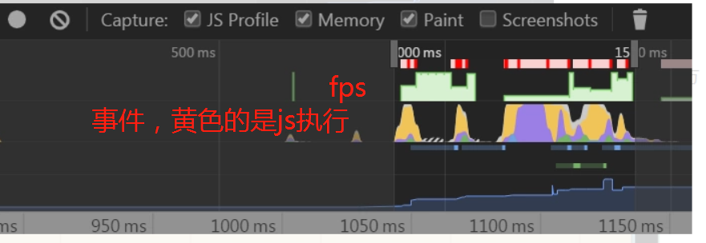
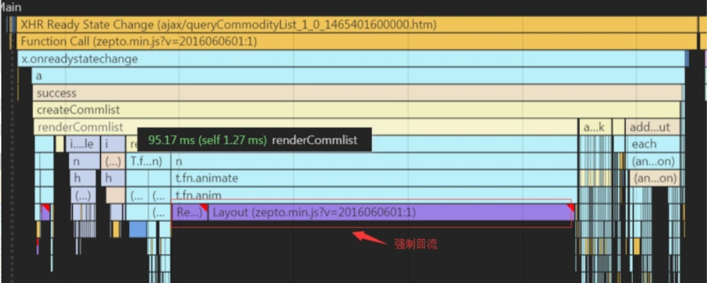

## 什么是网页的 FPS？

网页内容在不断变化之中，网页的 FPS 是只浏览器在渲染这些变化时的帧率。帧率越高，用户感觉网页越流畅，反之则会感觉卡顿。

通过浏览器的 requestAnimationFrame API （可以使用 setInterval polyfill）来实现。

代码类似：

```js
var lastTime = performance.now();
var frame = 0;
var lastFameTime = performance.now();
var loop = function(time) {
    var now =  performance.now();
    var fs = (now - lastFameTime);
    lastFameTime = now;
    var fps = Math.round(1000/fs);
    frame++;
    if (now > 1000 + lastTime) {
        var fps = Math.round( ( frame * 1000 ) / ( now - lastTime ) );
        frame = 0;    
        lastTime = now;    
    };           
    window.requestAnimationFrame(loop);   
}
```

> *代码摘自淘宝前端团队的[《无线性能优化：FPS 测试》](https://link.zhihu.com/?target=http%3A//taobaofed.org/blog/2016/01/13/measuring-fps/)。*

通俗地解释就是，通过 requestAnimationFrame API 来定时执行一些 JS 代码，如果浏览器卡顿，无法很好地保证渲染的频率，1s 中 frame 无法达到 60 帧，即可间接地反映浏览器的渲染帧率。关于 requestAnimationFrame API 的细节，可以参看 [MDN 上的文档](https://link.zhihu.com/?target=https%3A//developer.mozilla.org/zh-CN/docs/Web/API/Window/requestAnimationFrame)。

**`window.requestAnimationFrame()`** 告诉浏览器——你希望执行一个动画，并且要求浏览器在下次重绘之前调用指定的回调函数更新动画。该方法需要传入一个回调函数作为参数，该回调函数会在浏览器下一次重绘之前执行

**注意：若你想在浏览器下次重绘之前**

这只是页面卡顿的一个点，当然还有很多，我们的页面卡顿就是由这样一个一个的点造成的。所以自己以后日常多多注意页面的性能。多用chrome dev来分析页面存在的性能问题。然后不要迷信开源框架，也是有缺陷的。


这里出现卡顿的原因是重排了





----

###  卡顿产生的原因和解决方案


在 VSync 信号到来后，系统图形服务会通过 CADisplayLink 等机制通知 App，App 主线程开始在 CPU 中计算显示内容，比如视图的创建、布局计算、图片解码、文本绘制等。随后 CPU 会将计算好的内容提交到 GPU 去，由 GPU 进行变换、合成、渲染。随后 GPU 会把渲染结果提交到帧缓冲区去，等待下一次 VSync 信号到来时显示到屏幕上。由于垂直同步的机制，如果在一个 VSync 时间内，CPU 或者 GPU 没有完成内容提交，则那一帧就会被丢弃，等待下一次机会再显示，而这时显示屏会保留之前的内容不变。这就是界面卡顿的原因。

从上面的图中可以看到，CPU 和 GPU 不论哪个阻碍了显示流程，都会造成掉帧现象。所以开发时，也需要分别对 CPU 和 GPU 压力进行评估和优化。

---

## 问题： 为什么requestAnimationFrame 可以测fps的数量

该回调函数会在浏览器下一次重绘之前执行

上面那个图，使用vsync信号+cpu执行代码，gpu渲染等于一个vsync周期

## 问题： 浏览器f12中看不到fps的数量，只能看到高低


## 发现fps低了之后继续排查，有哪些发展方向


有这么几个方向，会发现页面卡顿，白屏渲染，操作dom，

loading

scrpting

rendering

painting

idle

other

- 1.构建DOM树(DOM tree)：从上到下解析HTML文档生成DOM节点树（DOM tree），也叫内容树（content tree）；

- 2.构建CSSOM(CSS Object Model)树：加载解析样式生成CSSOM树；

- 3.执行JavaScript：加载并执行JavaScript代码（包括内联代码或外联JavaScript文件）；

- 4.构建渲染树(render tree)：根据DOM树和CSSOM树,生成渲染树(render tree)；

  渲染树：按顺序展示在屏幕上的一系列矩形，这些矩形带有字体，颜色和尺寸等视觉属性。

- 5.布局（layout）：根据渲染树将节点树的每一个节点布局在屏幕上的正确位置；

- 6.绘制（painting）：遍历渲染树绘制所有节点，为每一个节点适用对应的样式，这一过程是通过UI后端模块完成；

  

  为了更友好的用户体验，浏览器会尽可能快的展现内容，而不会等到文档所有内容到达才开始解析和构建/布局渲染树，而是每次处理一部分，并展现在屏幕上，这也是为什么我们经常可以看到页面加载的时候内容是从上到下一点一点展现的。

  

由于我在滚动的时候，有一些圆角的元素，浏览器在渲染的时候计算量大，所以，我最后开启了硬件加速。

```js
transform: translateZ(0); 
```

计算圆角元素是什么原因

我觉得应该首先理一理会造成性能损耗的一些场景:

1. 比如大列表的渲染,大量dom的渲染
   2.大量图片的加载,过多资源的请求.
   3.代码中有没有耗时的计算操作,或则大量循环.递归
2. 编写的组件过于庞大 层级过深,依赖模块过多等.
   我觉得首先就是查看请求的资源体积是否过大,如果过大考虑压缩,减少不必要的资源的请求,不必要的js代码的代码加载,用字体图标代替图片,异步加载等等.
   但是我觉得基本的优化策略(减少请求数,压缩请求资源的体积)都已经做过了,感觉性能还是没有提升,可能应该关注与代码层面的优化吧,比如过大的第三方库能不能换成轻量级的,代码中有没有很耗时的操作循环和递归,过多的分支条件语句,能不能改写以提高执行效率,简化复杂的组件逻辑,减少不必要的依赖,是否有杀鸡用了牛刀的操作等.暂时想到的就这些

性能瓶颈一般是表现在用户体验方面，比如页面加载过慢，动画卡顿，交互延迟等等，具体问题具体分析。
比如PM反馈说，你们这个页面怎么加载这么慢啊，好几秒才呈现，这种现象问题可能出现在请求资源过多，资源太大，没有压缩，没有缓存等等，那么就等减少http请求，压缩资源，设置缓存。
如果PM反馈说，这个列表滑动的时候加载数据一卡一卡的，那么性能瓶颈可能出现在频繁操作，数据太大等等，那么就得做懒加载，函数节流等等；
总之前端的性能瓶颈往往都是有表现的，需要针对具体表现具体分析具体解决

如果依赖大量的计算的话，也可以采用纯函数的形式，将函数的计算结果缓存起来，只在第一次call的时候运行，之后的取值都从缓存里面拿

https://github.com/Advanced-Frontend/Daily-Interview-Question/issues/300

> 如果发现页面卡顿，可以用chrome的proformance，查看fps的状况，找到标红，fps低的部分，也可以看看总结，看看那个阶段耗时比较多，针对相应阶段做优化，如果是某段时间fps低，可以看看具体这段时间做了什么，能看到源码，看到当时是再布局还是再重排还是再执行cpu
>
> 如果是加载阶段时间最长，请求资源多，可以开启gzip压缩，静态资源缓存，懒加载，
>
> 如果是执行js时间比较长，可以分析代码中是否处理数据占用太长
>
> 如果是页面渲染，可以针对性优化dom结构。
>
> 如果是频繁重排重绘，可以优化避免。
>
> 1，合并设置样式dom属性 2，利用代码片段3，先将节点设为display为none改变后再变回
>
> 我在时间遇到主要是页面初次加载时间太久，开启了gzip压缩，路由懒加载，用不到的静态变量freeze起来。添加dom不一个个加，放入代码片段加，操作双向绑定的数据也是，最后才改变，而不是再循环中改变

----

腾讯视频

ssr看看

看看面试题