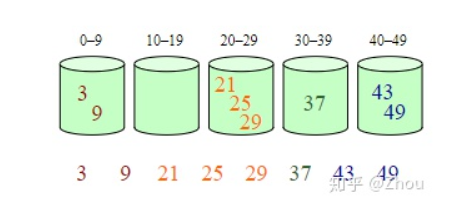

## 堆排序

**步骤一 构造初始堆。将给定无序序列构造成一个大顶堆（一般升序采用大顶堆，降序采用小顶堆)。**

　　a.假设给定无序序列结构如下


2.此时我们从最后一个非叶子结点开始（叶结点自然不用调整，第一个非叶子结点 arr.length/2-1=5/2-1=1，也就是下面的6结点），从左至右，从下至上进行调整。


4.找到第二个非叶节点4，由于[4,9,8]中9元素最大，4和9交换。


这时，交换导致了子根[4,5,6]结构混乱，继续调整，[4,5,6]中6最大，交换4和6。


此时，我们就将一个无需序列构造成了一个大顶堆。

**步骤二 将堆顶元素与末尾元素进行交换，使末尾元素最大。然后继续调整堆，再将堆顶元素与末尾元素交换，得到第二大元素。如此反复进行交换、重建、交换。**

a.将堆顶元素9和末尾元素4进行交换


b.重新调整结构，使其继续满足堆定义


c.再将堆顶元素8与末尾元素5进行交换，得到第二大元素8.


后续过程，继续进行调整，交换，如此反复进行，最终使得整个序列有序


再简单总结下堆排序的基本思路：

　　**a.将无需序列构建成一个堆，根据升序降序需求选择大顶堆或小顶堆;**

　　**b.将堆顶元素与末尾元素交换，将最大元素"沉"到数组末端;**

　　**c.重新调整结构，使其满足堆定义，然后继续交换堆顶元素与当前末尾元素，反复执行调整+交换步骤，直到整个序列有序。**


1，构建最大堆：从倒数第一个非叶子节点开始，对比自己的子节点，保持自己最大，然后就是第二个非叶子节点，保证自己最大的同时，也需要调整自己的子树，保证自己子树也是最大堆

2，将第一个元素和最后一个交换

3，从最上面的一个节点开始往下面沉，得到最后的排序

```js
// 创建堆，其实是对data数组做一个结构调整，使其具有堆的特性
function buildHeap(data) {
    var len = data.length;
    for(var i=Math.floor(len/2); i>=0; i--) {
        heapAjust(data, i, len);
    }
}
// 堆调整函数，即调整当前data为大根堆
function heapAjust(data, i, len) {
    var child = 2*i + 1;
    // 如果有孩子结点，默认情况是左孩子
    while(child <= len) { // 最后判断是否到了最后，该孩子不存在
        var temp = data[i];
        // 如果右孩子存在且其值大于左孩子的值，则将child指向右孩子
        if(child + 1 <= len && data[child] < data[child + 1]) {
            child = child + 1;
        }
        // 如果当前结点的值小于其孩子结点的值，则交换，直至循环结束
        if(data[i] < data[child]) {
            data[i] = data[child];
            data[child] = temp;
            i = child;
            child = 2*i + 1
        }else {
            break
        }
    }
}
// 排序
function heapSort(data) {
    var data = data.slice(0);
    // 将data数组改造为“堆”的结构
    buildHeap(data);

    var len = data.length;
    // 下面需要注意的时候参数的边界，参考文档里面程序中i的值是不对的
    for(var i=len-1; i>=0; i--) {
        swap(data, i, 0);
        heapAjust(data, 0, i-1);
    }
    return data;
}
const arr = [62, 88, 58, 47, 35, 73, 51, 99, 37, 93];
var newArr = heapSort(arr);
console.log(newArr);  // [35, 37, 47, 51, 58, 62, 73, 88, 93, 99]
```


## 桶排序



（n+k）

## 图深广遍历

图的遍历方式包括深度优先搜索（DFS）和广度优先搜索（BFS），其中 DFS 使用递归或栈进行实现，而 BFS 则采用队列进行实现。对比树的四种遍历方式，前序遍历、中序遍历和后序遍历均类似于 DFS，而层序遍历类似于 BFS，前中后序也均可采用栈的方式进行实现，层序遍历可以采用队列的方式进行实现

## 广度优先搜索

### 算法思想

广度优先遍历（Breadth First Search），又称为广度优先搜索，简称**BFS**。树的层序遍历方式便是一种广度优先搜索方式。为了清晰地理解广度优先搜索，我们同样以深度优先搜索的例子一起走一遍，这不过，我们对图中顶点的位置做了调整，这样看起来更清楚。


假定从顶点A开始进行广度优先搜索，则遍历的顺序为：

第一步：访问顶点A；


第二步：访问顶点A的所有未被访问的邻接顶点，顶点B和顶点F；


第三步：访问顶点B和顶点F的所有未被访问的邻接顶点，顶点C、I、G、E；


第四步：访问顶点C、I、G、E 的所有邻接顶点中未被访问的顶点，顶点D和顶点H。


## 深度优先搜索

### 算法思想

深度优化遍历( **Depth First Search** )，也有称为 **深度优化搜索** ，简称为 **DFS** 。事实上，我们在树的遍历中早已涉及DFS，层序遍历、中序遍历和后序遍历都属于深度优先遍历的方式，因为这些遍历方式本质上都归结于**栈**。为了讲清楚DFS，我们先来看两个概念。

**右手原则：** 在没有碰到重复顶点的情况下，分叉路口始终是向右手边走，每路过一个顶点就做一个记号。

**左手原则：** 在没有碰到重复顶点的情况下，分叉路口始终是向左手边走，每路过一个顶点就做一个记号。

本文约定以**右手原则**进行深度优先遍历。废话不多说，我们以下图说明深度优先搜索。


原则上，我们可以从图中的任何一个顶点开始，进行深度优先遍历，假设我们从顶点A开始，遍历过程中的每一步如下：

第一步：从顶点A开始，将顶点A标记为已访问顶点。


第二步：根据约定的右手原则，访问顶点B，并将B标记为已访问顶点。


第三步：右手原则，访问顶点C


第四步：右手原则，访问顶点D


第五步：右手原则，访问顶点E


第六步：右手原则，访问顶点F


第七步：右手原则，应该先访问顶点F的邻接顶点A，但发现A已被访问，则访问除A之外的最右侧顶点G。


第八步：右手原则，先访问顶点B，顶点B已被访问；再访问顶点D，顶点D已经被访问；最后访问顶点H。


第九步：发现顶点H的邻接顶点均已被访问，则退回到顶点G;

第十步：顶点G的邻接顶点均已被访问，则退回到顶点F；

第十一步：顶点F的邻接顶点已被访问，则退回到顶点E；

第十二步：顶点E的邻接顶点均已被访问，则退回到顶点D；

第十三步：顶点D的邻接顶点I尚未被访问，则访问顶点I；

