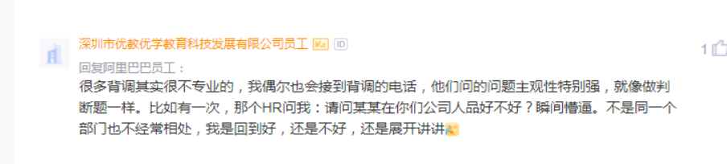

hr会问什么

1，职级是什么

然后再说自己期望

base 10.5k +提供公司住宿+100块的科技补助+16一天的餐补

1，职级是什么

2，猎聘直播和腾讯视频的关系

3，大概多久能收到口头offer或者邮件offer

4，可以骑电滑板车上班吗

项目难点亮点：饿了么没有的ui组件，自己做了一个

职业规划： 想好好工作，做出成功，希望能 成为中层

最优成就感的事情：项目上线的时候，最后项目年终还拿了奖，最优成就感，

优势劣势： 聪明，勤奋，性格好

劣势： 经验不足，接触的场景少，做选择的时候会考虑很多，会比较慢

拿了很多offer   字节还在流程中，

刚过一面

特别愿意去深圳

-----

背调

