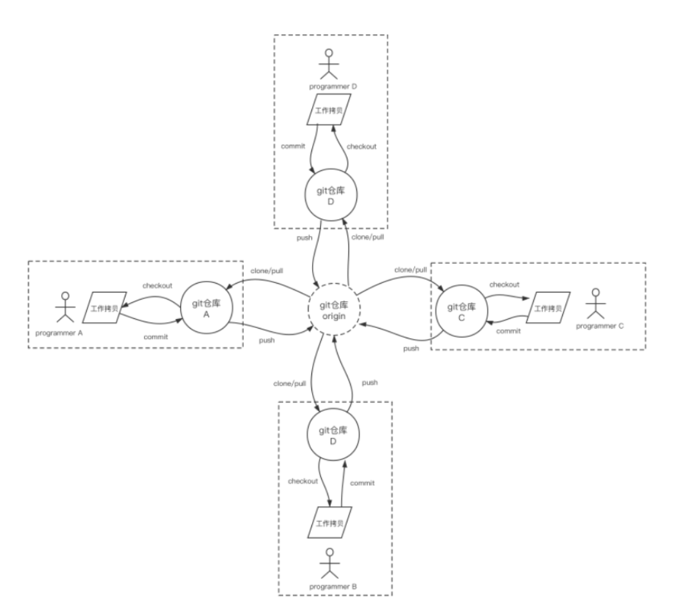
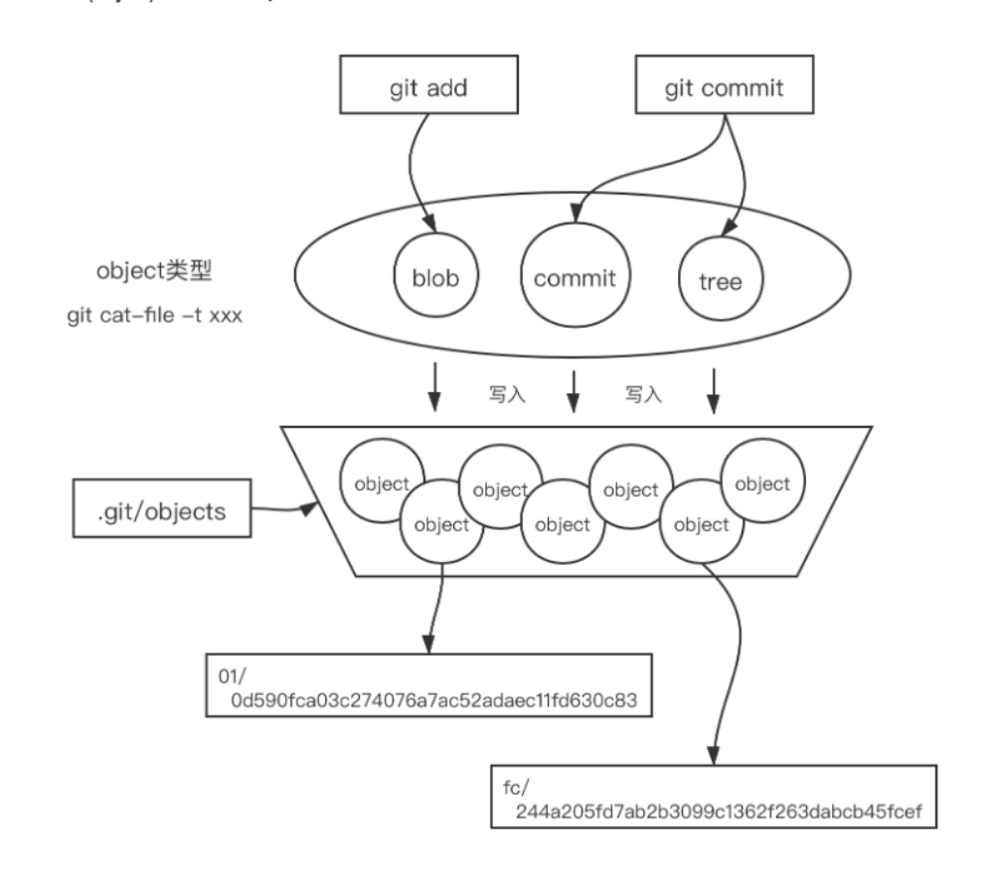

作者：summering
链接：https://www.nowcoder.com/discuss/396853
来源：牛客网

三面(现场面) 

  [前端]()未来规划？ 

  3年之后的规划？ 

> 想在前端，往深度广度学习
>
>  希望可以致力于做出更好的解决方案来解决一些问题，或者一些工具，架构能提高开发效率，大概就是想做出类似这种事情，更优的体验还有更好的开发效率。保持优秀，三年内最好能做高级开发吧

  有明确的想从事的路线吗？to B？to C？全栈？ 

> 暂时没有特别明确，做的开心有意义就价值就行

  node主要用来解决什么问题？ 

> node做服务器适合做高io的（读写文件，读写网络上的东西），他很轻量，适合做工具，我主要是用来写多进程打包工具，文件检查

  node做BFF的优点是什么？ 

> 前端解耦，性能优化，ssr

  对[项目]()监控这块有什么了解吗？ 

> 应该不会问，todo还是要了解下
>
> 说下自己知道的
>
> 有没有上线的，在测试阶段就去监控，就是模拟用户，出一个报告，然后根据报告去优化
>
> 也有再线上运行时，监测用户的使用情况，上报

  对微服务有了解吗 

  聊一聊docker？ 

  当时什么从事[前端]()？ 

  整个学习历程是什么？ 

> 平时如何学习：就答我自己那套+多看看公总号看看大佬们都在关注什么知识
>
> 学新技术，先去看官方文档，如果有没看懂的地方，我就会去网上搜下有什么推荐的资料。一般完整的技术我就选择看一些经典的书籍。小块知识点没可能会看文章，掘金小册。如果还是看不懂我会选择看讲解视频。
>
> 工作中：我就是把工作中用到的所有的技术都花时间好好学下，了解原理，然后遇到问题就能很快解决。

  介绍部门团队的情况 

> 讲下永辉那一套，一般就是一个项目分成两组，每个组有两个前端两个后端，一个测试，一个组长。部门有6-7个前端，很多其他开发 ，是个小部门，开发大概40个人

  四面（总监面） 

iot + 财务共享+数据云

  5g时代的来临对[前端]()有什么机遇与挑战？ 

> 考虑的侧重点不一样，技术肯定要翻新升级迭代
>
> 互联网更发达了，业务更复杂用户量更多，技术要升级迭代
>
> 应用面更大，承担的也会更多

  Html4，html5是建立在http上的，http的下一代要解决什么问题？ 

> tcp层的队头阻塞（全部都发，漏了会要求重发）
>
> tls放再了 quic层，更快了
>
> 

  对现在主流[前端]()框架的看法？ 

  看你有github，你一般在github上做什么呢？ 

  github看过什么关于[前端]()[项目]()的[源码]()？ 

  向什么[源码]()提过pr？ 

  restful接口架构的优缺点？ 

  restful接口架构会导致什么安全问题，具体怎么解决？ 

  团队合作有遇到过分歧吗？最后是怎么解决的？有什么事例最后是采取你建议的解决方案？ 

> 有，不过都是小事，就是接口定义规范，公用组件如何封装。我就觉得应该封装的更业务一点，更高效一点

  你印象中觉得[腾讯]()工作形式是什么方式呢？ 

> 业务复杂，技术前沿，技术氛围一流，都是大佬

  为什么想从360离职？ 

  深圳到湛江需要多久？ 

  深圳到湛江高铁通了吗？

---

作者：同学说
链接：https://www.nowcoder.com/discuss/474884?type=2
来源：牛客网

三面 8.24 30min

 基本没问js和vue。人太菜了，一问三不知，直接没有反问环节，状态已灰

 \- 浏览器渲染的细节。为什么要构建渲染树   

> 1,去除掉一些不需要渲染的节点，

 \- tcp拥塞控制的机制，详细

> 复习笔记就行

 \- 堆

> 大顶堆小顶堆

 \- [链表]()倒数第k个结点

 \- 操作系统学过吗？没有。那问个最简单的堆和栈的区别

> 栈由操作系统自动分配释放 ，用于存放函数的参数值、局部变量等，其操作方式类似于数据结构中的栈
>
> 堆由开发人员分配和释放， 若开发人员不释放，程序结束时由 OS 回收，分配方式类似于链表。

 \- js垃圾回收机制    

 \-     git与原理

> https://tonybai.com/2020/04/07/illustrated-tale-of-git-internal-key-concepts/
>
> 
>
> 本地有个git仓库，远程有个git
>
> 
>
> 

 \- 弹幕功能实现，要考虑性能   

> https://juejin.im/post/6847902224602005517

---

**找到我在哪里看到那个f（1）的题目；**

1，准备好  **todo**

---

1. [算法题](https://www.nowcoder.com/jump/super-jump/word?word=算法题)（LeetCode 459.重复的子字符串） ：给定一个非空的字符串，判断它是否可以由它的一个子串重复多次构成。给定的字符串只含有小写英文字母，并且长度不超过10000。

---

作者：Jennifer~
链接：https://www.nowcoder.com/discuss/486632?type=post&order=time&pos=&page=1&channel=1009&source_id=search_post
来源：牛客网

### 三面（50min）8.23 

 自我介绍 

 为啥当时选QQ（他们是[腾讯]()文档） 。。。当时随便选的，没想到自己选的会和捞我的组不一样 

 家是哪里的，会来深圳吗 

 对[腾讯]()文档了解吗？ 

 让你实现的话觉得有哪些难点？ 

 除了websocket还可以怎么实现内容实时更新（emmmm，其实websocket是二面面试官告诉我的，[客户端]()每隔一秒钟发一次请求、轮询之类的开始胡扯了） 

-  还有其他的吗 

 两个同时更新一块内容造成冲突咋办（加锁，，，瞎胡扯的） 

-  面试官说这样体验不好，，，还有其他办法吗？ 

 浏览器缓存机制 

-  Etag 是干啥的，怎么生成的，为啥有了Last-Modified还要Etag 

 http、https、http2.0区别 

-  https怎么更安全的，具体说一下 

 H5和小程序的区别？为啥小程序更受欢迎 

 **移动端适配方案**   todo

 设计模式以及在[前端]()的应用 

-  观察者和订阅/发布的区别 

 学习[前端]()多久了？用过react、node吗？ 

 写过开源[项目]()吗？（没 

 绩点多少呀，，，（还问了满分是多少 

 平时喜欢刷[算法题]()？ 

 应该还有其他的不记得了，，， 

 然后面试官说好就到这吧，（不让我问问题吗，，，强行问了一波，一共有几轮技术面？为啥我的官网状态没更新（面试官微信找我约的时间，面试就是在微信语音，没有邮件和面试通知） 

   答曰：会有四五轮技术面，（除了第一轮之外都是复试的状态），HR面大概一轮，然后说这是提前批，九月初就会结束掉，不会影响正式的秋招，，，  

###  四面（55min）9.3 

 数据结构有哪些、图的深度优先遍历、图的广度优先遍历 

> todo

 时间复杂度、空间复杂度、[排序]()[算法]()、快排思想、桶[排序]()思想 

> todo

 [项目]()中用到的设计模式： 

-  工厂模式及其优缺点 
-  单例模式及其优缺点 
-  观察者模式及其优缺点 

> 工厂模式，优缺点： 减少代码重复，每个工厂就要新加类
>
> 单例模式  节约资源，不适用变化的情况
>
> 观察者模式 观察者太多，通知会慢，并且可能出现循环观察情况

 进程与线程的区别 

> - 进程和线程是什么 线程是最小的执行单元，而进程由至少一个线程组成。如何调度进程和线程，完全由操作系统决定，程序自己不能决定什么时候执行，执行多长时间。 进程指计算机中已运行的程序。 线程指操作系统能够进行运算调度的最小单位。
>
>   #### 死锁是什么 当两个以上的运算单元，双方都在等待对方停止运行，以获取系统资源，但是没有一方提前退出时，就称为死锁。
>   
>   程有自己的堆栈和局部变量，但线程之间没有单独的地址空间
>   
>   **进程在执行过程中拥有独立的内存单元**，而**多个线程共享内存**
>   
>   1.进程要分配一大部分的内存，而线程只需要分配一部分栈就可以了. 2.一个程序至少有一个进程,一个进程至少有一个线程. 3.进程是资源分配的最小单位，线程是程序执行的最小单位。 4.一个线程可以创建和撤销另一个线程，同一个进程中的多个线程之间可以并发执行.

 死锁的含义 

> 

 怎么避免死锁 

> 

 银行家[算法]() 

> ## 2.死锁产生的必要条件：
>
> （1） 互斥：一次只有一个进程可以使用一个资源。其他进程不能访问已分配给其他进程的资源。
>
> （2）占有且等待：当一个进程在等待分配得到其他资源时，其继续占有已分配得到的资源。
>
> （3）非抢占：不能强行抢占进程中已占有的资源。
>
> （4）循环等待：存在一个封闭的进程链，使得每个资源至少占有此链中下一个进程所需要的一个资源。
>
> 
>
> ## 3.处理死锁的四种方法：
>
> （1）死锁预防：通过确保死锁的一个必要条件不会满足，保证不会发生死锁
>
> （2）死锁检测：允许死锁的发生，但是可以通过系统设置的检测结构及时的检测出死锁的发生，采取一些措施，将死锁清除掉
>
> （3）死锁避免：在资源分配过程中，使用某种方法避免系统进入不安全的状态，从而避免发生死锁
>
> （4）死锁解除：与死锁检测相配套的一种措施。当检测到系统中已发生死锁，需将进程从死锁状态中解脱出来。
>
> 常用方法：撤销或挂起一些进程，以便回收一些资源，再将这些资源分配给已处于阻塞状态的进程。
>
> 
>
> ## 
>
> #### 4.处理死锁的具体细节：
>
> ### 一、死锁预防：破坏死锁的四个条件中的一个或几个
>
> (1)互斥：它是设备的固有属性所决定的，不仅不能改变，还应该加以保证。
> (2)占有且等待：为预防占有且等待条件，可以要求进程一次性的请求所有需要的资源，并且阻塞这个进程直到所有请求都同时满足。这个方法比较低效。
> (3)不可抢占：预防这个条件的方法：
> *如果占有某些资源的一个进程进行进一步资源请求时被拒绝，则该进程必须释放它最初占有的资源。
> *如果一个进程请求当前被另一个进程占有的一个资源，则操作系统可以抢占另外一个进程，要求它释放资源。
> (4)循环等待：通过定义资源类型的线性顺序来预防。
> *如果一个进程已经分配了R类资源，那么接下来请求的资源只能是那些排在R类型之后的资源类型。该方法比较低效。
>
> ### 二、死锁避免：
>
> ### 两种死锁避免算法：
>
> *进程启动拒绝：如果一个进程的请求会导致死锁，则不启动该进程。
> *资源分配拒绝：如果一个进程增加的资源请求会导致死锁，则不允许此分配(银行家算法)。 
>
> 银行家算法：
> 1.如果request<=need，转向步骤2；否则认为出错，因为请求资源大于需要资源。
> 2.如果request<=available，转向步骤3,；否则尚无足够资源，进程p阻塞；
> 3.系统尝试为把资源分配给进程P，并修改available、allocation和need的数值。
> 4.系统执行安全性算法，检查此次分配后系统是否处于安全状态，若安全，才正式将资源分配给进程P，否则将本次试探性分配作废，让进程P等待。
> *安全状态：系统能按照某种进程顺序，为每个进程分配资源，直至满足每个进程对资源的最大需求，使每个进程都可顺利完成。

 js中的上下文对象 

 ES6新增的内容有哪些 

 http3.0的特点 s6dyyyyyyyDDDDDDDDDDDDDDDDDA

 http2.0的特点 

 [前端]()攻击 

 缓存策略 

​    call、apply、bind    的区别   

​    口述了一段代码输出啥   

 看过哪些[源码]() 

 用过哪些UI，看过[源码]()吗 

 被怼的很惨：是背的[面经]()吧，确定看的是[源码]()不是别人写的文章，我问的是什么什么而不是什么什么 

   自己太菜了，还有很多要学习总结的地方，希望大家以后在学习的时候也是能学会自己扩展、能见出自己的理解，来打动面试官吧

-----

说一下iframe标签的原理；

基本所有的技术终面都会问到以下主观性问题：项目难点、项目研发流程、技术选型、团队情况、团队内部的贡献（技术分享、维护工具）、沟通技巧、个人职业规划；最后的“你还有什么问题要问我吗”是了解团队和公司情况的一个极好的机会，我一般会提问：

- 能否对我的回答做总结性点评、对我有没有什么建议
- 团队当前的技术栈和业务方向
- 团队在公司内外维护的公共组件 or 开源产品，和在社区的活跃度
- 未来加入这个团队后，我的角色、职责和 leader 对我的期望

---

1，把能找到的面经全部看一遍，然后总结下，

**2，想到的点，全部准备下**

**3，准备下项目**

4，准备下知识点

(项目中难点亮点)

1,看看那个多语言插件

现在开始尽自己所能去面试

1，只要面试中问的问题都答出来了，能说服面试官就可以过

----

还是会问技术，会问项目

https://www.nowcoder.com/discuss/474884?type=2

https://juejin.im/post/6844904118981492749

https://zhuanlan.zhihu.com/p/34828312

https://www.nowcoder.com/discuss/394194?type=6

https://zhuanlan.zhihu.com/p/114090778

\1. 自我介绍，问项目（我这里答的很差...答的时候心态失衡了，也影响到后面的表现）

\2. Websocket的原理，[http://socket.io](https://link.zhihu.com/?target=http%3A//socket.io)的API（因为简历上写了[http://socket.io](https://link.zhihu.com/?target=http%3A//socket.io)，然后这个库我太久没用了，作死了= =），还问了心跳包

http://rickypeng.com/2020/04/17/tencent.html

https://segmentfault.com/a/1190000015666655

https://blog.nowcoder.net/n/c7639ed08e7149c1b52165f1d9d9b1bf

编码题：1. 快排、2. 大数相加、3. 拖拽、4. todo mvc 增删改查

1. 在公司做过的项目

2. 项目的优化有哪些

3. 自己的亮点在哪?

4. 前端安全CSRF攻击

5. 原型链，prototype

6. new过程做过的事情

7. 对象如何不可以被new

   `class` `A {``constructor() {`` ``throw` `new` `Error(``'can not call by new'``)``}``}``new` `A()`

8. var let const的区别

9. node如何实现多进程

10. ts了解吗？

11. 了解了那些新技术

12. 浏览器存储

复习下笔记

矩阵乘法

HTTP 长连接 短连接的区别，我就用轮询来举的例子

> 

web RTC (我最开始听成了RPC，难顶）

> **WebRTC** (Web Real-Time Communications) 是一项实时通讯技术，它允许网络应用或者站点，在不借助中间媒介的情况下，建立浏览器之间点对点（Peer-to-Peer）的连接，实现视频流和（或）音频流或者其他任意数据的传输。WebRTC包含的这些标准使用户在无需安装任何插件或者第三0-方的软件的情况下，创建点对点（Peer-to-Peer）的数据分享和电话会议成为可能。
>
> WebRTC包含了若干相互关联的API和协议以达到这个目标。你在这里看到的文档将会帮助你理解WebRTC的基本概念，还会教你如何去建立和使用可以传输媒体数据和其他任意数据的连接。当然你还会学到更多其他的东西。

1. 协程了解吗

> 在generator中，我们不但可以通过`for`循环来迭代，还可以不断调用`next()`函数获取由`yield`语句返回的下一个值。
>
> 但是Python的`yield`不但可以返回一个值，它还可以接收调用者发出的参数。
>
> 来看例子：
>
> 传统的生产者-消费者模型是一个线程写消息，一个线程取消息，通过锁机制控制队列和等待，但一不小心就可能死锁。
>
> 如果改用协程，生产者生产消息后，直接通过`yield`跳转到消费者开始执行，待消费者执行完毕后，切换回生产者继续生产，效率极高：

1. 前端优化场景问题，比如加载白屏等
2. 有20块钱，一瓶水一块钱，两个空瓶换一瓶水，可以喝多少瓶？然后又问那如果有n块钱呢，我想了一会说是2n - 1。面试官说能证明吗？于是用归纳法证明了（在腾讯文档里写）。感谢我自己居然没有忘大一学的离散，也是完全没想到前端面试会用到这个哈哈哈，各位当我是outlier吧….

一定要借瓶子，不然怎么都剩下一个瓶子

----

## js编程题+算法题

作者：lifearg
链接：https://www.nowcoder.com/discuss/476646
来源：牛客网

 sum(1,2).result === 3 
 sum(1,2)(3).result == 6 
 sum(1,2)(3,4).result == 10 
 sum(1,2)(3,4)(5).result == 15

作者：AbsentWorker
链接：https://www.nowcoder.com/discuss/481287
来源：牛客网

[算法题]()： 

 \1. 给个[链表]()和数字x，让比x小的节点到[链表]()[前端]()，比x大的就不移动，保持顺序不变 

 例如1->2->4->3->2->5 

 输出1->2->2->4->3->5 

 2..力扣上面有类似的原题，就是一个解压展开题。题目不记得了，就是根据数字将后面的字符展开多少次 

  输入ab[2|cd]e 

​    输出  abcdcde

\5. enctype的属性值有哪些（后背发凉

 一道[算法题](https://www.nowcoder.com/jump/super-jump/word?word=算法题)，判断字符串的括号是否配对

4.深拷贝手写（包括要完成function，正则，date的情况）

（手写代码用了很久时间，然后只写出了array和Obj的）

作者：同学说
链接：https://www.nowcoder.com/discuss/490797
来源：牛客网

五道[算法题]()，都要说实现的复杂度 

  \- 1.判断数组中是否有重复数 

  \- 2.[排序]()[链表]()去重 

 \- 3. [翻转二叉树]()            相关知识点：                    [树](javascript: void(0))            相关知识点：                    [树](javascript: void(0)) 

  \- 4. 分割[链表]()。[leetcode]()86 

  \- 5.  解压展开。  输入ab[2|cd]e，  输出 abcdcde。与[leetcode]()394类似