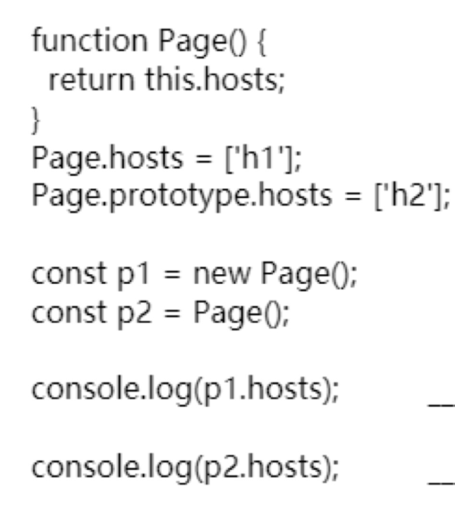

S腾讯视频，直播，node中台

---

作者：牛客228437268号
链接：https://www.nowcoder.com/discuss/535282
来源：牛客网

 1.做过的[项目]() 
 2.vue和jquery在使用起来有什么区别，vue有什么便利之处 

 3.做[项目]()的时候怎么进行模块设计、怎么定义接口的 

> 一般采用restful风格接口定义，code massage data。接口从

 4.vue的数据双向绑定怎么实现的 
 5.数据劫持之后vue做了什么 
 6.vue的订阅者怎么实现[前端]()更新渲染的 
 7.虚拟DOM （重点复习）

> 详细复习下vue中这部分

 8.tcp怎么保证在网络卡顿的时候不丢包 

假如一个包经过多次的重发也没有收到对端的确认包，那么就会认为接收端异常，强制关闭连接。并且通知应用通信异常强行终止。

### **拥塞控制**（重点背一下）

窗口控制解决了 两台主机之间因传送速率而可能引起的丢包问题，在一方面保证了TCP数据传送的可靠性。然而如果网络非常拥堵，此时再发送数据就会加重网络负担，那么发送的数据段很可能超过了最大生存时间也没有到达接收方，就会产生丢包问题。为此TCP引入慢启动机制，先发出少量数据，就像探路一样，先摸清当前的网络拥堵状态后，再决定按照多大的速度传送数据。

此处引入一个拥塞窗口：

发送开始时定义拥塞窗口大小为1；每次收到一个ACK应答，拥塞窗口加1；而在每次发送数据时，发送窗口取拥塞窗口与接送段接收窗口最小者。

慢启动：在启动初期以指数增长方式增长；设置一个慢启动的阈值，当以指数增长达到阈值时就停止指数增长，按照线性增长方式增加至拥塞窗口；线性增长达到网络拥塞时立即把拥塞窗口置回1，进行新一轮的“慢启动”，同时新一轮的阈值变为原来的一半。


 9..tcp怎么分包的 

### 在哪种情况下会出现分包与粘包：

- 1，要发送的数据大于TCP发送缓冲区剩余空间大小，将会发生分包。
- 2，待发送数据大于MSS（最大报文长度），TCP在传输前将进行分包。
- 3，要发送的数据小于TCP发送缓冲区的大小，TCP将多次写入缓冲区的数据一次发送出		     去，将会发生粘包。
- 4，接收数据端的应用层没有及时读取接收缓冲区中的数据，将发生粘包。

**是TCP协议定义的一个选项，MSS选项用于在TCP连接建立时，收发双方协商通信时每一个报文段所能承载的最大数据长度。**

**每个TCP socket在内核中都有一个发送缓冲区和一个接收缓冲区，TCP的全双工的工作模式以及TCP的流量(拥塞)控制便是依赖于这两个独立的buffer以及buffer的填充状态。**

tcp是面向报文的，udp是面向数据帧

## 解决方法

解决粘包的方法，是由应用层进行**分包处理**，本质上就是由**应用层**来维护消息和消息的边界（即定义自己的会话层和表示层协议）

### 解决粘包/分包常用方式：

> 两种方式

- 1，定义数据包包头，包头众包含数据完整包的长度，接收端接收到数据后，通过读取包头的长度字段，便知道每一个数据包的实际长度了。


> 比如说，将原数据加密，在密文前面加上包头，即：[包头]+[密文]。 包头=[密文长度+加密方式+...]

- 2，数据包之间设置边界


 10.一万条数据渲染到列表上，怎么优雅地实现 

> 虚拟长列表问题

 11.使用fragmentDocument跟一次性渲染有什么不同 


 12.笔试题实例、原型


12.懒加载的话怎么实现 

> 看源码
>
> ```js
> <script>
>     var num = document.getElementsByTagName('img').length;
>     var img = document.getElementsByTagName("img");
>     var n = 0; //存储图片加载到的位置，避免每次都从第一张图片开始遍历
> 
>     lazyload(); //页面载入完毕加载可是区域内的图片
> 
>     window.onscroll = lazyload;
> 
>     function lazyload() { //监听页面滚动事件
>         var seeHeight = document.documentElement.clientHeight; //可见区域高度
>         var scrollTop = document.documentElement.scrollTop || document.body.scrollTop; //滚动条距离顶部高度
>         for (var i = n; i < num; i++) {
>             if (img[i].offsetTop < seeHeight + scrollTop) {
>                 if (img[i].getAttribute("src") == "default.jpg") {
>                     img[i].src = img[i].getAttribute("data-src");
>                 }
>                 n = i + 1;
>             }
>         }
>     }
> </script>
> ```
>
> 监听window的onscroll事件，把放有真实src的data-src属性替换给src
>
> 

 13.元素太多的时候，对触发滚屏的事件没反应，怎么改善 （节流函数）

展示个加载中

> > 冒泡: `element`的`scroll`事件**不冒泡**, 但是`document`的`defaultView`的`scroll`事件冒泡
>
> 这句话的意思就是说，如果`scroll`的目标元素是一个元素的话，比如说是一个`div`元素。那么此时事件只有从`document`到`div`的捕获阶段以及`div`的冒泡阶段。如果尝试在父级监视`scroll`的冒泡阶段监视这一事件是无效的。如果`scroll`是由`document.defaultView`（目前`document`关联的`window`对象）产生的有冒泡阶段。但是由于其本身就是DOM树里最顶级的对象，因此只能在`window`里监视`scroll`的捕获阶段以及冒泡阶段。
>
> 1. ​	<script>
> 2. ​		window.onscroll=function(){alert(1)}
> 3. ​		var evt = window.document.createEvent('UIEvents'); 
> 4. ​	    evt.initUIEvent('scroll', true, false, window, 0); 
> 5. ​	   window.dispatchEvent(evt);
> 6. ​	</script>
>
> > ，这个问题跟浏览器滚动锚定[滚动锚定](https://www.cnblogs.com/ziyunfei/p/6668101.html)有关，这个特性是为了避免在页面加载的过程中，页面内容高度发生变化引起滚动条跳动的问题。开启这个特性后，浏览器会自动触发scroll事件，调整滚动条的位置，让滚动条不胡乱跳动。但是懒加载的时候由于不断更新列表项内部的高度，因此就会使浏览器自动触发滚动事件，而滚动事件又触发懒加载的更新，形成死循环，造成自动滚动的问题。在父元素中添加css属性`overflow-anchor:none`就正常了


长列表问题，卡顿？ 

 14.笔试题实例、原型 
 15.笔试题let var 


 16.编程题安排最多会议数的会议安排

> 回去做下这道题

 14.编程题安排最多会议数的会议安排

https://leetcode-cn.com/problems/maximum-number-of-events-that-can-be-attended/solution/

https://blog.csdn.net/qq_34115899/article/details/79731172

-----

pcg

作者：当可乐遇上曼妥思🍃
链接：https://www.nowcoder.com/discuss/522934
来源：牛客网


9.21日[腾讯]()正式批，我又被捞了。 

  提前批被反复鞭尸，我要看看这次能到哪一步爆炸。。。 

  题目记得不是很全。 

  


  9.22日一面 1h20mimn 

  1.介绍一下自己的[项目]() 

  2.git的reset和revert有什么区别。 

> 如果回退分支的代码以后还需要的话用`git revert`就再好不过了； 如果分支我就是提错了没用了还不想让别人发现我错的代码，那就`git reset`吧
>
> 例如：develop分支已经合并了a、b、c、d四个分支，我忽然发现b分支没用啊，代码也没必要，这个时候就不能用reset了，因为使用reset之后c和d的分支也同样消失了。这时候只能用`git revert b分支commit号`，这样c和d的代码依然还在。
>
> `revert hash` 这个hash为对应想删除的commit
>
> `revert hash..HEAD` 这个hash对应的commit不会被删除，会删除到它的后一次commit
>
> `revert` 会产生新的提交，并不会真正删除history。
>
> reset是直接回退到一个commit状态，并删除记录，revert是删除一个commit，会保留记录


  3.讲讲在acm中自己做的啥 

  4.vue的底层了解吗 

  5.宏任务和微任务 

  6.网页输入url以后发生什么 

  7.写一个防抖函数 

  8.说说js的继承（我是写了组合寄生式的继承代码） 

  9.js的内存回收 

  10.现在有一个宽高未知的父布局，以及一个未知宽高的子布局，实现水平垂直居中 

  11.计组，cache替换[算法]() 

  12.https了解多少 

  13.https的证书有什么用？ 

  14.hashmap的底层 

  15.hashmap发生碰撞怎么解决？ 

  16.手写二分 

  17.手写快排 


> 随机，取中间的元素作为
>
> `int a[] = { 2,5,4,9,3,6,8,7,1,0};`，‘2’、‘3’、‘0’，分别是第一个数，第（N/2）个是数以及最后一个数，三个数中3最大，0最小，2在中间，所以取2为基准值。


  18.手写冒泡[排序]() 


> 


  19.分析[排序]()时空复杂度 

  20.思维题，1000瓶水，一瓶有毒。10只老鼠，喝到有毒的一小时以后会死，问如何在1小时找出哪瓶有毒。

1000 = 2*10 = 1024 

----

因为 for...of 内部处理的机制和 forEach 不同，forEach 是直接调用回调函数，for...of 是通过迭代器的方式去遍历。

foreach中不能使用await方法

----

https://mp.weixin.qq.com/s/W7wJYoqXYwfpBloXiIAlfQ

比较难的实习面试题

cdn

 大致为一个8*8棋盘，0代表空，1代表有车（ju），车可以进攻横竖直线上的其他车（称为有冲突），问输入一个棋盘，是否有冲突。

上一题的基础上，问有几个冲突，如0 1 0 1 0 0 0 1 共有2+1个冲突。

皇后、象后，棋盘最多还能下几个车而不冲突。（没让敲代码，我说通过dfs无脑。。）

----

vue+webpack+tcphttp+浏览器+node+性能优化+前端监控+简历项目+算法手写编程题
新技术的理解
vue原理，复习
mvvm，渲染模板原理


vue+webpack+tcphttp+浏览器++性能优化+前端监控+简历项目+node

今天我按照选的题一个个看完，明天重点看上面的，应该很快，周五看node+算法题，周末再来复习一波

担心的问题： tcp问到不会的，背+理解+找题目

node深入问

前端监控

cdn： 

算法：二叉树，常见动态规划题目，

----

把笔记背背理解清楚，重点猪呢比上面的ok

作者：牛客228437268号
链接：https://www.nowcoder.com/discuss/535282
来源：牛客网

1.做过的[项目]() 
 2.vue和jquery在使用起来有什么区别，vue有什么便利之处 
 3.做[项目]()的时候怎么进行模块设计、怎么定义接口的 
 4.vue的数据双向绑定怎么实现的 
 5.数据劫持之后vue做了什么 
 6.vue的订阅者怎么实现[前端]()更新渲染的 
 7.虚拟DOM 
 8.tcp怎么保证在网络卡顿的时候不丢包 
 9..tcp怎么分包的 
 10.一万条数据渲染到列表上，怎么优雅地实现 
 11.使用fragmentDocument跟一次性渲染有什么不同 
 12.笔试题实例、原型12.懒加载的话怎么实现 
 13.元素太多的时候，节流函数对触发滚屏的事件没反应，怎么改善 
 14.笔试题实例、原型 
 15.笔试题let var 
 16.编程题安排最多会议数的会议安排 
 14.编程题安排最多会议数的会议安排

----



第一个是undefined，第二个报错

new关键字的实现： 先

```js
function a(foo){
let context = Object.create(foo.prototype)
let restult = foo.call(contex,arg)
return (typeof result == 'object' && result != null)? restult : context
}
```

> 优先使用最小的饼干满足最小的胃口

- 孩子胃口，饼干大小从小到大排序
- 优先满足胃口小的孩子，满足后换一个胃口大的
- 使用糖果进行尝试，满足后换下一个大饼


----

- node.js
- node.js模块加载机制
- es6i新特性
- vue promise原理
- vue promise 同时发起
- axios和ajax区别
- vue 组件封装
- vue data为什么必须是函数

---

作者：cc.-C
链接：https://www.nowcoder.com/discuss/160121?source_id=profile_create&channel=1009
来源：牛客网

vue-router [源码]()有看过吗， vue [源码]()有了解吗， vue的双向数据绑定实现， vue的双向数据绑定在什么时候收集依赖（这里答了在 get阶段收集之后，面试官继续追问下去就跪了）

> 在组件运行的时候，执行了a.get就会把调用的组件watcher或者是watch或者是computedwatch放入dep容器中

， Webpack 打包如何按需加载

如果max-age到了，浏览器会不会直接向服务器请求资源

>  不会，要等下次需要请求的时候，发现缓存过期了才会去发起请求

ajax请求竞态问题，如何解决，如何优化

> 现在页面上有一个输入框，随着用户的输入会不断发出异步请求，取回后端返回的结果渲染在页面上。
>
> 但是蛋疼的是，接口的响应时间并不确定，也就是说，有可能先请求的后返回，后请求的却先返回了。
>
> 如果不作处理，这会导致前端渲染的结果错误（不是最后一个请求返回的结果）
>
> 这个问题应该就是我遇到的多次模糊搜索，早搜索的结果提前到，但是我是想看后面输入的搜索结果
>
> 最简单的想法就是记一下数（其实已经记了）。。。比较一下是不是最后一个就好了
>
> 现在，换一种思路。在连续的请求过程中，每当我发出一个请求，我就将之前正在 `pending` 的请求的 `Promise` `reject` 掉，并且该请求的 `XHR` 对象执行 `abort()`
>
> 

你认为最优的一种[排序](https://www.nowcoder.com/jump/super-jump/word?word=排序)[算法](https://www.nowcoder.com/jump/super-jump/word?word=算法)，时间复杂度（其实面试官问的是复杂度如何计算出来，我答了了复杂度之后停了，我们都愣了。。。orz）

- 有去做页面打开时加载速度的优化吗？（回答C端做过）
- 怎么去做这种优化？


- [微软](https://www.nowcoder.com/jump/super-jump/word?word=微软)的vs有一个叫**依赖注入**的，对这个怎么理解的？

- > 依赖注入（DI）和控制反转（IOC）基本是一个意思，因为说起来谁都离不开谁。
  >
  > 简单来说，a依赖b，但a不控制b的创建和销毁，仅使用b，那么b的控制权交给a之外处理，这叫控制反转（IOC），而a要依赖b，必然要使用b的instance，那么
  >
  > 1. 通过a的接口，把b传入；
  > 2. 通过a的构造，把b传入；
  > 3. 通过设置a的属性，把b传入；
  >
  > 这个过程叫依赖注入（DI）。
  >
  > 
  >
  > 那么什么是IOC Container？
  >
  > 随着DI的频繁使用，要实现IOC，会有很多重复代码，甚至随着技术的发展，有更多新的实现方法和方案，那么有人就把这些实现IOC的代码打包成组件或框架，来避免人们重复造轮子。
  >
  > 所以实现IOC的组件或者框架，我们可以叫它IOC Container

- es6了解过吗？模块化是怎么实现的？怎么做到变量名之间互不干扰就是模块之间如何保证互不影响，模块化是怎么做到的？

> 立即执行函数去包裹模块，只有输入输出对应的module和export

- 我们如果有一个奖励的系统，有一个用户通过第三方疯狂调用我们的接口我们该怎么做？

- 那我们如果要把http1换成http2，我们网站需要做一些什么工作呢？

> 1，切换端口，2，配置ng后面加上http2
>
> ## HTTPS
>
> ### 一、所需条件
>
> - 域名
> - Web服务器（Nginx，Apache，IIS都行）
> - SSL证书（可通过腾讯云、阿里云等申请）
> - 需要Nginx支持SSL（命令nginx -V中，如果出现 ‘-with-http_ssl_module’ 字样即可）
>
> ### 二、操作步骤
>
> 1. 登录阿里云购买免费SSL证书并申请
> 2. 下载证书，上传至服务器
> 3. Nginx配置HTTPS服务
> 4. 重定向
> 5. 重启Nginx服务
> 6. 将html中所有的外链资源（如img,css,js,媒体标签等）url置为https
>
> ### 三、具体操作
>
> #### 　1.登录阿里云购买免费SSL证书（https://www.aliyun.com/product/cas?utm_content=se_1001656059）
>
> 　　阿里云免费型DV SSL有效期1年，购买后填写一些信息，提交申请，即可等待签发。在这里表扬一下阿里云，秒速签发。
>
> 　　在这里讲一下，域名验证类型可选择自动DNS、手动DNS和文件验证，在这里我选择的是自动的；CSR生成方式选择系统生成。
>
> 　　验证阶段，根据提示，要将域名添加一条DNS解析记录，这里要注意，**要去申请域名的网站去操作**。比如我的服务器买的阿里云，域名在新网买的，所以要去新网去设置，而不是在阿里云。　
>
> #### 　2.下载SSL证书并上传至服务器
>
> 　　选择Nginx版本证书，在nginx安装目录（一般在/etc/nginx）中新建文件夹（cert），放置证书
>
> #### 　3.Nginx配置HTTPS服务
>
> #### 　4.重定向
>
> 　 将所有http请求重定向为https，如上面配置所述。
>
> 　 有三种重定向方式：
>
> - rewrite ^/(.*)https://example.com/https://example.com/1;
> - rewrite ^ https://example.com$request_uri? permanent;
> - return 301 https://example.com$request_uri;
>
> 　 唯一的区别：正则匹配的性能。第三种性能最优，第一种差一些。然而对于业余的我，完全体会不到。
>
> #### 　5.重启Nginx服务
>
> ```
> nginx ``-``t``nginx ``-``s ``reload
> ```
>
> #### 　6.前端页面外链资源url全部改成https协议
>
> 　　否则浏览器仍会提示不安全的连接
>
> 　　
>
> 　　 对于这些资源，能够使用https的则使用，如果不能使用可以将其下载到自己的服务器上。
>
> ## HTTP2
>
> ### 一、所需条件
>
> 　1、openssl 1.0.2+
>
> ```
> openssl version ``//查看版本的命令
> ```
>
>  2、升级HTTPS
>
> ·　3.Nginx 1.9.5+ 且 支持
>
> ```
> nginx -V` `# 查看版本
> ```
>
> ### 二、修改Nginx配置文件
>
> 　原本的https的listen为
>
> ```
> listen 443 ssl;
> ```
>
> 　现在在后面加上http2：
>
> ```
> listen 443 ssl http2 default_server;
> ```
>
> 　重启Nginx
>
> ```
> nginx -t``nginx -s reload
> ```
>
> 　在浏览器中可以查看到协议
>
> 　FireFox
>
>   
>
> 　chrome
>
>   

vue[源码](https://www.nowcoder.com/jump/super-jump/word?word=源码)结构

- node和浏览器有什么区别吗

---

深拷贝手写（包括要完成function，正则，date的情况）