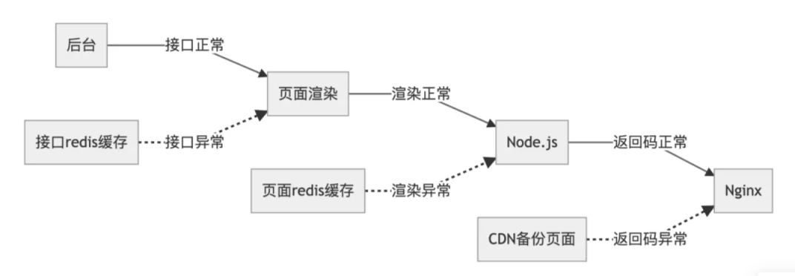
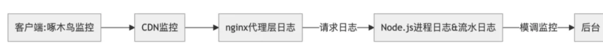

----
### webpack
1.有没有自己写过webpack的loader,他的原理以及啥的，记得也不太清楚。

2.有没有去研究webpack的一些原理和机制，怎么实现的。 

 webpack的原理, loader 和 plugin 是干什么的? 有自己手写过么 ? 

> webpack专题，自己写过就是照着教程写demo
>
> loader 用于对模块的源代码进行转换
>
> webpack 插件是一个具有 apply 方法的 JavaScript 对象。apply 方法会被 webpack compiler 调用，并且在整个编译生命周期都可以访问 compiler 对象。
>
> 插件可以监听webpacj整个编译周期，然后执行一些事情，然后也能拿到整个编译对象
>

对plugin了解的还不是很深


  Rollup和webpack区别, treeshaking是什么? 

todo: 大专题，深入分析（源码）tree-shaking的原理 

> 通过分别对Webpack和Rollup的介绍，不难看出，Webpack和Rollup在不同场景下，都能发挥自身优势作用。Webpack对于代码分割和静态资源导入有着“先天优势”，并且支持热模块替换(HMR)，而Rollup并不支持，所以当项目需要用到以上，则可以考虑选择Webpack。但是，Rollup对于代码的Tree-shaking和ES6模块有着算法优势上的支持，若你项目只需要打包出一个简单的bundle包，并是基于ES6模块开发的，可以考虑使用Rollup。

1，看下loader plugin怎么写的，看看详细过程，原理是什么

> C:\learn-note\面试笔试\打包工具\webpack\webpack4.0慕课.md在这里

2，tree-shaking原理 

> es6，可以支持，在没有运行前，就能判断引入的模块有没有被使用
>
> //_createClass本质上也是一个IIFE（ babel编辑之后会把class变成一个立即执行函数）
>
> https://juejin.im/post/6844903687412776974#heading-14
>
> 如果要`更好`的使用Webpack Tree shaking,请满足：
>
> - 使用ES2015(ES6)的模块   （开启babel的module：false）
> - 避免使用IIFE （不会shaking立即执行函数）
> - 如果使用第三方的模块，可以尝试直接从文件路径引用的方式使用（这并不是最佳的方式）
>
> ```
> import { fn } from 'module'; （模块也是用立即执行函数来引用其他工具模块）
> => 
> import fn from 'module/XX';
> ```
>
> /*#__PURE__*/(忘记可以往上看)，让下面的IIFE变成可分析的，成功了使用了Tree-shaking

3， 之后看下webpack学习目录

hmr热更新原理，找个有源码有流程图的好文章

----

### node3

简述公司node架构中容灾的实现 ? 

> 没搜到合适的，可以作为一个方向好好学习，往node工具方面发展
>
> 容灾是什么，
>
> 
>
> 
>
> \1. 客户端提供了前端监控和告警，提供用户侧的监控，比如页面质量，CGI 质量， 用户流水及手动上报的能力。
> \2. 反向代理层 由 Nginx 上报监控，监控访问波动，错误量占比 (4xx， 5xx) 时耗时。
> \3. 请求日志 主要记录原站的总请求数，请求失败数据及平均耗时。
> 4.Nodejs 进程日志 主要进程异常退出，内存泄露，僵尸进程等进程日志， 对业务稳定运行， 非常重要。
> 5.Node 请求流水日志 主要记录请求维度的开发自定义日志，用于问题的定位复盘， 进程状态观测。
> \6. 模调监控 监控请求方和服务方的错误和响应时间的情况，当前模块与底层依赖模块的接口实时接口质量。
>
> 每层的监控和日志可以帮助业务快速了解业务状态，定位业务异常。
>
> 总结来说：单个用户异常，查看客户端啄木鸟流水和 Node 请求流水日志，服务大概率异常查模调和请求日志，Node 进程异常查看 代理层日志和进程日志，响应时间异常可以从客户端、代理层、源站及模调的耗时逐步分析。
>
> 
>
> 大方向：数据容灾，应用容灾
>
> ssr

-----
### babel
 3.babel把ES6转成ES5或者ES3之类的原理是什么，有没有去研究。 

看babel那篇文章

> # 转换过程
>
> 转换过程分为三步：
>
> 1. Parser 解析
>    第一步主要是将 ES6 语法解析为 AST 抽象语法树。简单地说就是将代码打散成颗粒组装的对象。这一步主要是通过 babylon 插件来完成。
>
> 2. Transformer 转换
>    第二步是将打散的 AST 语法通过配置好的 plugins（babel-traverse 对 AST 进行遍历转译）和 presets （es2015 / es2016 / es2017 / env / stage-0 / stage-4 其中 es20xx 表示转换成该年份批准的标准，env 是最新标准，stage-0 和 stage-4 是实验版）转换成新的 AST 语法。这一步主要是由 babel-transform 插件完成。plugins 和 presets 通常在 .babelrc 文件中配置。
>
> 3. Generator 生成
>    第三步是将新的 AST 语法树对象再生成浏览器都可以识别的 ES5 语法。这一步主要是由 babel-generator 插件完成。
>
>    babel 各种包介绍
>
>    babel-core：核心包，提供转译的 API，用于对代码进行转译。例如 babel.transform。在 webpack 中 babel-loader 就是通过这个包实现。
>    babylon：babel 的词法解析器。将原始代码逐个字母地像扫描机一样读取分析得出 AST 语法树结构。
>    babel-traverse：对 AST 进行遍历转译。
>    babel-generator：将新的 AST 语法树生成新的代码。
>    babel-types：用于检验、构建和改变 AST 树的节点
>    babel-template：辅助函数，用于从字符串形式的代码来构建 AST 树节点
>    babel-helpers：一系列预制的 babel-template 函数，用于提供给一些 plugins 使用
>    babel-code-frames：用于生成错误信息，打印出错误点源代码帧以及指出出错位置
>    babel-plugin-xxx：babel 转译过程中使用到的插件，其中 babel-plugin-transform-xxx 是 transform 步骤使用的。
>    babel-preset-xxx：transform阶段使用到的一系列的 plugin。
>    babel-polyfill：JS 标准新增的原生对象和 API 的 shim，实现上仅仅是 core-js 和 regenerator-runtime两个包的封装。
>    babel-runtime：功能类似 babel-polyfill，一般用于 library 或 plugin 中，因为它不会污染全局作用域。

----
### 模块化 (这个好难，放后面) 2（今天）

 7.JS模块化Commonjs,UMD,CMD规范的了解，以及ES6的模块化跟其他几种的区别，以及出现的意义。

 简单介绍前端模块化，amd，cmd，commonjs es6的module 

 commonjs 和 es6的module哪个支持异步 

-----

### 业务场景3

 2.一个业务场景，面对产品不断迭代，以及需求的变动该怎么应对，具体技术方案实现。 

 具体业务场景，我就不一一描述，Boss在白板上画了一个大致的模块图，然后做了一些需求描述
 然后需求一层一层的改变，然后往下挖，主要是考察应对产品能力，以及对代码的可维护性和可拓展性这些考察，开放性问题，我觉得还考察一些沟通交流方面的能力，因为有些地方面试官故意说得很含糊，反正就是一个综合能力，以及对产品的理解，中间谈到怎么实现，也问到了一些具体的点，记得问到的有一下几个。

 1.业务场景：比如说百度的一个服务不想让阿里使用，如果识别到是阿里的请求，然后跳转到404或者拒绝服务之类的？ 7.怎么实现草稿，多终端同步，以及冲突问题？ 

场景题
1. 如何看待前端框架选型 ? 

1、保证产品质量

（1）功能稳健：网页不白屏，不错位，不卡死；操作正常；数据精准。

（2）体验优秀：加载体验，交互体验，视觉体验，无障碍访问。

2、降低人力成本

（1）降低前期开发成本；

 [工具使用技巧](..\..\..\工具使用技巧) （2）降低后期维护成本。
  假如监控系统别的组需要用，并且没满足他们的需求，你会怎么处理 
  设计一个通过拖拽，然后交换位置的组件，给思路就可以。 
 假如有2个团队，一个团队想用另一个团队的一个类库，并且还是想在用到的时候才加进来，怎么办？
 设计一个组件你会考虑哪些问题？ 

做成一个npm包，然后利用按需应用来打包，没答全

基本上都是和业务相关的，还有和产品、运营如何沟通协作等 

面试邀约看

----

### vue1

1. SSR 和 客户端渲染有什么区别 , vue是如何实现绑定事件的 ?
vue事件机制原理

https://juejin.im/post/6844903919290679304看这个

事件是我们日常开发中必不可少的功能点，`Vue`在应用层暴露了`@,v-on`的指令供开发者在模板中绑定事件。事件指令在模板编译阶段会以属性的形式存在，而在真实节点渲染阶段会根据事件属性去绑定相关的事件。对于组件的事件而言，我们可以利用事件进行子父组件间的通信，他本质上是在同个子组件内部维护了一个事件总线，从分析结果可以看出，之所以有子父组件通信的效果，原因仅仅是因为回调函数写在了父组件中。

（再看一遍原理，今天）

-----

### 移动端3
  移动端rem布局如何实现? 

- 使用rem布局，实质都是通过动态改写html的font-size基准值，来实现不同设备下的良好统一适配；
- 网易与淘宝不同 的地方是 ，网易将布局视口设置成了 视觉视口，淘宝将布局视口设置成了物理像素大小，通过 scale缩放嵌入了 视觉视口中；
- 容器元素的字体大小都不使用rem，需要额外的media查询；

https://segmentfault.com/a/1190000007526917

没看懂。需要一点基础，视口网易将布局视口设置成了 视觉视口，淘宝将布局视口设置成了物理像素大小，通过 scale缩放嵌入了 视觉视口中；

留后面看

----

### 优化1
1. 移动端如何优化首页白屏时间过长 ? 

---
### h5 1
 什么是h5? 

H5，“H”代表HTML，HyperText Markup Language，超文本标记语言。一般网页，无论是电脑上还是移动设备上，都是用这种HTML语言来编辑，以便用户来可以浏览。“5”代表HTML语言的第五个版本，目的是为了适应屏幕尺寸不一、使用场景不一的移动设备。

 举几个h5的新特性 

nav section aritcle<video> 标签是 HTML5 的新标签

---

 webview和h5的关系？  1
----

 4.git大型项目的团队合作，以及持续集成啥的。

1，按版本号分支来确定，gitprecommit 设置规范，commit规范

大范围题目，git rebase是什么，持续集成是什么，永辉项目怎么实践
这就是rebase操作的特点：把分叉的提交历史“整理”成一条直线，看上去更直观。缺点是本地的分叉提交已经被修改过了。
rebase操作可以把本地未push的分叉提交历史整理成直线；

rebase的目的是使得我们在查看历史提交的变化时更容易，因为分叉的提交需要三方对比。

----

todo： 了解下webview（今天）


-----


今天晚上能大致看完，然后就把笔记细细看看背背

明天定下学习计划