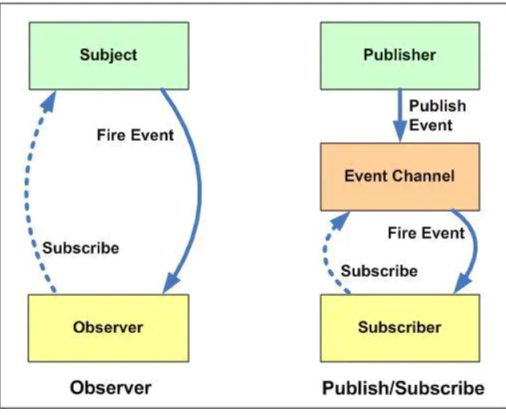
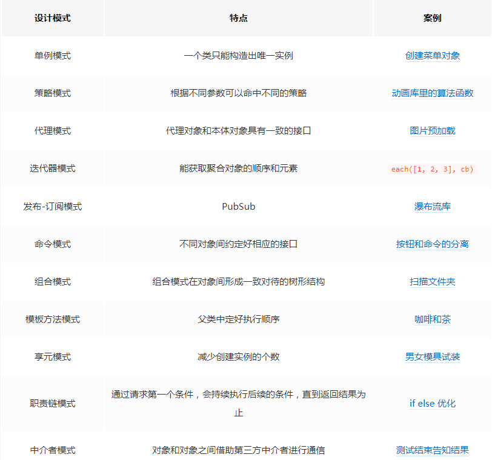

作者：伊川明道
链接：https://www.nowcoder.com/discuss/422075?type=2&order=0&pos=2&page=1&channel=666&source_id=discuss_tag
来源：牛客网


三面:

## 1 Vue3 proxy 解决了哪些问题？

> ES6 原生提供 Proxy 构造函数，MDN上的解释为：Proxy 对象用于定义基本操作的自定义行为（如属性查找，赋值，枚举，函数调用等）。
>
> 一个是拦截对象
>
> 一个是拦截对象的属性
>
> 所以proxy可以拦截对象的属性添加删除，数组的下标变化，然后需要递归遍历对象很耗性能
>
> 主要是因为Proxy是拦截对象，对`对象`进行一个"拦截"，外界对该对象的访问，都必须先通过这层拦截。无论访问对象的什么属性，之前定义的还是新增的，它都会走到拦截中，
>
> reflect是什么？？研究一下
>
> `Proxy` 是对象的包装，将代理上的操作转发到对象，并可以选择捕获其中的一些操作。
>
> 它可以包装任何类型的对象，包括类和函数。
>
> 语法为：
>
> ```
> let proxy = new Proxy(target, {
> /* traps */
> });复制代码
> ```
>
> ……然后，我们应该在所有地方使用 `proxy` 而不是 `target`。代理没有自己的属性或方法。如果提供了钩子，它将捕获操作，否则将其转发给 `target` 对象。
>
> 我们可以捕获：
>
> - 读取（`get`），写入（`set`），删除（`deleteProperty`）属性（甚至是不存在的属性）。
> - 函数调用（`apply` 钩子）。
> - `new` 操作（`construct` 钩子）。
> - 许多其他操作（完整列表在本文开头和 [docs](https://developer.mozilla.org/en-US/docs/Web/JavaScript/Reference/Global_Objects/Proxy) 中）。
>
> 这使我们能够创建“虚拟”属性和方法，实现默认值，可观察对象，函数装饰器等等。
>
> 我们还可以将对象多次包装在不同的代理中，并用多个函数进行装饰。
>
> 该[Reflect](https://developer.mozilla.org/en-US/docs/Web/JavaScript/Reference/Global_Objects/Reflect) API旨在补充 [Proxy](https://developer.mozilla.org/en-US/docs/Web/JavaScript/Reference/Global_Objects/Proxy)。对于任何 `Proxy` 钩子，都有一个带有相同参数的 `Reflect` 调用。我们应该使用它们将调用转发给目标对象。
>
> Proxy 有一些局限：
>
> - 内置对象具有“内部插槽”，对这些对象的访问无法被代理。请参阅上面的解决方法。
> - 私有类字段也是如此，因为它们是在内部使用插槽实现的。因此，代理方法的调用必须具有目标对象 `this` 才能访问它们。
> - 对象相等性测试 `===` 不能被拦截。
> - 性能：基准测试取决于引擎，但通常使用最简单的代理访问属性所需的时间要长几倍。实际上，这仅对某些“瓶颈”对象重要。

> 总结一下： 就是proxy是个新的对象，他会拦截对target对象的操作。Object.defineProperty()拦截的是对象属性的操作。所以proxy能解决一些问题，无法监测添加删除属性，操作数组下标，递归添加带来的能耗。
>
> reflect是针对proxy，提供直接处理原对象，绕过代理的方法
>
> proxy也有不足
>
> 许多内置对象，例如 `Map`, `Set`, `Date`, `Promise` 等等都使用了所谓的 “内部插槽”。添加了proxy之后，这些对象就不能正常使用mapset方法（要再包裹一层）
>
> 私有属性变化
>
> Proxy != target

##  Vue 响应式原理。

找到自己写的笔记啊啊啊

todo：再看一遍mvvm，然后写出一段详细答案，现在不想复习


##  发布订阅模式和观察者模式的异同。

设计模式（看看）

> 在**观察者**模式中，观察者是知道Subject的，Subject一直保持对观察者进行记录。然而，在**发布订阅**模式中，发布者和订阅者**不知道对方的存在**。它们只有通过消息代理进行通信。
>
> 在**发布订阅**模式中，组件是松散耦合的，正好和观察者模式相反。
>
> **观察者模式**大多数时候是**同步**的，比如当事件触发，Subject就会去调用观察者的方法。而**发布-订阅**模式大多数时候是**异步的**（使用消息队列）。
>
> **观察者** 模式需要在单个应用程序地址空间中实现，而**发布-订阅**更像交叉应用模式。
>
> 




## 图片懒加载实现。

``

监听scroll事件，图片在视口再显示，将data-src中真正的url替换src属性值

## css 垂直居中。

行内元素

```css
.parent {
    height: 100px;
    border: 1px solid #ccc; /*设置border是为了方便查看效果*/
}
.parent img {
    //注意此时应该保证图片自身的高度或者你设置的高度小于父元素的200px的行高,不然你看不出来居中的效果.
    line-height: 100px;
}
```

**固定宽高**

- position absolute + 负margin
- position absolute + margin auto
- position absolute + calc

看字典树最优解 （完成）

- position absolute + transform
- css-table
- flex
- grid

### position absolute + margin auto

css代码如下：

```
    /* 此处引用上面的公共代码 */
    .container {
        position: relative;
    }
    .box-center {
        position: absolute;
        top: 0;
        left: 0;
        right: 0;
        bottom: 0;
        margin: auto;
    }
```

### position absolute + 负margin

css代码如下：

```
    /* 此处引用上面的公共代码 */
    .container {
        position: relative;
    }
    .box-center {
        position: absolute;
        top: 50%;
        left: 50%;
        margin-top: -50px;
        margin-left: -50px;
    }
```

### position absolute + calc

css代码如下：

```
    /* 此处引用上面的公共代码 */
    .container {
        position: relative;
    }
    .box-center {
        position: absolute;
        top: calc(50% - 50px);
        left: calc(50% - 50px);
    }
复制代码
```

通过`calc`计算属性减去元素本身高度和宽度的一半。

### flex

css代码如下：

```
    /* 此处引用上面的公共代码 */
    .container {
        display: flex;
        justify-content: center;
        align-items: center;
    }
    .box-center {
        text-align: center;
    }
```


## CI/CD 流程。

## 谈谈性能优化。

哔哩哔哩

一面:

## Vue3 proxy 优缺点。

有点就是，解决了Object.defineProperty()的三个缺点。

缺点就是: 1，一些内置的属性会失效，map set 一个能用set方法的对象被proxy包裹1了之后无法调用

2，内部私有属性失效，因为this指向原因 ？？？

[内建方法 `Map.prototype.set`](https://tc39.es/ecma262/#sec-map.prototype.set) 方法试图访问内部属性 `this.[[MapData]]`，但由于 `this=proxy` 在 `proxy` 中不能找到它，只能失败

this指向

- 内置对象具有“内部插槽”，对这些对象的访问无法被代理。请参阅上面的解决方法。
- 私有类字段也是如此，因为它们是在内部使用插槽实现的。因此，代理方法的调用必须具有目标对象 `this` 才能访问它们。
- 对象相等性测试 `===` 不能被拦截。
- 性能：基准测试取决于引擎，但通常使用最简单的代理访问属性所需的时间要长几倍。实际上，这仅对某些“瓶颈”对象重要。

## ES6 特性。

所以那本书上都是

## ssr 性能优化，node 中间层细节处理。

Vue 应用运行时性能优化措施

- 引入生产环境的 Vue 文件
- 使用单文件组件预编译模板
- **提取组件的 CSS 到单独到文件**
- 利用`Object.freeze()`提升性能
- **扁平化 Store 数据结构**
- 合理使用持久化 Store 数据
- **组件懒加载**

Vue 应用加载性能优化措施

- 服务端渲染 / 预渲染
- 组件懒加载
  作者：迅雷前端
  链接：https://juejin.im/post/5b960fcae51d450e9d645c5f

## Promise 实现原理。

todo

## vue 组件间通信。

prop $emit

$children  $parent

provide inject

ref refs

eventBus

vuex

localstorge sessionStorage

$attrs  $listeners

就是把prop中的变量全部放到$attr里面，如果用来隔代传递

## vuex 数据流动过程。

 state、getters、mutations、actions、modules 。

使用mapState辅助函数, 利用对象展开运算符将state混入computed对象中

```js
import {mapState} from 'vuex'
export default{
    computed:{
        ...mapState(['price','number'])
    }
}
```


## 谈谈 css 预处理器机制。

## 算法：Promise 串行。

串行是指多个任务时，各个任务按顺序执行，完成一个之后才能进行

```js
function iteratorPromise(arr){

	(function iter(){
		if(arr.length)
			arr.shift()().then(iter)
	})()
}

let arr = [()=>{
	return new Promise(res=>{
		console.log("run", Date.now());
		res()
	})
},()=>{
	return new Promise(res=>{
		console.log("run", Date.now());
		res()
	})
},()=>{
	return new Promise(res=>{
		console.log("run", Date.now());
		res()
	})
}]

```

利用了promise的链式调用

## SSR 对性能优化的提升在哪里。

## 怼项目。

但其实也可以将SPA应用打包到服务器上，在服务器上渲染出HTML，发送到浏览器，这样的HTML页面还不具备交互能力，所以还需要与SPA框架配合，在浏览器上“混合”成可交互的应用程序。所以，只要能合理地运用SSR技术，不仅能一定程度上解决首屏慢的问题，还能获得更好的SEO。


---

## packge.json  npm init

所以 npm 官方提供了 `npm init` 命令帮助我们快速初始化 `package.json` 文件。执行之后会有一个交互式的命令行让你输入需要的字段值，当然如果你想直接使用默认值，也可以使用 `npm init -y` 来超速初始化。

## dev-dependence（开发）和dependence（上线）有啥不同？

​	

1. ​			dependencies：在生产环境中需要用到的依赖 	
2. ​			devDependencies：在开发## 测试环境中用到的依赖 	

- ​				description：描述信息，有助于搜索 		
- ​				main: 入口文件，一般都是 index.js 		
- ​				scripts：支持的脚本，默认是一个空的 test 		
- ​				keywords：关键字，有助于在人们使用 npm search 搜索时发现你的项目 		
- ​				author：作者信息 		
- ​				license：默认是 [MIT](https://zh.wikipedia.org/wiki/MIT許可證)  		
- ​				bugs：当前项目的一些错误信息，如果有的话

----

作者：欢迎来到祖安
链接：https://www.nowcoder.com/discuss/375032?type=2&order=0&pos=3&page=1&channel=666&source_id=discuss_tag


##  跨域

 **JSONP的实现流程**

- 声明一个回调函数,其函数名(如show)当做参数值,要传递给跨域请求数据的服务器,函数形参为要获取目标数据(服务器返回的data)
- 创建一个 <script src=>标签 ,把那个跨域的API数据接口地址,赋值给script的src， 还要在这个地址中向服务器传递该函数名(可以通过问号传参?callback=show)。
- 服务器接收到请求后,需要进行特殊的处理:把传递进来的函数名和它需要给你的数据拼接成一个字符串,例如:传递进去的函数名是show,它准备好的数据是 show('我不爱你')。
- 最后服务器把准备的数据通过HTTP协议返回给客户端,客户端再调用执行之前声明的回调函数(show),对返回的数据进行操作。

##  预检请求

不过在学习CORS时，有些朋友会有疑惑，为什么CORS要把请求分成两类：简单请求和预检请求（preflighted requests）呢？

第二，要回答某个请求是否接受跨源，可能涉及额外的计算逻辑。这个逻辑可能很简单，比如一律放行。也可能比较复杂，结果可能取决于哪个资源哪种操作来自哪个 origin。对浏览器来说，就是某个资源是否允许跨源这么简单；对服务器来说，计算成本却可大可小。所以我们希望最好不用每次请求都让服务器劳神计算。

CORS-preflight 就是这样一种机制，浏览器先单独请求一次，询问服务器某个资源是否可以跨源，如果不允许的话就不发实际的请求。注意先许可再请求等于默认禁止了跨源请求。如果允许的话，浏览器会记住，然后发实际请求，且之后每次就都直接请求而不用再询问服务器否可以跨源了。于是，服务器想支持跨源，就只要针对 preflight 进行跨源许可计算。本身真正的响应代码则完全不管这个事情。并且因为 preflight 是许可式的，也就是说如果服务器不打算接受跨源，什么事情都不用做。

 复杂请求需要用个预请求来判断服务器支不支持，再发送实际请求

##　进程与线程


---

作者：JCXJanet
链接：https://www.nowcoder.com/discuss/225896?type=2&order=0&pos=4&page=1&channel=666&source_id=discuss_tag
来源：牛客网


0.自我介绍（专业技能## 项目## 实习） 

  1.变量提升？ 

  2.浏览器上输入一个网址经历了哪些过程？ 

  3.js的运行机制（event loop） 

  4.解释一下事件冒泡## 事件捕获，先进行的是哪个？事件***？ 

  5.闭包？有什么作用？ 

  6.继承的方法？讲一下原型链？ 

  7.es6使用过哪些？let和const的区别？ 

  8.键头函数的this指向和普通函数的区别？ 

  9.Promise了解么？ 

  10.vue的生命周期？created和mounted的区别？ 

  11.Vue Router生命周期 

  12.computed和watch区别 

  13.网页的优化？ 

  14.怎么判断数组？isArray  instanceof 

  15.怎样将***数组降成一维？[1,[2,3],[2,3,[3,4]],4] => [1,2,3,4] 

  16.css的预处理框架有什么作用? 

  17.webpack原理？有没有自己配过？ 

  


  一个多礼拜前的，刚投完就来了面试，问了好多好多，还聊了会天，反正应该已经挂了这么久了（/哭）

----

作者：杨珏成
链接：https://www.nowcoder.com/discuss/369971?type=2&order=0&pos=1&page=1&channel=666&source_id=discuss_tag
来源：牛客网


详述es5 es6中的作用域和闭包 √（es5全局+函数级，函数化闭包，es6块级） 

详述输入url到页面渲染完成 √（域名解析-TCP分包-IP寻路-握手-滑动窗口传输-持久化连接-挥手-解析-构建dom树与cssom-构建渲染树-回流-重绘-渲染） 

详述js异步机制Event Loop，MacroTask和MicroTask √（1个主线程+n个任务队列，浏览器异步处理后推入队列，循环处理，一个macroTask后跟全部microtask） 

Promise.all的用法 √（在所有all中的promise结束后再执行） 

如何让Promise.all在抛出异常后依然有效 ×（正确答案：主动reject） 

什么是VueX √（状态量跨组件管理）

- VueX中action和mutation的区别 ×（正确答案：同步和异步） 

详述Vue的双向数据绑定原理 √（语法糖，dom监听+模型监听） 

Vue的优势 √（virtual dom，数据绑定，视图与模型分离，隐去冗杂的dom操作） 

如何实现SEO优化 ？（只答了服务器端伪静态） 

详述回流和重绘优化 √（回流是对物理尺寸的变更，回流一定会重绘，重绘不一定回流，因此尽量减少回流次数，将元素移出dom树再变更） 

详述防抖和节流优化 √（状态锁/同步锁） 

简述ES6新特性 √（块级作用域,变量不提升,let, const,箭头函数,模板字符串,promise,async） 

简述箭头函数特性 × 

webpack打包如何优化 ×

---

作者：杨珏成
链接：https://www.nowcoder.com/discuss/369971?type=2&order=0&pos=1&page=1&channel=666&source_id=discuss_tag
来源：牛客网


纯js如何获取scrolltop值 √ 

详述js闭包原理和意义 √ 

深拷贝 浅拷贝是什么 √ 

arguments如何转数组 √ 

移动端和pc端click事件为什么差了300毫秒 ×（因为iphone可以双击缩放） 

flex布局用法 √ 

如何实现移动端响应式布局 √ 

ES6的作用域 √ 

async await是什么 √ 

块级作用域有哪些 √ 

详述promise异步机制 √ 

如何实现跨域访问 √ 

http通信如何设置缓存 √ 

详述http状态码 √ 

如何实现vue组件通信 √ 

简述VueX的作用 √ 

如何实现一个swiper √ 

hybrid是什么 √ 

hybrid js如何调用native接口 × 

为什么要做前端 

对于自己的发展规划 

上海怎么样

---

作者：江小菜
链接：https://www.nowcoder.com/discuss/234207?type=2&order=0&pos=5&page=1&channel=666&source_id=discuss_tag
来源：牛客网


1. js数据类型，简单与复杂的数据类型区别 	
2. ​			跨域实现方式 ，具体每种的实现方式 	
3. ​			http2与http1区别，刚说到多路复用就让说一下具体实现，什么是多路复用 	
4. ​			promise底层实现原理 	
5. ​			除了cookie， webStorage还有哪些本地存储的方式 	
6. ​			vue路由如何实现 	
7. ​			vue子组件如何修改父组件的值 	
8. ​			项目中实现了哪些公共组件 	

​		总结：问的很深入，一般回答完都要继续追问具体实现方式。被小破站虐的很惨。。

---

作者：jz
链接：https://www.nowcoder.com/discuss/306949?type=2&order=0&pos=6&page=1&channel=666&source_id=discuss_tag
来源：牛客网


16届本科非科班转行前端，裸辞用了一个月的时间全力准备找工作，主要是巩固基础知识## 刷刷算法题以及总结项目经验。月末开始面试，面了有三个星期。基本上JD写的比较有诚意以及眼熟的公司都投了，考虑到个人实在是无法接受996，所以投递的基本比较偏向非996的公司。  

​        猫眼电影（过）           加班属于互联公司的正常范围，紧急加班的情况居多，薪资正常范围。
​            一面     

1. ​       vue组件间通信       
2. ​       Vue3 proxy的好坏       
3. ​       性能优化       
4. ​       react和vue更新机制的区别       
5. ​       symbol应用       
6. ​       深拷贝       
7. ​       项目       

​           二面                dns解析流程              怼项目            

###     拼多多（过）    

​    纯996。其实当时也就是随便面面，不过薪资确实给的很大方，我就是随口说了个数，人家不带犹豫地就答应了。
​     

####     一面    

1. ​     Promise实现原理         
2. ​     vue组件间通信         
3. ​     性能优化         
4. ​     vuex数据流动过程         
5. ​     谈谈css预处理器机制         
6. ​     算法：Promise串行        

####     二面    

1. ​     CI/CD整体流程         
2. ​     性能优化         
3. ​     SSR对性能优化的提升在哪里         
4. ​     怼项目        

###    达观数据（过）   

   不加班，提倡工作和生活严格区分。感觉公司非常重视技术，技术栈是Angular + Python，也有严格的code review，不过hr给的薪资是我报的期望薪资的最低值，也是我拿到的所有offer中最低的，涨幅10%，更绝的是试用期还要减1k工资，社保公积金按10k交，emmm。
    

####    笔试   

   同样都是基础题，注意有两道算法：柯里化通用实现和two-sum问题。   

####    一面   

1. ​     typescript的好处     
2. ​     vue项目中如何约束rxjs数据类型     
3. ​     rxjs高阶数据流定义，常用的高阶数据流操作符     

####    二三面   

   两面都基本没问什么基础题基础题，全在深挖项目，但更侧重rxjs和typescript这块内容。   

###    英语流利说（挂）   

   考察的题目相对偏硬核和细节，也是唯一一家把我挂了的公司。感觉这家公司技术上是有点东西，但和hr聊的不算很愉快，在问到公司的工作时间的时候，hr的回复是“我们的员工都是很自觉推动工作的，况且你还年轻，趁这个时候多拼一下“，加班应该比较严重。
    

####    一面（电面）   

1. ​     RxJS冷热流区别     
2. ​     RxJS调试方法     
3. ​     针对React的性能优化手段     
4. ​     301 302 307 308 401 403     
5. ​     nginx负载均衡配置     
6. ​     谈谈XSS防御，以及Content-Security-Policy细节     
7. ​     前端性能优化手段     
8. ​     JWT优缺点     
9. ​     选择器优先级     
10. ​     基本数据类型     
11. ​     vue的nextTick实现原理以及应用场景     
12. ​     vue组件间通信     

####    二面   

1. ​     mobx-react如何驱动react组件重渲染     
2. ​     React key场景题：列表使用index做key，删除其中一个后，如何表现？     
3. ​     forceUpdate经历了哪些生命周期，子组件呢?     
4. ​     RxJS相对于其他状态管理方案的优势？     
5. ​     场景题：一个气球从右上角移动到中间后会抖动，怎么实现     
6. ​     场景题：计算外边距合并的高度     
7. ​     算法：实现setter(obj, 'a.b.c' ,val)     

####    三面   

1. ​     手写冒泡排序     
2. ​     JWT细节，适用场景     
3. ​     跨域     
4. ​     方案题：不同前端技术栈的项目，如何实现一套通用组件方案？     

​             达达京东到家（过）              面试整体上偏重基础知识，一二面基本没问项目，加班情况听hr说属于正常程度，有双休，环境也挺不错的，感觉是家不错的公司。
​               笔试              都是些基础选择题，考察计算机网络，事件循环机制，闭包，this这些。              一面              TCP有哪些手段保证可靠交付                     三次握手和四次挥手详细介绍                URL从输入到页面渲染全流程                DNS解析会出错吗，为什么                ES6的Set内部实现                如何应对流量劫持                如何预防中间人攻击                算法：top-K问题，分成top-1,top-2,top-K三小问                          二面                    跨域                 webpack的plugins和loaders的实现原理                 vue和react谈谈区别和选型考虑                 webpack如何优化编译速度                 事件循环机制，node和浏览器的事件循环机制区别                   三面                    单元测试编写有哪些原则                 一个大型项目如何分配前端开发的工作                 怼项目              

###    天壤智能（过）   

   个人感觉真的挺不错的，工作时间975，hr和面试官都很有诚意，薪资也不错，如果不是很看重平台可以考虑一下，大概会接触到一些可视化相关的工作，唯一不足的就是前端团队目前比较小。
    

####    一面   

1. ​     react生命周期     
2. ​     key的作用     
3. ​     hooks     
4. ​     vue和react区别，选型考虑     
5. ​     canvas优化绘制性能     
6. ​     webpack性能优化手段     
7. ​     事件循环     
8. ​     如何解决同步调用代码耗时太高的问题     
9. ​     手写Promise实现     

####    二面   

1. ​     场景题：如何实现登录功能     
2. ​     聊项目     

####    三面   

   聊项目   

​        拍拍贷（过）           主要做混合app和node方向的工作，成长空间应该可以，公司环境也不错，薪资也算有诚意，不过因为是核心组，加班肯定不少。另外因为p2p行业原因，对这方面有顾虑的也要好好考虑下。最后就是位置太偏僻了。。下地铁后还要坐4站左右的公交吧。
​            一面                ES6的特性              Promise内部实现原理              virtual dom有哪些好处              vuex, mobx, redux各自的特点和区别              react生命周期              谈谈闭包和this              postcss配置              各方面谈谈性能优化              serviceworker如何保证离线缓存资源更新               然后换了个有黑板的面试间，狂怼项目，各方面都问到了。           二面           总监面，把刚才一黑板的项目架构图全部擦掉，再来谈一遍。           三面           交叉技术面                Vue3 proxy解决了哪些问题？              Vue响应式原理              发布订阅模式和观察者模式的异同              图片懒加载实现              css垂直居中              CI/CD流程              谈谈性能优化         
​    

####    一面   

1. ​     跨域     
2. ​     性能优化     
3. ​     vue和react选型和比较     
4. ​     ssr优缺点     
5. ​     贝塞尔曲线     
6. ​     怼项目     

####    一面  

##  如何编写loaders和plugins    

loaders是处理项目中文件的，

reverse-loader.js

```
module.exports = function (src) {
  if (src) {
    console.log('--- reverse-loader input:', src)
    src = src.split('').reverse().join('')
    console.log('--- reverse-loader output:', src)
  }
  return src;
}
```

源代码需要做一些填充就可以自己编写loader

src就是解析之后的js代码。

loaders必须是一个函数，不能是剪头函数，因为webpack要给他绑定this

---

plugins

就是对webpack广播函数应用一个函数，这个函数我们编写的，能拿到webpack的配置信息，当前模块的编译对象

- **Compiler 对象包含了 Webpack 环境所有的的配置信息**，包含 options，loaders，plugins 这些信息，这个对象在 Webpack 启动时候被实例化，它是全局唯一的，可以简单地把它理解为 Webpack 实例；
- **Compilation 对象包含了当前的模块资源、编译生成资源、变化的文件等**。当 Webpack 以开发模式运行时，每当检测到一个文件变化，一次新的 Compilation 将被创建。Compilation 对象也提供了很多事件回调供插件做扩展。通过 Compilation 也能读取到 Compiler 对象。

#### Compiler 和 Compilation 的区别在于：

Compiler 代表了整个 Webpack 从启动到关闭的生命周期，而 Compilation 只是代表了一次新的编译


## webpack 热更新原理   

另一种是基于`WDS (Webpack-dev-server)`的模块热替换，只需要局部刷新页面上发生变化的模块，同时可以保留当前的页面状态，比如复选框的选中状态、输入框的输入等

最后思考下🤔，浏览器是如何知道本地代码重新编译了，并迅速请求了新生成的文件？是谁告知了浏览器？浏览器获得这些文件又是如何热更新成功的？那让我们带着疑问看下热更新的过程，从源码的角度看原理。

- 启动`webpack`，生成`compiler`实例。`compiler`上有很多方法，比如可以启动 `webpack` 所有**编译**工作，以及**监听**本地文件的变化。

- 使用`express`框架启动本地`server`，让浏览器可以请求本地的**静态资源**。

- 本地`server`启动之后，再去启动`websocket`服务，如果不了解`websocket`，建议简单了解一下[websocket速成](https://www.ruanyifeng.com/blog/2017/05/websocket.html)。通过`websocket`，可以建立本地服务和浏览器的双向通信。这样就可以实现当本地文件发生变化，立马告知浏览器可以热更新代码啦！

- 当监听到一次`webpack`编译结束，就会调用`_sendStats`方法通过`websocket`给浏览器发送通知，`ok`和`hash`事件，这样浏览器就可以拿到最新的`hash`值了，做检查更新逻辑。

为什么代码的改动保存会自动编译，重新打包？这一系列的重新检测编译就归功于`compiler.watch`这个方法了。监听本地文件的变化主要是通过**文件的生成时间**是否有变化，这里就不细讲了。

https://juejin.im/post/5de0cfe46fb9a071665d3df0

todo 很多之后要多看看


## 谈谈element框架源码     

