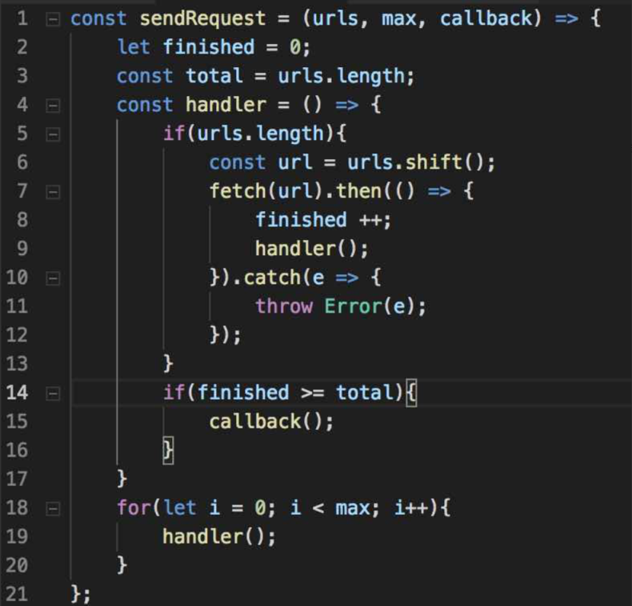

#### 字节（同面试冲刺-8-16）（除了补充的其他都有准备）

字节是通过一个同学内推的。字节也是自己比较中意的公司之一吧。为了准备字节面试，刷了不少leetcode，虽然好像面试也没怎么考，但是通过这段时间刷leetcode，不得不承认感觉自己的代码能力也有一定提升

某个周日晚上20点

一面

- 常用的http状态码(101 200 204 301 302 304 307 400 404 500...)

  \> [`100 Continue`](https://developer.mozilla.org/zh-CN/docs/Web/HTTP/Status/100)**101对切换协议的确认回复**

  这个临时响应表明，迄今为止的所有内容都是可行的，客户端应该继续请求，如果已经完成，则忽略它。101，对客户端切换协议的确认回复

- 301和302的区别(永久/临时)

- 前端路由怎样实现(`hashchange`事件 hack history.pushState)

- 前端路由直接刷新404怎样处理(404时重定向到index.html 如nginx)

- 从前端到后端全链路如何设计实现一个登陆的流程(session方案、jwt) （没准备的太细）

- 什么是跨域，怎样处理

- 简单请求和复杂请求的区别

- 浏览器的缓存策略说下

- domain属性解决跨域。几种domain设置对跨域是否生效

- ts 泛型做什么的，infer关键字的作用

题目

- 实现typescript的`Paramters`、`ReturnType` (考察infer关键字使用)
- 实现`Promise.all` (**每个promise resolve结果存数组，最后一个promise返回时，把数组返回**)
- 实现一个并发请求控制函数，限制并发数

  > 并发，就是同时进行，并行，就是一次只有一个，但是同时开始。找了一个容易看懂的，就是用闭包变量，来控制并发数量
  >
  > 

二面 一面之后马上进行了二面

- jwt的原理（以前用过，比较好说）
- xss和csrf是怎样的，如何去解决
- `pureComponent`和`Component`的区别(前者`shouldComponentUpdate`默认比较props)
- `react` hoc hook解决了什么问题
- 有哪些常用的react hook，它们做了什么(`useState` `useReducer`` useContext`等等...)
- 项目实现一个中间层的意义（前端全链路日志打通）
- `setState`同步还是异步
- `setState`传递对象和函数有什么区别？如何选择
- 合成事件怎样的，有什么好处
- 事件冒泡和事件捕获的区别、react中的冒泡和捕获呢（react中都是合成事件，无论冒泡和捕获，对应于原生事件都是冒泡）
- 怎样看待加班（hhh 加班很正常啦，在腾讯的时候也是每天加班）
- 为啥选择跳槽

题目

- 实现`css`垂直、水平居中
- 实现`bind`函数
- 实现快速排序

三面 三面是leader面，某个周二下午进行

- 为什么之前拿了实习offer没来/下一份工作有怎样的预期
- `graphql`相比`restful`的区别、优点缺点()
- 为啥选择了`redux-saga`作为解决方案(解决异步优雅/提供很多工具函数)。`redux`的异步中间件方案有哪些，对比。`saga`对比`dva`？
- graphql的鉴权在哪里做
- 协程是什么（语言层面实现的并发），Go/nodeJs怎样去实现协程（Go使用go关键字、`node`可以使用`Generator`实现、我理解`react`16的异步渲染也是协程的实现）
- `react` `fiber`的机制是怎样的
- 锁机制的作用，node和Go如何处理死锁
- Go/node实现并发怎么做
- node和Go的优缺点怎样理解

编程

- 实现一个`useState`

三面可能因为简历写了自己写过一些Go（其实我只是个人项目的一些玩具），面试官问了不少node和Go的问题，然后我就先表明Go自己只是简单学过，然后就按照我的理解回答node和Go的问题..幸好感觉回答得也7788吧

四面 因为某些原因，前3面发了offer后我选择换了部门，于是就有了4面

- 介绍项目 项目难点
- 项目做了哪些优化
- 一个广告页面，如何统计在不同平台上的停留时间
- 为何选择换工作

四面基本上都是聊项目，难得没有做题。我们准备面试的时候一定也要先整理下自己的项目的一些难点之类的，所以四面过程还是比较轻松的

字节感觉总体难度是这4个公司面试难度最大的，写代码也是最多的，而且感觉面试的时候写代码真的比平时加了不少`debuff`，这个还是非常考验心理素质和代码能力的。最后还是有惊无险拿了字节跳动的offer啦～

作者：flytam
链接：https://juejin.im/post/6855649603497230350
来源：掘金
著作权归作者所有。商业转载请联系作者获得授权，非商业转载请注明出处。

---

这篇在之前中已经出现，并已看