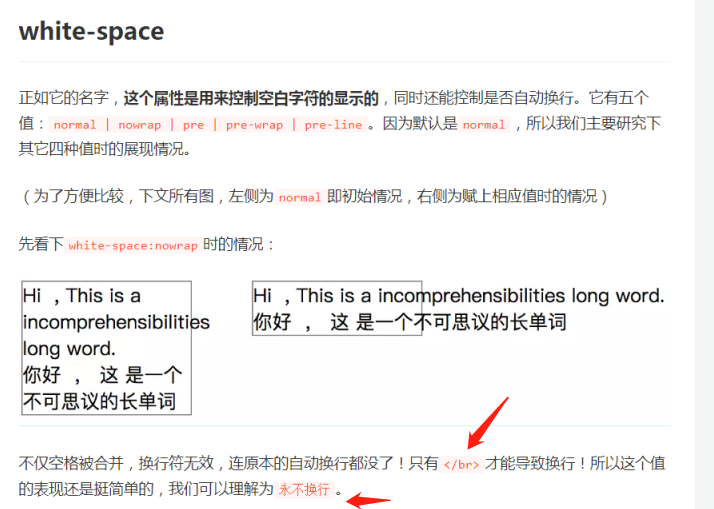

1.for of 和 for in 的区别和优缺点

> for of 用来遍历含有Symbol.iterator属性的对象，数组，setmap都可以
>
> for in 遍历数组的时候，空位不会被遍历，如果有原型属性也会被遍历
>
> 对于**数组** ，迭代出来的是**数组元素**，对于**对象** ，迭代出来的是对象的**属性；**
>
> **所有可枚举属性，包括继承属性**
>
> 我们需要手动判断 key 是否属于 obj 自身，然后进行真正的操作。因此，有一些开发者，建议不用 for in，总是使用 Object.keys。
>
> 
>
> 
>
> 
>
> Object.keys 是 ES5 新增的静态方法，它将 obj 自身包含的所有可遍历的 key，装配成数组形式返回。配合同样是 ES5 新增的数组 forEach 方法，可以实现遍历对象的功能。
>
> 

​	2.position

>​			static：默认值，表示没有开启定位
>
>​			relative：开启元素的相对定位 **相对自己原来的位子定位**
>
>​			absolute：开启元素的绝对定位  **相对第一个开启定位的祖先元素**
>
>​			fixed：开启元素的固定定位（也是绝对定位的一种） **根据浏览器窗口定位**

​	3.css省略文本 单行 和多行

> ``` 
> overflow:hidden;
> text-overflow:ellipsis;
> white-space:nowrap;
> （需要对容器设置单行高度）
> ```
>
> 

​	4.对象怎么防篡改

>**实现方法**：Object.freeze(yourObjName)
>
> **检测是否被冻结**：Object.isFrozen(yourObjName)
>
>不可以新增属性，不可修改属性描述符，不可删除属性，不可修改属性

​	5.bfc

> bfc管理开启了bfc元素里面的所有块级元素
>
> bfc布局规则：
>
> 1，内部box会垂直排列
>
> 2，bfc的区域不会与float box重叠
>
> 3，内部的BOX垂直方向的距离由margin决定，属于同一个BFC的两个相邻box的margin会发生重叠
>
> BFC是指**一个独立的渲染区域，只有Block-level Box参与， 它规定了内部的Block-level Box如何布局，并且与这个区域外部毫不相干**.
>
> 它的作用是在**一块独立的区域，让处于BFC内部的元素与外部的元素互相隔离**

​	6.事件代理

> 事件冒泡：就是从点击的子元素一直向上触发事件
>
> 事件捕获：就是发生了点击事件，从父元素向子元素依次触发
>
> addEventListener() 和 removeEventListener()。这两个方法都接收三个参数：事件名称、事件处理器函数和一个布尔值。前两个参数不作解释，最后一个布尔值则是决定这个事件的事件流处理方式是什么？**默认情况下布尔值是 false，表示事件处理器是在冒泡阶段触发。**当布尔值为 true 的时候则事件处理器是在捕获阶段触发。
>
> 数据代理：这样将事件监听函数加到父元素上，借助事件冒泡机制来处理数目不定的子元素事件的方式，就被叫做**事件代理**（或**事件委托**）。
>
> e.preventDefault();

​	7.http缓存

> https://juejin.im/post/5b3c87386fb9a04f9a5cb037
>
> 有两种，expires和cache-control两个字段，这两个字段，有cache-control
>
> - Expires 过期控制不稳定，因为浏览器端可以随意修改时间，导致缓存使用不精准。
> - Last-Modified 过期时间只能精确到秒。
>
> cache-control更优先
>
> 讲之前我那个图吧，透视http上面的图
>
> - HTTP1.0提供Expires，值为一个绝对值表示
> - HTTP1.1增加了Cache-Control : max-age=，值为以秒为单位的最大新鲜时间
>
> 做题

​	8.如果单张图片让他一直返回200怎么办

> 

​	9.浏览器加载页面时的pending状态 怎么优化

> 1、尽量减少大批量ajax请求，尤其是在网络不通畅，大量ajax请求未返回响应式，占用socket连接。
> 2、禁止短时间内进行大批量ajax请求。
> 3、多个图片尽量进行懒加载
>
> http1.1的时候会出现等待事件，
>
> 浏览器http1.1给每个域名分配6个tcp链接，并且支持使用代理来实现域名分片，
>
> 因为http1.1是接受应答式，当这个tcp链接还没有应答时需要等待，浏览器准备资源分配资源也是需要实践。
>
> 优化，就是减少短剑时大批请求，大文件采用分段请求，开启gzip压缩
>
> http2，使用了类似udp的解决了队头阻塞，一个域名只分配一个tcp链接。所有请求都可以并发请求。pedding时间相对较少。可以考虑升级到http2
>
> 排队：1，资源优先级，重要的jscsshtml会排在前面，每个域名只有6个tcp链接，前期准备分配磁盘也需要等待
> 排队时间过久，⼤概率是由浏览器为每个域名最多维护6个连接导致的。那么基于这个原因，你就可以让1个 站点下⾯的资源放在多个域名下⾯，⽐如放到3个域名下⾯，这样就可以同时⽀持18个连接了，这种⽅案称 为域名分⽚技术。除了域名分⽚技术外，我个⼈还建议你把站点升级到HTTP2，因为HTTP2已经没有每个 域名最多维护6个TCP连接的限制了。
> http1.1
> 实现
> 利用cdn代理来实现域名分片
> 基于此，HTTP/2的思路就是⼀个域名只使⽤⼀个TCP⻓连接来传输数据，这样整个⻚⾯资源的下载过程只 需要⼀次慢启动，同时也避免了多个TCP连接竞争带宽所带来的问题。 另外，就是队头阻塞的问题，等待请求完成后才能去请求下⼀个资源，这种⽅式⽆疑是最慢的，所以 HTTP/2需要实现资源的并⾏请求，也就是任何时候都可以将请求发送给服务器，⽽并不需要等待其他请求 的完成，然后服务器也可以随时返回处理好的请求资源给浏览器。 所以，HTTP/2的解决⽅案可以总结为：⼀个域名只使⽤⼀个TCP⻓连接和消除队头阻塞问题。

​	10.js数据类型判断

> typeof 可以监测所有的基本数据类型，除了null
>
> #### 1、typeof
>
> typeof返回一个表示数据类型的字符串，返回结果包括：number、string、boolean、object、undefined、function。typeof可以对基本类型number、string 、boolean、undefined做出准确的判断（null除外，typeof null===“object”，这是由于历史的原因，我就不巴拉巴拉了，其实我也说不清楚😢）；而对于引用类型，除了function之外返回的都是object。但当我们需要知道某个对象的具体类型时，typeof就显得有些力不从心了。
>
> ```
> typeof 1; // number 有效
> typeof ‘ ’;//string 有效
> typeof true; //boolean 有效
> typeof undefined; //undefined 有效
> typeof null; //object 无效
> typeof new Function(); // function 有效
> typeof [] ; //object 无效
> typeof new Date(); //object 无效
> typeof new RegExp(); //object 无效
> typeof NaN
> "number"
> 所以NaN要用 isNaN
> ```
>
> typeof可以准确地判断出基本类型，但是对于引用类型除function之外返回的都是object；
>
> 已知是引用类型的情况可以选用instanceof或constructor方法进行具体类型的判断：
>
> instanceof是基于原型链的；
>
> constructor 属性易变，不可信赖，为了规范，在重写对象原型时一般都需要重新给constructor赋值，以保证实例对象的类型不被改写；
>
> Object.prototype.toString.call() 通用但很繁琐。
>
> #### 4、Object.prototype.toString 
>
> toString是Object原型对象上的一个方法，该方法默认返回其调用者的具体类型，更严格的讲，是 toString运行时this指向的对象类型, 返回的类型格式为[object,xxx],xxx是具体的数据类型，其中包括：String,Number,Boolean,Undefined,Null,Function,Date,Array,RegExp,Error,HTMLDocument,... 基本上所有对象的类型都可以通过这个方法获取到。
>
> ```
> Object.prototype.toString.call('') ;   // [object String]
> Object.prototype.toString.call(1) ;    // [object Number]
> Object.prototype.toString.call(true) ; // [object Boolean]
> Object.prototype.toString.call(undefined) ; // [object Undefined]
> Object.prototype.toString.call(null) ; // [object Null]
> Object.prototype.toString.call(new Function()) ; // [object Function]
> Object.prototype.toString.call(new Date()) ; // [object Date]
> Object.prototype.toString.call([]) ; // [object Array]
> Object.prototype.toString.call(new RegExp()) ; // [object RegExp]
> Object.prototype.toString.call(new Error()) ; // [object Error]
> Object.prototype.toString.call(document) ; // [object HTMLDocument]
> Object.prototype.toString.call(window) ; //[object Window]
> ```
>
> 这个方法可以判断是否是nul

​	11.数组扁平化

>### es6的扩展运算符(推荐使用)
>
> [].concat(...arr),每次只会扁平化一层， 因此需要判断该数组中有几层数组然后一层一层的进行扁平。
>
>```
>const arr1 = [1,[4,6],[8,3,[19,38]]]
>console.log([].concat(...arr1))
>//(6) [1, 4, 6, 8, 3, Array(2)]复制代码
>const arr1 = [1,[4,6],[8,3,[19,38]]]
>function flatten(arr) {
>    while(arr.some(item => Array.isArray(item))) {
>        arr = [].concat(...arr);
>    }
>    return arr;
>}
>console.log(flatten(arr1))
>//(7) [1, 4, 6, 8, 3, 19, 38]
>```
>
>这个很好，记住啦，完美

​	12.xss csrf

> 本文主要介绍了 XSS 和 CSRF 的攻击原理和防御措施。当然，在 Web 安全领域，除了这两种常见的攻击方式，也存在这 SQL 注入等其它攻击方式，这不在本文的讨论范围之内，如果你对其感兴趣，可以阅读[SQL注入技术专题](https://zhuanlan.zhihu.com/p/23569276)的专栏详细了解相关信息。最后，总结一下 XSS 攻击和 CSRF 攻击的常见防御措施：
>
> 1. 防御 XSS 攻击
>
>    - HttpOnly 防止劫取 Cookie
>    - 用户的输入检查
>    - 服务端的输出检查
>
> 2. 防御 CSRF 攻击
>
>    - 验证码
>    - Referer Check
>    - Token 验证
>
> 3. XSS 攻击是指攻击者在网站上注入恶意的客户端代码，通过恶意脚本对客户端网页进行篡改，从而在用户浏览网页时，对用户浏览器进行控制或者获取用户隐私数据的一种攻击方式
>
> 4. CSRF，即 Cross Site Request Forgery，中译是跨站请求伪造，是一种劫持受信任用户向服务器发送非预期请求的攻击方式。
>
>    通常情况下，CSRF 攻击是攻击者借助受害者的 Cookie 骗取服务器的信任，可以在受害者毫不知情的情况下以受害者名义伪造请求发送给受攻击服务器，从而在并未授权的情况下执行在权限保护之下的操作。

​	13.水平垂直居中

> flex
>
> { display: flex; justify-content: center; align-items: center; }
>
> `justify-content`属性定义了项目在主轴上的对齐方式。
>
> `align-items`属性定义项目在交叉轴上如何对齐。
>
> 开启绝对定位，然后就是让top50% left50% 在transform变换xy50%50%

​	14.async await

>手写promise，留着下午突破。先把模模糊糊的知识点理清

​	15.await 错误处理 

​	16.在数组中找到两数之和等于n的下标

> 求两数之和，
>
>    var twoSum = function (nums, target) {
>       const map = {};
>       if (Array.isArray(nums)) {
>         for (let i = 0; i < nums.length; i++) {
>           if (map[target - nums[i]] != undefined) {
>             return [map[target - nums[i]], i];
>           } else {
>             map[nums[i]] = i;
>           }
>         }
>       }
>       return [];
>     };
>
> 三数之和也是这样，四数之和也是这样
>
> 思想也还是遍历，但是让map的查询给我们做了这步（因为map是hash）

​	17.git切换分支前怎么做缓存 怎么取出缓存

> git stash
>
> git stash pop

​	18.Linux复制文件到远程服务器

> 命令 scp -r computer@10.0.0.522:/home/hello/ ~/
>
> linux命令不太了解，但linux也是一个操作系统，应该也是需要通过计算机网络传输ftp或者http

​	19.ES6了解多少

> 很多，常用的差不多都会

​	20.反问环节

### 	二面

​	1.webpack 的了解

> 

​		2.loader plugin 

> `Loader` 本质就是一个函数，在该函数中对接收到的内容进行转换，返回转换后的结果。 因为 Webpack 只认识 JavaScript，所以 Loader 就成了翻译官，对其他类型的资源进行转译的预处理工作。
>
> `Plugin` 就是插件，基于事件流框架 `Tapable`，插件可以扩展 Webpack 的功能，在 Webpack 运行的生命周期中会广播出许多事件，Plugin 可以监听这些事件，在合适的时机通过 Webpack 提供的 API 改变输出结果。
>
> `Loader` 在 module.rules 中配置，作为模块的解析规则，类型为数组。每一项都是一个 Object，内部包含了 test(类型文件)、loader、options (参数)等属性。
>
> `Plugin` 在 plugins 中单独配置，类型为数组，每一项是一个 Plugin 的实例，参数都通过构造函数传入。

​		3.babel转换过程 

> 重点复习webpack面试题 https://juejin.im/post/5e6f4b4e6fb9a07cd443d4a5

​		4.重排 重绘 

> 1. 部分渲染树（或者整个渲染树）需要重新分析并且节点尺寸需要重新计算。这被称为**重排**。注意这里至少会有一次重排-初始化页面布局。
>
> 2. 由于节点的几何属性发生改变或者由于样式发生改变，例如改变元素背景色时，屏幕上的部分内容需要更新。这样的更新被称为**重绘**。
>
>    详见浏览器学习笔记
>
>     重排更新整个流水线，开销最大
>
>      重绘
>
>      如果修改了元素的背景颜⾊，那么布局阶段将不会被执⾏，因为并没有引起⼏何位置的变
>      换，所以就直接进⼊了绘制阶段，然后执⾏之后的⼀系列⼦阶段，这个过程就叫重绘。相较于重排操作，重绘省去了布局和分层阶段，所以执⾏效率会⽐重排操作要⾼⼀些
>
>      合成
>
>      我们使⽤了CSS的transform来实现动画效果，这可以避开重排和重绘阶段，直接在⾮主线程上 执⾏合成动画操作。这样的效率是最⾼的，因为是在⾮主线程上合成，并没有占⽤主线程的资源，另也避开了布局和绘制两个⼦阶段，所以相对于重绘和重排，合成能⼤⼤提升绘制效率。

​		5.为什么用offTop获取属性会引发重排 

> 既然渲染树变化伴随的重排和重绘代价如此巨大，浏览器一直致力于减少这些消极的影响。一个策略就是干脆不做，或者说至少现在不做。浏览器会基于你的脚本要求创建一个变化的队列，然后分批去展现。通过这种方式许多需要一次重排的变化就会整合起来，最终只有一次重排会被计算渲染。浏览器可以向已有的队列中添加变更并在一个特定的时间或达到一个特定数量的变更后执行。
>
> 但是有时你的代码会阻止浏览器优化重排并立即刷新队列，与此同时展示所有批次的变化。这通常发生在你请求样式信息的时候，例如：
>
> 1. `offsetTop`, `offsetLeft`, `offsetWidth`, `offsetHeight`
> 2. `scrollTop`/`Left`/`Width`/`Height`
> 3. `clientTop`/`Left`/`Width`/`Height`
> 4. `getComputedStyle()`, or `currentStyle` in IE
>
> 以上就是一个节点基本的可请求信息。无论合适你发出请求，浏览器不得不提供给你最新的值。为了实现这一目的，浏览器需要应用所有队列中的变更，刷新队列然后去实现重排。
>
> 举个例子，同时去set和get样式是很糟糕的想法:
>
> 因为浏览器会维护一个队列来积累重排重绘操作。但是当去获得一个节点的精确信息，浏览器为了实现这个会强制重排拿到最新
>
>   减少重排重绘，相当于少了渲染进程的主线程和⾮主线程的很多计算和操作，能够加快web的展⽰。
>   1 **触发repaint reflow的操作尽量放在⼀起**，⽐如改变dom⾼度和设置margin分开写，可能会出发两次重
>   排
>   2 通过虚拟dom层计算出操作总得差异，⼀起提交给浏览器。之前还⽤过createdocumentfragment来汇
>   总append的dom,来**减少触发重排重绘次数**（vue中就是这么做的）

​		6.实习时遇到的困难 怎么解决的 

> 动态业务逻辑，pwa中遇到的问题

​		7.react使用 index作为key会引发什么问题 为什么 


​		8.react的key在底层的作用 


​		9.虚拟dom的理解 和真实怎么对比 


​		10.diff算法 

​		11JS事件循环 

> 

12.括号匹配算法

> 要求返回子串在原字符串中首次出现的位置
>
> 当发现首字符相同，就可以截取一部分判断就行。这个判断也可以用hash实现

​	13.实现promise.all

> 重点复习promise

​	14.反问环节


浏览器 （三星）

算法  

**es6  js 重点**

**vue 重点**

**webpack 重点**

https://juejin.im/post/5e8b163ff265da47ee3f54a6#heading-12

主要看高频考点，复杂的跳过

今天两天：简历和这三块看完。下周开始刷题，投简历

项目上可以好好写下，就是那个泽辉写的文件上传组件，业务组件

国际化也可以好好写下

pwa，这方面也可以写写

就这几方面的问题（好好看）

---

优化性能中资源压缩一般用什么工具？

webpack除了压缩还有其他什么功能吗？

CSS预处理器用过吗

webpack有哪些性能优化的地方？（通过webpack提升页面性能的）

三栏等宽布局？如何对无序正整数数组进行排序

sort方法接收哪些参数

sort方法如何降序排序

选择刚才说的排序算法进行描述算法过程及代码思路

JS继承实现的几种方式？

computed理解吗？除了data，computed还能监听哪些属性？computed自身能监听吗？computed源码怎么实现了解过吗？


new call bind instanceof 继承 防抖节流 快排归并冒泡二分 深拷贝 柯里化 数组去重 扁平化 promise版ajax jsonp sleep eventEmit类

cdn怎么找到最近的站点

['ab', 'c', 'ab', 'd', 'c'] => ['ab1', 'c1' ,'ab2', 'd', 'c2'] 

字符串数组从左边变成右边，个数为1不添加，时间复杂度多少，空间复杂度多少。

- hashMap 循环两次，从后往前遍历赋值


- 跨域
- 强缓存和协商缓存

- 事件委托
  - 为什么比正常绑定性能好


async await

- await后面抛出异常就会直接改变返回的promise的状态，返回一个reject状态的promise

----

作者：luochangwen
链接：https://www.nowcoder.com/discuss/377377?type=2&order=0&pos=77&page=1
来源：牛客网


```
题目1：实现一个对树型结构进行过滤的函数，其中树形结构的格式如下：` `tree = [``  ``{name: ``'A'``},``  ``{name: ``'B'``, children: [``    ``{name: ``'A'``},``    ``{name: ``'AA'``, children: [...]}``  ``]},``  ``{name: ``'C'``}``]` `1. 假设我输入的 str 为 A 则过滤后返回的结果为` `[``  ``{name: ``'A'``，children: [name: ``'bcde'``]},``  ``{name: ``'B'``, children: [``    ``{name: ``'A'``}``  ``]}``]` `2. 假设我输入的 str 为 AA 则过滤后返回的结果为` `[``  ``{name: ``'B'``, children: [``    ``{name: ``'AA'``, children: [...]}``  ``]}``]` `// 实现该函数，要求不允许对原有的tree做任何修改，最终返回结果是一棵新结构出来的树``function` `filter (tree, str) {` `}
题目2：实现一个函数 checkCount，能匹配出数组中连续为 a 的最大次数，并返回。` `如：``var` `arr = [``'a'``, ``'b'``, ``'b'``, ``'a'``, ``'a'``, ``'a'``, ``'b'``, ``'a'``];``checkCount(arr) => 3` `function` `checkCount (arr) {` `}

https://www.nowcoder.com/discuss/377377?type=2&order=0&pos=77&page=1
```

算法：反转链表（很简单，写了一个函数给他看）

vue中怎么实现继承

await 发生异常了还能不能继续往下之行 try/catch捕获

- 一个需求 Promise 串行

- 箭头函数可以使用 arguments吗 使用对象结构const arrow = (...args) => { console.log(args) }

  

  5.用过webpack吗，自己配置过哪些内容？
   6.npm打包的文件，添加的哈希值是做什么的？
   7.讲讲js的宏事件、微事件
   8.npm打包如果一次将所有模块打包，出现体积过大，加载速度慢的问题，如何解决？

13.平衡二叉树查找的时间复杂度？
14.堆，大根堆，小根堆？


Vue的指令解析是如何解析的

-----

社招面经

**1. 跨域，同源策略，webpack里面有个跨域的方式知道么**

**2. 怎么把es6转成es5，babel怎么工作的**

- 解析：将代码字符串解析成抽象语法树
- 变换：对抽象语法树进行变换操作
- 再建：根据变换后的抽象语法树再生成代码字符串

**3. 反向代理知道么，Nginx**

**4. 继承有哪些方式**

**5. 怎么实现一个sleep ，手写一个promise**

**7. 深拷贝怎么写**

（1）var new_arr = JSON.parse( JSON.stringify(arr) );

（2）for in 加递归

```
function isObj(obj) {
//判断是否为对象或者函数，但不是null
    return (typeof obj === 'object' || typeof obj === 'function') && obj !== null
}

function deepCopy(obj) {
    let newObj = Array.isArray(obj) ? [] : {}
    for(let key in obj) {
        newObj[key] = isObj(obj[key]) ? deepCopy(obj[key]) : obj[key]
    }
    return newObj
}
复制代码
```

（3）$.extend()

（4）函数库lodash，提供_.cloneDeep（）

**9. 怎么实现垂直中间布局**

**10. Call和apply，哪个性能开销大****11. 正则写一个手机号，全局匹配是什么**

**12. 删除一个数组中的某个数**

splice方法

**13. 模块化介绍一下，什么是编译时优化**

**14. 有哪些网络安全名词，怎么防范**

**15. 平时怎么学习**

**1. git push -u 是什么意思**

绑定默认提交的远程版本库，加了参数-u后，以后即可直接用git push 代替git push origin master

**2. git rebase解释下**

有test和dev两个分支，分别有两个commit，此时执行下列命令：

```
git checkout test
git rebase dev
复制代码
```

以dev为基准将test的提交进行回放，挨个的应用到dev上去，然后test的那些提交就会废弃。 等价于git merge dev。

**git merge 和git rebase区别：**

- merge不会修改提交历史，rebase会修改提交历史 。
- rebase只应用于本地没有提交的代码，如果应用到已经提交到远程的分支不要应用，不然会非常的麻烦，git merge 可以应用于远程分支。

**3. linux命令，怎么打开一个文件**

cat abc.txt

**4. 你的上级给你review 代码时会提什么建议**

**5. 怎么看待加班和工作效率**

**6. get和post分别进行几次数据交互**

**get请求过程：（2次交互）**

- 浏览器请求tcp连接（第一次握手）   
- 服务器答应进行tcp连接（第二次握手）   
- 浏览器确认，并发送get请求头和数据（第三次握手，这个报文比较小，所以http会在此时进行第一次数据发送）   
- 服务器返回200 ok响应。

**post请求过程：（3次交互）**

- 浏览器请求tcp连接（第一次握手）   
- 服务器答应进行tcp连接（第二次握手）   
- 浏览器确认，并发送post请求头（第三次握手，这个报文比较小，所以http会在此时进行第一次数据发送）   
- 服务器返回100 continue响应   
- 浏览器开始发送数据   
- 服务器返回200 ok响应

**7. 怎么打断点，如何确定一个结果来自于哪个函数**

