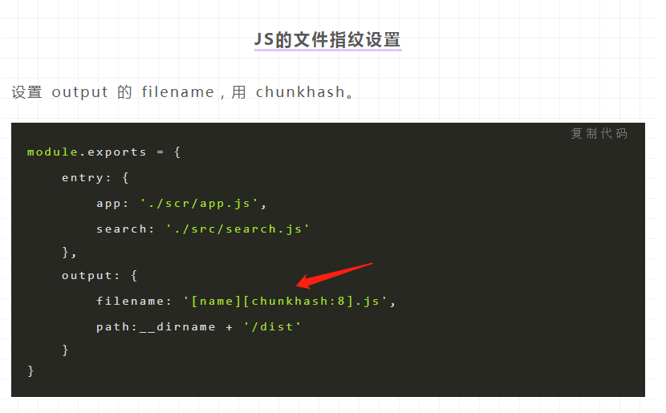
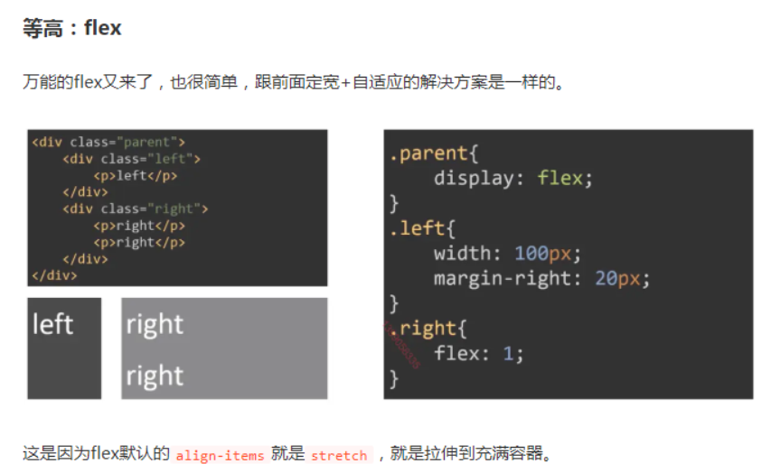
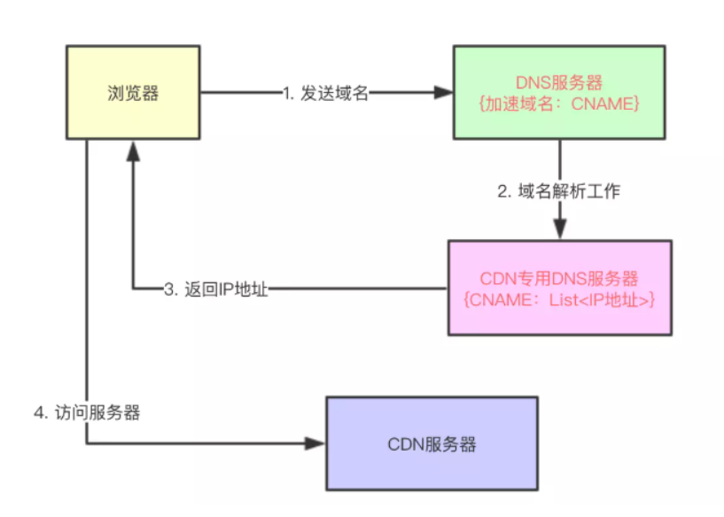
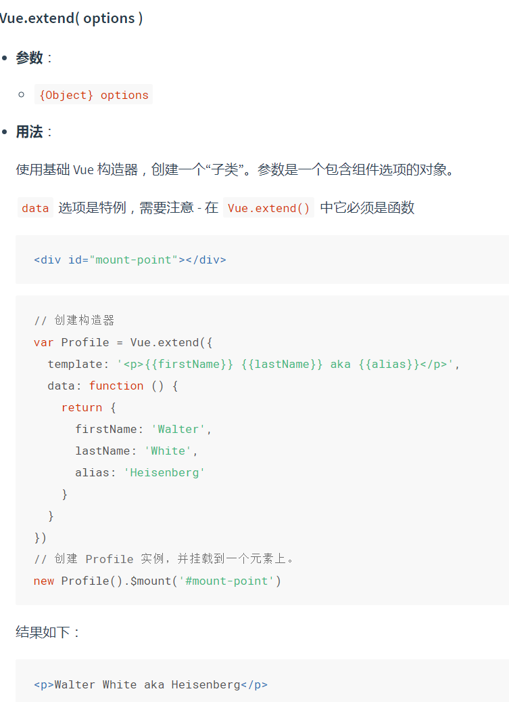
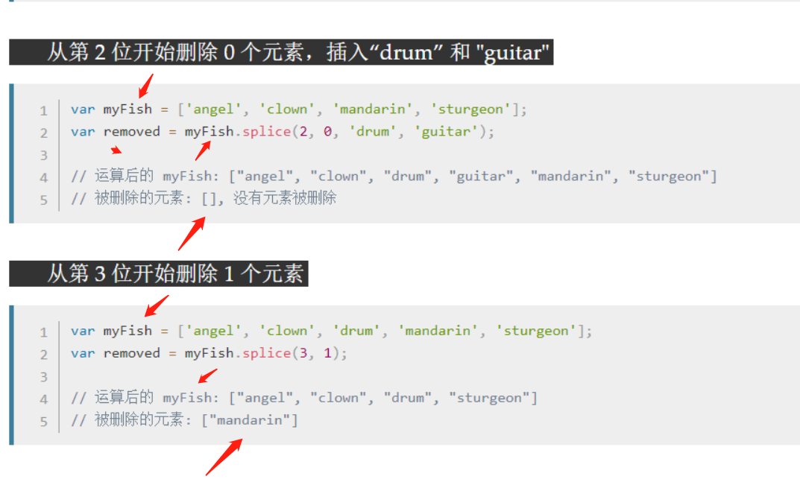

#### 1.for of 和 for in 的区别和优缺点

> **for of 用来遍历含有Symbol.iterator属性的对象**，数组，setmap都可以
>
> **for of 遍历数组和map**
>
> **遍历对象用Object.keys（）**
>
> for in 遍历数组的时候，空位不会被遍历，如果有原型属性也会被遍历
>
> 对于**数组** ，迭代出来的是**数组元素**，对于**对象** ，迭代出来的是对象的**属性；**
>
> **所有可枚举属性，包括继承属性**
>
> 我们需要手动判断 key 是否属于 obj 自身，然后进行真正的操作。因此，有一些开发者，建议不用 for in，总是使用 Object.keys。
>
> 
>
> 
>
> 
>
> Object.keys 是 ES5 新增的静态方法，它将 obj 自身包含的所有可遍历的 key，装配成数组形式返回。配合同样是 ES5 新增的数组 forEach 方法，可以实现遍历对象的功能。
>
> 

​	2.position

>​			static：默认值，表示没有开启定位
>
>​			relative：开启元素的相对定位 **相对自己原来的位子定位**
>
>​			absolute：开启元素的绝对定位  **相对第一个开启定位的祖先元素**
>
>​			fixed：开启元素的固定定位（也是绝对定位的一种） **根据浏览器窗口定位**

​	3.css省略文本 单行 和多行

> ``` 
> overflow:hidden;
> text-overflow:ellipsis;
> white-space:nowrap;
> （需要对容器设置单行高度）
> ```
>
> 

​	4.对象怎么防篡改

>**实现方法**：Object.freeze(yourObjName)
>
> **检测是否被冻结**：Object.isFrozen(yourObjName)
>
>不可以新增属性，不可修改属性描述符，不可删除属性，不可修改属性

​	5.bfc

> bfc管理开启了bfc元素里面的所有块级元素
>
> bfc布局规则：
>
> 1，内部box会垂直排列
>
> 2，bfc的区域不会与float box重叠
>
> 3，内部的BOX垂直方向的距离由margin决定，属于同一个BFC的两个相邻box的margin会发生重叠
>
> BFC是指**一个独立的渲染区域，只有Block-level Box参与， 它规定了内部的Block-level Box如何布局，并且与这个区域外部毫不相干**.
>
> 它的作用是在**一块独立的区域，让处于BFC内部的元素与外部的元素互相隔离**

​	6.事件代理

> 事件冒泡：就是从点击的子元素一直向上触发事件
>
> 事件捕获：就是发生了点击事件，从父元素向子元素依次触发
>
> addEventListener() 和 removeEventListener()。这两个方法都接收三个参数：事件名称、事件处理器函数和一个布尔值。前两个参数不作解释，最后一个布尔值则是决定这个事件的事件流处理方式是什么？**默认情况下布尔值是 false，表示事件处理器是在冒泡阶段触发。**当布尔值为 true 的时候则事件处理器是在捕获阶段触发。
>
> 数据代理：这样将事件监听函数加到父元素上，借助事件冒泡机制来处理数目不定的子元素事件的方式，就被叫做**事件代理**（或**事件委托**）。
>
> e.preventDefault();

​	7.http缓存

> https://juejin.im/post/5b3c87386fb9a04f9a5cb037
>
> 有两种，expires和cache-control两个字段，这两个字段，有cache-control
>
> - Expires 过期控制不稳定，因为浏览器端可以随意修改时间，导致缓存使用不精准。
> - Last-Modified 过期时间只能精确到秒。
>
> cache-control更优先
>
> 讲之前我那个图吧，透视http上面的图
>
> - HTTP1.0提供Expires，值为一个绝对值表示
> - HTTP1.1增加了Cache-Control : max-age=，值为以秒为单位的最大新鲜时间
>
> 做题

​	8.如果单张图片让他一直返回200怎么办

> 强缓存

​	9.浏览器加载页面时的pending状态 怎么优化

> 1、尽量减少大批量ajax请求，尤其是在网络不通畅，大量ajax请求未返回响应式，占用socket连接。
> 2、禁止短时间内进行大批量ajax请求。
> 3、多个图片尽量进行懒加载
>
> http1.1的时候会出现等待事件，
>
> 浏览器http1.1给每个域名分配6个tcp链接，并且**支持使用代理来实现域名分片**，
>
> 因为http1.1是接受应答式，当这个tcp链接还没有应答时需要等待，浏览器准备资源分配资源也是需要实践。
>
> 优化，就是减少短剑时大批请求，大文件采用分段请求，开启gzip压缩
>
> http2，使用了类似udp的解决了队头阻塞，一个域名只分配一个tcp链接。所有请求都可以并发请求。pedding时间相对较少。可以考虑升级到http2
>
> 排队：1，资源优先级，重要的jscsshtml会排在前面，每个域名只有6个tcp链接，前期准备分配磁盘也需要等待
> 排队时间过久，⼤概率是由浏览器为每个域名最多维护6个连接导致的。那么基于这个原因，你就可以让1个 站点下⾯的资源放在多个域名下⾯，⽐如放到3个域名下⾯，这样就可以同时⽀持18个连接了，这种⽅案称 为域名分⽚技术。除了域名分⽚技术外，我个⼈还建议你把站点升级到HTTP2，因为HTTP2已经没有每个 域名最多维护6个TCP连接的限制了。
> http1.1
> 实现
> **利用cdn代理来实现域名分片**
> 基于此，HTTP/2的思路就是⼀个域名只使⽤⼀个TCP⻓连接来传输数据，这样整个⻚⾯资源的下载过程只 需要⼀次慢启动，同时也避免了多个TCP连接竞争带宽所带来的问题。 另外，就是队头阻塞的问题，等待请求完成后才能去请求下⼀个资源，这种⽅式⽆疑是最慢的，所以 HTTP/2需要实现资源的并⾏请求，也就是任何时候都可以将请求发送给服务器，⽽并不需要等待其他请求 的完成，然后服务器也可以随时返回处理好的请求资源给浏览器。 所以，HTTP/2的解决⽅案可以总结为：⼀个域名只使⽤⼀个TCP⻓连接和消除队头阻塞问题。

#### 10.js数据类型判断

> typeof 可以监测所有的基本数据类型，除了null
>
> #### 1、typeof
>
> typeof返回一个表示数据类型的字符串，返回结果包括：number、string、boolean、object、undefined、function。typeof可以对基本类型number、string 、boolean、undefined做出准确的判断（null除外，typeof null===“object”，这是由于历史的原因，我就不巴拉巴拉了，其实我也说不清楚😢）；而对于引用类型，除了function之外返回的都是object。但当我们需要知道某个对象的具体类型时，typeof就显得有些力不从心了。
>
> ```
> typeof 1; // number 有效
> typeof ‘ ’;//string 有效
> typeof true; //boolean 有效
> typeof undefined; //undefined 有效
> typeof null; //object 无效
> typeof new Function(); // function 有效
> typeof [] ; //object 无效
> typeof new Date(); //object 无效
> typeof new RegExp(); //object 无效
> typeof NaN   //"number"无效
> 所以NaN要用 isNaN
> ```
> 
>typeof可以准确地判断出基本类型**，但是对于引用类型除function之外返回的都是object；**
> 
>已知是引用类型的情况可以选用instanceof或constructor方法进行具体类型的判断：
> 
>instanceof是基于原型链的；
> 
>**constructor 属性易变，不可信赖**，为了规范，在重写对象原型时一般都需要重新给constructor赋值，以保证实例对象的类型不被改写；
> 
>Object.prototype.toString.call() 通用但很繁琐。
> 
>#### 4、Object.prototype.toString （现在就明白了为啥toString可以鉴定类型，不管是什么都会返回字符串，array重写了tostring，[]所以是''）
> 
>toString是Object原型对象上的一个方法，该方法默认返回其调用者的具体类型，更严格的讲，是 toString运行时this指向的对象类型, 返回的类型格式为[object,xxx],xxx是具体的数据类型，其中包括：String,Number,Boolean,Undefined,Null,Function,Date,Array,RegExp,Error,HTMLDocument,... 基本上所有对象的类型都可以通过这个方法获取到。
> 
>```
> Object.prototype.toString.call('') ;   // [object String]
> Object.prototype.toString.call(1) ;    // [object Number]
> Object.prototype.toString.call(true) ; // [object Boolean]
> Object.prototype.toString.call(undefined) ; // [object Undefined]
> Object.prototype.toString.call(null) ; // [object Null]
> Object.prototype.toString.call(new Function()) ; // [object Function]
> Object.prototype.toString.call(new Date()) ; // [object Date]
> Object.prototype.toString.call([]) ; // [object Array]
> Object.prototype.toString.call(new RegExp()) ; // [object RegExp]
> Object.prototype.toString.call(new Error()) ; // [object Error]
> Object.prototype.toString.call(document) ; // [object HTMLDocument]
> Object.prototype.toString.call(window) ; //[object Window]
> ```
> 
>这个方法可以判断是否是nul

​	11.数组扁平化

>### es6的扩展运算符(推荐使用)
>
>[].concat(...arr),每次只会扁平化一层， 因此需要判断该数组中有几层数组然后一层一层的进行扁平。
>
>```
>const arr1 = [1,[4,6],[8,3,[19,38]]]
>console.log([].concat(...arr1))
>//(6) [1, 4, 6, 8, 3, Array(2)]复制代码
>const arr1 = [1,[4,6],[8,3,[19,38]]]
>function flatten(arr) {
>while(arr.some(item => Array.isArray(item))) {
>   arr = [].concat(...arr);
>}
>return arr;
>}
>console.log(flatten(arr1))
>//(7) [1, 4, 6, 8, 3, 19, 38]
>数组去重
>```
>
>这个很好，记住啦，完美

​	12.xss csrf

> 本文主要介绍了 XSS 和 CSRF 的攻击原理和防御措施。当然，在 Web 安全领域，除了这两种常见的攻击方式，也存在这 SQL 注入等其它攻击方式，这不在本文的讨论范围之内，如果你对其感兴趣，可以阅读[SQL注入技术专题](https://zhuanlan.zhihu.com/p/23569276)的专栏详细了解相关信息。最后，总结一下 XSS 攻击和 CSRF 攻击的常见防御措施：
>
> 1. 防御 XSS 攻击
>
>    - HttpOnly 防止劫取 Cookie
>    - 用户的输入检查
>    - 服务端的输出检查
>
> 2. 防御 CSRF 攻击
>
>    - 验证码
>    - Referer Check
>    - Token 验证
>
> 3. XSS 攻击是指攻击者在网站上注入恶意的客户端代码，通过恶意脚本对客户端网页进行篡改，从而在用户浏览网页时，对用户浏览器进行控制或者获取用户隐私数据的一种攻击方式
>
> 4. CSRF，即 Cross Site Request Forgery，中译是跨站请求伪造，是一种劫持受信任用户向服务器发送非预期请求的攻击方式。
>
>    通常情况下，CSRF 攻击是攻击者借助受害者的 Cookie 骗取服务器的信任，可以在受害者毫不知情的情况下以受害者名义伪造请求发送给受攻击服务器，从而在并未授权的情况下执行在权限保护之下的操作。

​	13.水平垂直居中

> flex
>
> { display: flex; justify-content: center; align-items: center; }
>
> `justify-content`属性定义了项目在主轴上的对齐方式。
>
> `align-items`属性定义项目在交叉轴上如何对齐。
>
> 开启绝对定位，然后就是让top50% left50% 在transform变换xy50%50%

​	14.async await

>手写promise，留着下午突破。先把模模糊糊的知识点理清

​	15.await 错误处理 

**可以用trycatch，但是awatit前面是return不行，也可以在async函数中用.catch**

​	16.在数组中找到两数之和等于n的下标

> 求两数之和，
>
>    var twoSum = function (nums, target) {
>       const map = {};
>       if (Array.isArray(nums)) {
>         for (let i = 0; i < nums.length; i++) {
>           if (map[target - nums[i]] != undefined) {
>             return [map[target - nums[i]], i];
>           } else {
>             map[nums[i]] = i;
>           }
>         }
>       }
>       return [];
>     };
>
> 三数之和也是这样，四数之和也是这样
>
> 思想也还是遍历，但是让map的查询给我们做了这步（因为map是hash，查询是01）

​	17.git切换分支前怎么做缓存 怎么取出缓存

> git stash
>
> git stash pop

​	18.Linux复制文件到远程服务器

> 命令 scp -r computer@10.0.0.522:/home/hello/ ~/
>
> linux命令不太了解，但linux也是一个操作系统，应该也是需要通过计算机网络传输ftp或者http

​	19.ES6了解多少

> 很多，常用的差不多都会

​	20.反问环节

### 	二面

​	1.webpack 的了解

> 

​		2.loader plugin 

> `Loader` 本质就是一个函数，在该函数中对接收到的内容进行转换，返回转换后的结果。 因为 Webpack 只认识 JavaScript，所以 Loader 就成了翻译官，对其他类型的资源进行转译的预处理工作。
>
> `Plugin` 就是插件，基于事件流框架 `Tapable`，插件可以扩展 Webpack 的功能，在 Webpack 运行的生命周期中会广播出许多事件，Plugin 可以监听这些事件，在合适的时机通过 Webpack 提供的 API 改变输出结果。
>
> `Loader` 在 module.rules 中配置，作为模块的解析规则，类型为数组。每一项都是一个 Object，内部包含了 test(类型文件)、loader、options (参数)等属性。
>
> `Plugin` 在 plugins 中单独配置，类型为数组，每一项是一个 Plugin 的实例，参数都通过构造函数传入。
>
> file-loader url-loader(区别) source-map-loader svg-inline-loader image-loader
>
> babel-loader
>
> sass-loader
>
> css-loader style-loader postcss-loader
>
> html-webpack-plugin:简化html文件创建
>
> compression-webpack-plugin 添加gzip压缩
>
> speed-measure-webpack-plugin 测速
>
> 多线程，缓存插件
>
> ## **3.Webpack构建流程简单说一下**
>
> Webpack 的运行流程是一个串行的过程，从启动到结束会依次执行以下流程：
>
> - `初始化参数`：从配置文件和 Shell 语句中读取与合并参数，得出最终的参数
> - `开始编译`：用上一步得到的参数初始化 Compiler 对象，加载所有配置的插件，执行对象的 run 方法开始执行编译
> - `确定入口`：根据配置中的 entry 找出所有的入口文件
> - `编译模块`：从入口文件出发，调用所有配置的 Loader 对模块进行翻译，再找出该模块依赖的模块，再递归本步骤直到所有入口依赖的文件都经过了本步骤的处理
> - `完成模块编译`：在经过第4步使用 Loader 翻译完所有模块后，得到了每个模块被翻译后的最终内容以及它们之间的依赖关系
> - `输出资源`：根据入口和模块之间的依赖关系，组装成一个个包含多个模块的 Chunk，再把每个 Chunk 转换成一个单独的文件加入到输出列表，这步是可以修改输出内容的最后机会
> - `输出完成`：在确定好输出内容后，根据配置确定输出的路径和文件名，把文件内容写入到文件系统
>
> 在以上过程中，`Webpack` 会在特定的时间点广播出特定的事件，插件在监听到感兴趣的事件后会执行特定的逻辑，并且插件可以调用 Webpack 提供的 API 改变 Webpack 的运行结果。
>
> 初始化：启动构建，读取与合并配置参数，加载 Plugin，实例化 Compiler
>
> 编译：从 Entry 出发，针对每个 Module 串行调用对应的 Loader 去翻译文件的内容，再找到该 Module 依赖的 Module，递归地进行编译处理
>
> 输出：将编译后的 Module 组合成 Chunk，将 Chunk 转换成文件，输出到文件系统中
>
> webpack-merge，提取公共配置
>
> hotModuleReplacemenetPlugin模块热替换
>
> ## **source map是什么？生产环境怎么用？**
>
> `source map` 是将编译、打包、压缩后的代码映射回源代码的过程。打包压缩后的代码不具备良好的可读性，想要调试源码就需要 soucre map。
>
> map文件只要不打开开发者工具，浏览器是不会加载的
>
> 线上如何配置：考虑什么？？？
>
> 在打包完成的代码里加注释，注释上有源码，或者生成一个对应关系的文件
>
> ## **模块打包原理知道吗？**
>
> Webpack 实际上为每个模块创造了一个可以导出和导入的环境，本质上并没有修改 代码的执行逻辑，代码执行顺序与模块加载顺序也完全一致
>
> ## **文件监听原理呢？**
>
> 在发现源码发生变化时，自动重新构建出新的输出文件。
>
> Webpack开启监听模式，有两种方式：
>
> - 启动 webpack 命令时，带上 --watch 参数
> - 在配置 webpack.config.js 中设置 watch:true
>
> 缺点：每次需要手动刷新浏览器
>
> 原理：轮询判断文件的最后编辑时间是否变化，如果某个文件发生了变化，并不会立刻告诉监听者，而是先缓存起来，等 `aggregateTimeout` 后再执行。
>
> ## **8.说一下 Webpack 的热更新原理吧**
>
> (敲黑板，这道题必考)
>
> `Webpack` 的热更新又称热替换（`Hot Module Replacement`），缩写为 `HMR`。 这个机制可以做到不用刷新浏览器而将新变更的模块替换掉旧的模块。
>
> **HMR的核心就是客户端从服务端拉去更新后的文件，准确的说是 chunk diff (chunk 需要更新的部分)，实际上 WDS 与浏览器之间维护了一个 `Websocket`，当本地资源发生变化时，WDS 会向浏览器推送更新，并带上构建时的 hash，让客户端与上一次资源进行对比。客户端对比出差异后会向 WDS 发起 `Ajax` 请求来获取更改内容(文件列表、hash)，这样客户端就可以再借助这些信息继续向 WDS 发起 `jsonp` 请求获取该chunk的增量更新。**
>
> 后续的部分(拿到增量更新之后如何处理？哪些状态该保留？哪些又需要更新？)由 `HotModulePlugin` 来完成，提供了相关 API 以供开发者针对自身场景进行处理，像`react-hot-loader` 和 `vue-loader` 都是借助这些 API 实现 HMR。
>
> ## **10.文件指纹是什么？怎么用？**
>
> 文件指纹是打包后输出的文件名的后缀。
>
> - `Hash`：和整个项目的构建相关，只要项目文件有修改，整个项目构建的 hash 值就会更改
> - `Chunkhash`：和 Webpack 打包的 chunk 有关，不同的 entry 会生出不同的 chunkhash
> - `Contenthash`：根据文件内容来定义 hash，文件内容不变，则 contenthash 不变
>
> 
>
> ## **在实际工程中，配置文件上百行乃是常事，如何保证各个loader按照预想方式工作？**
>
> 可以使用 `enforce` 强制执行 `loader` 的作用顺序，`pre` 代表在所有正常 loader 之前执行，`post` 是所有 loader 之后执行。(inline 官方不推荐使用)
>
> ## **如何优化 Webpack 的构建速度？**
>
> (这个问题就像能不能说一说**「从URL输入到页面显示发生了什么」**一样）
>
> (我只想说：您希望我讲多长时间呢？)
>
> (面试官：。。。)
>
> - 使用`高版本`的 Webpack 和 Node.js
> - `多进程/多实例构建`：HappyPack(不维护了)、thread-loader
> - `压缩代码`
>   - 多进程并行压缩
>     - webpack-paralle-uglify-plugin
>     - uglifyjs-webpack-plugin 开启 parallel 参数 (不支持ES6)
>     - terser-webpack-plugin 开启 parallel 参数
>   - 通过 mini-css-extract-plugin 提取 Chunk 中的 CSS 代码到单独文件，通过 css-loader 的 minimize 选项开启 cssnano 压缩 CSS。
> - `图片压缩`
>   - 使用基于 Node 库的 imagemin (很多定制选项、可以处理多种图片格式)
>   - 配置 image-webpack-loader
> - `缩小打包作用域`：
>   - exclude/include (确定 loader 规则范围)
>   - resolve.modules 指明第三方模块的绝对路径 (减少不必要的查找)
>   - resolve.mainFields 只采用 main 字段作为入口文件描述字段 (减少搜索步骤，需要考虑到所有运行时依赖的第三方模块的入口文件描述字段)
>   - resolve.extensions 尽可能减少后缀尝试的可能性
>   - noParse 对完全不需要解析的库进行忽略 (不去解析但仍会打包到 bundle 中，注意被忽略掉的文件里不应该包含 import、require、define 等模块化语句)
>   - IgnorePlugin (完全排除模块)
>   - 合理使用alias
> - `提取页面公共资源`：
>   - 基础包分离：
>     - 使用 html-webpack-externals-plugin，将基础包通过 CDN 引入，不打入 bundle 中
>     - 使用 SplitChunksPlugin 进行(公共脚本、基础包、页面公共文件)分离(Webpack4内置) ，替代了 CommonsChunkPlugin 插件
> - `DLL`：
>   - 使用 DllPlugin 进行分包，使用 DllReferencePlugin(索引链接) 对 manifest.json 引用，让一些基本不会改动的代码先打包成静态资源，避免反复编译浪费时间。
>   - HashedModuleIdsPlugin 可以解决模块数字id问题
> - `充分利用缓存提升二次构建速度`：
>   - babel-loader 开启缓存
>   - terser-webpack-plugin 开启缓存
>   - 使用 cache-loader 或者 **hard-source-webpack-plugin**
> - `Tree shaking`
>   - 打包过程中检测工程中没有引用过的模块并进行标记，在资源压缩时将它们从最终的bundle中去掉(只能对ES6 Modlue生效) 开发中尽可能使用ES6 Module的模块，提高tree shaking效率
>   - 禁用 babel-loader 的模块依赖解析，否则 Webpack 接收到的就都是转换过的 CommonJS 形式的模块，无法进行 tree-shaking
>   - 使用 PurifyCSS(不在维护) 或者 uncss 去除无用 CSS 代码
>     - purgecss-webpack-plugin 和 mini-css-extract-plugin配合使用(建议)
> - `Scope hoisting`
>   - 构建后的代码会存在大量闭包，造成体积增大，运行代码时创建的函数作用域变多，内存开销变大。Scope hoisting 将所有模块的代码按照引用顺序放在一个函数作用域里，然后适当的重命名一些变量以防止变量名冲突
>   - 必须是ES6的语法，因为有很多第三方库仍采用 CommonJS 语法，为了充分发挥 Scope hoisting 的作用，需要配置 mainFields 对第三方模块优先采用 jsnext:main 中指向的ES6模块化语法
> - `动态Polyfill`
>   - 建议采用 polyfill-service 只给用户返回需要的polyfill，社区维护。 (部分国内奇葩浏览器UA可能无法识别，但可以降级返回所需全部polyfill)
>
> 图片如何压缩？？？？
>
> 利用type='file' input标签来获取图片的files对象。
>
> 将files对象通过FileReader来转化为base64格式。
>
> 通过canvas.drawImage()对图片进行压缩处理。
>
> 将base64 通过Exift.js插件进行图片校验，将发生旋转的图片通过canvas进行矫正。
>
> 将base64转为blob二进制对象，进行上传。
>
> `base64`通过`canvas.drawImage()`将图片绘制在canvas画布上,然后再通过`canvas.toDataURL('image/jpeg', this.quality)`来获取压缩后的base64
>
> canvas: html5新增的元素，可用于通过使用js的脚本来绘制图形，创建动画(相信大家都用过)。
>
> Canvas本质上就是一张位图，而`drawImage()`方法可以把一张大大的图片绘制在小小的Canvas画布上，不久等同于图片尺寸压缩了？
>
> 对于本案例的压缩，使用的5个参数的API方法：
>
> ```
> context.drawImage(img, dx, dy, dWidth, dHeight);复制代码
> ```
>
> 各参数具体含义可以参见“[Canvas API中文文档-drawImage](https://www.canvasapi.cn/CanvasRenderingContext2D/drawImage)”，这里不展开。
>
> **举例：**
> 一张图片（假设图片对象是`img`）的原始尺寸是4000*3000，现在需要把尺寸限制为400*300大小，很简单，原理如下代码示意：
>
> 所以canvas压缩图片的原理在，让图片等比例压缩了。然后再用api**canvas.toDataURL()**下载，toBlob()也是
>
> ```js
> ...
> let canvas = document.createElement('canvas')
> let ctx = canvas.getContext('2d');
> let image = document.createElement('img');
> image.src = base64;
> image.onload = () => {
>     canvas.width = imageWidth
>     canvas.height = imageHeight
>     ctx.drawImage(imge, 0, 0, imageWidth, imageHeight);
>      //质量压缩成之前的0.5
>     canvas.toDataURL('image/jpeg', 0.5)
> }
> ...
> 链接：https://juejin.im/post/5e78b6d4f265da57520966c6
> 
> ```
>
> 

​		3.babel转换过程 

> 重点复习webpack面试题 https://juejin.im/post/5e6f4b4e6fb9a07cd443d4a5
>
> ## **聊一聊Babel原理吧**
>
> 大多数JavaScript Parser遵循 `estree` 规范，Babel 最初基于 `acorn` 项目(轻量级现代 JavaScript 解析器) Babel大概分为三大部分：
>
> - 解析：将代码转换成 AST
>   - 词法分析：将代码(字符串)分割为token流，即语法单元成的数组
>   - 语法分析：分析token流(上面生成的数组)并生成 AST
> - 转换：访问 AST 的节点进行变换操作生产新的 AST
>   - [Taro](https://github.com/NervJS/taro/blob/master/packages/taro-transformer-wx/src/index.ts#L15)就是利用 babel 完成的小程序语法转换
> - 生成：以新的 AST 为基础生成代码

​		4.重排 重绘 

> 1. 部分渲染树（或者整个渲染树）需要重新分析并且节点尺寸需要重新计算。这被称为**重排**。注意这里至少会有一次重排-初始化页面布局。
>
> 2. 由于节点的几何属性发生改变或者由于样式发生改变，例如改变元素背景色时，屏幕上的部分内容需要更新。这样的更新被称为**重绘**。
>
>    详见浏览器学习笔记
>
>     重排更新整个流水线，开销最大
>
>      重绘
>
>      如果修改了元素的背景颜⾊，那么布局阶段将不会被执⾏，因为并没有引起⼏何位置的变
>      换，所以就直接进⼊了绘制阶段，然后执⾏之后的⼀系列⼦阶段，这个过程就叫重绘。相较于重排操作，重绘省去了布局和分层阶段，所以执⾏效率会⽐重排操作要⾼⼀些
>
>      合成
>
>      我们使⽤了CSS的transform来实现动画效果，这可以避开重排和重绘阶段，直接在⾮主线程上 执⾏合成动画操作。这样的效率是最⾼的，因为是在⾮主线程上合成，并没有占⽤主线程的资源，另也避开了布局和绘制两个⼦阶段，所以相对于重绘和重排，合成能⼤⼤提升绘制效率。

​		5.为什么用offTop获取属性会引发重排 

> 既然渲染树变化伴随的重排和重绘代价如此巨大，浏览器一直致力于减少这些消极的影响。一个策略就是干脆不做，或者说至少现在不做。浏览器会基于你的脚本要求创建一个变化的队列，然后分批去展现。通过这种方式许多需要一次重排的变化就会整合起来，最终只有一次重排会被计算渲染。浏览器可以向已有的队列中添加变更并在一个特定的时间或达到一个特定数量的变更后执行。
>
> 但是有时你的代码会阻止浏览器优化重排并立即刷新队列，与此同时展示所有批次的变化。这通常发生在你请求样式信息的时候，例如：
>
> 1. `offsetTop`, `offsetLeft`, `offsetWidth`, `offsetHeight`
> 2. `scrollTop`/`Left`/`Width`/`Height`
> 3. `clientTop`/`Left`/`Width`/`Height`
> 4. `getComputedStyle()`, or `currentStyle` in IE
>
> 以上就是一个节点基本的可请求信息。无论合适你发出请求，浏览器不得不提供给你最新的值。为了实现这一目的，浏览器需要应用所有队列中的变更，刷新队列然后去实现重排。
>
> 举个例子，同时去set和get样式是很糟糕的想法:
>
> 因为浏览器会维护一个队列来积累重排重绘操作。但是当去获得一个节点的精确信息，浏览器为了实现这个会强制重排拿到最新
>
>   减少重排重绘，相当于少了渲染进程的主线程和⾮主线程的很多计算和操作，能够加快web的展⽰。
>   1 **触发repaint reflow的操作尽量放在⼀起**，⽐如改变dom⾼度和设置margin分开写，可能会出发两次重
>   排
>   2 通过虚拟dom层计算出操作总得差异，⼀起提交给浏览器。之前还⽤过createdocumentfragment来汇
>   总append的dom,来**减少触发重排重绘次数**（vue中就是这么做的）

​		6.实习时遇到的困难 怎么解决的 

> 动态业务逻辑，pwa中遇到的问题

​		7.react使用 index作为key会引发什么问题 为什么 

**react利用key来识别组件，它是一种身份标识标识**

帮助判断是否是同一个节点

​		8.react的key在底层的作用 

key可以帮助判断是不是同一个节点，如果key相同，并且节点基本信息相同就是同一个节点

​		9.虚拟dom的理解 和真实怎么对比 

四个指针，对比四次

​		10.diff算法 

我们将它们取出来并分别用s和e指针指向它们的头child和尾child


现在分别对`oldS、oldE、S、E`两两做`sameVnode`比较，有四种比较方式，当其中两个能匹配上那么真实dom中的相应节点会移到Vnode相应的位置，这句话有点绕，打个比方

- 如果是oldS和E匹配上了，那么真实dom中的第一个节点会移到最后
- 如果是oldE和S匹配上了，那么真实dom中的最后一个节点会移到最前，匹配上的两个指针向中间移动
- 如果四种匹配没有一对是成功的，分为两种情况
  - 如果新旧子节点都存在key，那么会根据`oldChild`的key生成一张hash表，用`S`的key与hash表做匹配，匹配成功就判断`S`和匹配节点是否为`sameNode`，如果是，就在真实dom中将成功的节点移到最前面，否则，将`S`生成对应的节点插入到dom中对应的`oldS`位置，`S`指针向中间移动，被匹配old中的节点置为null。
  - 如果没有key,则直接将`S`生成新的节点插入`真实DOM`（ps：这下可以解释为什么v-for的时候需要设置key了，如果没有key那么就只会做四种匹配，就算指针中间有可复用的节点都不能被复用了）

再配个图（假设下图中的所有节点都是有key的，且key为自身的值）


链接：https://juejin.im/post/5affd01551882542c83301da

​		11JS事件循环 

> 为了让异步任务有优先级，所以分成了微任务和宏任务。
>
> 有两个栈，先执行同步代码，在执行同步代码的时候如果遇到异步代码。是宏任务就放在宏任务里，微任务就放微任务里，同步代码执行完成的时候，先看看微任务有没有，有就清空微任务，微任务为空就，从宏任务取出一个执行，每执行一个宏任务就把微任务清空

12.括号匹配算法

> 要求返回子串在原字符串中首次出现的位置
>
> 当发现首字符相同，就可以截取一部分判断就行。这个判断也可以用hash实现
>
> 利用栈

​	13.实现promise.all

```js
    MyPromise.all = function (promises) {
      return new Promise((resolve, reject) => {
        if (promises.length === 0) {
          resolve([]);
        } else {
          let result = [];
          let index = 0;
          for (let i = 0; i < promises.length; i++) {
            promises[i].then(data => {
              result[i] = data;
              if (++index === promises.length) {
                resolve(result);
              }
            }, err => {
              reject(err);
              return;
            });
          }
        }
      });
    }
```


​	14.反问环节

## 预解析DNS

**资源预加载是另一个性能优化技术，我们可以使用该技术来预先告知浏览器某些资源可能在将来会被使用到。**
通过 DNS 预解析来告诉浏览器未来我们可能从某个特定的 URL 获取资源，当浏览器真正使用到该域中的某个资源时就可以尽快地完成 DNS 解析。例如，我们将来可从 example.com 获取图片或音频资源，那么可以在文档顶部的 <head> 标签中加入以下内容：

```
<link rel="dns-prefetch" href="//example.com">
```

当我们从该 URL 请求一个资源时，就不再需要等待 DNS 的解析过程。该技术对使用第三方资源特别有用。通过简单的一行代码就可以告知那些兼容的浏览器进行 DNS 预解析，这意味着当浏览器真正请求该域中的某个资源时，DNS 的解析就已经完成了,从而节省了宝贵的时间。
另外需要注意的是，**浏览器会对a标签的href自动启用DNS Prefetching，所以a标签里包含的域名不需要在head中手动设置link。但是在HTTPS下不起作用，需要meta来强制开启功能**。这个限制的原因是防止窃听者根据DNS Prefetching推断显示在HTTPS页面中超链接的主机名。下面这句话作用是强制打开a标签域名解析

```
<meta http-equiv="x-dns-prefetch-control" content="on">
```

浏览器 （三星）

算法  

**es6  js 重点**

**vue 重点**

**webpack 重点**

https://juejin.im/post/5e8b163ff265da47ee3f54a6#heading-12

主要看高频考点，复杂的跳过

今天两天：简历和这三块看完。下周开始刷题，投简历

项目上可以好好写下，就是那个泽辉写的文件上传组件，业务组件

国际化也可以好好写下

pwa，这方面也可以写写

就这几方面的问题（好好看）

---

优化性能中资源压缩一般用什么工具？

1，去除多余重复的css，压缩成一行

 optimize-css-assets-webpack-plugin

html-webpack-plugin压缩html和js代码

 image-webpack-loader 压缩图片

```js
//添加loader
{
    test:/\.(png|svg|jpg|gif)$/,
        use:[
            "file-loader",
            'image-webpack-loader',
        ]
}
```


webpack除了压缩还有其他什么功能吗？

1. 依赖管理：方便引用第三方模块、让模块更容易复用、避免全局注入导致的冲突、避免重复加载或加载不需要的模块。

2. 合并代码：把各个分散的模块集中打包成大文件，减少HTTP的请求链接数，配合UglifyJS可以减少、优化代码的体积。

3. 各路插件：babel把ES6+转译成ES5-，eslint可以检查编译期的错误……

   分析代码，对代码进行模块化处理，自动对代码做一些符合我们需求的操作。自动化构建成原生的代码。

CSS预处理器用过吗

LESS & SCSS，使用less比较多。比其他原生的css更方便书写。也赋予了css函数的能力，减少重复样式代码，带来了灵活

webpack有哪些性能优化的地方？（通过webpack提升页面性能的）

1，优化构建速度

2，优化开发体验

3，优化输出质量-压缩文件体积

4，优化输出质量，加速网络请求

5，优化输出质量-提高代码运行速度

### 4.1 使用CDN加速静态资源加载

1. **CND加速的原理**

   CDN通过将资源部署到世界各地，使得用户可以就近访问资源，加快访问速度。要接入CDN，需要把网页的**静态资源上传到CDN服务**上，在访问这些资源时，使用CDN服务提供的URL。

   由于CDN会为资源开启长时间的缓存，例如用户从CDN上获取了index.html，即使之后替换了CDN上的index.html，用户那边仍会在使用之前的版本直到缓存时间过期。业界做法：

   - **HTML文件：放在自己的服务器上且关闭缓存，不接入CDN**
   - **静态的JS、CSS、图片等资源：开启CDN和缓存，同时文件名带上由内容计算出的Hash值**，这样只要内容变化hash就会变化，文件名就会变化，就会被重新下载而不论缓存时间多长。

   另外，HTTP1.x版本的协议下，浏览器会对于向同一域名并行发起的请求数限制在4~8个。那么把所有静态资源放在同一域名下的CDN服务上就会遇到这种限制，所以可以把他们**分散放在不同的CDN服务**上，例如JS文件放在js.cdn.com下，将CSS文件放在css.cdn.com下等。这样又会带来一个新的问题：增加了域名解析时间，这个可以通过**dns-prefetch**来解决 `` 来缩减域名解析的时间。形如**`//xx.com` 这样的URL省略了协议**，这样做的好处是，浏览器在访问资源时会自动根据当前URL采用的模式来决定使用HTTP还是HTTPS协议。

2. **总之，构建需要满足以下几点：**

   - **静态资源导入的URL要变成指向CDN服务的绝对路径的URL**
   - **静态资源的文件名需要带上根据内容计算出的Hash值**
   - **不同类型资源放在不同域名的CDN上**

3. **最终配置：**

   ```js
   const ExtractTextPlugin = require('extract-text-webpack-plugin');
   const {WebPlugin} = require('web-webpack-plugin');
   //...
   output:{
    filename: '[name]_[chunkhash:8].js',
    path: path.resolve(__dirname, 'dist'),
    publicPatch: '//js.cdn.com/id/', //指定存放JS文件的CDN地址
   },
   module:{
    rules:[{
        test: /\.css/,
        use: ExtractTextPlugin.extract({
            use: ['css-loader?minimize'],
            publicPatch: '//img.cdn.com/id/', //指定css文件中导入的图片等资源存放的cdn地址
        }),
    },{
       test: /\.png/,
       use: ['file-loader?name=[name]_[hash:8].[ext]'], //为输出的PNG文件名加上Hash值 
    }]
   },
   plugins:[
     new WebPlugin({
        template: './template.html',
        filename: 'index.html',
        stylePublicPath: '//css.cdn.com/id/', //指定存放CSS文件的CDN地址
     }),
    new ExtractTextPlugin({
        filename:`[name]_[contenthash:8].css`, //为输出的CSS文件加上Hash
    })
   ]
   链接：https://juejin.im/post/5b652b036fb9a04fa01d616b
   
   ```

三栏等宽布局？

##### flex: 1

`flex: 1`是`flex: 1 1 0`的简写，对应的完全体是：

```
{
  flex-grow: 1;
  flex-shrink: 1;
  flex-basis: 0;
}
复制代码
```

- **flex-grow**：设置元素的扩展比例。假如父级元素总宽度为500px, 子元素A, B, C三个元素的`flex-grow`分别为1, 2, 2，那他们的宽度比例为1:2:2，三个元素最终的宽度为100px, 200px, 200px;
- **flex-shrink**: 设置元素的收缩比例。假如父级元素总宽度为500px,现在有A, B, C, D, E五个子元素，他们的`flex-shrink`分别为1, 1, 1, 2, 2,他们的`flex-basis`都是120px。计算可知，五个子元素总宽度为120 * 5 = 600px，超出了父级100px，所以需要对子元素进行收缩。收缩的时候就要通过`flex-shrink`来计算，我们发现他们`flex-shrink`的总和为1 + 1 + 1 + 2 + 2 = 7。所以将超出的100px分成7份，每份约14px，然后按照`flex-shrink`进行收缩。A, B ,C的份数都是1，所以他们收缩14px，他们的最终宽度是120 - 14 = 106px；D, E的份数是2，所以他们应该收缩14 * 2 = 28px，最终宽度是120 - 28 = 92px。




如何对无序正整数数组进行排序

排序

sort方法接收哪些参数

比较函数

默认排序顺序是在将元素转换为字符串，然后比较它们的UTF-16代码单元值序列时构建的

sort方法如何降序排序


选择刚才说的排序算法进行描述算法过程及代码思路

排序算法：？？？？

没有手写过

todo

JS继承实现的几种方式？

1，构造器中调用，父类的构造器并传入自己的this

2，原型链继承

3，组合继承，1和2组合起来


computed理解吗？除了data，computed还能监听哪些属性？vuex,路由，props变量

computed自身能监听吗？

todo：computed源码怎么实现了解过吗？

可以自己监听自己，就是双向数据绑定里面使用的是computedwatcher

watch的高级用法

下面这个：

1.handler方法和immediate属性

2.deep属性通过以上的分析，深入理解了计算属性computed和侦听属性watch是如何工作的。计算属性本质上是一个computed watch，侦听属性本质上是一个user watch。且它们其实都是vue对监听器的实现，只不过**computed主要用于对同步数据的处理，watch则主要用于观测某个值的变化去完成一段开销较大的复杂业务逻辑。**。能用computed的时候优先用computed，避免了多个数据影响其中某个数据时多次调用watch的尴尬情况。

```js
 computed: {
        fullName: {
            // getter
            get: function () {
                return this.firstName + ' ' + this.lastName
            },
            // setter
            set: function (newValue) {
                var names = newValue.split(' ');
                this.firstName = names[0];
                this.lastName = names[names.length - 1];
            }
        }
    }
});
//现在再运行 vm.fullName = 'John Doe' 时，setter 会被调用，vm.firstName 和 vm.lastName 也会相应地被更新
```

todo

new call bind instanceof 继承 防抖节流 快排归并冒泡二分 深拷贝 柯里化 数组去重 扁平化 promise版ajax jsonp sleep eventEmit类


cdn怎么找到最近的站点

你的猜测是对的，就是基于你的IP,DNS返回一个最近的服务器。所以对cdn来说，维护一个准确及时的ip数据库非常重要。



['ab', 'c', 'ab', 'd', 'c'] => ['ab1', 'c1' ,'ab2', 'd', 'c2'] 


字符串数组从左边变成右边，个数为1不添加，时间复杂度多少，空间复杂度多少。

第一次正序遍历，生成一个map。再将map中为1的去除

再逆序遍历，把为2的给最后出现的。

不要被多余的操作阻挡，面试过程中，先想出一个最简单最方便的答案

- hashMap 循环两次，从后往前遍历赋值

- 跨域
- 强缓存和协商缓存

- 事件委托
  - 为什么比正常绑定性能好

事件委托，通俗的说就是将元素的**事件委托给它的父级或者更外级的元素处理**，它的实现机制就是**事件冒泡**

**事件委托的优点**

- 只需要将同类元素的事件委托给父级或者更外级的元素，不需要给所有的元素都绑定事件，减少内存占用空间，提升性能。
- 动态新增的元素无需重新绑定事件

**需要注意的点**

- 事件委托的实现依靠的冒泡，因此不支持事件冒泡的事件就不适合使用事件委托。
- 不是所有的事件绑定都适合使用事件委托，不恰当使用反而可能导致不需要绑定事件的元素也被绑定上了事件。

https://juejin.im/post/5e739534e51d4526f23a4150

（核心就是给外层元素绑定事件，通过事件冒泡传递，然后用事件中target来做判断，做委托操作。注意判断li里面的span）

async await

- await后面抛出异常就会直接改变返回的promise的状态，返回一个reject状态的promise

----

作者：luochangwen
链接：https://www.nowcoder.com/discuss/377377?type=2&order=0&pos=77&page=1
来源：牛客网


```js
// 题目2：实现一个函数 checkCount，能匹配出数组中连续为 a 的最大次数，并返回。

// 如：var arr = ['a', 'a', 'b', 'b', 'a', 'a', 'a','a',  'b', 'a','a'];
// checkCount(arr) => 3

function checkCount (arr) {
 let result = 0; let num = 0
 for(let i=0;i<arr.length;i++){
   if(arr[i]=='a'){
     num++
   }else {
     num = 0
   }
  result = Math.max(result,num)
 }
 return result
}
第一个题，没看懂
https://www.nowcoder.com/discuss/377377?type=2&order=0&pos=77&page=1
```

算法：反转链表（很简单，写了一个函数给他看）

``` js
使用三个指针
，一个指向前一个元素，一个当前元素，一个指向下一个元素。
每次都把当前元素的next指向前一个元素。然后在三个指针都往下移动一个节点
var reverseList = function(head) {
    let pre = null
    let cur = head
    let nextP = null
    while(cur){
        nextP = cur.next
        cur.next = pre
        pre = cur
        head = cur
        cur = nextP
    }
    return head
};
最终不能返回cur，因为最终的cur等于nextp，已经变成了null
```


#### vue中怎么实现继承

mixins接收对象数组（可理解为多继承），extends接收的是对象或函数（可理解为单继承）。

mixins: [mixin1, mixin2],




#### await 发生异常了还能不能继续往下之行 try/catch捕获

**throw** 语句用来抛出一个用户自定义的异常。当前函数的执行将被停止（**throw** 之后的语句将不会执行），并且控制将被传递到调用堆栈中的第一个 **catch** 块。如果调用者函数中没有 **catch** 块，程序将会终止。**try/catch** 主要用于捕捉异常。**try/catch** 语句包含了一个 **try** 块, 和至少有一个 **catch** 块或者一个 **finally** 块，下面是三种形式的 **try** 声明:

如果从 **finally** 块中返回一个值，那么这个值将会成为整个 **try-catch-finally** 的返回值，无论是否有 **return** 语句在 **try** 和 **catch** 中。这包括在 **catch** 块里抛出的异常。

```js
function test() {
    try {
        throw new Error('can not find it1');
        return 1;
    } catch (err) {
        throw new Error('can not find it2');
        return 2;
    } finally {
        return 3;
    }
}

console.log(test()); // 3
```

### Throw or Reject

无论是 **try/catch** 还是 **promise** 都能捕获到的是“同步”异常

**reject** 是回调，而 **throw** 只是一个同步的语句，如果在另一个异步的上下文中抛出，在当前上下文中是无法捕获到的。

因此在 **Promise** 中使用 **reject** 抛出异常。否则 **catch** 有可能会捕捉不到。

```js
Promise.resolve()
.then(() => {
    setTimeout(()=>{
        throw new Error('throw error');
    },0);
})
.catch((err) => {
    console.log(err);
});

// Uncaught Error: throw error
Promise.resolve()
.then(() => {
    return new Promise((resolve, reject) => {
        setTimeout(() => {
            reject(new Error('throw error'));
        }, 0);
    });
})
.catch((err) => {
    console.log(err);
});

// Error: throw error
```

（在promise中，是异步异常，当在promise中使用throw来抛异常，catch回调会捕获不到）

**也就是在promise中需要使用reject来抛出异常，使用其他不能捕获，因为不是同一个函数执行上下文，但是reject方法是参数，是promise函数中的，**

https://juejin.im/post/5c49eb28f265da613a545a4b

在await函数后面.then。catch

try catch函数中的await如果发生了promise reject。可以捕获，只要不 return await 函数。

---

一个需求 Promise 串行

#### Promise 串行调用面试题

Promise 串行调用面试题

最新看到一个比较有趣的面试题：

> 怎么串行执行 Promise ?

这里简单给大家介绍下解答。针对多个 Promise 方法，原生提供了 `all` 和 `race` 方法。但是，他们都不是串行执行。那应该如果执行串行方法？这里介绍两种写法：

**递归执行**

简单来说就是在 then 方法里面递归传递下一次异步方法：`then(next())`

```js
function iteratorPromise(arr){

	(function iter(){
		if(arr.length)
			arr.shift()().then(iter)
	})()
}

let arr = [()=>{
	return new Promise(res=>{
		console.log("run", Date.now());
		res()
	})
},()=>{
	return new Promise(res=>{
		console.log("run", Date.now());
		res()
	})
},()=>{
	return new Promise(res=>{
		console.log("run", Date.now());
		res()
	})
}]

iteratorPromise(arr);

// output
run 1529918098567
run 1529918098568
run 1529918098569
```

-----

箭头函数可以使用 arguments吗 使用对象结构const arrow = (...args) => { console.log(args) }

箭头函数对于使用function关键字创建的函数有以下区别

1. 箭头函数没有arguments（建议使用更好的语法，剩余运算符替代）

2. **箭头函数没有prototype属性，不能用作构造函数（不能用new关键字调用）**

3. **箭头函数没有自己this，它的this是词法的，引用的是上下文的this**，即在你写这行代码的时候就箭头函数的this就已经和外层执行上下文的this绑定了(这里个人认为并不代表完全是静态的,因为外层的上下文仍是动态的可以使用call,apply,bind修改,这里只是说明了箭头函数的this始终等于它上层上下文中的this)

   ```js
   const myFunc = (...args) =>
     console.log ("arguments", args)
     
   myFunc (1, 2, 3)
   // arguments [1, 2, 3]
   ```

---

5.用过webpack吗，自己配置过哪些内容？
 6.npm打包的文件，添加的哈希值是做什么的？

我们的后台会给资源设置Cache-Control: max-age=秒替代，来对资源进行缓存时间的设置，这使得我们在刷新页面之后会去缓存中加载资源，但是存在一个问题，就是，一旦我们更新版本之后，客户没有去清除缓存，同时缓存还没有过期的情况下，就无法加载到最新的资源。这时我们就需要hash值来进行版本控制。

 7.讲讲js的宏事件、微事件
 8.npm打包如果一次将所有模块打包，出现体积过大，加载速度慢的问题，如何解决？

代码分割？？？todo，提取第三方库，代码压缩，设置缓存

#### 平衡二叉树查找的时间复杂度？

1. 平衡二叉树要么是一棵空树
2. 要么保证左右子树的高度之差不大于 1
3. 子树也必须是一颗平衡二叉树

**查找**的时间复杂度维持在O(logN)，不会出现最差情况

14.堆，大根堆，小根堆？

https://www.cnblogs.com/wangchaowei/p/8288216.html


####　Vue的指令解析是如何解析的

比较难啊，没看懂，暂时放一放 todo

-----

社招面经

**1. 跨域，同源策略，webpack里面有个跨域的方式知道么**

域名、协议、端口均为相同。

同源策略限制了一下行为：

- Cookie、LocalStorage 和 IndexDB 无法读取
- DOM 和 JS 对象无法获取
- Ajax请求发送不出去

### jsonp跨域

jsonp跨域其实也是JavaScript设计模式中的一种代理模式。在html页面中通过相应的标签从不同域名下加载静态资源文件是被浏览器允许的，所以我们可以通过这个“犯罪漏洞”来进行跨域。一般，我们可以动态的创建script标签，再去请求一个带参网址来实现跨域通信

#### cors跨域

设置允许

```http
Access-Control-Allow-Origin: http://api.bob.com // 允许跨域的字段
Access-Control-Allow-Credentials: true // 是否可以拿到cookie
Access-Control-Expose-Headers: FooBar // 可以拿到的其他字段
Content-Type: text/html; charset=utf-8
```

另一方面，开发者必须在AJAX请求中打开`withCredentials`属性。

> ```javascript
> var xhr = new XMLHttpRequest();
> xhr.withCredentials = true;
> ```

webpack 本地起服务代理

```js
  devServer: {
    open: true,
    port: 8085,
    https: false,
    hotOnly: false,
    proxy: {
      '/api': {
        // target: "http://10.17.162.100:30000/api/dc",
        // target: "http://10.18.17.183:30001/api/dc",
        target: "http://10.18.2.199:4000/api/dc",
        changeOrigin: true,
        pathRewrite: {
          '^/api': '' // 重写路径
        }
      }
    }
  },
      proxyTable相关配置及使用说明：vue脚手架提供
在config/index.js文件中，找到dev对象下proxyTable对象进行跨域设置，配置如下：
dev: {
env: require('./dev.env'),
host: 'localhost',
port: 8088,
autoOpenBrowser: true,
assetsSubDirectory: 'static',
assetsPublicPath: '/',
proxyTable: {
'/api': {
target: 'https://api.douban.com/v2/movie/',//设置你调用的接口域名和端口号 别忘了加http、https
changeOrigin: true,//是否跨域
secure: true, // 允许https请求
pathRewrite: {
'^/api': ''//这里理解成用‘/api’代替target里面的地址
}
}
},
```

**2. 怎么把es6转成es5，babel怎么工作的**

- 解析：将代码字符串解析成抽象语法树
- 变换：对抽象语法树进行变换操作
- 再建：根据变换后的抽象语法树再生成代码字符串

**3. 反向代理知道么，Nginx**

这个时候，我们通过第三方服务器访问服务器集群的内容，但是我们并不知道是哪一台服务器提供的内容，此种代理方式称为**反向代理**

一句话：**nginx会给你分配服务器压力小的去访问**


**4. 继承有哪些方式**


**5. 怎么实现一个sleep ，手写一个promise**

todo

**7. 深拷贝怎么写**

（1）var new_arr = JSON.parse( JSON.stringify(arr) );

（2）for in 加递归 

```js
function isObj(obj) {
//判断是否为对象或者函数，但不是null
    return (typeof obj === 'object' || typeof obj === 'function') && obj !== null
}

function deepCopy(obj) {
    let newObj = Array.isArray(obj) ? [] : {}
    for(let key in obj) {
        newObj[key] = isObj(obj[key]) ? deepCopy(obj[key]) : obj[key]
    }
    return newObj
}
复制代码
```

（3）$.extend()

（4）函数库lodash，提供_.cloneDeep（）

**9. 怎么实现垂直中间布局**


**10. Call和apply，哪个性能开销大**

call 的性能要比 apply 好一些（尤其是传递给函数的参数超过三个的时候）

　　let arr = [10, 20, 30],

　　obj = { }

　　function fn (x, y, z) { }

　　fn.apply (obj, arr);

　　fn.call (obj, ...arr); =》基于 ES6 的展开运算符也可以实现把数组中的每一项一次传递给函数

apply 最后还是转化成 call 来执行的，call 要更快毫无疑问


1. 正则写一个手机号，全局匹配是什么**

`/^1[3456789]\d{9}$/`

https://juejin.im/post/5de9bd5fe51d45582c27b6f3

如果一个表达式有多个地方符合正则表达式，那都会被匹配，尽可能多的匹配。也是全局都匹配


**12. 删除一个数组中的某个数**

splice(index,1)



splice可以添加和删除元素。第三个往后的参数是新增的元素参数。shuzu.splice()。shuzu会被改变，同时该原型函数的返回值为被删除元素组成的数组。Array.prototype.splice()

**13. 模块化介绍一下，什么是编译时优化**

https://juejin.im/post/5b0767736fb9a07a9919440f

**14. 有哪些网络安全名词，怎么防范**

xss   corf

**15. 平时怎么学习**

**1. git push -u 是什么意思**

绑定默认提交的远程版本库，加了参数-u后，以后即可直接用git push 代替git push origin master

**2. git rebase解释下**

有test和dev两个分支，分别有两个commit，此时执行下列命令：

```
git checkout test
git rebase dev
复制代码
```

以dev为基准将test的提交进行回放，挨个的应用到dev上去，然后test的那些提交就会废弃。 等价于git merge dev。

```
三次提交合并成了一次，减少了无用的提交信息。
git rebase 分支
首先，git 会把 feature1 分支里面的每个 commit 取消掉；
其次，把上面的操作临时保存成 patch 文件，存在 .git/rebase 目录下；
然后，把 feature1 分支更新到最新的 master 分支；
最后，把上面保存的 patch 文件应用到 feature1 分支上；

根据上文来看，git-rebase 很完美，解决了我们的两个问题：
1.合并 commit 记录，保持分支整洁；
2.相比 merge 来说会减少分支合并的记录；
```


**git merge 和git rebase区别：**

- merge不会修改提交历史，rebase会修改提交历史 。
- rebase只应用于本地没有提交的代码，如果应用到已经提交到远程的分支不要应用，不然会非常的麻烦，git merge 可以应用于远程分支。
- merge 按时间线，会生成mergeinto记录，rebase不按时间线，不会有其他记录

**3. linux命令，怎么打开一个文件**

cat abc.txt

**4. 你的上级给你review 代码时会提什么建议**

**5. 怎么看待加班和工作效率**

**6. get和post分别进行几次数据交互**

**get请求过程：（2次交互）**

- 浏览器请求tcp连接（第一次握手）   
- 服务器答应进行tcp连接（第二次握手）   
- 浏览器确认，并发送get请求头和数据（第三次握手，这个报文比较小，所以http会在此时进行第一次数据发送）   
- 服务器返回200 ok响应。

**post请求过程：（3次交互）**

- 浏览器请求tcp连接（第一次握手）   
- 服务器答应进行tcp连接（第二次握手）   
- 浏览器确认，并发送post请求头（第三次握手，这个报文比较小，所以http会在此时进行第一次数据发送）
- 服务器返回100 continue响应  

[`100 Continue`](https://developer.mozilla.org/zh-CN/docs/Web/HTTP/Status/100)

这个临时响应表明，迄今为止的所有内容都是可行的，客户端应该继续请求，如果已经完成，则忽略它。

- 浏览器开始发送数据   
- 服务器返回200 ok响应

**对于GET方式的请求，浏览器会把http header和data一并发送出去，服务器响应200（返回数据）；  而对于POST，浏览器先发送header，服务器响应100 continue，浏览器再发送data，服务器响应200 ok（返回数据**

**7. 怎么打断点，如何确定一个结果来自于哪个函数**

----

互问中的http不清楚的地方

1，http1.1新加的地方

1，加了put delete方法

2，强制加入host字段

3，使用了缓存机制，启用了缓存机制，更洗颗粒，不再是时间，而是文件是否改变

4，使用了长连接

5，允许相应数据分块，range字段

http2

1，二进制不再是文本

2，可以发起多个请求并行，废弃了管道

3，使用专用的算法压缩头部（客户端服务端建字典，传索引，哈夫曼压缩数字和字符串）

4，允许服务器推送消息

5，事实上用了加密通信，要求使用tls1.2以上并且列了很多不安全的算法套件黑名单

----

## 关于js动画和css3动画的差异性

关于js动画和css3动画的差异性你了解吗？请简单谈一下、

渲染线程分为main thread和compositor thread，如果css动画只改变transform和opacity，这时整个CSS动画得以在compositor trhead完成（而js动画则会在main thread执行，然后出发compositor thread进行下一步操作），**特别注意的是如果改变transform和opacity是不会layout或者paint的**。<br /> 区别： · 功能涵盖面，js比css大 · 实现/重构难度不一，CSS3比js更加简单，性能跳优方向固定 · 对帧速表现不好的低版本浏览器，css3可以做到自然降级 · css动画有天然事件支持 · css3有兼容性问题

css3动画：css3之后添加了transform动画计算函数，所以实现动画更为简单方便，并且transform矩阵是C++级的计算，所以速度会快很多。但是动画控制上不是特别灵活，部分动画无法实现（比如轮播图，视差滚动都需要js去参与）并且兼容性也存在一定问题。

js动画：一般可以使用requestAnimationFrame去实现，js动画相对css3动画来说，控制力更强一些，可以单帧的控制变换，同时可以兼容到IE6版本的浏览器，并且功能非常强大，但是它编码较为繁琐，并且运算预渲染性能都不如css3动画。

所以，综合考虑，简单的交互动画就用css3实现，控制比较复杂、比较繁琐的交互动画可以交由js实现。

改变函数内部this指针的指向函数（bind，apply，call的区别）

通过apply和call改变函数的this指向，他们两个函数的第一个参数都是一样的表示要改变指向的那个对象，第二个参数，apply是数组，而call则是arg1,arg2...这种形式。 通过bind改变this作用域会返回一个新的函数，这个函数不会马上执行。

请你谈一下改变函数内部this指针的指向函数有哪几种，他们的区别是什么

## js的各种位置，比如clientHeight,scrollHeight,o...

请你讲一下对于js中各种位置的理解，比如clientHeight,scrollHeight,offsetHeight ,以及scrollTop, offsetTop,clientTop的各自表示什么，它们的区别是什么？

clientHeight：表示的是可视区域的高度，不包含border和滚动条 <br /> offsetHeight：表示可视区域的高度，包含了border和滚动条 <br /> scrollHeight：表示了所有区域的高度，包含了因为滚动被隐藏的部分。 <br /> clientTop：表示边框border的厚度，在未指定的情况下一般为0 <br /> scrollTop：滚动后被隐藏的高度，获取对象相对于由offsetParent属性指定的父坐标(css定位的元素或body元素)距离顶端的高度。

## 重建二叉树

输入某二叉树的前序遍历和中序遍历的结果，请重建出该二叉树。假设输入的前序遍历和中序遍历的结果中都不含重复的数字。例如输入前序遍历序列{1,2,4,7,3,5,6,8}和中序遍历序列{4,7,2,1,5,3,8,6}，则重建二叉树并返回